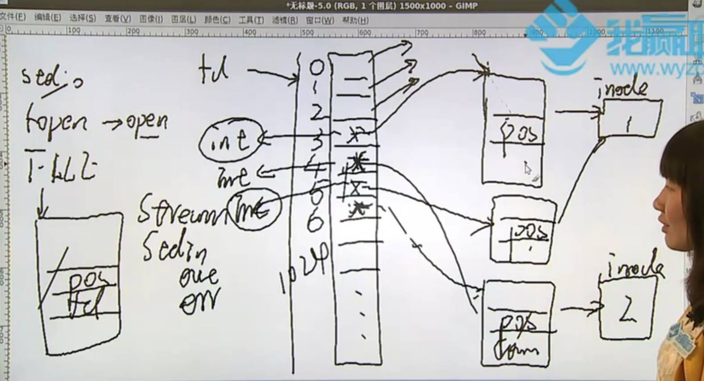
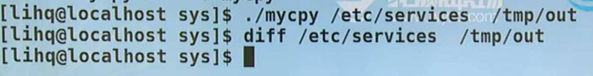
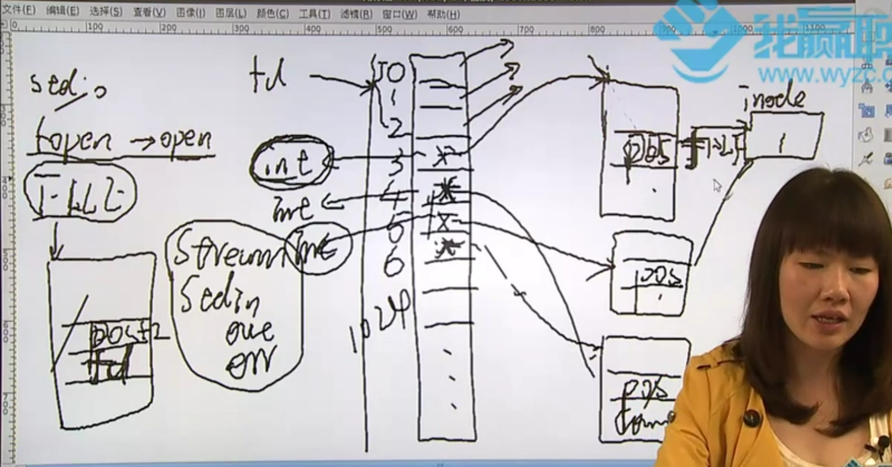
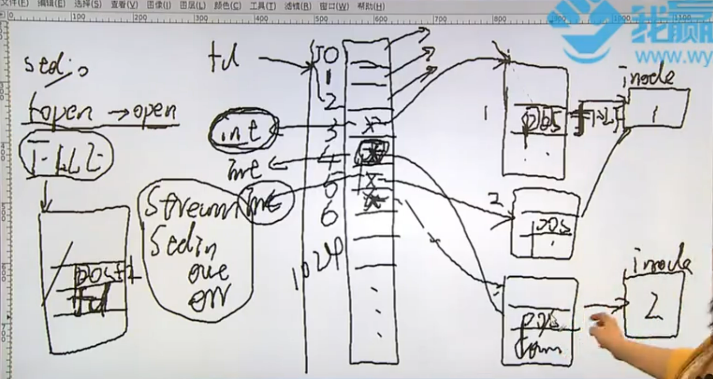

# 标准I/O介绍

IO的实现包括两种，一种称之为标准IO(stdio)、一种称之为系统调用IO(sysio | 文件IO)。IO操作是一切实现的基础，在程序运行过程中产生的数据就有了保留价值，不管是永久的还是暂时，都可以把它们转存到文件中去，等某个时刻用到的话就可以把这些数据从文件中读取出来，然后进行使用或者计算等等操作，如果没了IO操作的话程序的结果想就相当于不存在了。

标准IO和系统调用IO该怎样进行区分呢？在可行的情况下，即在某种环境下两种IO都能够使用的话，优先使用标准IO：当程序处于用户态并且对话内核态的时候，当前的内核为我们提供了一组函数让我们能够去对话内核，这组函数被称作系统调用IO(sysio)；另外一种形式出现的关键是当内核不一样时，也就是说内核提供的一套系统调用IO不一样，这个时候给程序员造成了困扰，比如说linux和windows的内核显然是不一样的，linux提供了一套系统调用IO，windows也提供了一套系统调用IO，在进行任何实现的时候就要顾及到此时计算机是处于哪个环境中的。此时"标准就跳出来和稀泥了"，不管是在linux系统还是windows系统都想对内核进行对话，那么标准就提供了一套使用，即标准IO(stdio)。此时不仅能够通过sysio对话内核也能通过stdio来对话内核，标准IO是基于系统调用IO而实现的，大家都接触过printf这个函数，很多人在使用这个函数的时候压根没考虑过到底是在linux平台下使用的还是在windows平台下使用的，printf函数是典型的stdio中的一个函数，也就是说标准中规定了一套标准函数，不管各个环境平台的底层、系统调用IO或者说内核是如何实现的，只要标准IO实现的是打印、关闭、打开...就使用标准IO提供的函数。

标准IO的移植性好，并且能够合并系统调用，合并系统调用在绝大多数情况下都是有好处的，因为其提供了buffer和cahce的机制，能够为读写提供加速机制。不同stdio的函数依赖的系统调用函数是不太一样的，比如打开文件函数fopen，这是标准IO里的一个函数。fopen在linux环境下依赖的是open函数，而在windows环境下依赖的是openfile函数，以上两个函数就是内核提供的系统调用IO，而fopen就属于标准IO，在哪个平台都能使用fopen来实现打开一个文件的作用，但它依赖的系统调用IO是不一样的，所以在两个IO都能用的情况下优先考虑标准IO(stdio)。


标准IO里有这么一系列函数：

1. fopen();   // 文件打开
2. fclose();   // 文件关闭

 // 二进制字符的读写

1. fgetc();    
2. fputc();

// 字符串读写

1. fgets();   
2. fputs();

// 二进制数据块的操作

1. fread();    
2. fwrite();


1. printf();
2. scanf();

// 文件位置指针操作

1. fseek(); 
2. ftell();
3. rewind();

// buffer&cache操作

1. fflush();

# fopen函数

标准IO当中涉及到一个类型贯穿始终：FILE，FILE是一个结构体，FILE由fopen函数产生

>  FILE *fopen(const char *pathname, const char *mode);
>
>  * const char *pathname : 打开文件地址
>  * const char *mode : 打开文件操作权限(读|写)
>  * return FILE * : 文件结构体起始位置指针
>
> 参数由const修饰，表明函数调用不会对文件path和mode进行改变
>
> 1) RETURN VALUE
>     Upon  successful completion fopen(), fdopen() and freopen() return a FILE pointer.  Otherwise, NULL is returned and errno is set to indicate the error.
>
>     * errno被定义的时候是一个全局变量的概念，如果此时出错了就会把出错的原因放到errno这个全局变量上。换句话说，当前进行完某个操作，如果出错需要马上打印或者勘误被放进errno中的出错信息。如果没有马上打印或者勘误而继续进行别的操作的话，则errno也会记录其他执行发生的错误。
>
>     * 从定义角度讲，errno本身是一个整型，这是其最早的定义，但是现在已经重构了这个概念，把它私有化之后errno是一个宏了。 
>
> 2. The argument mode points to a string beginning with one of the following sequences (possibly followed by additional characters, as described below)

**01**

```markdown
/usr/include/asm-generic/errno-base.h

/* SPDX-License-Identifier: GPL-2.0 WITH Linux-syscall-note */
#ifndef _ASM_GENERIC_ERRNO_BASE_H
#define _ASM_GENERIC_ERRNO_BASE_H

#  宏名               宏值          errormessage

#define EPERM            1      /* Operation not permitted */
#define ENOENT           2      /* No such file or directory */
#define ESRCH            3      /* No such process */
#define EINTR            4      /* Interrupted system call */
#define EIO              5      /* I/O error */
#define ENXIO            6      /* No such device or address */
#define E2BIG            7      /* Argument list too long */
#define ENOEXEC          8      /* Exec format error */
#define EBADF            9      /* Bad file number */
#define ECHILD          10      /* No child processes */
...
```

```c
#include <errno.h>

errno;
```

这个程序没有main函数也就没了入口地址，因此是运行不起来的。但是可以执行`gcc -E test.c`预处理指令，以#开头的内容都是在预处理阶段完成的。

```markdown
# 37 "/usr/include/errno.h" 3 4
extern int *__errno_location (void) __attribute__ ((__nothrow__ , __leaf__)) __attribute__ ((__const__));
# 52 "/usr/include/errno.h" 3 4

# 2 "test.c" 2

(*__errno_location ())
# 3 "test.c"
    ;
```

这是预处理的结果，如果能看到errno这个变量的话就说明它还是一个整型变量，可是errno已经私有化成为了(*__errno_location ())宏实现，然后把当前出错的内容映射到当前的地址空间上，所以不会和别的程序冲突

**02**

> r      Open text file for reading.  The stream is positioned at the beginning of the file.
>
> r+     Open for reading and writing.  The stream is positioned at the beginning of the file.
>
> w      Truncate file to zero length or create text file for writing.  The stream is positioned at the  beginning  of  the file.
>
> w+     Open for reading and writing.  The file is created if it does not exist, otherwise it is truncated.  The stream is positioned at the beginning of the file.
>           
> a      Open for appending (writing at end of file).  The file is created if it does not exist.  The stream is  positioned at the end of the file.
>
> a+     Open for reading and appending (writing at end of file).  The file is created if it does not exist.  Output is always appended to the end of the file.  POSIX is silent on what the initial read position is when using this  mode. For  glibc,  the initial file position for reading is at the beginning of the file, but for Android/BSD/MacOS, the initial file position for reading is at the end of the file.

* Truncate file to zero length or create text file for writing : 有则清空，无则创建
* beginning of the file : 文件当中第一个有效字符
* the end of the file : 文件最后一个有效字节的下一个位置。文件的读和写都发生在当前位置，如果the end of the file表示的是文件的最后一个字节，则会覆盖掉最后一个字节
* Open for reading and appending (writing at end of file) : 如果进行append操作的话，那么文件位置指针就会在文件末尾处，此时读操作就不好用了。因为如果以a+形式打开文件并读文件，但是文件指针在末尾处，就不好读了，所以以a+形式打开文件之后的指针位置取决于下一步要进行的操作
* 在这六种操作文件方式里，只有r和r+最特殊，因为其他四种方式都有着The file is created if it does not exist字样。r和r+在操作一个文件的时候必须保证文件存在，如果文件不存在则结束当前调用返并回出错信息
* 在其他一些参考书里讲到文件IO的时候，有着类似'r+b'，'w+b'，b表示二进制操作。在windows下区分两种流：文本流和二进制流这两种流在用程序进行控制的时候是不一样的，所以在windows环境下进行编程要指定是用r打开还是用r+b打开。但是在linux环境下不用指定，因为在linux环境下只有流(stream)的概念而不区分是二进制还是文本，除非是程序有可能移植到windows环境下才有必要加上b

> > The mode string can also include the letter 'b' either as a last character or as a character between  the  characters  in any of the two-character strings described above.  This is strictly for compatibility with C89 and has no effect; the 'b' is ignored on all POSIX conforming systems, including Linux.  (Other systems may treat text files and binary  files  differently, and adding the 'b' may be a good idea if you do I/O to a binary file and expect that your program may be ported to non-UNIX environments.)

```c
#include <stdio.h>
#include <stdlib.h>
#include <errno.h>

int main()
{
    FILE *fp;

    fp = fopen("tmp", "r");
    if (fp == NULL)
    {
        fprintf(stderr, "fopen() failed! error = %d\n", errno);
        exit(1);
    }
    puts("ok!");

    exit(0);
}


# result
# fopen() failed! error = 2

# vim /usr/include/asm-generic/errno-base.h
# #define ENOENT           2      /* No such file or directory */
```

程序出错可能是由于方方面面的问题，比如说找不到文件、权限受限、路径有误...多种原因都会造成当前操作失败，所以说有必要查看出错原因，而当前使用该方法查看出错原因显然不是一个好的办法。这里提几个函数：

1. `perror()`  : 用来把errno转换成errmsg

```c
NAME
       perror - print a system error message

SYNOPSIS
       #include <stdio.h>

       void perror(const char *s);

       #include <errno.h>

       const char * const sys_errlist[];
       int sys_nerr;
       int errno;       /* Not really declared this way; see errno(3) */
```

* const char *s : 是人为规定的字符串，会在该字符串后面加上出错信息从而打印输出

```c
#include <stdio.h>
#include <stdlib.h>
#include <errno.h>

int main()
{
    FILE *fp;

    fp = fopen("tmp", "r");
    if (fp == NULL)
    {
        // fprintf(stderr, "fopen() failed! error = %d\n", errno);
        perror("fopen()");

        exit(1);
    }
    puts("ok!");

    exit(0);
}


# result
# fopen(): No such file or directory
```

2. `strerror()` : 要包含string.h头文件 

```c
NAME
       strerror, strerror_r, strerror_l - return string describing error number

SYNOPSIS
       #include <string.h>

       char *strerror(int errnum);
```

```c
#include <stdio.h>
#include <stdlib.h>
#include <errno.h>
#include <string.h>

int main()
{
    FILE *fp;

    fp = fopen("tmp", "r");
    if (fp == NULL)
    {
        // fprintf(stderr, "fopen() failed! error = %d\n", errno);
        // perror("fopen()");
        fprintf(stderr, "fopen():%s\n", strerror(errno));

        exit(1);
    }
    puts("ok!");

    exit(0);
}


# result
# fopen():No such file or directory
```

# fclose和文件权限问题

fopen的返回值是一个指针，此时需要思考这个指针指向的空间是哪一块？
下面给出三种可能的情况1. 栈；2. 静态区；3. 堆

1. 如果返回指针所指空间存在于栈上(×)

```c
FILE *fopen(const char *pathname, const char *mode)
{
    # 1. 定义FILE类型变量
	FILE tmp；
    # 2. 给结构体内的成员变量赋值
    tmp.xxx = xxx;
    tmp.yyy = yyy;
    ......
    
    # 3. 返回指针
    return  &tmp;
}
```

这种方式是不对的，因为这段函数企图返回一个局部变量的地址，而这个局部变量tmp会在函数调用结束后比回收，从而使得tmp指针失效并且释tmp指针空间

2. 如果返回指针所指空间存在于静态区上(×)

```c
FILE *fopen(const char *pathname, const char *mode)
{
    # 1. 定义FILE类型静态变量
	static FILE tmp；
    # 2. 给结构体内的成员变量赋值
    tmp.xxx = xxx;
    tmp.yyy = yyy;
    ......
    
    # 3. 返回指针
    return  &tmp;
}
```

因为tmp变量被存放在了静态区上，所以当函数调用执行完时tmp空间还会被保留直到进程结束为止。但是此时就会有这样一个问题：保存在静态区上的变量有一个特点就是函数被重复调用的时候，被static修饰的变量只会被声明一次，也就是说即使调用10次fopen，给tmp变量分配的空间也只有一块。这就会导致打开第一个文件用FILE\*操作是正确的，然后打开第二个文件时依然会返回一个FILE\*，但是第二个文件填充的结构体就是第一个文件填充的结构体，也就是说第二次的结果会把第一次的结果给覆盖掉，即之前的文件就没法用了

3. 如果返回指针所指空间存在于堆上(√)

```c
FILE *fopen(const char *pathname, const char *mode)
{
    # 1. 定义FILE类型指针变量
	FILE *tmp = NULL；
    tmp = malloc(sizeof(FILE));
    
    # 2. 给结构体内的成员变量赋值
    tmp->xxx = xxx;
    tmp->yyy = yyy;
    ......
    
    # 3. 返回指针
    return  tmp;
}
```

fopen做了一步动态分配空间的操作即malloc，还有一个对应的函数fclose()，与malloc相对应的free函数就定义在fclose()中。如果一个函数的返回值是指针并且有一个与之对应的逆操作函数，比如fopen与fclose，则多半可以确定这个函数返回的指针就存放在堆上。如果没有互逆操作，则可能存放在堆上也有可能存放在静态区上，这需要代码去验证。

>int fclose(FILE *stream)
>
>* FILE *stream : 通过fopen成功打开的一个流
>
>1. 一般情况下fclose的返回值很少去校验，因为一般我们认为fclose不会失败
>2. RETURN VALUE
>    Upon successful completion, 0 is returned.  Otherwise, EOF is returned and errno is set to indicate the error.  In either case, any further access (including another call to fclose()) to the stream results in undefined behavior.

2. EOF是typedefine出来的一个宏，宏值一般情况下是-1，但即便告知了EOF的宏值一般情况为-1，也应该去验证EOF这个宏名，因为宏值未必是-1。有宏名用宏名，不要轻易用宏值

```c
#include <stdio.h>
#include <stdlib.h>
#include <errno.h>
#include <string.h>

int main()
{
    FILE *fp;

    fp = fopen("tmp", "w");
    if (fp == NULL)
    {

        fprintf(stderr, "fopen():%s\n", strerror(errno));

        exit(1);
    }
    puts("ok!");

    fclose(fp);

    exit(0);
}
```

以上程序经过了`打开文件->ok->释放文件`这几步操作

在linux编程领域里有几个概念需要强调：1. 谁打开谁关闭；2. 谁申请谁释放；3. 一切皆文件等设计原理，还有一个重要的理念就是`是资源就有上限`，当前可以在一个进程当中利用fopen打开文件，但是打开文件个数一定是有上限的。不管这个上限设计的有多大，100个也好，10个也好但都是有上限的。就比如在写递归函数的时候也要有一个上限的控制，那么现在来做一个实验看下一个进程的空间最多能打开多少个文件？

```c
#include <stdio.h>
#include <stdlib.h>
#include <string.h>
#include <errno.h>

int main(void)
{
    FILE *fp;
    int count = 0;

    while (1)
    {
        fp = fopen("tmp", "r");
        if (fp == NULL)
        {
            perror("fopen()");
            break;
        }
        count++;
    }

    printf("count = %d\n", count);

    exit(0);
}


# result
# fopen(): Too many open files
# count = 8174
```

程序结果显示在该进程下最多能打开8174个文件，但其实不是。我们提到stream流的概念，在不更改当前环境的情况下，实际上有3个流在一个进程产生的时候就默认打开了：1. stdin；2. stdout；3. stderr，所以当前进程最多能打开的文件个数是8174+3=8177个
我们在程序目录下使用`ulimit -a`命令就能显示当前进程最多打开的文件个数

* 这里的最多文件打开数为什么是8192而不是8174暂且不知，应该是有其他的流在占用这文件打开数

* -a表示查看所有项

* ulimit -n 数字 : 更改最多文件打开数

```markdown
core file size          (blocks, -c) 0
data seg size           (kbytes, -d) unlimited
scheduling priority             (-e) 0
file size               (blocks, -f) unlimited
pending signals                 (-i) 31399
max locked memory       (kbytes, -l) 65536
max memory size         (kbytes, -m) unlimited
open files                      (-n) 8192
pipe size            (512 bytes, -p) 8
POSIX message queues     (bytes, -q) 819200
real-time priority              (-r) 0
stack size              (kbytes, -s) 8192
cpu time               (seconds, -t) unlimited
max user processes              (-u) 31399
virtual memory          (kbytes, -v) unlimited
file locks                      (-x) unlimite
```

执行`ulimit -n 1024`指令后的程序结果

```c
# result
# fopen(): Too many open files
# count = 1006
```

我们在调用fopen函数打开tmp文件时使用的时'w'形式，tmp文件的属性是'-rw-rw-r--'，即664。在创建文件的时候并没有提供参数或者接口去指定文件权限，所以文件权限并不是凭空出来的，文件权限遵循公式`0666 & ~umask`，这里的umask值为0002，umask存在的意义就是为了防止产生权限过松的文件，umask的值越大，文件权限值就会越低。比如说写一个进程，我怕这个进程出现bug被别人利用，我们就可以禁止产生文件或者是利用umask去产生权限很低的文件

```markdown
# /home/liangruuu/study/linuxc/code/io/stdio

drwxrwxr-x 2 liangruuu liangruuu  4096 Mar 17 10:23 ./
drwxrwxr-x 3 liangruuu liangruuu  4096 Mar 17 07:39 ../
-rw-rw-r-- 1 liangruuu liangruuu    26 Mar 17 07:50 errno.c
-rwxrwxr-x 1 liangruuu liangruuu 17016 Mar 17 10:12 fopen*
-rw-rw-r-- 1 liangruuu liangruuu   389 Mar 17 10:13 fopen.c
-rwxrwxr-x 1 liangruuu liangruuu 16832 Mar 17 10:23 maxfopen*
-rw-rw-r-- 1 liangruuu liangruuu   351 Mar 17 10:23 maxfopen.c
-rw-rw-r-- 1 liangruuu liangruuu     0 Mar 17 10:12 tmp
```

# fgetc和fputc

以后凡是碰到函数的返回值是指针的情况，要多问自己一句这个指针指向的内容是静态区里的一块地址还是堆上的一块地址

> // 二进制字符的读写
>
> 1. fgetc();    
> 2. fputc();
>
> // 字符串读写
>
> 1. fgets();   
> 2. fputs();
>
> // 二进制数据块的操作
>
> 1. fread();    
> 2. fwrite();

* getchar()

> SYNOPSIS
>
> > int fgetc(FILE *stream);
> >
> > char *fgets(char *s, int size, FILE *stream);
> >
> > int getc(FILE *stream);
> >
> > int getchar(void);
> 
> DESCRIPTION
>
> > fgetc()  reads the next character from stream and returns it as an unsigned char cast to an int, or EOF on end of file or error.
>>
> > getc() is equivalent to fgetc() except that it may be implemented as a macro which evaluates stream more than once.
> >
> > getchar() is equivalent to getc(stdin).
> >
> > fgets() reads in at most one less than size characters from stream and stores them into  the  buffer  pointed  to  by  s. Reading  stops  after  an EOF or a newline.  If a newline is read, it is stored into the buffer.  A terminating null byte ('\0') is stored after the last character in the buffer.
> 
> 1. 有三个标准流是被默认打开的：stdin、stdout、stderr，getchar()在功能上属于字符读入的函数，字符默认是从标准的输入设备上来的
> 2. getc() is equivalent to fgetc()：getc又相当于fgetc
> 3. getc和fgetc除了函数名不同其余都相同

2. getc获取的内容不仅仅局限于终端，它可以指定从任意成功打开的流中获取内容，它的返回值和getchar是一样的，返回的是读到字符的整型形式。因为读到的是一个unsinged char型数据，但是防止出错所以就把返回值用整型数据来代替，如果失败或者读到文件末尾了则返回EOF。

    > RETURN VALUE
    >
    > > fgetc(), getc() and getchar() return the character read as an unsigned char cast to an int or EOF on end of file  or  error.

 	3. 这两个函数一个会被定义成宏，一个会被定义成函数。getc()最原始的定义会被定义成宏使用，fgetc()被定义成函数。关于函数和宏的区别主要在于要写哪一部分内容。在数据结构中，内核链表通篇都是用宏来进行实现了，没有任何函数，因为内核在帮助节省一点一滴的时间，宏不占用调用时间，只占用编译时间，函数的调用则恰恰是相反的。但如果是在写应用态程序的话，建议以函数形式为主，因为要的是稳定安全

* putchar()

> SYNOPSIS
>
> >  int fputc(int c, FILE *stream);
> >
> >  int fputs(const char *s, FILE *stream);
> >
> >  int putc(int c, FILE *stream);
> >
> >  int putchar(int c);
> >
> >  int puts(const char *s);
>
> DESCRIPTION
>
> > fputc() writes the character c, cast to an unsigned char, to stream.
> >
> > fputs() writes the string s to stream, without its terminating null byte ('\0').
> >
> > putc() is equivalent to fputc() except that it may be implemented as a macro which evaluates stream more than once.
> >
> > putchar(c) is equivalent to putc(c, stdout).
> >
> > puts() writes the string s and a trailing newline to stdout.
> >
> > Calls  to  the  functions  described  here can be mixed with each other and with calls to other output functions from the stdio library for the same output stream.
>
> 1. putchar(c) is equivalent to putc(c, stdout) : 把指定的字符输出到stdout上，putchar相当于putc(c, stdout)的二次封装，而putc又相当于fputc
>
> 2. int putc(int c, FILE *stream) : 指的是指定一个输出项，但是它的走向是走到一个指定的流上，这个流可以是标准的输出、出错也可以是任何的成功打开的文件
>
> 3. fputc和putc跟fgetc和getc的区别是一样的

> 实现文件copy的功能，指令为`mycp src dest`

* 以下代码为程序骨架

```c
#include <stdio.h>
#include <stdlib.h>

int main(int argc, char **argv)
{
    fopen();
    fopen();
    
    while(1)
    {
        fgetc();
        fputc();
    }
    
    fclose();
    fclose();
    
    exit(0);
}
```

1. 6-7&15-16：由于有两个文件，所以要调用两次fopen，然后理所应当谁打开谁关闭，所以都要调用两次fclose
2. 9-13：应该是从src中读一块往dest中写一块，用fgetc从源文件当中读一个字符，再往目标文件中写一个字符，而这个过程是需要放在一个循环当中的，即第一次写一次，并且有必要的话需要校验每一条语句的输出情况

* 完整代码

```c
# mycp.c

#include <stdio.h>
#include <stdlib.h>

int main(int argc, char **argv)
{
    FILE *fps, *fpd;
    int ch;

    if (argc < 3)
    {
        fprintf(stderr, "Usage:%s <src_file> <dest_file>\n", argv[0]);
        exit(1);
    }

    fps = fopen(argv[1], "r");
    if (fps == NULL)
    {
        perror("fopen()");
        exit(1);
    }

    fpd = fopen(argv[2], "w");
    if (fpd == NULL)
    {
        perror("fopen()");
        fclose(fps);
        exit(1);
    }

    while (1)
    {
        ch = fgetc(fps);
        if (ch == EOF)
            break;
        fputc(ch, fpd);
    }

    fclose(fpd);
    fclose(fps);

    exit(0);
}
```

1. 11-15：在程序中写足够多的注释或者说明性的内容，只要用到命令行的传参则必须判断命令行的参数
2. 15-20：以只读方式打开源文件并且返回FILE\*，并且马上判断有无出错，选择r而不选择r+就是为了当源文件不存在时报错
3. 22-28：以只写方式打开目标文件并且返回FILE\*，并且马上判断有无出错
4. 38-39：首先关闭依赖别人的文件对象再关闭被依赖的文件对象
5. 7：ch被定义为int类型数据而不是char*，因为当getc出错时返回的值为-1，字符型数据的值没有负值
6. 30-36：fgetc从源文件读取数据，返回值为读取到的字符并且以整型接收然；EOF被判断为文件末尾；fputc把ch值写入目标文件
7. 28：当src文件成功打开，但是目标文件打开失败的话，按照之前代码的逻辑就会出现内存泄漏。因为当src文件成功打开时就有了一个合法的文件指针指向一个FILE结构体，如果之后文件读取失败的话，还没来得及关闭之前的文件指针。所以在判断fpd==null的代码体里需要加上对之前已打开文件的关闭逻辑

```c
# result

# ./mycp /etc/services /tmp/out
# diff /etc/services /tmp/out
# diff指令无输出则表明两个文件相同

# ./mycp
# Usage:./mycp <src_file> <dest_file>
```

> 用fpetc实现小功能：文件有属性，其中有一个size值代表文件的大小，指的是文件当中的有效字符个数，当我们有了之前介绍的几个函数之后，我们就可以测试一个文件有多少个有效字符

```markdown
total 84
drwxrwxr-x 2 liangruuu liangruuu  4096 Mar 17 13:20 ./
drwxrwxr-x 3 liangruuu liangruuu  4096 Mar 17 07:39 ../
-rw-rw-r-- 1 liangruuu liangruuu    26 Mar 17 07:50 errno.c
-rwxrwxr-x 1 liangruuu liangruuu 17016 Mar 17 10:12 fopen*
-rw-rw-r-- 1 liangruuu liangruuu   389 Mar 17 10:13 fopen.c
-rwxrwxr-x 1 liangruuu liangruuu 16832 Mar 17 10:23 maxfopen*
-rw-rw-r-- 1 liangruuu liangruuu   351 Mar 17 10:23 maxfopen.c
-rwxrwxr-x 1 liangruuu liangruuu 17000 Mar 17 13:20 mycp*
-rw-rw-r-- 1 liangruuu liangruuu   634 Mar 17 12:47 mycp.c
-rw-rw-r-- 1 liangruuu liangruuu     0 Mar 17 10:12 tmp
```

```c
# fgetc.c

#include <stdio.h>
#include <stdlib.h>

int main(int argc, char **argv)
{
    FILE *fp;
    int count = 0;

    if (argc < 2)
    {
        fprintf(stderr, "Usage:%s <src_file>\n", argv[0]);
        exit(1);
    }

    fp = fopen(argv[1], "r");
    if (fp == NULL)
    {
        perror("fopen()");
        exit(1);
    }

    while (fgetc(fp) != EOF)
    {
        count++;
    }

    printf("count = %d\n", count);

    fclose(fp);

    exit(0);
}
```

1. 9：计数器count，表示读取了多少个字符，假设当前用来测试的文件不会超过整型的最大返回，如果要测试大文件的话数据类型可能会溢出，这时就需要考虑用long类型或者long long类型来进行接收
2. 24-27：不需要判断读取到的具体字符，只需要直到读到的是否是EOF，即文件末尾，如果不是的话就代表读取到的字符是有效字符

```c
# result

# ./fgetc ./fopen.c
#count = 389
```

# fread和fwrite

有一个函数叫做gets，gets()很危险不应该去使用，因为其不检查缓冲区的溢出

>NAME
>
>> gets - get a string from standard input (DEPRECATED) 
>
>BUGS
>
>> Never  use  gets().  Because it is impossible to tell without knowing the data in advance how many characters gets() will read, and because gets() will continue to store characters past the end of the buffer, it is extremely dangerous to  use. It has been used to break computer security.  Use fgets() instead.
>
>1. Use fgets() instead.

1. 查看fgets()函数具体内容

> SYNOPSIS
>
> > char *fgets(char *s, int size, FILE *stream);
>
> 1. gets()危险的地方在于函数传参只约定了一个地址，从终端上接收内容，这些内容没有放到指定的地址空间上去，而是放到了输入缓冲区中，只有当用户键入回车键的时候这些内容才会被放到所指定的地址上去，这个输入缓冲区我们是不知道其大小的，因此当我们从键盘或者其他IO设备输入过大的数据时可能会导致数据大小大于输入缓冲区大小，从而导致缓冲区溢出
> 2. fget()指定输入内容被存放至指针s所指向的地址空间上去，并且最多能接受size个字符，数据是从指定的流stream上来的，返回值char也代表了指针s指向的地址本身
> 3. fgets()的正常结束有两种情况：
>     * 读到了size-1个有效字节，剩余的一个字节是留给'\0'的
>     * 读到了'\n'

3. 我们使用fgets()来读取字符

```markdown
# define SIZE 5

char buf[SIZE];
fgets(buf, SIZE, stream);

1. 第一种情况读到size-1个字符
2. 第二种情况读到'\n'

# 内容是abcdef
1. 第一次去读的话，buf空间里分别存储的是a b c d '\0'，当前文件中文件的位置指针是定位在字符e，因为下一个要读取的字符为e，即读取size-1=4个字符再加上一个'\0'。

# 内容是ab
1. 即使是最后一行的内容，句末也会有一个换行符。举一个不是很贴切的例子，windows环境下的word，word一旦打开如果把显示换行标记的设置打开，就会看到新建一个word文档什么还没有输入的时候其实这个word文档就默认有了一个换行符。再比如用vim打开一个文档，只要按一下i进入编辑模式，其实第一行默认就是一个换行符，只不过是没有有效的字符内容罢了，有效的字节和字节是两个概念，很多函数在统计文件大小的时候是统计有效的字符个数，而不是字符个数，即不去统计诸如空格，回车等，这点需要区分。
2. 如果用fgets(buf, SIZE, stream)去读取内容的时候，buf空间里存储的是a b '\n' '\0'，并且只读取了3个字符，'\0'不能算做读取的字符

# 内容是abcd
1. 如果用fgets(buf, SIZE, stream)去读取该内容，需要几次读完？
2. 因为每一次读取都只读取size-1个字符，所以第一次读取内容a b c d 再加一个'\0'，此时的文件位置指针指向的是串尾，即字符d的下一个字符，因为每一行的字符串末尾都有一个换行符'\n'
3. 第二次读取内容'\n' '\0'

```

还有一个函数叫做puts()

> NAME
>
> > fputc, fputs, putc, putchar, puts - output of characters and strings
>
> SYNOPSIS
>
> > int fputc(int c, FILE *stream);
> >
> > int fputs(const char *s, FILE *stream);
> >
> > int putc(int c, FILE *stream);
> >
> > int putchar(int c);
> >
> > int puts(const char *s);
>
> 1. int puts(const char *s)：从起始地址开始输出直到遇到'\0'为止
> 2. int fputs(const char *s, FILE *stream)：把指定的串不一定输出到stdout上，可以输出到任意一个打开的流上去
>
> RETURN VALUE
>
> > fgets() returns s on success, and NULL on error or when end of file occurs while no characters have been read.
>
> 

> 用fgets()和fputs()实现mycpy

```c
#include <stdio.h>
#include <stdlib.h>

#define BUFSIZE 1024

int main(int argc, char **argv)
{
    FILE *fps, *fpd;
    char *buf[BUFSIZE];

    if (argc < 3)
    {
        fprintf(stderr, "Usage:%s <src_file> <dest_file>\n", argv[0]);
        exit(1);
    }

    fps = fopen(argv[1], "r");
    if (fps == NULL)
    {
        perror("fopen()");
        exit(1);
    }

    fpd = fopen(argv[2], "w");
    if (fpd == NULL)
    {
        perror("fopen()");
        fclose(fps);
        exit(1);
    }

    while (fgets(buf, BUFSIZE, fps) != NULL)
    {
        fputs(buf, fpd);
    }

    fclose(fpd);
    fclose(fps);

    exit(0);
}

```

* 9：因为fgets第一个参数需要一个缓冲区间的地址，所以定义一个字符缓冲区间
* 32-34：读一块写一块，并且需要进行跳出死循环的判断。因为fgets读取成功返回fps指针，读取失败或者读取到文件尾则返回NULL，此时返回的不是EOF

```c
# result

# ./mycp_fgets /etc/services /tmp/out
# diff /etc/services /tmp/out

```

* fread()和fwrite()

> NAME
>
> > fread, fwrite - binary stream input/output
>
> SYNOPSIS
>
> > size_t fread(void *ptr, size_t size, size_t nmemb, FILE *stream);
> >
> > size_t fwrite(const void *ptr, size_t size, size_t nmemb, FILE *stream);
>
> 1. size_t fread(void *ptr, size_t size, size_t nmemb, FILE *stream)：从一个指定的stream流中读取数据并且放到指针ptr所指向的地址空间去，读nmemb个数据对象，每个数据对象大小为size。也就是说ptr这块起始位置的地址总大小为size * nmemb
> 2. size_t fwrite(const void *ptr, size_t size, size_t nmemb, FILE *stream)：用const修饰ptr指针表示fwrite函数对源数据只读不写，其余参数同fread
>
> 3. 为什么很多人喜欢用这两个函数？

3. 比如有这么一种情况，要实现一个学校的人员数据管理系统，每个学生或老师要存放的数据就是固定那么多，比如姓名、年龄、籍贯......多半时候可以把它抽象成一个定长的结构体。那么把这些数据写到文件中去，那么就可以使用fwrite函数这么做：指针ptr指向元素数据，每个学生数据的结构体大小为size，要往文件stream里写nmemb=100个学生数据，使用fread同理，非常好操作，因此很多人比较倾向于在处理成块的数据时使用这两个函数。但是这两个函数有着致命的缺陷：并没有验证数据边界，比如说学生结构体大小为40个字节，那么每次操作都是在读写40个字节大小数据，这个过程能不能允许数据传输出错的，中间只要有1个字节出错那么整个数据传输过程都会出错。

> RETURN VALUE
>
> > On  success,  fread()  and  fwrite()  return the number of items read or written.  This number equals the number of bytes transferred only when size is 1.  If an error occurs, or the end of the file is reached, the return value is a short item count (or zero).
>
> 1. return the number of items read or written：如果当前读或者写不够一个对象(nmemb)的话，则当前读或写返回值就为0或者为失败 	

```markdown
# fread(buf, size, nmemb, fp);

# 1. 假设buf是10个字节大小的char型数组，并且当前文件当中的数据量非常足够，也就是绝对超过10个字节
# 第一种读取方式
fread(buf, 1, 10, fp);
# fread返回值为10，因为能够成功读取10个对象，每个对象大小为1字节

# 第二种读取方式
fread(buf, 10, 1, fp);
# fread返回值为1，一个对象大小为10字节


# 2. 文件大小只有5个字节
# 第一种读取方式
fread(buf, 1, 10, fp); 
# 文件只有5个字节，也就是说有5个对象存在，那么fread返回值为5，即5个对象

# 第二种读取方式
fread(buf, 10, 1, fp);
# 文件大小不够一个读取对象，所以fread返回值为0
```

fread和fwrite这两个函数只能去执行数据块工工整整的操作，还不太保险，文件位置指针是要稍微偏移一个位置，后面的全部跟着偏移一个位置，fread和fwrite保险起见永远采用单字节来操作，也就是把它当做fgetc和fputc来使用

> 用fread和fwrite实现my_cpy

```c
#include <stdio.h>
#include <stdlib.h>

#define BUFSIZE 1024

int main(int argc, char **argv)
{
    FILE *fps, *fpd;
    char buf[BUFSIZE];
    int n = 0;

    if (argc < 3)
    {
        fprintf(stderr, "Usage:%s <src_file> <dest_file>\n", argv[0]);
        exit(1);
    }

    fps = fopen(argv[1], "r");
    if (fps == NULL)
    {
        perror("fopen()");
        exit(1);
    }

    fpd = fopen(argv[2], "w");
    if (fpd == NULL)
    {
        perror("fopen()");
        fclose(fps);
        exit(1);
    }

    while ((n = fread(buf, 1, BUFSIZE, fps)) > 0)
    {
        fwrite(buf, 1, n, fpd);
    }

    fclose(fpd);
    fclose(fps);

    exit(0);
}
```

* 33-36：很多人会把这部分的代码写成如下形式，即读BUFSIZE个对象，写BUFSIZE个对象。这是肯定错误的，因为无法保证用fread函数满打满算读取BUFSIZE个或者BUFSIZE整倍数个的对象，fread也好、fwrite也好，它们的返回值是能正常读取或者写入的对象个数，所以这里应该是读到n个对象，写入n个对象，并且加上判断逻辑

    ```c
    while (fread(buf, 1, BUFSIZE, fps))
    {
        fwrite(buf, 1, BUFSIZE, fpd);
    }
    ```

* 10：定义n值


# 标准IO-printf和scanf函数族

> SYNOPSIS
>
> > #include <stdio.h>
> >
> > int printf(const char *format, ...);
> >
> > int fprintf(FILE *stream, const char *format, ...);
> >
> > int sprintf(char *str, const char *format, ...);
> >
> > int snprintf(char *str, size_t size, const char *format, ...);
>
> 1. int printf(const char *format, ...)：作用是把省略号部分的输出项所对应的值按照前面format当中约定的格式输出到stdout流上
> 2. int fprintf(FILE *stream, const char *format, ...)：当前流往哪里输出就往哪走向，最好不要把所有的输出都放在stdout流上，把省略号部分的输出项按照format指定格式放到指定的FILE *stream上去
> 3. 在标准IO中有一个类型是贯穿始终的，那就是FILE
> 4. int sprintf(char *str, const char *format, ...)：把省略号部分代表的内容按照format格式输出到字符串str当中去
> 5. sprintf可以把不同格式的字符拼接起来并且存入到一个字符串中
> 6. int snprintf(char *str, size_t size, const char *format, ...)：把省略部分的输出项按照format格式输出到字符串str当中去，str指针所指地址空间大小为size

2. 类似于与mycpy.c文件中，当命令行传参不正确的时候就用fprintf来报错，并把出错信息往stderr流上输出。stdin也就是标准输入，比如键盘鼠标等设备，stdout、stderr都指向目前的标准的输出设备，比如显示屏。这些都是默认的设置，我们也可以根据需要去改变它们，比如说现在有需要把stderr不再指向终端，而是指向一个打开文件，这就类似于linux里重定向echo的概念。所以经常使用fprintf把报错信息给输出到stderr上，因为stderr不仅能够输出到显示器上，也能通过设置从而输出重定向到一个文件里而不是终端上，有点类似于记录报错日志的感觉，fprintf首字母f代表的就是一个流(FILE*)

    ```c
    if (argc < 3)
    {
        fprintf(stderr, "Usage:%s <src_file> <dest_file>\n", argv[0]);
        exit(1);
    }
    ```

    

4. atoi()：把一个串转换成一个整型数

> SYNOPSIS
>
> > #include <stdlib.h>
> >
> > int atoi(const char *nptr);
>
> 1. int atoi(const char *nptr)：传入参数是一个字符串，返回值是整型值。如果字符串中夹杂着字符的话，就会拿到字母或者尾0为止

```c
# atoi.c

#include <stdio.h>
#include <stdlib.h>

int main(void)
{

    char str[] = "123456";
    printf("%d\n", atoi(str));
    char str2[] = "123a56";
    printf("%d\n", atoi(str2));

    exit(0);
}
```

```c
# result 
# 123456
# 123
```

5. 比如说把一些信息综合起来，而最终得到的完整信息是有id、串、结构体、float...换句话说需要一种综合的数据类型

```c
# atoi.c

#include <stdio.h>
#include <stdlib.h>

int main(void)
{

    int year = 2020, month = 12, day = 30;
    printf("%d-%d-%d\n", year, month, day);

    exit(0);
}

```

```c
# result 
# 2020-12-30
```

* 10：这行代码能做出一种假象即输出了“2020-12-30”这行字符串，但是却没办法当做一个完整的串来处理。sprintf函数却能把多种不同的数据类型按照特定一对一的格式把它放在字符串中

```c
# atoi.c

#include <stdio.h>
#include <stdlib.h>

int main(void)
{

    char buf[1024];
    int year = 2020, month = 12, day = 30;
    sprintf(buf, "%d-%d-%d", year, month, day);
    puts(buf);

    exit(0);
}
```

* 12：现在就拿到了一个综合起来的串用来承载所要求的的年月日输出，并且是以一个完整的串输出的

6. 在谈到gets函数的时候提到了用fgets来替代它，因为gets是不检查缓冲区大小的，即不知道buffer有多大，所以很容易造成缓冲区溢出。同理sprintf依然存在相同的问题：str所指向的空间大小未知，所以就用snprintf来解决这个缓冲区溢出的问题，所以在写程序的时候就要有意识的去注意内存溢出或者内存泄露的问题。str所指地址空间所能容纳的数据大小为size-1个字节，因为要给尾0预留一个字节。

> SYNOPSIS
>
> > #include <stdio.h>
> >
> > int scanf(const char *format, ...);
> > int fscanf(FILE *stream, const char *format, ...);
> > int sscanf(const char *str, const char *format, ...);
>
> 1. int scanf(const char *format, ...)：从终端获取内容并且按照format格式放到省略号代表的一个个地址上去
> 2. int fscanf(FILE *stream, const char *format, ...)：从一个指定流中获取，当然这个流包括stdin，按照format格式放到地址当中去
> 3. int sscanf(const char *str, const char *format, ...)：数据来源是一个字符串，其余同理
> 4. 在scanf一系列的函数中要慎重使用%s这个格式，因为在format部分设置%s，则需要在省略号部分给出地址，但是这一步非常危险，因为在终端输入或者文件取数据的时候是不清楚有待拿的字符串是有多长的，所以依然是看不到目标位置有多大，这是scanf在使用时候最大的缺陷之一

# 标准IO-文件位置函数和缓冲区刷新函数

操作文件位置指针

> NAME
>
> > fgetpos, fseek, fsetpos, ftell, rewind - reposition a stream
>
> SYNOPSIS
>
> > #include <stdio.h>
> >
> > int fseek(FILE *stream, long offset, int whence);
> >
> > long ftell(FILE *stream);
> >
> > void rewind(FILE *stream);
> >
>
> 1. int fseek(FILE *stream, long offset, int whence)
>     * FILE *stream：指定要操作的FILE流
>     * long offset：偏移量，即要偏移多大的字符
>     * int whence：相对位置，意为从哪个位置开始偏移。位置有三种选项，分别是：SEEK_SET,  SEEK_CUR, SEEK_END
>     * return int：使用feek()函数成功的话返回值为0，否则返回值为-1并且设置errno
> 2. long ftell(FILE *stream)：反映当前文件位置指针在哪
>     * FILE *stream：指定要操作的FILE流
> 3. void rewind(FILE *stream)
>     * FILE *stream：指定要操作的FILE流
> 4. fseek也可以帮助完成一个空洞文件
>
> DESCRIPTION
>
> > The fseek() function sets the file position indicator for the stream pointed to by stream.  The new position, measured in bytes, is obtained by adding offset bytes to the position specified by whence.  If whence is set to  SEEK_SET,  SEEK_CUR, or  SEEK_END,  the  offset  is relative to the start of the file, the current position indicator, or end-of-file, respecively.  A successful call to the fseek() function clears the end-of-file indicator for the stream and undoes any effects of the ungetc(3) function on the same stream.
>
> RETURN VALUE
>
> > The  rewind() function returns no value.  Upon successful completion, fgetpos(), fseek(), fsetpos() return 0, and ftell() returns the current offset.  Otherwise, -1 is returned and errno is set to indicate the error.
>
> 

在讲到fopen函数的时候说到过，由于打开文件方式不同导致文件位置指针不同，有的在文件首，有的在文件尾，而且还有一个概念叫做当前位置，文件的读和写都是发生在当前位置。

```c
// 假设需要这样的实现：

// 打开文件
fp = fopen();

// 利用fputc()往指针fp指向的文件每次写入一个字符，并且执行10次
fputc(fp) * 10

// 想要读出写入文件的10个字符
fgetc(fp) * 10
```

我们会认为想要读出写入文件的10个字符就用`fgetc(fp) * 10`代码去实现，其实不是这样的。因为文件当中有个文件位置指针，文件位置指针就特别像眼睛一样，比如说眼睛在读报纸的实收是顺序依次向后看的，没有人在读报纸的时候是永远在读第一个字节的，所以在读写文件的时候也是同样的情况，读/写完第一个字节然后第二个第三个...文件位置指针所在的位置被称为当前位置，读和写一定是发生在当前位置的，所以之前给出的伪代码是显然无法实现读取10个被写入相同文件中的字符的，因为在利用fputc写进10个字符的时候，文件位置指针已经向后偏移了，现在是指针第11个字符的位置，如果在这个位置读取10次的话，其实文件位置指针是向后移动再读取10个。

```c
// 打开文件
fp = fopen();

// 利用fputc()往指针fp指向的文件每次写入一个字符，并且执行10次
fputc(fp) * 10
    
fclose();

fp = fopen();

// 想要读出写入文件的10个字符
fgetc(fp) * 10
```

如果没有其他机制介入的话，实现该读写操作的方法就是关闭再打开，让文件位置指针重新定位到文件开头。而且假设这10个字符是在文件的中间位置写的，那么即使关掉文件再打开也无法实现该功能，因为无法找到刚才的位置，而本节介绍的函数就是来解决这些问题的，所以他们的功能被叫做reposition a stream，即重新定位一个流。当然我们会有一些相对位置，是要定位到文件首还是文件尾，还是说当前位置向前多少、向后多少...

1. SEEK_SET表示文件头，SEEK_CUR代表文件当前位置，SEEK_END表示文件尾。如果想要使用fseek实现读取写入文件的10个字节的话，伪代码如下：

```markdown
fp = fopen();

fputc(fp) * 10
    
# 把指针定义到文件开头：偏移量为0，然后偏移的位置设置为SEEK_SET
fseek(fp, 0, SEEK_SET);
# 如果字符不是从文件首开始写的，向前偏移10个字节就能读到刚才写的10个字节了
fseek(fp, -10, SEEK_CUR);


fgetc(fp) * 10
```

2. ftell经常和fseek放在一起使用，即其实我们可以用另外一种方式获取文件大小。在之前的代码中我们其实写过一份代码用来获得文件大小，现在我们使用feek和ftell来获取文件大小，代码见文件`flen.c`

```c
// fget.c

#include <stdio.h>
#include <stdlib.h>

int main(int argc, char **argv)
{
    FILE *fp;
    int count = 0;

    if (argc < 2)
    {
        fprintf(stderr, "Usage:%s <src_file>\n", argv[0]);
        exit(1);
    }

    fp = fopen(argv[1], "r");
    if (fp == NULL)
    {
        perror("fopen()");
        exit(1);
    }

    while (fgetc(fp) != EOF)
    {
        count++;
    }

    printf("count = %d\n", count);

    fclose(fp);

    exit(0);
}
```

```c
#include <stdio.h>
#include <stdlib.h>

#define BUFSIZE 1024

int main(int argc, char **argv)
{
    FILE *fp;

    if (argc < 2)
    {
        fprintf(stderr, "Usage:%s <file>\n", argv[0]);
        exit(1);
    }

    fp = fopen(argv[1], "r");
    if (fp == NULL)
    {
        perror("fopen()");
        exit(1);
    }

    fseek(fp, 0, SEEK_END);
    printf("%ld\n", ftell(fp));

    fclose(fp);

    exit(0);
}

```

* 23-24：不管文件之前的位置指针在哪，即不管用什么方式打开的，都需要把第三个参数设置为文件末尾，然后利用ftell()，它会反映文件位置指针的位置，此时ftell的返回值就代表着文件内容字节数

```markdown
# result

 # ./flen flen.c
 > 414
 
 # ls -l flen.c
 > -rw-rw-r-- 1 liangruuu liangruuu 414 Mar 18 18:39 flen.c
```

3. rewind()不需要返回值，也就是我们人为rewind()函数不会出错，它的功能等同于代码`(void) fseek(stream, 0L, SEEK_SET)`，所以rewind完成的功能是不管文件位置指针在哪，只要在程序中执行了rewind，那么文件位置指针一定指向了文件开始处。所以在01给出的代码可以以rewind的形式给出

```markdown
fp = fopen();

fputc(fp) * 10
    
rewind(fp);


fgetc(fp) * 10
```

4. 空洞文件中全部或者一部分充斥的是字符0，这里的字符0不是指用单引号括起来的'0'，而是字符的ASCII码值为0的哪个特殊的字符，也就是指的是空字符。大家都用过下载工具比如说迅雷，用这些下载工具下载一部2GB大小的电影，会在建立下载任务之后在磁盘上马上创建一个文件，那么基本上下载工具产生的那个文件一被创建就应该是源文件的大小，而不是从1个字节大小慢慢涨到2GB大小，因为下载工具不会在下载到一半的时候然后告知空间不足，它会在建立下载任务的时候磁盘容量是多少、当前文件有多大等等，类似于在steam上下载游戏时的弹窗界面显示信息。那么空洞文件就是刚刚建立下载任务时被创建的文件，所要产生的效果就是先占有磁盘空间，当创建一个文件的时候，文件大小本应该为0，下载工具在文件产生的时候立马调用fseek，把产生文件打开并且给它的大小从SEEK_SET开始直接延伸到2G大小的磁盘空间，这2G个空间里存放的全部都是字符0，然后把这2G空间切成片，用多进程或多线程进行每一小块的下载。

> NAME
>
> > fflush - flush a stream
>
> SYNOPSIS
>
> > #include <stdio.h>
> >
> > int fflush(FILE *stream);
>
> 1. int fflush(FILE *stream)：刷新流
>     

1. 给一个小例子

```c
#include <stdio.h>
#include <stdlib.h>

int main(int argc, char **argv)
{
    int i;

    printf("before while(1)");
    while(1);
    printf("after while(1)");

    exit(0);
}

```

直觉上来看最后程序的结果是只输出"before while(1)"，在死循环后被定义的打印不出来，可事实是两个都打印不出来


printf一系列的函数往标准终端进行输出的时候，标准输出是典型的行缓冲模式，即碰到换行或者是一行内容满了的情况下刷新缓冲区，所以在没有特殊格式要求的情况下printf上要加上\n


还有一种方式就是使用fflush函数强制刷新缓冲区

> DESCRIPTION
>
> > If the stream argument is NULL, fflush() flushes all open output streams.
>
> 1. 如果有多个流需要刷新的话就只需要写一句fflush()，并且传参为空即可

```c
#include <stdio.h>
#include <stdlib.h>

int main(int argc, char **argv)
{
    int i;

    // printf("before while(1)\n");
    printf("before while(1)");
    // 1. 要么单独传入某一个流
    fflush(stdout);

    while(1);
    // printf("after while(1)\n");
    printf("after while(1)");
    // 2. 要么就传空参数
    fflush(NULL);

    exit(0);
}
```


缓冲区的作用：大多数情况下是好事，最大的作用就是合并系统作用
缓冲的模式：

* 行缓冲：换行的时候刷新缓冲区数据、缓冲区满了的时候刷新或者强制刷新(使用fflush)，典型的例子比如说标准输入stdout
* 全缓冲：缓冲区满了的时候刷新或者强制刷新，只要不是终端设备默认是全缓冲模式，stdout是行缓冲模式就是因为它是终端设备
* 无缓冲：需要立即输出的内容，如stderr，因为一旦出错立马输出，什么条件都不等待，也不等待缓冲区是否满了等情况

# 标准IO-fseeko和ftello

刚才我们说过printf和scanf一族函数的缺陷是什么，也说了对于文件位置指针如何使用以及缓冲区的使用方法

包括之前讲到的输入输出函数实际上都会有问题，比如说没有一个函数能够做到从任何一个流中想取多少取多少，如完整的取到一行内容。

文件位置指针定位的几个函数中会存在这么几个问题：fseek和ftell函数"奇丑无比"，这两个函数中的long类型特别的"恶劣"

```c
int fseek(FILE *stream, long offset, int whence);

long ftell(FILE *stream);
```

从ftell的角度来分析，它能反映一个文件位置指针的位置，而这个long型是不知道多大的，因为long型在不同的平台上要看字自身机器字长来定义，即使在标准C当中对于类型没有一个严格的定义，比如整型大概一个字长、float和double类型的关系...long型在32位的环境中占32位也就是4个字节，而在ftell函数中没有特殊的说明，那么这就是个有符号的long型，有符号的long型代表着的是(-2^31)~(2^31 - 1)，也就是从-2G~2G - 1。而在ftell函数中不可能反映出文件的位置是一个负值，所以ftell的返回值只能是个正数(0~2G - 1)，所以为了迁就ftell，在fessk当中的offset参数能有正有负，即能够从当前位置向前定义2G，也能从当前位置向后定义2G，那么加起来这个文件有4G大小。但如果结合ftell来看的话，就会发现这个文件压根就不敢达到4G的长度，因为ftell用不了负值部分，所以fseek和ftell共同进行工作的时候就会遇到这样的问题：当前文件大小不会超过2G,也就是只能定义2G大小的文件

> NAME
>
> > fseeko, ftello - seek to or report file position
>
> SYNOPSIS
>
> > #include <stdio.h>
> >
> > int fseeko(FILE *stream, off_t offset, int whence);
> >
> > off_t ftello(FILE *stream);
>
> 1. fseeko和ftello在实现的时候就把刚才说的有争议的两个参数替换为了一个type define过的类型，unix定义的标准名字都是很规范的，什么什么类型都被叫_t，t代表的是type，off_t代表的位数随着机器字长而改变。如果让我们去设计类似于fseek函数的话，其实可以想到把数据类型高度抽象，将来如果这个类型不够用的话那么就可以把另外的一个数据类型放过去就行了
>
> DESCRIPTION
>
> > On some architectures, both off_t and long are 32-bit types, but defining _FILE_OFFSET_BITS with the value 64 (before including any header files) will turn off_t into a 64-bit type.
>
> 2. off_t如果不加上`# define _FILE_OFFSET_BITS 64`声明的话，那么off_t的长度是不是32位是很难说的，是不确定的。如果加上了这个声明，则off_t一定表示的是64位的整型数

既然fseeko和ftello函数中的文件大小已经不受限制了，那么我们是否可以抛弃原来的feek和ftell呢？答案是不能的，因为fseeko和ftello是方言，遵循的是POSIX，而fseek和ftell是遵循C88，C99的，意味着可移植性要好。所以如果文件真的超过2G并且要求可移植性好，那么就只能想别的办法了，而别去使用fseeko和ftello

> CONFORMING TO
>
> > POSIX.1-2001, POSIX.1-2008, SUSv2.

# 标准IO-getline

没有任何一个现行的函数能够完整地取得一行，因为一定会有大小限制。如果自己去实现这个功能的话该如何实现呢？一个办法是使用动态内存来实现：首先申请一块内存，这块内存有10个字节大小，往这10个字节空间里写数据，当快写满的时候再去申请10个字节大小的空间并以此类推，直到满足空间需求为止，那么这就可以借助malloc一族函数去实现

> NAME
>
> SYNOPSIS
>
> > #include <stdlib.h>
> >
> > void *malloc(size_t size);
> > void *realloc(void *ptr, size_t size);
>
> 1. 首先使用malloc(size_t size)去获得一块内存，然后如果还有需要的话再通过realloc对一块已有的内存进行重复的申请

但为了实现这个功能还有一个更好的方法，就是geline，实际上这个函数就是把刚才说的过程给封装了一遍

> NAME
>
> > getline, getdelim - delimited string input
>
> SYNOPSIS
>
> > #include <stdio.h>
> >
> > ssize_t getline(char **lineptr, size_t *n, FILE *stream);
>
> 1. ssize_t getline(char **lineptr, size_t *n, FILE *stream)：这个函数实现的功能或者说封装起来的过程就是刚才提到的那样。首先malloc一块空间用一用，不够用了再去扩展以此类推，即第一次用的是malloc，之后用的都是realloc
>     * char **lineptr：虽然参数类型是二级指针，但是这个参数实际上表示的是一级指针的地址(char\*)\*lineptr
>     * size_t *n：用malloc申请的内存块的大小，因为要把值回填给n，所以是一个整型数据的地址
>     * FILE *stream：从stream中读取一行内容
>
> DESCRIPTION
>
> > getline()  reads  an  entire  line from stream, storing the address of the buffer containing the text into *lineptr.  The
> > buffer is null-terminated and includes the newline character, if one was found.
>
> 2. 把保存文本数据的缓冲区的地址存一级指针lineptr当中去，另外即使给出一个串的起始位置，但依然不知道这块空间有多大，所以用size_t定义的整型值去限制以lineptr指针指向的地址开头空间的整个大小为n。因为要回填存储空间大小，所以size_t *n也不代表一级指针，而代表的是整型数的地址
>
> RETURN VALUE
>
> > On success, getline() and getdelim() return the number of characters read, including the delimiter character, but not including the terminating null byte ('\0').  This value can be used to handle embedded null bytes in the line read.
> >
> > Both functions return -1 on failure to read a line (including end-of-file condition).  In the event of an error, errno is
> > set to indicate the cause.
>
> 

1. 实现：利用getline返回文件中每一行有多少个文件字符

```c
// getline.c

#include <stdio.h>
#include <stdlib.h>
#include <string.h>

int main(int argc, char **argv)
{

    // mtrace();
    FILE *fp;
    char *linebuf = NULL;
    size_t linesize = 0;

    if (argc < 2)
    {
        fprintf(stderr, "Usage:%s <src_file>\n", argv[0]);
        exit(1);
    }

    fp = fopen(argv[1], "r");
    if (fp == NULL)
    {
        perror("fopen()");
        exit(1);
    }

    while (1)
    {
        if(getline(&linebuf, &linesize, fp) < 0)
            break;
        printf("%d\n", strlen(linebuf));
        printf("%d\n", linesize);
    }

    fclose(fp);

    
    exit(0);
}
```

* 10-11：两个指针必须初始化，不然会出现段错误

以自定义的makefile文件为例，该文件第一行的字符个数为45个(包括一个换行符\n)，第二航只有一个换行符，所以用`strlen(linebuf)`打印出来的结果就是45和1，但是因为linesize表示的是malloc申请的内存块大小，所以可以看到每次用malloc申请的块大小为120个字节，因为该文文本有两行，所以调用了两次getline函数，因此也相当于调用了2次malloc函数


当前行数据大小将要超过120字节时，就会调用realloc，内存块大小有可能是120，120...的增长，也有可能是120，60，60...或者其他情况，可以来看一个例子，结果是用malloc申请的内存块大小为240，也就是说当内存块数据快要到达120字节的时候又使用realloc以120字节长度再次申请，即最后使得getline一次申请了240字节大小的内存空间

```shell
> ./getline /etc/services
```


`getline.c`里的代码其实有一点不妥当，其实这个程序已经造成了可控的内存泄漏，这段程序实现了通过malloc和realloc申请了一段内存空间，但是并没有给出互逆操作：使用malloc函数之后并没有是用诸如free函数来释放掉内存空间，内存泄漏指的是&linebuf的空间没来得及释放掉，其实getline这个函数也没有提供一个比如getlinefree的函数。那为什么说是可控的内存泄漏呢？如果在服务器上运行的程序长时间不能宕机，每一段时间都会产生一点内存泄漏的碎片，那么长此以往就会有问题了，这段程序泄露的只有从lineptr地址开始n大小的空间。

也许会有人想既然存在内存泄露，那么在程序结束的时候加上free函数不就好了吗？理论上是可以的，但是不建议这么做，因为这里写free是以原函数使用malloc为前提的，即知道原函数的封装细节，但是内存动态申请的函数并不是只有malloc和free这一对，还有诸如c++里的new和delete，万一函数里使用的是new，那么就不能用free来释放内存空间了。这里提个醒，在做动态内存分配的时候一定记着提供类似于close、free等释放内存的操作

```markdown
fclose(fp);

free(linebuf);

exit(0);
```

* 这里提供一个自己去实现而不是系统提供的getline函数，以为getline是典型的的遵循GNU标准的方言，只存在于libc库中，但是getline在实际生产中具有十分意义的函数，因为没有一个函数能完成取一行，不管这行有多大字节，总能够通过malloc不断扩充而获取到数据

```c
#include <stdio.h>
#include <stdlib.h>
#include <string.h>
// #include<mcheck.h>

// void cleanup(char** pointer) {
//   free(*pointer);
//   *pointer = NULL;
// }

// 自行实现getline函数
ssize_t mygetline(char **line, size_t *n, FILE *fp)
{
    char *buf = *line;
    // c来存储字符，i来记录字符串长度
    ssize_t c = 0;
    ssize_t i = 0;

    // buf为空或n为0时动态分配空间
    if (buf == NULL || *n == 0)
    {
        *line = malloc(10);
        buf = *line;
        *n = 10;
    }

    while ((c = fgetc(fp)) != '\n')
    {
        if (c == EOF)
            return -1;
        //留2个空间给'\n'和'\0'
        if (i < *n - 2)
            *(buf + i++) = c;
        else
        {
            //空间不足,需要扩展空间，重新进行分配
            *n = *n + 10;
            buf = realloc(buf, *n);
            *(buf + i++) = c;
        }
    }

    *(buf + i++) = '\n';
    *(buf + i) = '\0';
    return i;
}

int main(int argc, char **argv)
{

    // mtrace();
    FILE *fp;
    char *linebuf = NULL;
    size_t linesize = 0;

    if (argc < 2)
    {
        fprintf(stderr, "Usage:%s <src_file>\n", argv[0]);
        exit(1);
    }

    fp = fopen(argv[1], "r");
    if (fp == NULL)
    {
        perror("fopen()");
        exit(1);
    }

    while (1)
    {
        if (mygetline(&linebuf, &linesize, fp) < 0) // if(getline(&linebuf, &linesize, fp) < 0)
            break;
        printf("%lu\n", strlen(linebuf));
        printf("%lu\n", linesize);
    }

    fclose(fp);
    free(linebuf);
    exit(0);
}
```

# 标准IO-临时文件

抽象一个场景：假设一个服务器由于用户的登录、用户提交信息、请求链接等，总而言之在服务器上会收到来自用户临时发送过来的数据，如果服务器需要使用到这些数据，这些数据要么是永久保存，要么是使用了就丢弃，这就涉及到几个问题：1. 数据如何存放？并且要牵扯到创建文件，这时候要创建的文件其实没有必要整个保留下来，那么就需要把临时数据保留在临时文件里，那么临时文件就会遇到第二个问题。2. 如何创建临时文件才不会冲突？在linux环境下，我们习惯在tmp目录下来存放一些小例子，那就会出现这么一个问题：unix本身是一个多用户、多任务的操作系统，我们想在tmp目录下创建所要用到的临时文件，另外有一个用户和我们公用同一个环境，他也在tmp目录下创建文件，这时就会产生冲突，或者说不同的进行在同意目录下创建文件也有可能产生冲突。3. 创建临时文件之后没有及时销毁，那么内存空间吃紧是一方面，再有一个当前造成第二个问题的几率就增大了

> NAME
>
> > tmpnam, tmpnam_r - create a name for a temporary file
>
> SYNOPSIS   
>
> > #include <stdio.h>
> >
> > char *tmpnam(char *s);
> > char *tmpnam_r(char *s);
>
> 1. char *s：这是一个指向字符数组的指针，其中，临时文件名将被存储为 C 字符串
> 2. return *：调用 tmpnam(char \* s)函数后返回一个保存临时文件名的数组指针，失败返回NULL
>
> 

2. 该文件名与系统中已经存在的文件的文件名都不重名。若s为NULL，则该临时文件名将保存在一个静态数组中（该静态数组为系统自动创建直到程序停止），当再次调用该函数，此静态数组内容将会被新的临时文件名覆盖（即每次调用都会得到一个新的临时文件名）。若s非空，则返回的临时文件名的数组指针保存在s所指向的数组中，该数组的长度不小于L_tmpnam

* 下面的实例演示了 tmpnam() 函数的用法

```c
#include <stdio.h>

int main()
{
    char buffer[L_tmpnam];
    char *ptr;


    tmpnam(buffer);
    printf("临时名称 1: %s\n", buffer);

    ptr = tmpnam(NULL);
    printf("临时名称 2: %s\n", ptr);

    return(0);
}
```

```markdown
# result
临时名称 1: /tmp/filebaalTb
临时名称 2: /tmp/filedCIbb0
```

tmpnam()有一个使用上的缺陷：假如说跟另外一个进程要请求的数据都是在同一个路径下，那么返回的名字有没有可能一样呢？有人可能会觉得系统给一个名字并且去创建文件，再给别人创建文件的话肯定会分配另外一个不同的名字，即不会冲突。所以从这个函数中能看到unix编程的味道，即要往并发的角度去想问题。比如说拿放大镜把这个过程扯开来看，进程A执行完tmpnam方法后获得的是一个可以使用的文件名，那么下一步就可以调用fopen选择除开方法r以外的方式去创建文件。此时A,B两个进程正在并发，A和B均在统一文件目录去申请临时文件名去创建文件，A在获取到文件名之后还没来得及去执行fopen，B也申请了一个临时文件名，结果在当前路径下还没有创建分配给A进程文件名的的文件，那么这个名字很有可能被分配给进程B，那么AB相当于拿到了同一个文件名，至于谁拿到这个名字就看谁先执行fopen。谁先拿到谁倒霉，比如说A先执行fopen创建文件并且写入数据之后，B再执行fopen对同一个文件进行写操作就会覆盖掉之前进程A写的数据

tmpnam其实是有使用上的危险的，危险在于创建一份临时文件需要两步，即1. 创建分配文件名；2. 写入数据，而在当前的机器环境当中其实只有一条机器指令，这是不能被打断的。所以tmpnam无法两步并做一步，即无法产生名字并马上创建文件，所以无法产生一个非常安全的临时文件

>NAME
>
>>  tmpfile - create a temporary file
>
>SYNOPSIS
>
>> #include <stdio.h>
>>
>> FILE *tmpfile(void);
>
>1. FILE *tmpfile(void)：tmpfile不需要参数，直接给出一个返回值
>
>DESCRIPTION
>
>> The  tmpfile()  function  opens  a unique temporary file in binary read/write (w+b) mode.  The file will be automatically deleted when it is closed or the program terminates.
>
>2. 以二进制读写形式打开文件
>    

1. tmpfile产生出来的临时文件有这么一个特点：对于程序员来说我们并不关心文件名，因为在标准IO部分有一个FILE类型贯穿始终，这个类型是我们所需要的，因为一旦产生FILE类型，那么接下去的读写等等操作全是通过一个FILE指针去操作的。既然不关心文件名，则tmpfile这个函数产生一个匿名文件，这个匿名文件其实在磁盘上产生了，并且被成功打开了，打开之后返回了一个FILE指针，此后的任意读写、关闭...都只需要操作FILE即可，但是这个文件在磁盘上看不见，即命令行输入ls的时候显示不出。这个匿名文件有个好处就是：既然没有名字也就不存在文件名冲突的问题。另外一个好处就是：如果在程序最后执行fclose，并把匿名函数对应的FILE*传递给fclose的话，那么会关闭当前的创建出来的临时文件。一个文件如果没有任何硬链接指向它，而当前文件的打开计数又为0的话，那么这块数据就会被释放，所以这个时候就不要考虑之前提出的及时销毁问题

    有人可能会问：如果使用tmpfile产生一个临时文件之后，忘记了fclose，除非当前进程是一个守护进程或者类似于一个server，一运行就是好几个月甚至几年，即程序不会正常终止。如果程序会正常终止，则程序终止的时候会释放进程所占有的所有资源，那么使用tmpfile所创建的临时文件也会被销毁，所以即使忘了fclose，我们也可以把它理解是一个可控的内存泄漏，前提条件是这个进程不是一直运行下去的。如果只打开不关闭，则会造成一个非常严重的现象，这里涉及到文件描述符的使用和个数上限，将会在下一小节讲述，其实之前讲到过一个命令`ulimit -a`，我们能查看到文件打开的最多个数，如果只打开不关闭，这个数值会达到最大上限

    ```shell
    > ulimit -a
    
    ...
    open files                      (-n) 1024
    pipe size            (512 bytes, -p) 8
    ...
    ```


# 系统调用IO-文件描述符实现原理

之前的章节讨论了标准IO的使用，接下去的几节来讨论下文件IO或者称为系统调用IO，在标准IO中提到了一个类型：FILE，它是贯穿始终的一个类型。在这里也要用到一个类型：文件描述符，它是在文件IO中贯穿始终的一个类型，也就是说在之前的标准IO中，我们都是使用FILE*去进行文件读写、关闭等等操作，在一个文件打开的时候创建了FILE指针，就此我们也讨论了一个话题：当一个函数的返回值为指针的时候，那我们要多问自己一句，这个指针所指向的位置到底是哪块空间（栈、堆、静态区）

文件描述符通常被称为fd（file descriptor），在这几节当中我们要讨论这么几个话题

1. 什么是文件描述符（概念）
2. 文件描述符的使用（文件IO操作）：open、close、read/write、lseek，在之前用到这么多方法其实完全是由这几个函数支撑所得，fopen依赖用open，fclose依赖于close，各种各样的读写(getc,gets,fgetc...)只要是读取相关的，都依赖于read而实现的，write同理，feek函数则是依赖于lseek进行实现的
3. 文件IO与标准IO的区别
4. IO的效率问题
5. 文件共享
6. 原子操作
7. 程序中的重定向：dup、dup2
8. 同步：sync、fysnc、fdatasync
9. fcntl、ioctl

在标准IO当中，类型FILE贯穿始终，我们在标准IO中用fopen函数来获取这个FILE类，而fopen是依赖于系统调用中的open函数来进行实现的。而FILE其实是一个结构体，这个结构体当中一定包含了能够操纵文件所有属性的内容，其中之一我们能推测出来一定有文件位置指针，我们把它简称为POS，因为只有凭借文件位置指针我们才能读完一个字节读下一个字节，写完一个字节写下一个字节。当前用方框来表示一个文件，理所应当我们要给它找一个标识，就像身份证一样，每一份文件都有一个唯一的标识，这个标识被称为inode，我们用inode号来表示存放在磁盘上的一个文件。如果用open来打开一个文件的话，那么就会产生一个结构体，因为能执行读写以及lseek定位功能，所以毋庸置疑这个结构体里肯定也有一个POS，这个结构体里存放的是当前文件几乎所有的属性信息，在系统调用IO当中其实可以如同FILE*一样获取到这个结构体的指针，但是操作系统并没有这么做，操作系统把数据结构隐藏了起来，压根就不让用户看到定义了一个什么样的结构体。操作系统定义了一个数组，把当前产生的结构体的起始地址存放到数组中的某一个位置去，即这个数组中的某一个位置上存放的是一个结构体类型的指针数据，然后交给用户的是当前所存放的指针数组的下标，也就是一个整型数。所以文件描述符的实质是一个整型数，为什么是一个整型数，因为其是一个数组下标，那么下次就依照这个整型数来操作文件。

此时如果有另外一个文件，依然用inode来表示这个文件，把它打开其实也会关联一个结构体，它里面也有一个POS，这个结构体可能会存在数组下标为4的位置上，当然也会给用户一个下标。然后应该反应出两个问题，1. 在标准IO当中，以内标准IO是依赖于文件IO的，每次调用fopen产生出一个FILE结构体，那么在系统调用层面也一定会产生一个对应的结构体，所以在FILE结构体里也一定会有一个成员，就是整型描述符fd，因为fopen依赖于open产生，那么同理当调用fclose销毁FILE结构体的时候也应当在系统调用层面调用close销毁对应的结构体。2. 存放结构体指针数据的数组有多大？答：1024个，其中有3个指针分别代表着stdout、stdin和stderr，如果通多ulimit命令来更改最大文件个数的话，其实就是在更改这个数组的大小，该数组下标为0的位置存放的是指向stdin，下标为1的位置存放的指针指向的是stdout，下标为2的位置存放的指针指向的是stderr，也就是说用户每次都会提前打开3各设备，所以说标准的输入、输出、出错才能正常使用，其实这三个都是指代的是stream流，但是在linux环境下万物皆文件。

文件描述符优先使用当前可用范围内最小的，比如一开始任何文件都不打开就只有012三个默认的整型数，此时打开一个文件自然而然所占的是下标3，再打开一个就战占有下标4....如果此时0~6都被占有了，但是下标3所对应的文件关闭了，那么此时再打开一个文件，则该文件的结构体指针回去占据下标3

这个存放结构体指针的数组是存放在进程空间里的，每一个进程都会有这么一个数组，所以下面这幅图表示的是在同一个进程打开的文件状态，所以如果两个进程再打开同一个文件，它们拿到的不是同一个结构体，虽然两个进程对于一个文件进行操作可能会导致互斥等冲突，但这不关结构体的事，这是一式两份的结构体，是分开的，不是多个进程公用的。再比如说同一个文件在一个进程的空间里面打开两次或者是更多的次数，每次打开都会产生一个结构体，并且存放在相应的数组位置上，这时拿到了两个文件描述符，这两个文件描述符都关联的是一个文件，通过文件描述符3和5来操作同一个文件的时候，如果不会出现竞争的话那就不会有什么问题，其实两者如果有协议的话还可以进行一些协同操作。那么如果涉及到close，比如说close数组下标3存放的结构体指针的时候，实际上就是把这块空间设置为空，把对应的结构体释放掉。

还有一种特殊情况，下标4对应的结构体指针打开的是第二个文件，指针就是一个地址值无所谓多少，然后把这个值复制一份放在数组下标为6的位置上，则复制后的指针同样指向的是该结构体的起始位置。现在就出现了数组下标4和下标6存放的指针指向的是同一个结构体，我们刚才针对3，5下标指针指向的结构体的时候说道，close谁就相当于把谁释放掉。而4和6关联的是同一个结构体，如果close4或者6的其中一个并不会释放掉结构体，因为仅仅关闭掉其中一个指针，这个结构体还是存在的，不然另外一个就成为了野指针，所以一个文件结构体一定会有一个打开计数器来表示当前结构体被几个指针引用到。比如关闭4实际上是相当于给count--，减完之后发现不是0则不执行free；如果4和6都close了，那么计数器值为0，则才会释放掉结构体空间



# 系统调用IO-read,write,lseek及mycopy的实现

> NAME
>
> > read - read from a file descriptor
>
> SYNOPSIS
>
> > #include <unistd.h>
> >
> > ssize_t read(int fd, void *buf, size_t count);
>
> 1. ssize_t read(int fd, void *buf, size_t count)：读取一个已经成功打开的文件描述符，把count个字节数据读到buf去，如果成功的话返回的是成功读取到的字节数，如果读到文件尾则返回0，读取失败则返回-1并且设置errno
>
> DESCRIPTION
>
> > read() attempts to read up to count bytes from file descriptor fd into the buffer starting at buf.
>
> RETURN VALUE
>
> > On success, the number of bytes read is returned (zero indicates end of file)，On error, -1 is returned, and errno is set appropriately.
>
> 

>NAME
>
>> write - write to a file descriptor
>
>SYNOPSIS
>
>> #include <unistd.h>
>>
>> ssize_t write(int fd, const void *buf, size_t count);
>
>1. ssize_t write(int fd, const void *buf, size_t count)：往已经成功打开的文件fd里写入count个字节的数据，数据来源为buf，注意这里的buf使用const来修饰的，表明消息来源是不能被改动的。返回值如果为0的话表示什么都没写进去，并不是表示出错
>
>RETURN VALUE
>
>> On success, the number of bytes written is returned.  On error, -1 is returned, and errno is set to indicate the cause of the error.
>
>

>NAME
>
>> lseek - reposition read/write file offset
>
>SYNOPSIS
>
>> #include <sys/types.h>
>> #include <unistd.h>
>>
>> off_t lseek(int fd, off_t offset, int whence);
>
>1. off_t lseek(int fd, off_t offset, int whence)：对文件fd进行定位，偏移量为offset，相对偏移位置为whence，同样有SEEK_SET、SEEK_CUR、SEEK_END
>2. return off_t：返回从文件开始处到当前位置的文件位置指针的距离，或者说所经历的字节个数。也就是说实际上lseek这个函数把fseek和ftell进行综合

* 用以上方法实现mycpy功能

```c
#include <stdio.h>
#include <stdlib.h>
#include <unistd.h>
#include <sys/types.h>
#include <sys/stat.h>
#include <fcntl.h>
#include <errno.h>

#define BUFSIZE 1024

int main(int argc, char **argv)
{
    int sfd, dfd;
    char buf[BUFSIZE];

    if (argc < 3)
    {
        fprintf(stderr, "Usage:%s <src_file> <dest_file>\n", argv[0]);
        exit(1);
    }

    do
    {
        sfd = open(argv[1], O_RDONLY);
        if (sfd < 0)
        {
            if (errno != EINTR)
            {
                perror("open()");
                exit(1);
            }
        }
    } while (sfd < 0);

    do
    {
        dfd = open(argv[2], O_WRONLY | O_CREAT | O_TRUNC, 0600);
        if (dfd < 0)
        {
            close(sfd);
            perror("open()");
            exit(1);
        }
    } while (dfd < 0);

    while (1)
    {
        len = read(sfd, buf, BUFSIZE);
        if (len < 0)
        {

            if (errno == EINTR)
                continue;
            perror("read()");
            break;
        }
        if (len == 0)
            break;

        ret = write(dfd, buf, len);
        if (ret < 0)
        {
            perror("write()");
            break;
        }
    }

    close(dfd);
    close(sfd);

    exit(0);
}
```

* 13：定义两个文件描述符分别代表目标文件和源文件
* 27、40：打开源文件和目标文件，以只写方式打开目标文件，并且这个文件不一定要存在，如果存在则清空，如果文件打开方式有O_CREAT则必须设置文件权限
* 51、67：读一块写一块，read函数返回的值为真正读取到的字节数，这里使用变量len接收
* 43：如果目标文件打开失败的时候源文件是处于打开成功的状态，所以需要手动释放源文件的结构体空间防止内存泄漏
* 63-69：如果返回值len的值是大于0的话就表示从源文件中读到了len个有效字节，那么就开始写入目标文件



之前的文件确实能实现文件的拷贝，但是还存在着一些问题，下面这段代码中假设len读取到了10个字节，那么当使用write函数从buf写10个字节到目标文件中去可能会出现在写过程中存在着遗漏字节数的问题，即读取10个字节，但是只写入3个字节，但是返回的值也不小于0，那么就会进行下一步的read，因此凭空丢了7个字节。所以要在write的时候判断有无把所有字节写入目标文件中去

```c
while (1)
{
    len = read(sfd, buf, BUFSIZE);
    if (len < 0)
    {

        if (errno == EINTR)
            continue;
        perror("read()");
        break;
    }
    if (len == 0)
        break;

    ret = write(dfd, buf, len);
    if (ret < 0)
    {
        perror("write()");
        break;
    }
}
```

更改后的代码：

```c
#include <stdio.h>
#include <stdlib.h>
#include <unistd.h>
#include <sys/types.h>
#include <sys/stat.h>
#include <fcntl.h>
#include <errno.h>

#define BUFSIZE 1024

int main(int argc, char **argv)
{
    int sfd, dfd;
    char buf[BUFSIZE];

    if (argc < 3)
    {
        fprintf(stderr, "Usage:%s <src_file> <dest_file>\n", argv[0]);
        exit(1);
    }

    do
    {
        sfd = open(argv[1], O_RDONLY);
        if (sfd < 0)
        {
            if (errno != EINTR)
            {
                perror("open()");
                exit(1);
            }
        }
    } while (sfd < 0);

    do
    {
        dfd = open(argv[2], O_WRONLY | O_CREAT | O_TRUNC, 0600);
        if (dfd < 0)
        {
            close(sfd);
            perror("open()");
            exit(1);
        }
    } while (dfd < 0);

    while (1)
    {
        len = read(sfd, buf, BUFSIZE);
        if (len < 0)
        {

            if (errno == EINTR)
                continue;
            perror("read()");
            break;
        }
        if (len == 0)
            break;

        ret = write(dfd, buf, len);
        if (ret < 0)
        {
            perror("write()");
            break;
        }
    }

    close(dfd);
    close(sfd);

    exit(0);
}
```

* 16：使用一个循环一直读取到源文件的数据被读取完为止
* 19：这个时候获取数据的位置并不是从buf的起始位置，而是从buf每次加上一段已读取的地址开始，是之前所有返回值的累加。如第一次写是从buf+0的位置取内容，要写10个字节的数据，假设只写进去3个字节，那么len的值为7，判断大于0，则继续执行write函数，这时是从buf+3的位置开始，还要写len-3=4个字节的数据

# 系统IO和标准IO比较实例

以传达室老大爷跑邮局为例：有两种方式，第一种方式：1. 一次拿一封信并且跑一趟邮局，一来一去20分钟，大家一听就能感觉得出来效率有点慢；2. 以老大爷的承载量，一次跑邮局拿20封信，一来一去20分钟，这一趟相当于帮20个人处理了信件。这个过程会有意外，比如说老大爷已经拿了5封信了，来第6个人的时候这封信是加急的信，则老大爷马上拿着6封信跑了趟邮局，一来一回20分钟，中间这段加急操作就相当于fflush，即刷新缓冲区的操作。我们把老大爷送信的任务类比成缓冲区的操作的话，缓冲区大小为20个字节，当缓冲区满了自动刷新一遍，如果当前有强制刷新的动作，则马上就执行一遍刷新任务

所以标准IO和系统调用IO的区别就是：标准IO具有缓冲的机制，而系统调用IO是每调用一次就实打实的从用户态切换到内核态去执行一次，相当于实时性非常的高。而在标准IO，有什么样的操作，看起来好像是写进文件里面去了，但实际上没有，其实是把数据放到了输出的缓冲区中，什么时候才真正写进去呢？就是之前讲到fflush函数时候的那几个条件：1. 缓冲区满了的时候刷；2. 换行的时候刷；3. 强制的时候刷

两者的区别在于响应速度和吞吐量上，文件IO的响应速度快，标准IO的吞吐量大。缓冲机制的存在最大的一个作用就是合并系统调用

* 面试题：如何使一个程序变快？

程序变快有两个层面，一个是响应速度变快，一个是吞吐量变大，增大二者可以分别采用对应的调用方式，但是对于用户而言更希望增大的是吞吐量，所以在之前的章节说到更推荐使用标准IO操作

提醒：标准IO和文件IO不可混用

> NAME
>
> > clearerr, feof, ferror, fileno - check and reset stream status
>
> SYNOPSIS
>
> > int fileno(FILE *stream);
>
> 1. int fileno(FILE *stream)：有一个FILE *，想把标准IO的操作转换成文件IO的操作，那么fileno函数就能帮助做到，它的返回值就是文件描述符fd
>
> 

> NAME
>
>> fopen, fdopen, freopen - stream open functions
>
>SYNOPSIS
>
>> FILE *fdopen(int fd, const char *mode);
>
>1. FILE *fdopen(int fd, const char *mode)：假设当前使用系统调用打开文件的话，那么就会拿到一个文件描述符fd，然后针对这个文件指定操作方式mode，进一步使用函数fdopen封装成FILE\*使用，即把文件IO转换成标准IO使用
>
>

以上两个函数是在标准IO和文件IO当中来进行转换的函数

现在使用标准IO中的fopen函数打开一个文件，就会拿到一个FILE\*，此时如果使用fileno函数的话就会从FILE结构体中拿到fd，这时需要注意的是，即使是同一个文件也不要一会使用标准IO一会使用系统调用IO。因为FILE\*指向的结构体和指向inode节点的结构体中的POS字段是不一样的，标准IO有缓冲机制

```markdown
FILE *fp

fputc(fp) --> pos++
fputc(fp) --> pos++
```

* 3：用fputc函数向FILE指针指向文件写入一个字符的时候，POS就会向后移动一位
* 4：如果用fputc(fp)再操作一边的话，POS就会再向后移动一位

这就相当于FILE结构体中的POS字段做了一个+2操作，但这是否意味着指向inode节点的结构体中的POS字段也+2呢？答案是否定的，因为标准IO有缓冲区机制，实际上往文件写入的两个字符并没有真正的写入到磁盘上，比如说在对word进行修改的时候，改完之后点击关闭软件会提示是否保存对该文档的修改，如果此时点保存的话那么刚才做的修改实际上就更新了文件，如果点不保存的话，那么修改实际上没有被更新到文件上，关闭之后重新打开会发现word文档还是原来的内容。所以指向inode节点的结构体中的POS字段其实并没有改变，直到执行了之前说的刷新操作，比如说缓冲区满了才会一次性的加上FILE结构体中POS更改的值

反过来，如果使用标准IO进行一个文件的读操作，原本会想到从文件当中对个字符，POS+1，再读一次再+1，实际上指向inode节点结构体中的POS值并没有+1。其实并不是这样的，通常往外面读比如1k字符，这个内容是拿到cache中的，也就是假设POS加了1024，那这1024个字节是拿到cache中的，此值并没有同步到FILE结构体中，FILE结构体中POS的变化得等到从cache中拿到多少个字节则相应加上多少的值。总而言之，并不是这边加1，那边也加1，所以说两个结构体往往是不一样的，因此标准IO和系统调用IO不要混用，不然出错的几率会很大



* 混用标准IO和系统调用IO输出字符例子

```c
// ab.c

#include <stdio.h>
#include <stdlib.h>
#include <unistd.h>

int main(void)
{

    putchar('a');
    write(1, "b", 1);

    putchar('a');
    write(1, "b", 1);

    putchar('a');
    write(1, "b", 1);

    return 0;
}
```

* 8-9：第一个参数1表示终端stdout，第二第三个参数表示往终端上输入一个字节'b'

上面的代码是两种不同的调用形式，putchar是标准IO里的函数，write是系统调用IO里的函数

```markdown
# result

bbbaaa
```

函数结果为先输出由write调用的3个b，再输出由putchar调用的3个a，我们使用指令`strace`来跟踪一个可执行文件系统调用的步骤

```markdown
> strace ./ab

....
write(1, "b", 1b)                        = 1
write(1, "b", 1b)                        = 1
write(1, "b", 1b)                        = 1
write(1, "aaa", 3aaa)                      = 3
....
```

首先往终端分三次输出字符b，而由于标准IO有缓冲记住，所以导致三句getchar相当于把内容放到了输出缓冲区中，最后由于write支撑起了所有写的操作包括putchar，所以这三句putchar相当于一次write，即往终端上写了三个a，所以不会出现ababab交替输出的情况

# 文件共享

* 习题：将mycpy.c程序进行更改，将BUFSIZE的值进行放大，并观察进程所消耗的时间，注意性能最佳拐点出现时的BUFSIZE值，以及何时程序会出问题

在之前关于文件打开结构体的那幅图里有一个存放结构体指针的数组，这个数组是存放在一个独立进程空间里的，即使两个进程打开同一个文件，它们产生的结构体也是存放在不同的进程空间，互不干扰的

* 文件共享面试题：用程序删除一个文本文件中的第10行数据

文件存放可以理解为数组的存放，比如说一个数组占有10个空间，要删除第三个元素，要做的肯定不是把第三个元素删了完事，而是把第三个元素后面的内容逐个向前移动一位把第三个元素覆盖掉，这个数组还是有10个空间，只不过最后一块空间被空了出来。文件同理，如果要删除文件第10行，应该要找到第10行的行首和第11行的行首，从第11行开始一个一个向前覆盖写，该过程的伪代码如下表示

```c
while()
{
    lseek 11 + read	+ lseek 10 + write	
}
```

* 3：定位到第11行行首，读取内容，并且读取第10行行首然后覆盖写
* 1：（定位读+定位写）整个内容要包在一个循环结构当中，直到把文件最后的内容都写到前面位置，那么就好比数组，最后这个文件会多余一块长度，这块长度其实就应该是第10行的长度，我们需要把这快多余的长度给截断掉。这个思路是最直观的但也是效率最低的

> NAME
>
> > truncate, ftruncate - truncate a file to a specified length
>
> SYNOPSIS
>
> > #include <unistd.h>
> > #include <sys/types.h>
> > int truncate(const char *path, off_t length);
> > int ftruncate(int fd, off_t length);
>
> 1. int truncate(const char *path, off_t length)：把一个未打开的文件path截断到length长度
> 2. int ftruncate(int fd, off_t length)：把一个已打开的文件fd截断到length长度大小，第10行的长度是由第11行之前的文件大小减去第10行之前的文件大小，所以截断之后的文件大小就是源文件大小减去第10行数据，的大小

目前实现删除行操作需要4个系统调用，我们能否从文件共享的角度来解决这个问题，即多个任务共同操作一个文件或者协同完成任务，我们用文件共享的思路来重构之前的代码，伪代码如下所示：

```c
1-> open r -> fd1 -> lseek 11
2-> open r+ -> fd1 -> lseek 10
    
    
while()
{
    1-> fd1 -> read
    2-> fd2 -> write
}
```

* 1-2：在当前进程空间里把一个文件打开两次，第一次以只读方式打开，第二次以读写方式打开。第一次打开的时候会获取到文件描述符fd1，第二次打开依然会获取到文件描述符fd2。并且对于fd1定位到第11行首，对于fd2定位到第10行首
* 7-8：通过文件描述符fd1对文件读一块，因为读完的数据是放在一个buf上的，所以马上通过文件描述符fd2从buf中获取数据对文件写一块。

上面的代码减少了while循环里的系统调用，是一个进程当中对把文件打开两次，实际上还可以在两个进程中打开同一个文件，这就变成了两个进程协同操作这个任务，其实也可以不同进程，因为可以把之前一个进程中打开两个文件的动作抽象成两个线程，这就变成了多线程通信

```
process1->open->r

process2->open->r+

p1->read -> p2->write
```

# dup，dup2和原子操作

原子：不可分割的最小单位，原子操作也被称为不可分割的操作，如果一些操作可以分割，则会造成竞争，所以原子操作的作用就是解决竞争和冲突问题。

之前介绍过一个函数名为`char *tmpnam(char *s)`，它是用来创建一个临时文件，但是函数参数是一个文件名而不是一个可以直接打开的文件，它的作用是给一个文件名，然后一定会用到诸如create、fopen等函数去创建这个文件。其他进程或线程可以中间"插一脚"：在A进程中分配的名字还没来得及去创建，时间片就耗尽了，进程B也拿到同样的文件名先去创建文件，等A拿到时间片后创建文件的时候就会覆盖进程B的一些列对文件的操作，这就是典型的竞争的特点，出现竞争的原因在于两步操作并不原子。假如说操作原子化之后，那么几个步骤就会成为不可分割的单位，拿到文件名就马上去常见对应的文件，这两步是一气呵成的，进程的状态要么是既没拿到文件名也没创建文件，要么就是拿到了文件名并且已经创建了对应的文件，中间不会让其他进程或线程"插一脚"

* 实现功能：在给定条件下，把一个字符串输入到指定的文件当中，而不是输出到终端stdout上，这个条件是：程序中必须包含注释下面的代码，文件目录指定为'/tmp/out'

```c
#include <stdio.h>
#include <stdlib.h>

# define FNAME /tmp/out

int main()
{

    
    // *********************
    putc("hello!");
    
    exit(0);
}

```

puts函数是定死的，是一定会向终端stdout上输出的，这里提一句：stdout的文件描述符为1，这个1也就是puts函数的走向。如果注释下面的内容不许变，转而在注释上方做手脚的话，就意味着需要对文件描述符1做一个重定向，用shell语言来描述的就是

````shell
echo 1 > /...
````

而文件描述符的特点是优先使用当前可用范围里最小的内容

```c
#include <stdio.h>
#include <stdlib.h>
#include <sys/types.h>
#include <sys/stat.h>
#include <fcntl.h>
#include <unistd.h>

# define FNAME /tmp/out

int main()
{

    close(1);
    
    fd = open(FNAME, "O_WRONLY|O_CREAT|O_TRUNC,0600");
    if(fd < 0)
    {
        perror("open()");
        exit(1);
    }
    
    
    
    
    // *********************
    putc("hello!");
    
    exit(0);
}

```

* 13-15：首先关闭1号文件描述符，然后马上调用open函数打开给定的文件，并且用一个文件描述符fd来接收，因为文件描述符的特点是优先使用当前可用范围里最小的内容，所以按道理来讲打开的文件就会占据1号空间
* 16-20：如果打开失败则报错结束


有一个函数dup可以实现上面的功能

>NAME
>
>> dup, dup2, dup3 - duplicate a file descriptor
>
>SYNOPSIS
>
>> #include <unistd.h>
>>
>> int dup(int oldfd);
>> int dup2(int oldfd, int newfd);
>
>1. int dup(int oldfd)：dup会使用当前可用范围内最小的文件描述符作为新的文件描述符，功能是复制一个文件描述符然后放到当前可用范围内最小的位置上去
>
>DESCRIPTION
>
>> The  dup()  system call creates a copy of the file descriptor oldfd, using the lowest-numbered unused file descriptor for the new descriptor.
>
>
>

1. 用dup函数改写之前的代码

```c
void mydup2()
{
    int fd;
    fd = open(FNAME, O_WRONLY | O_CREAT | O_TRUNC, 0600);
    if (fd < 0)
    {
        perror("open()");
        exit(1);
    }
    //以下三句实现输出重定向
    close(1);
    // 非原子操作
    dup(fd);
    close(fd);
    
	//************************************
    puts("Hello you!");
}
```

* 20-21：在创建完fd之后再关闭1号文件描述符，fd相当于函数参数里的oldfd，把fd复制一个副本放到当前可用范围里最小的位置上
* 22：因为经过dup复制之后有两个指针指向同一个结构体，所以现在可以释放其中一个，即原来的fd。那么其实现在就剩下1号描述符，这个描述符关联的是制定的文件而不再是stdout了

下图显示了如果原本有文件描述符4，现在的数组情况是0~5号位置都被占用，此时对4号描述符执行dup操作然后只能把副本描述符放到6号位置上，此时4号和6号实际上指向的是同一个结构体，所以现在通过4号或者6号操作的是同一个结构体里的属性



代码写到这里，我会告诉你之前的那段代码是错误的。错误的原因有两点：1. 假设一个系统里没有1号文件描述符，那么第一次使用open函数产生的fd的值就是1，然后调用close函数把1号关闭了，这个文件相当于是释放了，那么dup(fd)中的fd相当于是dup了一个不存在的fd，这就明显出错了；2. 因为linux是面向多进程并发的，假设还有一个进程或线程在调用fopen函数，并且AB进程共用同一个文件描述符表，那么当执行close刚把1号文件关闭的时候，还没来得及dup复制，那么可能是进程B抢到了这个1号描述符，此时进程A只能获取到除1号描述符之外的描述符，那么puts就会输出到别的文件当中去了。

产生第二个问题的原因在于close和dup这两步操作不原子，是非原子操作。那么dup2就是来解决这个操作不原子的问题的

>SYNOPSIS
>
>> int dup2(int oldfd, int newfd)
>
>1. int dup2(int oldfd, int newfd)：把newfd作为oldfd的一个副本，如果newfd被占用的话，就会先关闭newfd，然后把oldfd的副本放到newfd的位置上去
>    

1. 并且dup2不会出先刚才说的第一个问题

>DESCRIPTION
>
>> If oldfd is a valid file descriptor, and newfd has the same value as oldfd, then  dup2()  does  nothing,  and  returns newfd.
>
>如果oldfd和newfd是同一个文件描述符，则dup2什么都不做并且返回当前的newfd本身。换句话说，如果newfd本身是1的话，那么dup2什么都不做，也不把1号关闭

```c
void mydup3()
{
    int fd;
    fd = open(FNAME, O_WRONLY | O_CREAT | O_TRUNC, 0600);
    if (fd < 0)
    {
        perror("open()");
        exit(1);
    }
    // dup2实现原子操作
    dup2(fd, 1);
    if (fd != 1)
        close(fd);

    // *********************
    puts("Hello you.......!");
}
```

* 12-13：因为dup2函数的性质不会关闭新老描述符相同的描述符，所以为了避免用户自己关闭fd，所以需要加上一个判断逻辑


