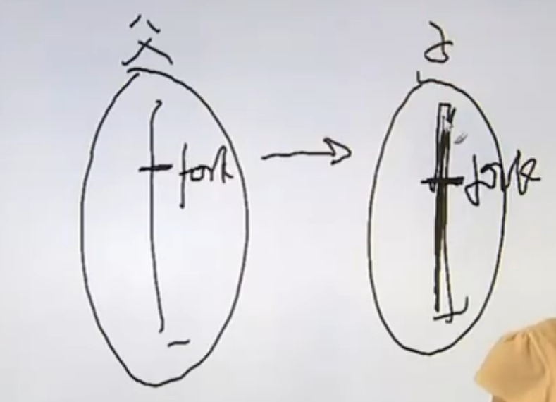
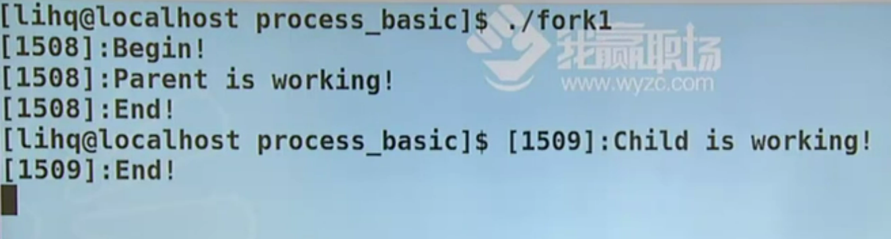
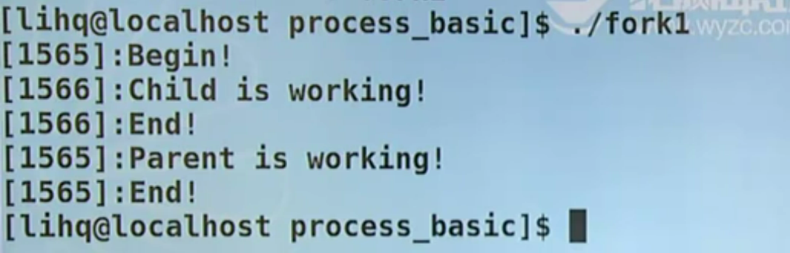
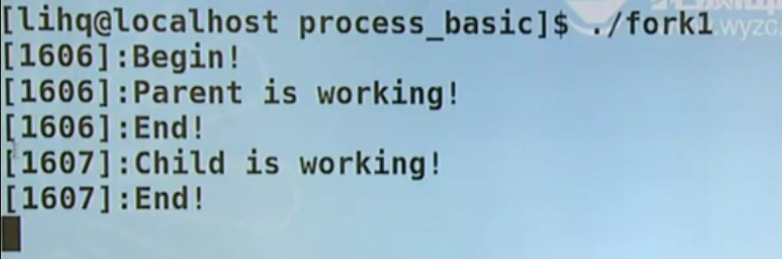
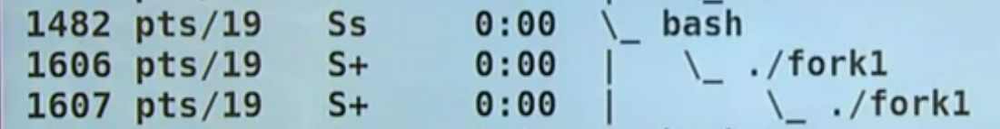
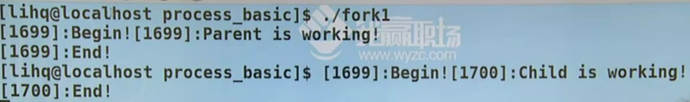
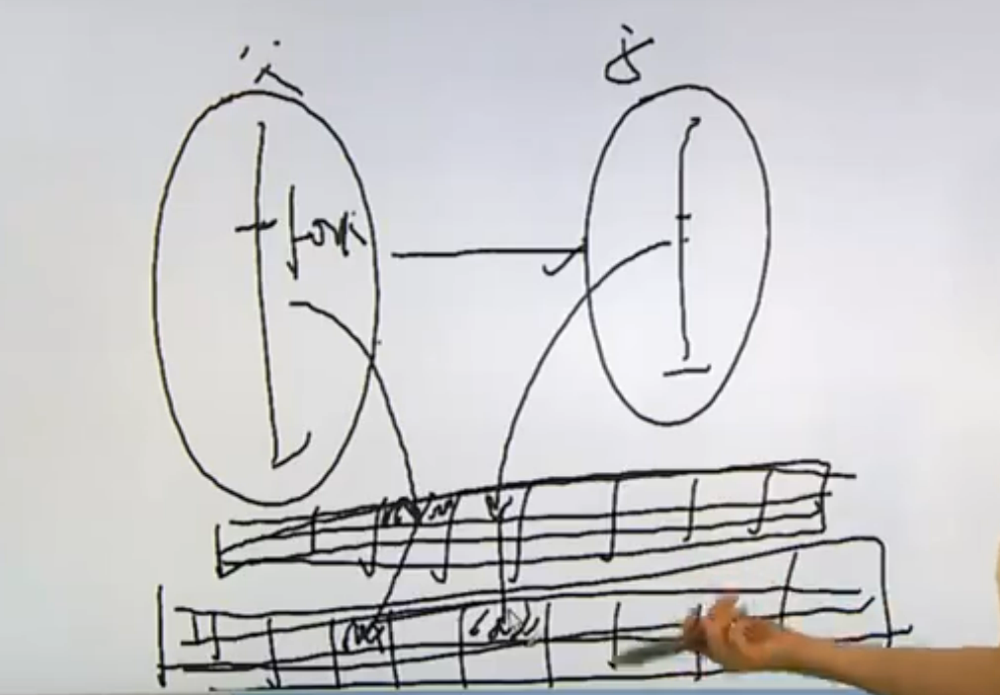
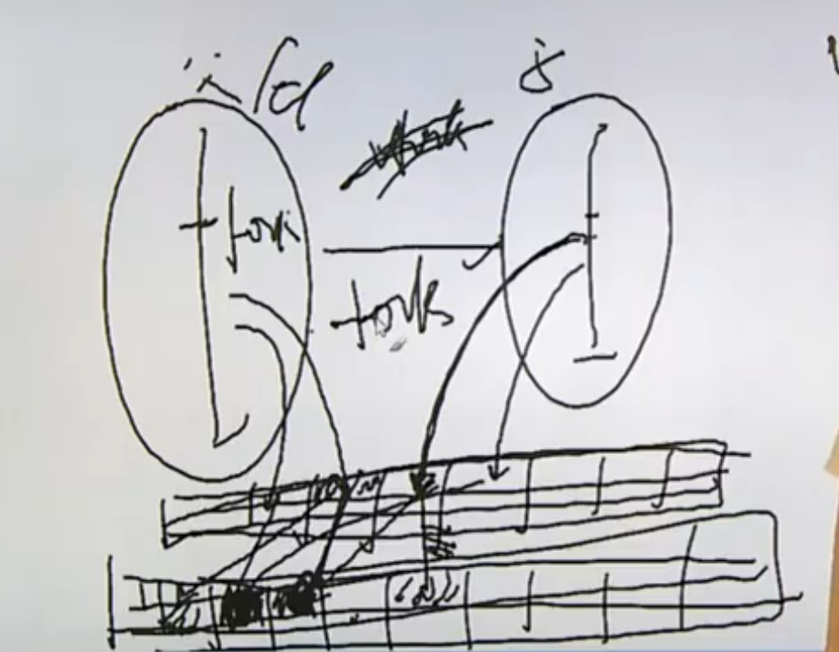

# glob函数解析

glob函数提供目录的解析功能

>NAME
>
>> glob, globfree - find pathnames matching a pattern, free memory from glob()
>
>SYNOPSIS
>
>> #include <glob.h>
>>
>> int glob(const char \*pattern, int flags, int (\*errfunc) (const char *epath, int eerrno), glob_t \*pglob);
>> void globfree(glob_t \*pglob);
>
>1. find pathnames matching a pattern：glob函数的目的是帮助分析一个pattern，这个pattern被翻译成模式或者通配符，flag
>
>

1. main函数的参数跟命令行shell来解析的通配符有什么样的关系？

```c
// main.c

#include <stdio.h>
#include <stdlib.h>

int main(int argc, char **argv)
{
    printf("argc = %d\n", argc);

    exit(0);
}
```

```shell
> ./main

# result
argc = 1

> ./main hello world 123 900

# result
argc = 5

> ./main *.c

# result
argc = 5
```

`./main *.c`命令的结果是是5而不是2，其实执行这一段指令就相当于执行`./main big.c main.c fsize.c ftype.c`，也就是说从shell环境下是获取不到\*号的，这个\*号会被当前shell解析掉，这个\*被称为通配符

// TODO

# 进程终止方式

进程环境

1. main函数
2. 进程的终止
3. 命令行参数的分析
4. 环境变量
5. C程序的存储空间布局
6. 库
7. 函数跳转
8. 资源的获取与控制


main函数目前来讲是两个参数的形式`int main(int argc, char *argv[])`

进程终止分为正常终止和异常终止

正常终止：

* 从main函数返回：return 0
* 调用exit
* 调用\_exit或\_Exit
* 最后一个线程从其启动例程返回：我们可以把进程看做一个容器，在这个容器当中如果最后一个线程都结束了的话就表示当前进程空间内再也没有线程在运行了，启动例程代表线程本身
* 最后一个线程调用了pthread_exit函数：这个函数相当于线程环境下的exit函数

异常终止：

* 调用abort函数：发送一个sigabrt_abort信号给当前进程，然后结束当前进程顺便得到一个call dword文件
* 接收到一个信号并终止，比如说有一个死循环的程序，用crtl+c结束掉了，这实际上就是接收到一个终止信号
* 最后一个线程对其取消请求作出响应：这种形式本质上来说也是被迫结束，因为线程本身跑得好好的，因为需要所以被迫取消

如果是正常终止则会刷新各种各样的流调用、钩子函数等等。但如果是异常终止，则相当于什么都不做，并且如果程序最后确定是异常终止的话，那么就会导致一些操作没有正常结束，比如关闭文件、释放资源、进程锁

# 钩子函数

>NAME
>
>> exit - cause normal process termination
>
>SYNOPSIS
>
>> #include <stdlib.h>
>>
>> void exit(int status);
>
>1. void exit(int status)：exit(status)的意思是向父进程返回一个值。比如exit(1)意思是向父进程返回值为1的整型数据，
>
>> All functions registered with atexit(3) and on_exit(3) are called, in the reverse order of their  registration.
>
>2. 如果调用exit函数使得进程正常结束，那么被atexit(3) and on_exit(3)函数注册过的函数将会被逆序调用
>
>

1. 虽然这个status是一个整型值，也就是说范围是-2^31~2^31-1，但其实并不能返回这么多种情况。exit所能返回的值是`status & 0xFF`，这个步骤就相当于保留了整型数值的后8位，而原来的整型数本身就是有符号的，所以按位与之后得到的数值也是有符号的，也就是说是一个有符号的char型大小数据，说白了exit能返回256种数据，其值范围是-128~127

> DESCRIPTION
>
> > The  exit()  function  causes  normal  process  termination and the value of status & 0xFF is returned to the parent (see wait(2))

2. 钩子函数调用者：atexit()，钩子函数能解决之前进程结束时候出现的内存来不及释放、进程来不及关闭等等问题

>NAME
>
>> atexit - register a function to be called at normal process termination
>
>SYNOPSIS
>
>> #include <stdlib.h>
>>
>> int atexit(void (*function)(void));
>
>* 注册一个函数，这个函数将会在进程正常终止时被调用
>
>* int atexit(void (*function)(void))：函数参数就是之前说的钩子函数，钩子函数的调用次序是以当初声明顺序的逆序，返回值指的是是否成功挂载钩子函数
>
>

```c
// atexit.c

#include <stdio.h>
#include <stdlib.h>

static void f1(void)
{
    puts("f1() is working");
}

static void f2(void)
{
    puts("f2() is working");
}

static void f3(void)
{
    puts("f3() is working");
}

int main()
{

    puts("Begin......");

    atexit(f1);
    atexit(f2);
    atexit(f3);
    puts("End......");

    exit(0);
}

```

* 26-28：把三个函数挂在钩子上，并没有去调用，直到要执行exit函数之前才会被调用

```markdown
# result

Begin......
End......
f3() is working
f2() is working
f1() is working
```

用伪码来表示钩子函数大的用途：我们之前写过文件打开的代码，如果fd2打开失败的话就需要做close(fd1)操作，假设后面要打开100个文件，当打开到fd100时失败了，则需要关闭从fd1到fd99一共99个文件

```c
fd1 = open();
if(fd1 < 0)
{
    perror();
    exit(1);
}

fd2 = open();
if(fd2 < 0)
{
	close(fd1);
    perror();
    exit(1);
}
// ...


fd100 = open();
if(fd100 < 0)
{
    // close(fd1);
    // close(fd2);
    // ...
    // close(fd99);
    
    perror();
    exit(1);
}
```

所以我们需要使用到钩子函数，我们在每一个文件打开之后都调用一个atexit来调用钩子函数，钩子函数的作用是close(fd)。此时如果fd2打开失败了的话就不用手动调用close(fd1)了，因为在fd2打开失败调用exit(1)的时候会主动逆序调用所有钩子函数。同理如果fd2能成功打开的话就马上挂载一个钩子函数

```c
fd1 = open();
if(fd1 < 0)
{
    perror();
    exit(1);
}

atexit();  // ------> close(fd1)

fd2 = open();
if(fd2 < 0)
{
    perror();
    exit(1);
}

atexit();  // ------> close(fd2)


fd100 = open();
if(fd100 < 0)
{
    perror();
    exit(1);
}

atexit();  // ------> close(fd100)
```

# 进程-进程概念和fork

进程基本知识

1. 进程标识符pid
2. 父子进程的产生fork
3. 进程的消亡及释放资源
4. esec函数族
5. 用户权限及组权限
6. system函数：相当于2，3，4点的封装
7. 进程会计：统计进程的所占资源量
8. 进程时间
9. 守护进程
10. 系统日志


进程标识符的类型叫做pid_t，其是一个有符号的16位整型数，也就是说能同时产生的进程个数位3万多个，但是因为pid_t是一个type define出来的类型，所以具体所占位数在每个不同的机器上都有可能不同

这里有个常用的命令是：ps

>NAME
>
>> ps - report a snapshot of the current processes.
>
>SYNOPSIS
>
>>  ps [options]
>
>EXAMPLES
>
>> ps -e
>>
>> pe -au
>>
>> ......
>
>1. ps axf
>
>2. ps axm：以详细信息进行查看

1. ​		

```shell
> ps axf

# result
PID TTY      STAT   TIME COMMAND
2 ?        S      0:00 [kthreadd]
3 ?        I<     0:00  \_ [rcu_gp]
4 ?        I<     0:00  \_ [rcu_par_gp]
6 ?        I<     0:00  \_ [kworker/0:0H-events_highpri]
7 ?        I      0:00  \_ [kworker/0:1-mm_percpu_wq]
9 ?        I<     0:00  \_ [mm_percpu_wq]
....

```

* PID：进程号

* TTY：所占据终端
* STAT：进程状态
* TIME：消耗时间
* COMMAND：哪个命令触发的该进程

文件描述符的使用策略是优先使用当前可用范围内最小的整型数，而进程标识符pid是顺次向下使用，比如当前进程号为10001，则下一个进程号为10002....即使前面有释放的进程，当前进程号并不会回头去找，而是继续往下查找，把当前进程号消耗一遍，消耗完之后再从头开始

> NAME
>
> > getpid, getppid - get process identification
>
> SYNOPSIS
>
> > #include <sys/types.h>
> > #include <unistd.h>
> >
> > pid_t getpid(void);
> > pid_t getppid(void);
>
> 1. pid_t getpid(void)：获取当前进程的进程号
> 2. pid_t getppid(void)：获取当前进程父进程的进程号
>
> ERRORS
>
> > These functions are always successful.
>
> RETURN VALUE
>
> > On success, the PID of the child process is returned in the parent, and 0 is returned in the child.  On  failure,  -1  is returned in the parent, no child process is created, and errno is set appropriately.
>
> 3. 如果创建成功则返回进程的pid给父进程，如果失败则返回-1，这个pid就是用做分支语句的判断。并且返回给子进程0值

进程的产生fork

>NAME
>
>> fork - create a child process
>
>SYNOPSIS
>
>> #include <sys/types.h>
>> #include <unistd.h>
>>
>> pid_t fork(void);
>
>1. pid_t fork(void)：通过复制当前进程来创建新进程
>
>

1. fork是典型的执行一次返回两次的函数，它的返回是从两个不同的进程中返回，从理论上来讲fork之后一定跟的是一条分支语句，即如果返回值是第一种情况该如何，是第二种情况该如何

> DESCRIPTION
>
> > fork()  creates  a  new process by duplicating the calling process.
>
> 

复制意味着副本跟原本一模一样，一模一样到什么程度，连执行到的代码位置都一样，也就是说创建出来的子进程不会从头再把程序复制一遍；注意理解关键字duplicating，意味着拷贝、一模一样



执行fork函数之后父子进程的区别：fork的返回值不同，pid不同，ppid也不同(因为父进程也是由父进程的父进程fork出来的，所以也是有ppid的)，未决信号和文件锁不继承，资源利用量清零

init进程：实际上当前的启动过程从init进程产生，它起了一个分水岭似的地位，在init进程产生之前内核是相当于一个程序在执行，产生之后就想到与一个库守在后台，即每次出现异常的时候出来解决这个异常；init进程是所有进程的祖先进程，并且进程标识符为1号

# 进程-fork实例

* 实现fork

```c
// fork1.c

#include <stdio.h>
#include <stdlib.h>
#include <unistd.h>

int main()
{
    pid_t pid;

    printf("[%d]:Begin...\n", getpid());

    pid = fork();
    if (pid < 0)
    {
        perror("fork()");
        exit(1);
    }

    if (pid == 0)		// child
    {
        printf("[%d]:Child is working...\n", getpid());
    }
    else				// parent
    {
        // sleep(1);
        printf("[%d]:Father is working...\n", getpid());
    }

    printf("[%d]:End...\n", getpid());
    
    getchar();

    exit(0);
}

```

* 14-18：在创建子进程之后做的第一个工作就是进行条件判断，如果出错当前进程就没有继续的必要
* 13：一旦执行fork语句产生父子进程关系，就相当于代码一式两份了，连执行到的位置都一样，父子进程从fork语句开始分裂，因此子进程不会执行15行之前的代码，父子进程开始分别对16行以后的代码进行判断执行
* 32：让程序等待字符输入，不要让程序结束，以此来观察父子进程的关系



出现倒数二行结果的原因是因为当前所写函数并不完善，终端命令行相较于子进程结果先打印出来了；父进程的进程号为1508，子进程的进程号为1509，在打印出Begin之后有可能看到父进程先打印也有可能看到子进程先打印。永远不要凭空猜测父子进程谁先被调度，因为调度情况是由调度器的调度策略来决定哪个进程先运行

假设一定要让子进程先运行，因为现在调度器决定的是父进程先运行，那就让父进程待一会，最简单的方式就是让父进程执行sleep函数



* 观察父子进程的关系

```c
...
printf("[%d]:End...\n", getpid());

// 让程序等待字符输入，不要让父子程序结束，以此来观察父子进程的关系
getchar();

exit(0);
...
```



调用`ps axf`命令观察进程关系，这个关系是呈现一种阶梯状关系的，当前shell创建fork1进程，在fork1执行过程中又创建一个子进程，这个子进程连名字都是一样的，因为正如之前说的子进程是父进程的一模一样的拷贝。这种阶梯状关系的源头就是init进程，所以并不是init进程直接fork出来所有进程，而是呈一种阶梯状关系不断地fork下去



大家会发现这样的现象，之前代码的结果在终端上只会输出一个begin语句和两个end语句，这是理所应当的，但是当把输出换做是文件而不是终端的话就会出错

```shell
> ./fork1 > /tmp/out
> vim /tmp/out 

# result
[12395]:Begin...
[12395]:Father is working...
[12395]:End...
[12395]:Begin...
[12396]:Child is working...
[12396]:End...
```

而且如果把第11行的换行符删掉的话在终端也会出现输出两个begin语句的现象，对于这个现象的解释是因为没有换行符，所以导致文本就被放到了输入缓冲区中，实际上也不完全是这样，因为即使begin语句后面跟着换行符，在输出到文件去的时候也会导致输出两个begin语句，所以加上换行符并没有解决这个问题



所以解决这类问题的方法就是在fork之前加一句fflush函数来刷新所有成功打开的流，所以这行非常重要。因为加一个换行符只不过是往终端输出，终端是一个标准的输出设备，而标准的输出设备是行缓冲模式，所以换行符会刷新缓冲区，而文件默认是全缓冲模式，在全缓冲模式下换行符已经不代表刷新缓冲区了，只是一个换行的作用。也就是说在begin放入了缓冲区中，还没来得及写入文件的时候就执行fork语句，那么父子进程的缓冲区里就各自有一个begin语句，所以才会输出两次。因为这个begin语句是由父进程创建的，所以即使是在子进程输出的语句，最前面的进程号也显示的是父进程的进程号

```markdown
...
printf("[%d]:Begin...\n", getpid());

fflush(NULL);

pid = fork();
...
```

fork案例的完整代码如下

```c
// fork1.c

#include <stdio.h>
#include <stdlib.h>
#include <unistd.h>

int main()
{
    pid_t pid;

    printf("[%d]:Begin...\n", getpid());

    fflush(NULL);

    pid = fork();
    if (pid < 0)
    {
        perror("fork()");
        exit(1);
    }

    if (pid == 0)
    {
        printf("[%d]:Child is working...\n", getpid());
    }
    else
    {
        printf("[%d]:Father is working...\n", getpid());
    }

    printf("[%d]:End...\n", getpid());

    // getchar();

    exit(0);
}

```

加了fflush之后就可以正常只输出一个begin语句了

```shell
# result

[13761]:Begin...
[13761]:Father is working...
[13761]:End...
[13762]:Child is working...
[13762]:End...
```

* 一个进程实现筛选质数的功能

```c
// primer.c

#include <stdio.h>
#include <stdlib.h>
#include <unistd.h>

#define LEFT 30000000
#define RIGHT 30000200

int main()
{
    int i, j, mark;

    for (i = LEFT; i <= RIGHT; i++)
    {
        mark = 1;
        for (j = 2; j < i / 2; j++)
        {
            if (i % j == 0)
            {
                mark = 0;
                break;
            }
        }
        if (mark)
            printf("%d is a primer\n", i);
    }

    exit(0);
}

```

```shell
# result

30000001 is a primer
30000023 is a primer
30000037 is a primer
30000041 is a primer
30000049 is a primer
30000059 is a primer
30000071 is a primer
30000079 is a primer
30000083 is a primer
30000109 is a primer
30000133 is a primer
30000137 is a primer
30000149 is a primer
30000163 is a primer
30000167 is a primer
30000169 is a primer
30000193 is a primer
30000199 is a primer

> ./primer | wc -l		# 查看输出结果有多少行
# result
18

> time ./primer			# 查看进程执行时间
# result
real    0m0.534s
user    0m0.525s
sys     0m0.009s

```

* 多个进程处理筛选质数功能

```c
// primer2.c

#include <stdio.h>
#include <stdlib.h>
#include <unistd.h>
#include <sys/types.h>
#include <sys/wait.h>

#define LEFT 30000000
#define RIGHT 30000200

int main()
{
    int i, j, mark;
    pid_t pid;

    for (i = LEFT; i <= RIGHT; i++)
    {

        pid = fork();
        if(pid < 0)
        {
            perror("fork()");
            exit(1);
        }
        if(pid == 0)
        {
            mark = 1;
            for (j = 2; j < i / 2; j++)
            {
                if(i%j == 0)
                {
                    mark = 0;
                    break;
                }
            }
            if(mark)
                printf("%d is a primer\n",i);

        }
    }


    exit(0);
}

```

20：父进程执行i++，并且只管fork出子进程，而子进程执行具体的筛选操作

以上程序在一般的计算机上一定会造成资源报警，因为这段代码其实不是fork了201个子进程，而是当父进程fork出子进程之后，因为子进程的代码和父进程代码是一模一样的，所以也要执行循环语句，因此子进程也会fork出子进程的子进程，这个操作同样要执行200次，以此类推......

```markdown
1 -> 200
	1 -> 199
2 -> 199
	1 -> 198
......
```

所以需要给子进程一个退出的标记，也即调用exit函数

```c
// ...
if(mark)
    printf("%d is a primer\n",i);

exit(0);
// ...
```

添加exit函数之后执行一遍程序，可以观察到显示结果变得无序；执行time命令观察执行时间

```shell
# result
...
30000199 is a primer
30000109 is a primer
30000133 is a primer
30000137 is a primer
30000049 is a primer
30000149 is a primer
...

> time ./primer2	# 多进程执行

# result
real    0m0.063s
user    0m0.000s
sys     0m0.048s

> time ./primer		# 单进程执行

# reuslt
real    0m0.534s
user    0m0.521s
sys     0m0.012s
```

因为涉及到创建、切换进程导致程序执行时间变慢，又因为由于是多进程在处理这段程序所以导致程序执行时间加快，总的来说执行效率是变快的，所以可以看到的是sys时间变慢，因为涉及到进程操作，而real时间也就是总体时间变快

# 进程-init进程和vfork

针对之前获取质数的代码，观察父子进程关系的现象

```c
// primer2.c

int main()
{
    int i, j, mark;
    pid_t pid;

    for (i = LEFT; i <= RIGHT; i++)
    {

        pid = fork();
        if(pid < 0)
        {
            perror("fork()");
            exit(1);
        }
        if(pid == 0)
        {
            mark = 1;
            for (j = 2; j < i / 2; j++)
            {
                if(i%j == 0)
                {
                    mark = 0;
                    break;
                }
            }
            if(mark)
                printf("%d is a primer\n",i);
            
            sleep(1000);
			exit(0);
        }
    }


    exit(0);
}

```

* 31：加上sleep函数

现在有201个子进程，每一个子进程拿到一个待计算的i值，等计算完之后不管是否输出都需要sleep一下，即在这个程序中一定会让父进程先结束，现在执行以下程序primer2并且调用`ps axf`来看下执行结果，应该是有201个子进程，它们的状态都是S(sleep)，并且如果当前进程的树状进程关系是顶格来写的话，那么表示当前进程的父进程是init

```shell
> ps axf
# result

...
20779 pts/2    S      0:00  \_ ./primer2
20780 pts/2    S      0:00  \_ ./primer2
20781 pts/2    S      0:00  \_ ./primer2
20782 pts/2    S      0:00  \_ ./primer2
20783 pts/2    S      0:00  \_ ./primer2
20784 pts/2    S      0:00  \_ ./primer2
20785 pts/2    S      0:00  \_ ./primer2
20786 pts/2    S      0:00  \_ ./primer2
...
```

此时更改sleep函数的位置，把它放到父进程exit前面，那么现在是父进程在执行完程序之前需要sleep等待1000s，而子进程是每一个执行完就关闭

```c
// primer2.c

int main()
{
    int i, j, mark;
    pid_t pid;

    for (i = LEFT; i <= RIGHT; i++)
    {

        pid = fork();
        if(pid < 0)
        {
            perror("fork()");
            exit(1);
        }
        if(pid == 0)
        {
            mark = 1;
            for (j = 2; j < i / 2; j++)
            {
                if(i%j == 0)
                {
                    mark = 0;
                    break;
                }
            }
            if(mark)
                printf("%d is a primer\n",i);

            exit(0);
        }
    }

    sleep(1000);
    exit(0);
}

```

可以发现现在的子进程状态就不是顶格写了，而是以primer2作为父进程。当前父进程的状态是S态，而每个子进程的状态是Z态，在进程关系当中，出现Z态是非常正常的。我们一直在强调一个观点：谁打开谁关闭，谁申请谁释放，要在当前环境下把子进程理解为父进程创建的资源，所以理所应当父进程把资源创建出来最后应该及时释放资源。所以父子进程的关系需要有个"收尸"的过程，如果父进程不收尸的话，那么子进程就像僵尸一样待在内存空间，收尸环节需要利用到wait函数，这个我们之后再讲。等父进程sleep(1000)结束之后，父进程将会正常退出，那么这些僵尸进程就会变成孤儿进程(父亲没了可不就是孤儿了吗)，那么孤儿进程全部都由init进程接管并且释放资源

```shell
> ps axf
# result

...
34405 pts/2    S+     0:00  |   |   |   |   |   \_ ./primer2
34406 pts/2    Z+     0:00  |   |   |   |   |       \_ [primer2] <defunct>
34407 pts/2    Z+     0:00  |   |   |   |   |       \_ [primer2] <defunct>
34408 pts/2    Z+     0:00  |   |   |   |   |       \_ [primer2] <defunct>
34409 pts/2    Z+     0:00  |   |   |   |   |       \_ [primer2] <defunct>
34410 pts/2    Z+     0:00  |   |   |   |   |       \_ [primer2] <defunct>
34411 pts/2    Z+     0:00  |   |   |   |   |       \_ [primer2] <defunct>
34412 pts/2    Z+     0:00  |   |   |   |   |       \_ [primer2] <defunct>
34413 pts/2    Z+     0:00  |   |   |   |   |       \_ [primer2] <defunct>
34414 pts/2    Z+     0:00  |   |   |   |   |       \_ [primer2] <defunct>
...
```

如果程序中出现僵尸态，这个僵尸进程应该是一闪即逝的，因为可能是由于操作系统或者是父进程因为忙于其他处理事务而没来得及给僵尸子进程收尸，但是肯定有一时刻是处于空闲状态的，那么在这个时候就可以给僵尸进程收尸了。僵尸进程大量存在其实占不了多少内存，因为一个僵尸进程其实就是一个结构体，这个结构体中只有诸如PID、退出状态等一系列状态标识，这些状态标识也就几个字节大小

我们再回到第一个sleep函数在循环体内的程序，也就是父进程不执行sleep，而子进程执行sleep，即父进程执行完程序就立马退出，而这些执行了sleep函数的子进程统统变成了孤儿进程等待init进程收尸。但是init进程也在等，等这群孤儿进程sleep执行完，再去执行exit才能去收尸，也就是说不管是父进程还是子进程，只要是一个正常在运行的程序是没有办法被收尸的，如果要强制收尸的话，那就意味着异常终止。所以到目前为止还差一个收尸的手段：父进程创建子进程，子进程干完活之前父进程在等子进程结束任务再去把子进程收尸释放资源，收尸主要做两件事，1. 是否关心子进程的退出状态，如果关心的话那就应该有个能获取子进程状态的功能；2.释放PID，因为这个资源非常宝贵，以为PID之前说过是一个16位的整型数据，是有一个上限的，如果僵尸进程一直占用着PID资源，那么极端点来讲其他进程就有可能获取不到PID了 

写时拷贝技术：

fork是通过复制父进程的方式来产生一个子进程，假设父进程从数据库中读取30w条记录，需要子进程帮忙打印一串“hello world”然后退出。这边关联了30w条数据，那么在执行fork操作产生子进程的时候就相当于memcpy了一遍，辛辛苦苦拷贝了30w条数据然后就只打印一串字符然后还没用上，所以就可以看到fork的成本实际来说是有点高的，但是需要知道的是，这只是fork的一种原始实现：

父进程一旦fork就产生一了一个子进程，父子进程是通过memcpy实现的，比如说现在有一份页表(虚拟地址->物理地址的映射)和一块物理地址，假设父进程当中用到了一个物理块，并且指针指向其中一个页表项，这个指针所关联的物理地址也是其中一块物理地址。然后一fork出子进程的话，子进程里面的数据也指向其中一个页表项，然后在对应的物理地址上也memcpy了一块空间给子进程中的数据



然后就遇到了我们刚才说的情况，所以现在在引入了写实时拷贝技术后的fork函数在父进程调用fork产生子进程的时候，父子进程共用同一块真实的物理地址，如果父子进程对这块空间是只读不写的话，那么还是共用一块；但是如果有一个进程企图去写这块物理空间的话，假设是父进程要去改变里面的数据，那么就把这块物理地址上的数据memcpy一份到别的地址上去，让页表项的对应数据变为另一块物理块的地址，然后去改新数据地址上的数据，该操作的准则是：谁写谁拷贝，父子进程之间除了一开始创建和收尸的关系之外，其他的资源一律不共享(进程是资源分配的最小单位)，两者是完全独立的个体，不是说父亲进程能去子进程里获取资源




