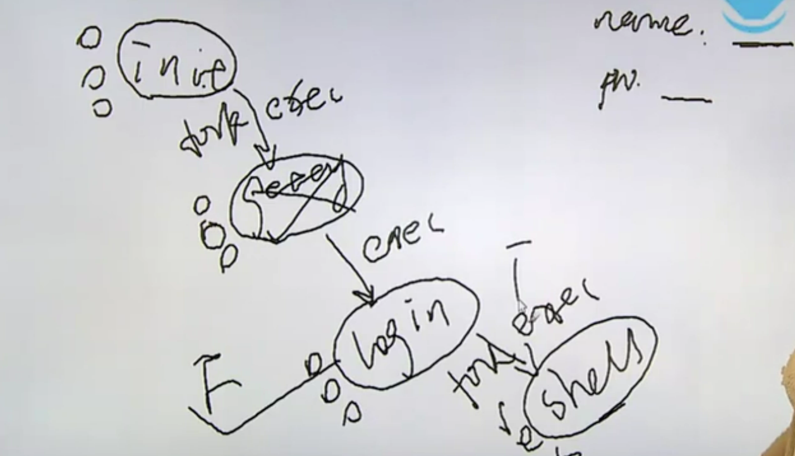

# glob函数解析

glob函数提供目录的解析功能

>NAME
>
>> glob, globfree - find pathnames matching a pattern, free memory from glob()
>
>SYNOPSIS
>
>> #include <glob.h>
>>
>> int glob(const char \*pattern, int flags, int (\*errfunc) (const char *epath, int eerrno), glob_t \*pglob);
>> void globfree(glob_t \*pglob);
>
>1. find pathnames matching a pattern：glob函数的目的是帮助分析一个pattern，这个pattern被翻译成模式或者通配符，flag
>
>

1. main函数的参数跟命令行shell来解析的通配符有什么样的关系？

```c
// main.c

#include <stdio.h>
#include <stdlib.h>

int main(int argc, char **argv)
{
    printf("argc = %d\n", argc);

    exit(0);
}
```

```shell
> ./main

# result
argc = 1

> ./main hello world 123 900

# result
argc = 5

> ./main *.c

# result
argc = 5
```

`./main *.c`命令的结果是是5而不是2，其实执行这一段指令就相当于执行`./main big.c main.c fsize.c ftype.c`，也就是说从shell环境下是获取不到\*号的，这个\*号会被当前shell解析掉，这个\*被称为通配符

// TODO

# 进程终止方式

进程环境

1. main函数
2. 进程的终止
3. 命令行参数的分析
4. 环境变量
5. C程序的存储空间布局
6. 库
7. 函数跳转
8. 资源的获取与控制


main函数目前来讲是两个参数的形式`int main(int argc, char *argv[])`

进程终止分为正常终止和异常终止

正常终止：

* 从main函数返回：return 0
* 调用exit
* 调用\_exit或\_Exit
* 最后一个线程从其启动例程返回：我们可以把进程看做一个容器，在这个容器当中如果最后一个线程都结束了的话就表示当前进程空间内再也没有线程在运行了，启动例程代表线程本身
* 最后一个线程调用了pthread_exit函数：这个函数相当于线程环境下的exit函数

异常终止：

* 调用abort函数：发送一个sigabrt_abort信号给当前进程，然后结束当前进程顺便得到一个call dword文件
* 接收到一个信号并终止，比如说有一个死循环的程序，用crtl+c结束掉了，这实际上就是接收到一个终止信号
* 最后一个线程对其取消请求作出响应：这种形式本质上来说也是被迫结束，因为线程本身跑得好好的，因为需要所以被迫取消

如果是正常终止则会刷新各种各样的流调用、钩子函数等等。但如果是异常终止，则相当于什么都不做，并且如果程序最后确定是异常终止的话，那么就会导致一些操作没有正常结束，比如关闭文件、释放资源、进程锁

# 钩子函数

>NAME
>
>> exit - cause normal process termination
>
>SYNOPSIS
>
>> #include <stdlib.h>
>>
>> void exit(int status);
>
>1. void exit(int status)：exit(status)的意思是向父进程返回一个值。比如exit(1)意思是向父进程返回值为1的整型数据，
>
>> All functions registered with atexit(3) and on_exit(3) are called, in the reverse order of their  registration.
>
>2. 如果调用exit函数使得进程正常结束，那么被atexit(3) and on_exit(3)函数注册过的函数将会被逆序调用
>
>

1. 虽然这个status是一个整型值，也就是说范围是-2^31~2^31-1，但其实并不能返回这么多种情况。exit所能返回的值是`status & 0xFF`，这个步骤就相当于保留了整型数值的后8位，而原来的整型数本身就是有符号的，所以按位与之后得到的数值也是有符号的，也就是说是一个有符号的char型大小数据，说白了exit能返回256种数据，其值范围是-128~127

> DESCRIPTION
>
> > The  exit()  function  causes  normal  process  termination and the value of status & 0xFF is returned to the parent (see wait(2))

2. 钩子函数调用者：atexit()，钩子函数能解决之前进程结束时候出现的内存来不及释放、进程来不及关闭等等问题

>NAME
>
>> atexit - register a function to be called at normal process termination
>
>SYNOPSIS
>
>> #include <stdlib.h>
>>
>> int atexit(void (*function)(void));
>
>* 注册一个函数，这个函数将会在进程正常终止时被调用
>
>* int atexit(void (*function)(void))：函数参数就是之前说的钩子函数，钩子函数的调用次序是以当初声明顺序的逆序，返回值指的是是否成功挂载钩子函数
>
>

```c
// atexit.c

#include <stdio.h>
#include <stdlib.h>

static void f1(void)
{
    puts("f1() is working");
}

static void f2(void)
{
    puts("f2() is working");
}

static void f3(void)
{
    puts("f3() is working");
}

int main()
{

    puts("Begin......");

    atexit(f1);
    atexit(f2);
    atexit(f3);
    puts("End......");

    exit(0);
}

```

* 26-28：把三个函数挂在钩子上，并没有去调用，直到要执行exit函数之前才会被调用

```markdown
# result

Begin......
End......
f3() is working
f2() is working
f1() is working
```

用伪码来表示钩子函数大的用途：我们之前写过文件打开的代码，如果fd2打开失败的话就需要做close(fd1)操作，假设后面要打开100个文件，当打开到fd100时失败了，则需要关闭从fd1到fd99一共99个文件

```c
fd1 = open();
if(fd1 < 0)
{
    perror();
    exit(1);
}

fd2 = open();
if(fd2 < 0)
{
	close(fd1);
    perror();
    exit(1);
}
// ...


fd100 = open();
if(fd100 < 0)
{
    // close(fd1);
    // close(fd2);
    // ...
    // close(fd99);
    
    perror();
    exit(1);
}
```

所以我们需要使用到钩子函数，我们在每一个文件打开之后都调用一个atexit来调用钩子函数，钩子函数的作用是close(fd)。此时如果fd2打开失败了的话就不用手动调用close(fd1)了，因为在fd2打开失败调用exit(1)的时候会主动逆序调用所有钩子函数。同理如果fd2能成功打开的话就马上挂载一个钩子函数

```c
fd1 = open();
if(fd1 < 0)
{
    perror();
    exit(1);
}

atexit();  // ------> close(fd1)

fd2 = open();
if(fd2 < 0)
{
    perror();
    exit(1);
}

atexit();  // ------> close(fd2)


fd100 = open();
if(fd100 < 0)
{
    perror();
    exit(1);
}

atexit();  // ------> close(fd100)
```

# 进程-进程概念和fork

进程基本知识

1. 进程标识符pid
2. 父子进程的产生fork
3. 进程的消亡及释放资源
4. esec函数族
5. 用户权限及组权限
6. system函数：相当于2，3，4点的封装
7. 进程会计：统计进程的所占资源量
8. 进程时间
9. 守护进程
10. 系统日志


进程标识符的类型叫做pid_t，其是一个有符号的16位整型数，也就是说能同时产生的进程个数位3万多个，但是因为pid_t是一个type define出来的类型，所以具体所占位数在每个不同的机器上都有可能不同

这里有个常用的命令是：ps

>NAME
>
>> ps - report a snapshot of the current processes.
>
>SYNOPSIS
>
>>  ps [options]
>
>EXAMPLES
>
>> ps -e
>>
>> pe -au
>>
>> ......
>
>1. ps axf
>
>2. ps axm：以详细信息进行查看

1. ​		

```shell
> ps axf

# result
PID TTY      STAT   TIME COMMAND
2 ?        S      0:00 [kthreadd]
3 ?        I<     0:00  \_ [rcu_gp]
4 ?        I<     0:00  \_ [rcu_par_gp]
6 ?        I<     0:00  \_ [kworker/0:0H-events_highpri]
7 ?        I      0:00  \_ [kworker/0:1-mm_percpu_wq]
9 ?        I<     0:00  \_ [mm_percpu_wq]
....

```

* PID：进程号

* TTY：所占据终端
* STAT：进程状态
* TIME：消耗时间
* COMMAND：哪个命令触发的该进程

文件描述符的使用策略是优先使用当前可用范围内最小的整型数，而进程标识符pid是顺次向下使用，比如当前进程号为10001，则下一个进程号为10002....即使前面有释放的进程，当前进程号并不会回头去找，而是继续往下查找，把当前进程号消耗一遍，消耗完之后再从头开始

> NAME
>
> > getpid, getppid - get process identification
>
> SYNOPSIS
>
> > #include <sys/types.h>
> > #include <unistd.h>
> >
> > pid_t getpid(void);
> > pid_t getppid(void);
>
> 1. pid_t getpid(void)：获取当前进程的进程号
> 2. pid_t getppid(void)：获取当前进程父进程的进程号
>
> ERRORS
>
> > These functions are always successful.
>
> RETURN VALUE
>
> > On success, the PID of the child process is returned in the parent, and 0 is returned in the child.  On  failure,  -1  is returned in the parent, no child process is created, and errno is set appropriately.
>
> 3. 如果创建成功则返回进程的pid给父进程，如果失败则返回-1，这个pid就是用做分支语句的判断。并且返回给子进程0值

进程的产生fork

>NAME
>
>> fork - create a child process
>
>SYNOPSIS
>
>> #include <sys/types.h>
>> #include <unistd.h>
>>
>> pid_t fork(void);
>
>1. pid_t fork(void)：通过复制当前进程来创建新进程
>
>

1. fork是典型的执行一次返回两次的函数，它的返回是从两个不同的进程中返回，从理论上来讲fork之后一定跟的是一条分支语句，即如果返回值是第一种情况该如何，是第二种情况该如何

> DESCRIPTION
>
> > fork()  creates  a  new process by duplicating the calling process.
>
> 

复制意味着副本跟原本一模一样，一模一样到什么程度，连执行到的代码位置都一样，也就是说创建出来的子进程不会从头再把程序复制一遍；注意理解关键字duplicating，意味着拷贝、一模一样


执行fork函数之后父子进程的区别：fork的返回值不同，pid不同，ppid也不同(因为父进程也是由父进程的父进程fork出来的，所以也是有ppid的)，未决信号和文件锁不继承，资源利用量清零

init进程：实际上当前的启动过程从init进程产生，它起了一个分水岭似的地位，在init进程产生之前内核是相当于一个程序在执行，产生之后就想到与一个库守在后台，即每次出现异常的时候出来解决这个异常；init进程是所有进程的祖先进程，并且进程标识符为1号

# 进程-fork实例

* 实现fork

```c
// fork1.c

#include <stdio.h>
#include <stdlib.h>
#include <unistd.h>

int main()
{
    pid_t pid;

    printf("[%d]:Begin...\n", getpid());

    pid = fork();
    if (pid < 0)
    {
        perror("fork()");
        exit(1);
    }

    if (pid == 0)		// child
    {
        printf("[%d]:Child is working...\n", getpid());
    }
    else				// parent
    {
        // sleep(1);
        printf("[%d]:Father is working...\n", getpid());
    }

    printf("[%d]:End...\n", getpid());
    
    getchar();

    exit(0);
}

```

* 14-18：在创建子进程之后做的第一个工作就是进行条件判断，如果出错当前进程就没有继续的必要
* 13：一旦执行fork语句产生父子进程关系，就相当于代码一式两份了，连执行到的位置都一样，父子进程从fork语句开始分裂，因此子进程不会执行15行之前的代码，父子进程开始分别对16行以后的代码进行判断执行
* 32：让程序等待字符输入，不要让程序结束，以此来观察父子进程的关系


出现倒数二行结果的原因是因为当前所写函数并不完善，终端命令行相较于子进程结果先打印出来了；父进程的进程号为1508，子进程的进程号为1509，在打印出Begin之后有可能看到父进程先打印也有可能看到子进程先打印。永远不要凭空猜测父子进程谁先被调度，因为调度情况是由调度器的调度策略来决定哪个进程先运行

假设一定要让子进程先运行，因为现在调度器决定的是父进程先运行，那就让父进程待一会，最简单的方式就是让父进程执行sleep函数


* 观察父子进程的关系

```c
...
printf("[%d]:End...\n", getpid());

// 让程序等待字符输入，不要让父子程序结束，以此来观察父子进程的关系
getchar();

exit(0);
...
```


调用`ps axf`命令观察进程关系，这个关系是呈现一种阶梯状关系的，当前shell创建fork1进程，在fork1执行过程中又创建一个子进程，这个子进程连名字都是一样的，因为正如之前说的子进程是父进程的一模一样的拷贝。这种阶梯状关系的源头就是init进程，所以并不是init进程直接fork出来所有进程，而是呈一种阶梯状关系不断地fork下去


大家会发现这样的现象，之前代码的结果在终端上只会输出一个begin语句和两个end语句，这是理所应当的，但是当把输出换做是文件而不是终端的话就会出错

```shell
> ./fork1 > /tmp/out
> vim /tmp/out 

# result
[12395]:Begin...
[12395]:Father is working...
[12395]:End...
[12395]:Begin...
[12396]:Child is working...
[12396]:End...
```

而且如果把第11行的换行符删掉的话在终端也会出现输出两个begin语句的现象，对于这个现象的解释是因为没有换行符，所以导致文本就被放到了输入缓冲区中，实际上也不完全是这样，因为即使begin语句后面跟着换行符，在输出到文件去的时候也会导致输出两个begin语句，所以加上换行符并没有解决这个问题


所以解决这类问题的方法就是在fork之前加一句fflush函数来刷新所有成功打开的流，所以这行非常重要。因为加一个换行符只不过是往终端输出，终端是一个标准的输出设备，而标准的输出设备是行缓冲模式，所以换行符会刷新缓冲区，而文件默认是全缓冲模式，在全缓冲模式下换行符已经不代表刷新缓冲区了，只是一个换行的作用。也就是说在begin放入了缓冲区中，还没来得及写入文件的时候就执行fork语句，那么父子进程的缓冲区里就各自有一个begin语句，所以才会输出两次。因为这个begin语句是由父进程创建的，所以即使是在子进程输出的语句，最前面的进程号也显示的是父进程的进程号

```markdown
...
printf("[%d]:Begin...\n", getpid());

fflush(NULL);

pid = fork();
...
```

fork案例的完整代码如下

```c
// fork1.c

#include <stdio.h>
#include <stdlib.h>
#include <unistd.h>

int main()
{
    pid_t pid;

    printf("[%d]:Begin...\n", getpid());

    fflush(NULL);

    pid = fork();
    if (pid < 0)
    {
        perror("fork()");
        exit(1);
    }

    if (pid == 0)
    {
        printf("[%d]:Child is working...\n", getpid());
    }
    else
    {
        printf("[%d]:Father is working...\n", getpid());
    }

    printf("[%d]:End...\n", getpid());

    // getchar();

    exit(0);
}

```

加了fflush之后就可以正常只输出一个begin语句了

```shell
# result

[13761]:Begin...
[13761]:Father is working...
[13761]:End...
[13762]:Child is working...
[13762]:End...
```

* 一个进程实现筛选质数的功能

```c
// primer.c

#include <stdio.h>
#include <stdlib.h>
#include <unistd.h>

#define LEFT 30000000
#define RIGHT 30000200

int main()
{
    int i, j, mark;

    for (i = LEFT; i <= RIGHT; i++)
    {
        mark = 1;
        for (j = 2; j < i / 2; j++)
        {
            if (i % j == 0)
            {
                mark = 0;
                break;
            }
        }
        if (mark)
            printf("%d is a primer\n", i);
    }

    exit(0);
}

```

```shell
# result

30000001 is a primer
30000023 is a primer
30000037 is a primer
30000041 is a primer
30000049 is a primer
30000059 is a primer
30000071 is a primer
30000079 is a primer
30000083 is a primer
30000109 is a primer
30000133 is a primer
30000137 is a primer
30000149 is a primer
30000163 is a primer
30000167 is a primer
30000169 is a primer
30000193 is a primer
30000199 is a primer

> ./primer | wc -l		# 查看输出结果有多少行
# result
18

> time ./primer			# 查看进程执行时间
# result
real    0m0.534s
user    0m0.525s
sys     0m0.009s

```

* 多个进程处理筛选质数功能

```c
// primer2.c

#include <stdio.h>
#include <stdlib.h>
#include <unistd.h>
#include <sys/types.h>
#include <sys/wait.h>

#define LEFT 30000000
#define RIGHT 30000200

int main()
{
    int i, j, mark;
    pid_t pid;

    for (i = LEFT; i <= RIGHT; i++)
    {

        pid = fork();
        if(pid < 0)
        {
            perror("fork()");
            exit(1);
        }
        if(pid == 0)
        {
            mark = 1;
            for (j = 2; j < i / 2; j++)
            {
                if(i%j == 0)
                {
                    mark = 0;
                    break;
                }
            }
            if(mark)
                printf("%d is a primer\n",i);

        }
    }


    exit(0);
}

```

20：父进程执行i++，并且只管fork出子进程，而子进程执行具体的筛选操作

以上程序在一般的计算机上一定会造成资源报警，因为这段代码其实不是fork了201个子进程，而是当父进程fork出子进程之后，因为子进程的代码和父进程代码是一模一样的，所以也要执行循环语句，因此子进程也会fork出子进程的子进程，这个操作同样要执行200次，以此类推......

```markdown
1 -> 200
	1 -> 199
2 -> 199
	1 -> 198
......
```

所以需要给子进程一个退出的标记，也即调用exit函数

```c
// ...
if(mark)
    printf("%d is a primer\n",i);

exit(0);
// ...
```

添加exit函数之后执行一遍程序，可以观察到显示结果变得无序；执行time命令观察执行时间

```shell
# result
...
30000199 is a primer
30000109 is a primer
30000133 is a primer
30000137 is a primer
30000049 is a primer
30000149 is a primer
...

> time ./primer2	# 多进程执行

# result
real    0m0.063s
user    0m0.000s
sys     0m0.048s

> time ./primer		# 单进程执行

# reuslt
real    0m0.534s
user    0m0.521s
sys     0m0.012s
```

因为涉及到创建、切换进程导致程序执行时间变慢，又因为由于是多进程在处理这段程序所以导致程序执行时间加快，总的来说执行效率是变快的，所以可以看到的是sys时间变慢，因为涉及到进程操作，而real时间也就是总体时间变快

# 进程-init进程和vfork

针对之前获取质数的代码，观察父子进程关系的现象

```c
// primer2.c

int main()
{
    int i, j, mark;
    pid_t pid;

    for (i = LEFT; i <= RIGHT; i++)
    {

        pid = fork();
        if(pid < 0)
        {
            perror("fork()");
            exit(1);
        }
        if(pid == 0)
        {
            mark = 1;
            for (j = 2; j < i / 2; j++)
            {
                if(i%j == 0)
                {
                    mark = 0;
                    break;
                }
            }
            if(mark)
                printf("%d is a primer\n",i);
            
            sleep(1000);
			exit(0);
        }
    }


    exit(0);
}

```

* 31：加上sleep函数

现在有201个子进程，每一个子进程拿到一个待计算的i值，等计算完之后不管是否输出都需要sleep一下，即在这个程序中一定会让父进程先结束，现在执行以下程序primer2并且调用`ps axf`来看下执行结果，应该是有201个子进程，它们的状态都是S(sleep)，并且如果当前进程的树状进程关系是顶格来写的话，那么表示当前进程的父进程是init

```shell
> ps axf
# result

...
20779 pts/2    S      0:00  \_ ./primer2
20780 pts/2    S      0:00  \_ ./primer2
20781 pts/2    S      0:00  \_ ./primer2
20782 pts/2    S      0:00  \_ ./primer2
20783 pts/2    S      0:00  \_ ./primer2
20784 pts/2    S      0:00  \_ ./primer2
20785 pts/2    S      0:00  \_ ./primer2
20786 pts/2    S      0:00  \_ ./primer2
...
```

此时更改sleep函数的位置，把它放到父进程exit前面，那么现在是父进程在执行完程序之前需要sleep等待1000s，而子进程是每一个执行完就关闭

```c
// primer2.c

int main()
{
    int i, j, mark;
    pid_t pid;

    for (i = LEFT; i <= RIGHT; i++)
    {

        pid = fork();
        if(pid < 0)
        {
            perror("fork()");
            exit(1);
        }
        if(pid == 0)
        {
            mark = 1;
            for (j = 2; j < i / 2; j++)
            {
                if(i%j == 0)
                {
                    mark = 0;
                    break;
                }
            }
            if(mark)
                printf("%d is a primer\n",i);

            exit(0);
        }
    }

    sleep(1000);
    exit(0);
}

```

可以发现现在的子进程状态就不是顶格写了，而是以primer2作为父进程。当前父进程的状态是S态，而每个子进程的状态是Z态，在进程关系当中，出现Z态是非常正常的。我们一直在强调一个观点：谁打开谁关闭，谁申请谁释放，要在当前环境下把子进程理解为父进程创建的资源，所以理所应当父进程把资源创建出来最后应该及时释放资源。所以父子进程的关系需要有个"收尸"的过程，如果父进程不收尸的话，那么子进程就像僵尸一样待在内存空间，收尸环节需要利用到wait函数，这个我们之后再讲。等父进程sleep(1000)结束之后，父进程将会正常退出，那么这些僵尸进程就会变成孤儿进程(父亲没了可不就是孤儿了吗)，那么孤儿进程全部都由init进程接管并且释放资源

```shell
> ps axf
# result

...
34405 pts/2    S+     0:00  |   |   |   |   |   \_ ./primer2
34406 pts/2    Z+     0:00  |   |   |   |   |       \_ [primer2] <defunct>
34407 pts/2    Z+     0:00  |   |   |   |   |       \_ [primer2] <defunct>
34408 pts/2    Z+     0:00  |   |   |   |   |       \_ [primer2] <defunct>
34409 pts/2    Z+     0:00  |   |   |   |   |       \_ [primer2] <defunct>
34410 pts/2    Z+     0:00  |   |   |   |   |       \_ [primer2] <defunct>
34411 pts/2    Z+     0:00  |   |   |   |   |       \_ [primer2] <defunct>
34412 pts/2    Z+     0:00  |   |   |   |   |       \_ [primer2] <defunct>
34413 pts/2    Z+     0:00  |   |   |   |   |       \_ [primer2] <defunct>
34414 pts/2    Z+     0:00  |   |   |   |   |       \_ [primer2] <defunct>
...
```

如果程序中出现僵尸态，这个僵尸进程应该是一闪即逝的，因为可能是由于操作系统或者是父进程因为忙于其他处理事务而没来得及给僵尸子进程收尸，但是肯定有一时刻是处于空闲状态的，那么在这个时候就可以给僵尸进程收尸了。僵尸进程大量存在其实占不了多少内存，因为一个僵尸进程其实就是一个结构体，这个结构体中只有诸如PID、退出状态等一系列状态标识，这些状态标识也就几个字节大小

我们再回到第一个sleep函数在循环体内的程序，也就是父进程不执行sleep，而子进程执行sleep，即父进程执行完程序就立马退出，而这些执行了sleep函数的子进程统统变成了孤儿进程等待init进程收尸。但是init进程也在等，等这群孤儿进程sleep执行完，再去执行exit才能去收尸，也就是说不管是父进程还是子进程，只要是一个正常在运行的程序是没有办法被收尸的，如果要强制收尸的话，那就意味着异常终止。所以到目前为止还差一个收尸的手段：父进程创建子进程，子进程干完活之前父进程在等子进程结束任务再去把子进程收尸释放资源，收尸主要做两件事，1. 是否关心子进程的退出状态，如果关心的话那就应该有个能获取子进程状态的功能；2.释放PID，因为这个资源非常宝贵，以为PID之前说过是一个16位的整型数据，是有一个上限的，如果僵尸进程一直占用着PID资源，那么极端点来讲其他进程就有可能获取不到PID了 

写时拷贝技术：

fork是通过复制父进程的方式来产生一个子进程，假设父进程从数据库中读取30w条记录，需要子进程帮忙打印一串“hello world”然后退出。这边关联了30w条数据，那么在执行fork操作产生子进程的时候就相当于memcpy了一遍，辛辛苦苦拷贝了30w条数据然后就只打印一串字符然后还没用上，所以就可以看到fork的成本实际来说是有点高的，但是需要知道的是，这只是fork的一种原始实现：

父进程一旦fork就产生一了一个子进程，父子进程是通过memcpy实现的，比如说现在有一份页表(虚拟地址->物理地址的映射)和一块物理地址，假设父进程当中用到了一个物理块，并且指针指向其中一个页表项，这个指针所关联的物理地址也是其中一块物理地址。然后一fork出子进程的话，子进程里面的数据也指向其中一个页表项，然后在对应的物理地址上也memcpy了一块空间给子进程中的数据


然后就遇到了我们刚才说的情况，所以现在在引入了写实时拷贝技术后的fork函数在父进程调用fork产生子进程的时候，父子进程共用同一块真实的物理地址，如果父子进程对这块空间是只读不写的话，那么还是共用一块；但是如果有一个进程企图去写这块物理空间的话，假设是父进程要去改变里面的数据，那么就把这块物理地址上的数据memcpy一份到别的地址上去，让页表项的对应数据变为另一块物理块的地址，然后去改新数据地址上的数据，该操作的准则是：谁写谁拷贝，父子进程之间除了一开始创建和收尸的关系之外，其他的资源一律不共享(进程是资源分配的最小单位)，两者是完全独立的个体，不是说父亲进程能去子进程里获取资源


# 进程-wait和waitpid

进程的消亡以资源释放

* wait();
* waitpid();

>NAME
>
>> wait, waitpid, waitid - wait for process to change state
>
>SYNOPSIS
>
>> #include <sys/types.h>
>> #include <sys/wait.h>
>>
>> pid_t wait(int *wstatus);
>>
>> pid_t waitpid(pid_t pid, int *wstatus, int options);
>
>1. wait for process to change state：等待进程状态发生变化
>2. pid_t wait(int *wstatus)：wstatus表示的是进程状态，要的是一个整型指针类型数据，这个wait操作是把当前进程子进程收尸回来的状态值放到这个wstatus变量当中去，因为是要把值找一个变量存储起来，所以传参是指针类型
>3. pid_t waitpid(pid_t pid, int *wstatus, int options)：指定一个PID回收，把退出码存放在wstatus指定的存储空间中，在收尸阶段的配置在options字段设置

在之前我们执行primer函数的时候，结果是命令行先显示出来然后才是逐渐打印结果。本来所有的程序理应是先出结果再出命令行，本节讲解的wait操作其实也就是在解释这个现象


2. wait函数如果成功的话返回的是终止的子进程ID，如果失败则返回-1

>RETURN VALUE
>
>> wait(): on success, returns the process ID of the terminated child; on error, -1 is returned.

其实可以给status传值NULL，因为可以只收尸不关注返回回来的状态，linux提供了若干宏来检测当前进程的退出状态

>DESCRIPTION
>
>> WIFEXITED(wstatus)：子进程是否正常结束，如果正常结束则返回true，否则返回false
>>
>> WEXITSTATUS(wstatus)：返回子进程结束时的状态，这个宏值必须要在WIFEXITED()返回值为真的时候才能检测，即首先得保证子进程是正常结束，然后这个宏就能打印子进程的退出码，即return()或者exit()括号里的值，比如常见的return 0; exit(0)，则退出码就是0
>>
>> WIFSIGNALED(wstatus)：如果子进程是由一个信号终止的，则返回true，也就是说子进程不是正常结束而是被一个信号叫停
>>
>> WTERMSIG(wstatus)：如果WIFSIGNALED为真，则可进一步使用。把导致当前子进程结束的signal number的编号返回
>>
>> ......
>
>

wait函数是没有指向的，即参数中并没有指定回收哪个子进程，只有等到把子进程回收之后通过返回值才知道其具体的PID，所以waitpid就是来解决这个不足的

3. 因为waitpid函数中有pid，所以就可以指定回收具体的子进程，其实waitpid这个函数好用的地方并不在于PID这个参数，而在于options参数。之前的wait函数是死等，即子进程结束之后，进程状态发生了改变，则会有个状态码status来通知父进程，随后父进程才去收尸，如果子进程状态出了问题永远也通知不了父进程的话，那么父进程就会一直处于等待的状态；但如果是waitpid的话就有着options可以设置某些参数来改变死等的状态

> DESCRIPTION
>
> > The value of options is an OR of zero or more of the following constants:
> >
> > WNOHANG     return immediately if no child has exited.
> >
> > WUNTRACED   also return if a child has stopped (but not traced via ptrace(2)).  Status for  traced  children  which  have stopped is provided even if this option is not specified.
> >
> > WCONTINUED (since Linux 2.6.10)
> > also return if a stopped child has been resumed by delivery of SIGCONT.
>
> 

* options是一个位图

* WNOHANG：如果添加了WNOHANG选项的话，即使当前没有子进程结束运行退出，也要立即退出，相当于WNOHANG选项把waitpid这个操作从阻塞变为非阻塞。wait操作死等并且收一个子进程的尸然后发现返回值，才能知道回收的是哪个子进程；waipid中如果options字段为0就相当于wait操作，如果options字段不为空，比如说是WNOHANG，那么如果指定进程仍在运行也会立刻返回不死等，如果确实已经结束了才会回收子进程。只有在子进程状态发生变化的时候才能执行收尸操作取出退出码然后释放资源，一个进程如果在正常运行是无法收尸的，有了options字段waitpid函数可以是非阻塞的，但是wait函数一定是阻塞的

>DESCRIPTION
>
>> The value of pid can be:
>>
>> < -1   meaning wait for any child process whose process group ID is equal to the absolute value of pid.
>>
>> -1     meaning wait for any child process.
>>
>> 0      meaning  wait  for any child process whose process group ID is equal to that of the calling process at the time of the call to waitpid().
>>
>> 0    meaning wait for the child whose process ID is equal to the value of pid.

PID的值其实也没有这么简单，PID如果大于0则意味着要回收的进程就是函数参数PID指定的进程；如果为0表示回收同组中的其他任意一个子进程；如果为-1则可以回收任意一个子进程；如果小于-1，则回收PID为对应值绝对值的哪个进程，比如返回值为-5，则回收PID为5的子进程

wait就相当于`waitpid(-1, &wstatus, 0)`的封装，-1表示回收任意一个子进程，状态码放入wstatus地址空间，没有options配置

* 添加收尸手段之后的primer程序

```c
#include <stdio.h>
#include <stdlib.h>
#include <unistd.h>
#include <sys/types.h>
#include <sys/wait.h>

#define LEFT 30000000
#define RIGHT 30000200

int main()
{
    int i, j, mark;
    pid_t pid;

    for (i = LEFT; i <= RIGHT; i++)
    {

        pid = fork();
        if (pid < 0)
        {
            perror("fork()");
            exit(1);
        }
        if (pid == 0)
        {
            mark = 1;
            for (j = 2; j < i / 2; j++)
            {
                if (i % j == 0)
                {
                    mark = 0;
                    break;
                }
            }
            if (mark)
                printf("%d is a primer\n", i);

            // sleep(1000);
            exit(0);
        }
    }

    for (i = LEFT; i <= RIGHT; i++)
        // wait(&st);
        wait(NULL);
    
    // sleep(1000);

    exit(0);
}

```

* 43-45：如果想要获取状态码则把状态写入st地址，如果不关心状态，则可以传入NULL

添加了收尸手段之后程序的结构就发生变化了，父进程fork了201个子进程，则等待子进程执行完毕，并且等待201次。当201个子进程陆续的exit回来，父进程就等在那边一个个回收

```shell
liangruuu@liangruuu-virtual-machine:~/study/linuxc/code/process_basic$ ./primer2
# result
30000001 is a primer
30000023 is a primer
30000041 is a primer
30000037 is a primer
30000049 is a primer
30000071 is a primer
30000079 is a primer
30000109 is a primer
30000059 is a primer
30000163 is a primer
30000137 is a primer
30000133 is a primer
30000167 is a primer
30000083 is a primer
30000193 is a primer
30000149 is a primer
30000199 is a primer
30000169 is a primer
```

# 进程-进程分配之交叉分配法实现

之前的筛选质数程序其实是有一点问题的，201个待计算的数值对应着创建了201个进程进行计算，其实这个设计思路不太好，因为假设在程序当中把left和right的值不停地放大，那么待计算的数也会一直增大到很大的数值，如果每一个待计算的数值都要用一个子进程来做的话就会出现一个问题：因为pid_t类型是有一个大小上限的，所以到底能否创建这么多个子进程？因此需要从别的角度去设计代码

```c
#include <stdio.h>
#include <stdlib.h>
#include <unistd.h>
#include <sys/types.h>
#include <sys/wait.h>

#define LEFT 30000000
#define RIGHT 30000200

int main()
{
    int i, j, mark;
    pid_t pid;

    for (i = LEFT; i <= RIGHT; i++)
    {

        pid = fork();
        if (pid < 0)
        {
            perror("fork()");
            exit(1);
        }
        if (pid == 0)
        {
            mark = 1;
            for (j = 2; j < i / 2; j++)
            {
                if (i % j == 0)
                {
                    mark = 0;
                    break;
                }
            }
            if (mark)
                printf("%d is a primer\n", i);

            exit(0);
        }
    }

    for (i = LEFT; i <= RIGHT; i++)
        wait(NULL);

    exit(0);
}

```

不管现在有201个质数还是多少个质数都统一找N个进程去执行，N是任意非负整数，并且确定系统能创建这么多个进程

1. 分块法：假如N是3，把201个待计算的数分成3份，每个进程来分担一部分数据的计算(就算待分数据个数无法被进程个数所整除也无所谓，无非就是某个进程多分一点数，某个进程少分一点数，其实无所谓)，看样子确实是把201个数给均分了，但其实每组任务是有轻重的，也就是说任务分配地不平均，直观来看进程1计算的都是小一点的数，而进程3计算的都是大一点的数，但其实是进程1的负载最重，因为比如说2~20之间的质数个数要比20~40之间的质数要多，并且20~40之间的质数要比200~400之间的质数要多，看出来了吗？质数一定是在小数范围内的分布多一些，因此会分配更多的质数给进程1，所以进程1的负载会是最重的，所以分块法并不是解决问题的最佳方法


2. 交叉分配法：交叉分配法就涉及到一些随机性了，201个数会随机分配给这三个进程中的其中一个。在一般的模型中如果能用分块法或交叉分配法进行并发的话优先使用交叉分配法，但是在这个模型上不是，这个模型太特殊了，用1、2两种方法解决这个问题都不是特别好。因为除3余0的数一定分配给第一个进程，除3余1的数一定分配给第二个进程，除3余2的数一定分配给第三个进程，可以看到第一个进程所处理的数肯定不是质数，因此会导致某个进程一个质数都拿不到


3. 池类算法：上游有一个任务，下游有N个任务，中间建立一个通讯的机制，上游的任务是把201个待计算的数值以此往中间容器传送，下游的三个进程去抢任务，抢到质数的进程就去计算，没抢到质数的进程就把数"扔了"然后继续去抢。当然这个池跟进程池是不同的，这个池只是一个容器，是一个任务池，然后把任务不停往这放。这种方式的好处就是能者多劳，拿到非质数就多算几个，拿到质数就少算几个，这里的随机性就完全取决于进程调度器的调度策略。这里先不实现池类算法，因为会涉及到竞争，比如某个进程抢到一个数，那么其他进程是怎么知道这个数已经被抢了的呢？怎么让别的进程知道该进程做了什么任务，等到讲到进程中通信的时候在去实现


* 用交叉分配法实现筛选质数

```c
// primer.c

#include <stdio.h>
#include <stdlib.h>
#include <unistd.h>
#include <sys/types.h>
#include <sys/wait.h>

#define LEFT 30000000
#define RIGHT 30000200
#define N 3

int main()
{
    int i, j, n, mark;
    pid_t pid;

    for (n = 0; n < N; n++)
    {
        pid = fork();
        if (pid < 0)
        {
            perror("fork()");
            exit(1);
        }
        if (pid == 0)
        {
            for (i = LEFT + n; i <= RIGHT; i += N)
            {
                mark = 1;
                for (j = 2; j < i / 2; j++)
                {
                    if (i % j == 0)
                    {
                        mark = 0;
                        break;
                    }
                }
                if (mark)
                    printf("[%d]:%d is a primer\n", n, i);
            }
            exit(0);
        }
    }

    for (n = 0; n < N; n++)
        wait(NULL);

    exit(0);
}
```

* 20：父进程专注于fork子进程，子进程去执行筛选质数的任务
* 21-25：其实这段代码是不严谨的，之前提到过假设前两个fork操作成功，在执行到第3个fork操作的时候失败了，如果是父进程的角色的话报错之后先别调用exit结束，因为有两个子进程已经被创建了还没来得及回收，从而使得子进程变成了僵尸进程，最后变成了孤儿进程从而被init进程接管。所以严谨一点的话先报错然后调用一个循环去回收之前创建的子进程的资源然后再调用exit
* 28-44：exit(0)放到了循环体外，目的是为了让子进程把活干完，因为每一个循环都是对应着一个子进程需要完成的任务；循环起始位置也不再固定位LEFT，因为该交叉分配法的原理，不同的进程起始位置不同，并且每次循环所增加的步长也是N
* 46-47：fork了3次，所以要收3次尸

```shell
liangruuu@liangruuu-virtual-machine:~/study/linuxc/code/process_basic$ ./primerN 
[2]:30000023 is a primer
[1]:30000001 is a primer
[2]:30000041 is a primer
[1]:30000037 is a primer
[2]:30000059 is a primer
[1]:30000049 is a primer
[2]:30000071 is a primer
[1]:30000079 is a primer
[2]:30000083 is a primer
[1]:30000109 is a primer
[2]:30000137 is a primer
[1]:30000133 is a primer
[2]:30000149 is a primer
[1]:30000163 is a primer
[1]:30000169 is a primer
[2]:30000167 is a primer
[1]:30000193 is a primer
[1]:30000199 is a primer
```

可以看到所拿数值是3的倍数的第一个子进程永远拿不到任何质数

# exec函数族

在这个阶段需要记住一个单词：few(fork+exec+wait)，这三个函数搭建起了整个unix框架

一个进程产fork一个子进程，这个子进程由又fork出来一个子进程的时候，是通过复制父进程的方式来产生的，因为是复制，所以需要和父进程一模一样。比如primer2程序，用ps命令把程序暂停起来，然后观察到：当前的shell终端fork了一个primer2子进程，而primer2子进程中又fork除了201个子进程，所以产生了201个primer2进程。后者比较好理解，由primer2执行了201次fork语句产生了201个子进程，这201个进程是和primer2一模一样的，代码以及执行的位置都一样，只不过再往下由于父子进程就会根据自己的身份来选择预先设定好的所要执行的代码

但是比如说用ps命令查看进程树的话，比如说像之前的程序就会看到如下的进程关系树：当前的shell把它当做bash，在终端上就会出现类似的级联关系，由我们写的primer2进程创建出了201个子进程，这201个进程就是和primer2一模一样的，可是在它之前还有一层关系，当前的父进程primer2之前还有一个shell进程。1. 但是如果按照之前的说法，一个父进程创建子进程是通过复制自己的方式来进行创建的，为什么这个primer2跟bash不一样呢，为什么当前的shell进行创建出来的不是一个shell进程而是一个primer2进程，这是一个问题；2. 还有一个问题：假设说当前算上父进程一共202个进程，在代码中就已经约定了如果是子进程就执行XX，如果是父进程就执行XX，那父子进程要执行的工作全在一个位置声明，换句话说各个子进程每个子进程执行的内容是一样的，父子进程的任务全在代码中体现出来了，那这样的话就不能让子进程去执行一段别的可执行进程它只能执行事先给规定好的代码，这样子放大点来想的话难不成要把所有要用的功能全部在一段程序当中声明吗？这就有点像html代码中的frame标签，frame标签里装的是外部任意一个可被展示的内容，但是并没有在html代码中规定这个frame需要被展示一些什么东西，所以这里就需要用到exec函数族

```shell
bash
	./primer2
		./primer2
		./primer2
		./primer2
		...201
```

>NAME
>
>> execl, execlp, execle, execv, execvp, execvpe - execute a file
>
>SYNOPSIS
>
>> #include <unistd.h>
>>
>> extern char **environ;
>>
>> int execl(const char \*pathname, const char \*arg, ...);
>> int execlp(const char \*file, const char \*arg, ...);
>> int execle(const char \*pathname, const char \*arg, ..., char *const envp[]);
>>
>> int execv(const char \*pathname, char \*const argv[]);
>> int execvp(const char \*file, char \*const argv[]);
>
>1. execute a file：这些函数族的功能都是统一的，即执行一个文件，有一句话非常重要：exec函数族的功能是`replaces the current process image with a new process image`，用一个新的进程映像去替换当前进程映像
>2. int execl(const char \*pathname, const char \*arg, ...)：把要运行的二进制可执行文件的路径地址作为参数pathname，char \*arg和...代表着执行pathname对应的文件时应该传递的参数，当然可以传多个参数，但是要在最后补一个NULL作为当前传递参数的结束
>3. execlp：不必给出可执行程序的路径，只需要给出文件名即可以及各种参数，参数形式如execl。为什么可以直接传递一个文件名而不用传递一个文件路径，是因为有个环境变量environ，这个环境变量可以理解为在配置java或者各种程序时进行各种路径配置时已经配置好的值
>4. execle：envp[]就代表着可以把自定义的存放环境变量的文件导入进来
>5. 前面三个函数看起来用...来表示变参形式，但其实是固定参数，因为一旦要传参数，就必须要在函数传参末尾添加一个NULL，那就表示当前的参数个数是固定了的；其实后两个函数才是真正的变参函数
>
>RETURN VALUE
>
>> The  exec() functions return only if an error has occurred.  The return value is -1, and errno is set to indicate the error.
>
>6. exec函数如果有返回值的话，那么就意味着replace失败。如果replace成功的话，那么进程映像就会被一个新的进程映像所替换

1. 为什么在shell下面执行`./primer2`能够产生一个子进程，并且子进程还是primer2，而不是shell或者父进程，原因就在于exec函数族的功能，通过一个打印时间戳的小例子来看下一个进程是如何摇身一变成为另一个进程的，也即"你还是你，你已经不是你了"

```c
// exec.c

#include <stdio.h>
#include <stdlib.h>
#include <unistd.h>

int main()
{
    puts("Begin...");

    execl("/bin/date", "date", "+%s", NULL);
    perror("execl()");
    exit(1);

    puts("End...");

    exit(0);
}

```

* 10：`date +%s`命令意味打印当前时间的时间戳， date命令的可执行文件在/bin/date，并且需要注意的是函数参数里的argv都是从argv[0]开始的，argv[0]就意味着命令，比如`ls -la`中ls就是argv[0]；最后以NULL作为结束，即argv[0]=date，argv[1]=+%s，argv[2]=NULL

因为execl的功能是用一个新的进程映像来替换目前的进程，也就是说当前的进程映像已经替换为了/bin/date，所以End语句打印不出来

```shell
liangruuu@liangruuu-virtual-machine:~/study/linuxc/code/process_basic$ ./exec 
Begin...
1647949601
```

其实这段程序是有一点问题的，如果执行`./exec > /tmp/out`命令输出重定向到文件中去就会发现连Begin都打印不出来，即在终端能够输出Begin，但是重定向到文件当中去的时候就会出现问题，所以在exec函数族的使用过程中也一定要注意fflush的使用，即在exec之前一定要需要刷新该刷新的所有流，因为还是那句话puts是基于行缓冲机制实现的，换行符代表刷新缓冲区，如果往文件里输入的话换行符就只代表一个换行的作用，结果这个Begin语句被放到缓冲区还没来得及输出就执行execl命令导致一个新的进程映像date替代了旧的进程映像，但是在新的进程印象里没有刷新缓冲区的操作，所以就会出现下面的问题

```shell
liangruuu@liangruuu-virtual-machine:~/study/linuxc/code/process_basic$ cat /tmp/out 
1647950781
```

完善程序

```c
// exec.c

#include <stdio.h>
#include <stdlib.h>
#include <unistd.h>

int main()
{
    puts("Begin...");
    fflush(NULL);  // !!!

    execl("/bin/date", "date", "+%s", NULL);
    perror("execl()");
    exit(1);

    puts("End...");

    exit(0);
}

```

```shell
liangruuu@liangruuu-virtual-machine:~/study/linuxc/code/process_basic$ gcc exec.c -o exec
liangruuu@liangruuu-virtual-machine:~/study/linuxc/code/process_basic$ ./exec > /tmp/out
liangruuu@liangruuu-virtual-machine:~/study/linuxc/code/process_basic$ cat /tmp/out 
Begin...
1647951154
```

"你还是你，但你已经不是你了"的意思是壳子没有变，壳子指的是PID，一旦fork出一个子进程就给子进程分配一个PID，即使当前进程映像被替换成了别的进程映像，但是PID是不会改变的。其实会发现上面的函数其实是没有意义的，因为既然我要使用别的程序代码，为什么不在一开始就用执行别的程序反而是要创建一个进程然后用exec函数族去替换调用呢？

* 把三个函数(fork,exec,wait)串成一块

```c
// few.c

#include <stdio.h>
#include <stdlib.h>
#include <unistd.h>
#include <sys/wait.h>

int main()
{
    pid_t pid;
    puts("Begin...");
    fflush(NULL);

    pid = fork();
    if (pid < 0)
    {
        perror("fork()");
        exit(1);
    }
    if (pid == 0)
    {
        execl("/bin/date", "date", "+%s", NULL);
        perror("execl()");
        exit(1);
    }

    wait(NULL);

    puts("End...");
    // getchar();

    exit(0);
}

```

* 12：fork之前一定要记得刷新所有流
* 20-25：如果是子进程就去执行别的程序
* 29：如果是父进程就等待子进程的返回

在本节最开始的时候讲到了一个问题就是在一个程序里代码中把父子进程所有的执行逻辑都写进去，这就显得很臃肿和冗余，通过few代码我们才知道exec就是有种类似模块化开发的意思在，即子进程要执行的程序在别的可执行文件中定义

```shell
liangruuu@liangruuu-virtual-machine:~/study/linuxc/code/process_basic$ gcc few.c -o few
liangruuu@liangruuu-virtual-machine:~/study/linuxc/code/process_basic$ ./few 
Begin...
1647951993
End...
```

# 进程-命令实现

来看下ls这个命令在shell环境下执行的时候所进行的工作一次来串联fork、exec和wait函数

shell环境下执行一个命令的时候其实就是fork产生了一个子进程，产生的这个子进程本质来说就是shell本身，然后再去执行exec函数让子进程变成所要执行的命令。在子进程运行的时候，父进程在执行wait函数等待子进程的所有结果都输出完之后，给子进程收尸，然后再去执行别的任务，所以可以看到一旦执行ls命令都是先把结果显示出来，然后再弹出命令行。由于当前shell程序写的是一个死循环，所以当前shell继续打印命令行等待终端的输入情况

```shell
liangruuu@liangruuu-virtual-machine:~/study/linuxc/code/process_basic$ ls
exec  exec.c  few  few.c  fork1  fork1.c  primer  primer2  primer2.c  primer.c  primerN  primerN.c
liangruuu@liangruuu-virtual-machine:~/study/linuxc/code/process_basic$ 
```


包括之前实现的没有添加wait操作的primer2代码，这份代码是实现结果是命令行先输出然后输出程序结果，因为shell创建了一个子进程，子进程primer2再运行，因为在primer2代码中没有加wait操作，所以primer2在fork完之后立马执行exec操作，然后当前的shell作为primer2的父进程正在wait，所以等待primer2一退出，收尸完了之后打印出命令行就结束了，但是primer2进程的子进程就变成了孤儿进程，此时该输出就输出

```
liangruuu@liangruuu-virtual-machine:~/study/linuxc/code/process_basic$ ./primer2 
liangruuu@liangruuu-virtual-machine:~/study/linuxc/code/process_basic$ 30000023 is a primer
30000037 is a primer
30000049 is a primer
30000079 is a primer
30000001 is a primer
30000083 is a primer
...
```

此时有个问题：为什么子进程的信息也显示在当前终端上而不是另外开一个终端显示？为什么父子进程能够打印到同一个终端上

有很多人认为不就应该显示打印在终端上吗，因为当前用的就是这个terminal。其实很多在我们眼里稀松平常，理所应当的现象都是蕴含着各种基本知识

父进程当中有一个文件描述符表，文件描述符表内存放着各种文件打开时的fd，包括默认的3个标准的设备stdin、stdout、stderr分别关联着0、1、2号文件描述符。一旦父进程执行了fork操作，那么产生的子进程是通过复制自身的方式所产生的，那么子进程里也会有一个一模一样的文件描述符表，所以子进程文件描述符是从父进程中继承过来的，包括0、1、2这三个描述符，而子进程中的这三个描述符也指向与父进程中指向的相同硬件设备，这就是为什么父子进程会共用同一个terminal的信息

其实父子进程间通信也是通过这种方式，比如父进程打开了一个文件，并且给这个文件分配3号描述符，此时一旦fork子进程，则子进程的3号描述符也指向相同的文件，那么现在父子进程间就可以实现通信了，比如父进程写文件->子进程读文件->子进程写文件->父进程读文件，这就是通信最基础的原型，但是要在这种通信中更多地考虑竞争和冲突：如何保证父进程写文件的时候子进程没有在读文件？反之亦然，这就是之后进程间通信要解决的问题

* 使用few实现sleep(100)的功能

```c
// sleep.c

#include <stdio.h>
#include <stdlib.h>
#include <unistd.h>
#include <sys/wait.h>

int main()
{
    pid_t pid;
    puts("Begin...");
    fflush(NULL);

    pid = fork();
    if (pid < 0)
    {
        perror("fork()");
        exit(1);
    }
    if (pid == 0)
    {
        execl("/bin/sleep", "sleep", "100", NULL);
        perror("execl()");
        exit(1);
    }

    wait(NULL);

    puts("End...");
    // getchar();

    exit(0);
}

```

```shell
liangruuu@liangruuu-virtual-machine:~/study/linuxc/code/process_basic$ ./sleep 
Begin...


liangruuu@liangruuu-virtual-machine:~/study/linuxc$ ps axf
39242 pts/4    Ss     0:00  |   |   |   |   \_ /usr/bin/bash
104122 pts/4    S+     0:00  |   |   |   |   |   \_ ./sleep
104123 pts/4    S+     0:00  |   |   |   |   |       \_ sleep 100
```

sleep是bash的子进程，sleep 100是sleep的子进程

这里要提一句argv[1]，我们通常对argv[1]没有那么关心，而且我们一般都把可执行文件的名字声明为源文件除去.c之后的名字

```shell
liangruuu@liangruuu-virtual-machine:~/study/linuxc/code/process_basic$ ls
exec  exec.c  few  few.c  fork1  fork1.c  primer  primer2  primer2.c  primer.c  primerN  primerN.c  sleep  sleep.c
```

但其实如果我们直接执行gcc [文件名]的话，其实就是生成了一个可执行的二进制文件名为a.out，其实我们并没有那么关心可执行文件的名字，也就是说我们并没有那么关心argv[0]

```shell
liangruuu@liangruuu-virtual-machine:~/study/linuxc/code/process_basic$ ls
a.out  exec  exec.c  few  few.c  fork1  fork1.c  primer  primer2  primer2.c  primer.c  primerN  primerN.c  sleep  sleep.c
```

但是在sleep程序中有这样一个问题：用exec调用某一个进程的时候，给该进程传参是从argv[0]开始的，又因为我们不关心argv[0]，所以这就可能导致我们能随意取名，这里的httpd是随意取名的

```c
execl("/bin/sleep", "httpd", "100", NULL);
```

改完代码之后再来执行一遍源程序，sleep进程的子进程已经变成了httpd，但是当前运行的是sleep这个二进制文件，我们让其实现的功能也是sleep(100)，假设说创建的子进程被别人利用了，所以它可以被伪造成类似这样的名字，这个就是木马程序的低级藏身办法，当我们感觉操作系统或者数据文件不太安全想查询进程关系的时候就只会发现一个httpd服务器在运行，但其实是一个不相关甚至是病毒文件在运行

```shell
liangruuu@liangruuu-virtual-machine:~/study/linuxc/code/process_basic$ ./sleep 
Begin...


liangruuu@liangruuu-virtual-machine:~/study/linuxc$ ps axf
39242 pts/4    Ss     0:00  |   |   |   |   \_ /usr/bin/bash
104122 pts/4    S+     0:00  |   |   |   |   |   \_ ./sleep
104123 pts/4    S+     0:00  |   |   |   |   |       \_ httpd 100
```

* 实现一个简易版的shell

1. 首先确定shell是一个死循环
2. 打印命令行
3. 习惯性输出$符号，$后面输命令，当前shell接收输入命令之后应该是先fork出来一个子进程，随后让子进程摇身一变，也就是调用exec函数族当中的某一个去执行某个命令，而shell本身作为父进程去wait，等子进程获得结果之后然后给子进程收尸进行资源释放
4. 调用exec这一族的任意一个函数，就要想到一个问题：不管是哪个函数，定参还是变参的形式都要把当前参数一个一个拆分出来，因为在传参的时候不是要一个大串，而要的是argv[0]，argv[1]....，比如`ls -l /etc -a /tmp /home -i ......`
5. 当前在shell环境下进行的命令实现有两种命令：1. 外部命令；2. 内部命令
    * 外部命令：一个命令的二进制可执行文件是存放在磁盘上的，那么这个命令就被称为外部命令
    * 内部命令：除了外部命令以外的命令，比如目录的管理、当前进程消亡之后子进程如何处理、调度命令（目前而言暂时不去考虑，因为涉及的知识点太多）

```c
#include <stdio.h>
#include <stdlib.h>
#include <unistd.h>

int main()
{
    while (1)
    {
        prompt();

        getline();

        parse();

        if (是内部命令)
        {
        }
        else if (是外部命令)
        {
            fork();
            if (< 0)
            {
            }
            if (== 0) // child
            {
                execXX();
                perror();
                exit(1);
            }
            else // parent
            {
                wait();
            }
        }
    }

    exit(0);
}
```

* 7：shell终端是一个死循环
* 9：打印提示符prompt
* 11：从终端获取输入内容，不要用gets，因为可能产生内存溢出，所以使用getline，不管一行字符多大都能全部拿到直到遇到\n为止
* 13：解析刚才拿到的输入内容，区分是内部命令还是外部命令
* 18-34：立刻使用fork创建出子进程，如果出错就....，如果成功则区分父子进程；如果是子进程则通过exec函数调用argv[0]、argv[1]等参数去replace想要变成的进程，如果变错则报错结束；如果师父进程就等着给子进程收尸，回收完子进程资源后就回到了while循环一开始再继续执行下一步的命令执行

# 进程-shell内部命令实现

1. 第一步打印提示符prompt函数，没有返回值

```c
static void prompt(void)
{
    printf("mysh-0.1$ ");
}
```

2. 第二步：getline函数的第一个参数为一个二级指针，第二个参数为set_t类型变量的地址，为的是描述当前地址空间有多大，第三个参数是一个stream流

```c
char *linebuf = NULL;
size_t linebuf_size = 0;

if (getline(&linebuf, &linebuf_size, stdin) < 0)
    break;
```

3. 第三步：用parse函数解析输入的命令，即linebuf中的内容，parse函数的作用是分割linebuf中的内容，以区分arg[0]，argv[1]...然后把这些参数给之后exec函数族当中的某一个函数使用

```cc
#define DELIMS " \t\n"

struct cmd_st
{
    glob_t globres;
};


static void parse(char *line, struct cmd_st *res)
{
    char *tok;
    int i = 0;

    while (1)
    {
        tok = strsep(&line, DELIMS);
        if (tok == NULL)
            break;

        if (tok[0] == '\0')
            continue;

        glob(tok, GLOB_NOCHECK | GLOB_APPEND * i, NULL, &res->globres);
        i = 1;
    }
}

```

* 8：strsep函数给定分隔符，把一个长串分割为由若干小串，在进行分割小串的时候字符串位置指针每判断一位都会向后移动一位，直到分割出一个小串。也就是说执行一次strsep函数只能分割出一个小串，所以需要使用一个循环来不断产生小串
* 1：定义分隔符DELIMS为空格、Tab、回车
* 20：若存在多个分隔符间隔的情况，比如`ls -a -l    /etc   /aaa/bbb/ccc`，则跳过当前分割符的判断，因为这些分隔符通过strsep函数的操作已经变成了数组里的一个空元素，所以用尾0来判断
* 23：tok作为通配符pattern；第二个参数是GLOB_NOCHECK，因为分割函数strsep的特性是解析一次只能产生一个小串，即针对`ls -l -a /etc`这个命令，解析ls然后放入地址，然后第二次循环再解析-l放入第四个参数所指地址并以此类推，但是这样子的操作是会覆盖掉之前的数据的，所以我们需要GLOB_APPEND属性以追加形式替换覆盖，并且变量i的作用是让第一次glob操作不追加，相当于GLOB_NOCHECK或上一个0值，执行完一次之后的操作才追加；第三个参数是出错路径设置为NULL；第四个参数是存放结果的地址值，我们使用一个结构体里的属性来接收，为什么要构建一个结构体呢？因为可能在执行shell命令的时候我们需要其他一些属性，而我们可以把这些属性全部保存在这个结构体里，就像FILE结构体存放了所有关于文件的信息，这里我们为了程序的拓展性就设置了一个结构体，只不过当前只需要在结构体里面放一个地址属性即可

现在出现了一个问题：通过strsep函数把每一个参数都获取出来了，但是没有地方去保存，那么比较理想的是定义一个数组，数组中的每一个元素内容都是字符指针char\*，但是问题又来了，这个数组大小定义为多大？可以发现无法固定一个数组大小，因为函数参数的不确定的，所以无法用一个固定长度的数组去接收变长度的元素。我们可以类比argv的存储，argv就相当于无论参数有多少都能存，直到最后有一个空指针来表示当前字符串的结束，因为我们本身就是在自定义实现一个shell中argv的功能，所以就无法使用现成的argv

glob函数和argv的存储结构很像

>NAME
>
>> glob, globfree - find pathnames matching a pattern, free memory from glob()
>
>SYNOPSIS
>
>> int glob(const char \*pattern, int flags, int (\*errfunc) (const char \*epath, int eerrno), glob_t \*pglob);
>
>1. int glob(const char \*pattern, int flags, int (\*errfunc) (const char \*epath, int eerrno), glob_t \*pglob)
>    

1. 我们可以使用glob_t结构体中的gl_pathv参数来充当argv使用

```c
typedef struct {
    size_t   gl_pathc;    /* Count of paths matched so far  */
    char   **gl_pathv;    /* List of matched pathnames.  */
    size_t   gl_offs;     /* Slots to reserve in gl_pathv.  */
} glob_t;

```

glob函数的第一个参数为pattern，但是在我们的shell功能中并没有涉及到通配符的使用，所以这时我们可以使用第二个flag参数来取消对第一个参数的使用

>DESCRIPTION
>
>> The argument flags is made up of the bitwise OR of zero or more the following symbolic constants, which modify the behavior of glob():
>>
>> ...
>>
>> GLOB_NOCHECK
>> If  no  pattern  matches,  return  the  original pattern.  By default, glob() returns GLOB_NOMATCH if there are no
>> matches.
>>
>> ...

* GLOB_NOCHECK属性的作用就是当没有内容可以匹配当前pattern的话，那么就把当前这个pattern本身返回，比如在我们的shell程序中给定ls命令，然后就会直接返回这个ls命令

完整代码

```c
#include <stdio.h>
#include <stdlib.h>
#include <string.h>
#include <unistd.h>
#include <glob.h>
#include <sys/wait.h>

#define DELIMS " \t\n"

struct cmd_st
{
    glob_t globres;
};

static void prompt(void)
{
    printf("mysh-0.1$ ");
}

static void parse(char *line, struct cmd_st *res)
{
    char *tok;
    int i = 0;

    while (1)
    {
        tok = strsep(&line, DELIMS);
        if (tok == NULL)
            break;

        if (tok[0] == '\0')
            continue;

        glob(tok, GLOB_NOCHECK | GLOB_APPEND * i, NULL, &res->globres);
        i = 1;
    }
}

int main()
{
    char *linebuf = NULL;
    size_t linebuf_size = 0;
    struct cmd_st cmd;

    while (1)
    {
        pid_t pid;
        prompt();

        if (getline(&linebuf, &linebuf_size, stdin) < 0)
            break;

        parse(linebuf, &cmd);

        if (0)
        {
            // 执行内部命令
            printf("Internal command is not executed\n");
        }
        else
        {
            // 执行外部命令
            pid = fork();

            if (pid < 0)
            {
                perror("fork()");
                exit(1);
            }
            if (pid == 0)
            {
                execvp(cmd.globres.gl_pathv[0], cmd.globres.gl_pathv);
                perror("execvp()");
                exit(1);
            }
            else
            {
                wait(NULL);
            }
        }
    }

    exit(0);
}

```

* 72：因为exec函数族的前三个函数都需要手动在函数末尾添加一个NULL参数，不太美观，并且后两个函数是实际上的变参函数，符合我们的shell命令格式；采用execvp是因为其一它是可变参数函数，其二它的第一个参数为文件名而不是文件路径，毕竟我们平常在写`ls`命令的时候也不会写`/bin/ls`；`cmd.globres.gl_pathv[0]`表示ls命令，`cmd.globres.gl_pathv`表示各个argv参数，只不过函数要的是字符数组的首地址

```c
int execvp(const char *file, char *const argv[]);
```

* 78：父进程等着收尸回售子进程资源

程序

```shell
liangruuu@liangruuu-virtual-machine:~/study/linuxc/code/process_basic$ ./mysh 
mysh-0.1$ ls
a.out  exec  exec.c  few  few.c  fork1  fork1.c  mysh  mysh.c  primer  primer2  primer2.c  primer.c  primerN  primerN.c  sleep  sleep.c
mysh-0.1$ whoami
liangruuu
mysh-0.1$ 
```

# 进程-用户权限和组权限实现原理

首先明确自从文件系统开始的时候就能够观察一个文件的user、group、username......用户权限和组权限其实是分作好几种方式进行存放的

比如执行`cat /etc/shadow`命令，会发现权限不够，因为普通用户是无法读取或者修改shadow文件的

```shell
liangruuu@liangruuu-virtual-machine:~$ cat /etc/shadow
cat: /etc/shadow: Permission denied
```

但是有一个操作叫`passwd`，passwd的作用是更改一个用户的口令，这里就遇到这样的问题：超级用户root肯定是可以更改其他用户的口令的，普通用户能够通过passwd命令更改自己的口令，但是如果用户要更改口令，那就一定要更改shadow文件，但是普通用户是没有权限访问shadow文件的，这就存在一个矛盾

还要理解每个用户在执行一段命令的时候其实是带着自己身份去执行的，在讲述这节内容的时候其实就是在讲u+s和g+s是怎样做到的

我们所认为的uid以至于gid其实存的都不止一份，uid存了三份：real uid、effective uid、save uid(res)，那么gid也同理存了三份值，其中可以没有save uid或者save gid，即很多平台不要求id存一分save id，系统鉴定文件权限的时候根据的是effective id，那么当前passwd的执行流程是：当前在shell环境下是带着自己的身份的，即带着3种id`res`，在命令行模式下其实就是shell复制了一个子进程之后调用了passwd命令，其实也就是执行了fork+exec命令，让fork产生的子进程变为passwd，子进程和父进程的身份其实是一样的，所以passwd进程的身份也是res

然后exec命令鉴定权限时发现了u+s的权限，那么什么是u+s和g+s呢：u+s指的是如果一个可执行的文件有u+s的权限的话那么就意味着当别的用户在调用当前这个可执行文件的时候他的身份会切换成当前可执行文件的user身份，然后以该身份去执行此文件，即套了一层皮。如果文件有g+s权限的话，那么就意味着不管任何用户调用这个二进制可执行文件，当前用户的身份就会切换成二进制文件同组用户的身份。这个u+s和g+s的权限就是由exec函数去鉴定的，在执行exec函数的时候发现当前passwd是u+s的权限，因此此时的passwd的user状态就变为了r00，即effective位变成0，save状态变成0，real状态不变，因为鉴定权限依据的是effective状态，所以当用户在执行passwd程序的时候是在以root用户的身份在执行

```shell
liangruuu@liangruuu-virtual-machine:~$ which passwd
/usr/bin/passwd
liangruuu@liangruuu-virtual-machine:~$ ls -l /usr/bin/passwd 
-rwsr-xr-x 1 root root 68208 Jul 15  2021 /usr/bin/passwd
```

把root用户的权限下放，比如原先普通用户无法更改自己的口令，但是做了u+s、g+s的实现，因此能够使得普通用户调用passwd来更改自己的口令了，这相当于普通用户获得了root用户的权限


那么当前shell的身份是从哪来的呢？当前机器环境下产生出的第一个进程是init进程，当init进程产生的时候用户本身还是root用户的权限，即身份是000，然后这时fork+exec产生了一个getty子进程，这个getty进程的效果是在终端输出一段文字让用户输入login name，用户输入完成后getty进程没有执行fork函数而是只执行了exec，使得自己变成了login进程。到login进程阶段，用户就会看到终端提示输入password

在getty和login进程阶段，进程都是以root用户的身份在执行相应操作的，在login进程阶段验证完用户信息之后就会fork+exec产生一个子进程shell，这个shell进程的身份切换成用户自己的res



可能会遇到的几个函数

* getuid()：返回当前进程的real user id
* geteuid()：返回当前进程的effective user id
* getgid()：返回当前进程的real group id
* getegid()：返回当前进程的effective group id
* setuid()：设置当前进程的effective user id
* setgid()：设置当前进程的effective group id
* setreuid()：交换user的两个real id和effective id，这个交换是原子化的操作
* setregid()：交换group的两个real id和effective id，这个交换是原子化的操作
* seteuid()：设置当前进程的real user id
* setegid()：设置当前进程的real group id

