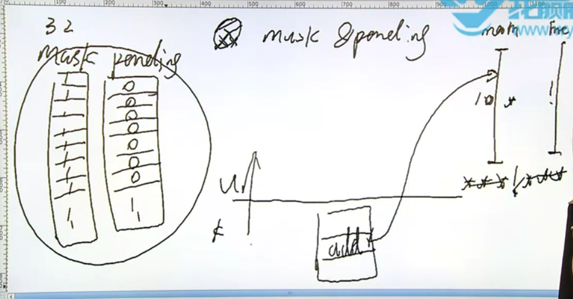
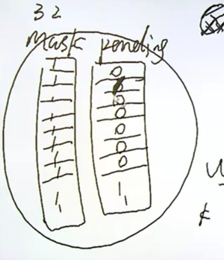
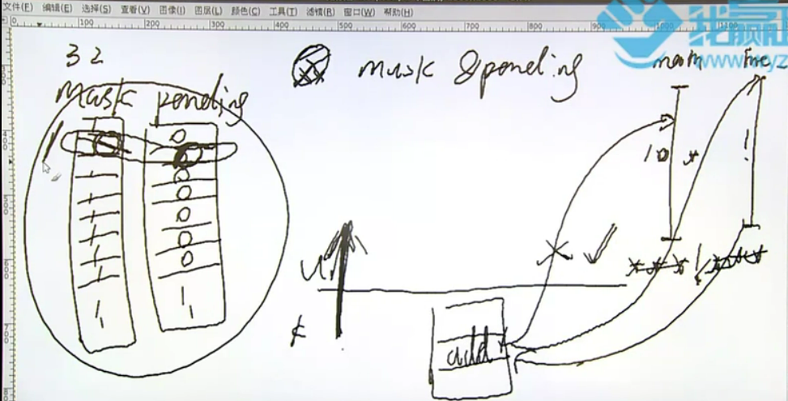
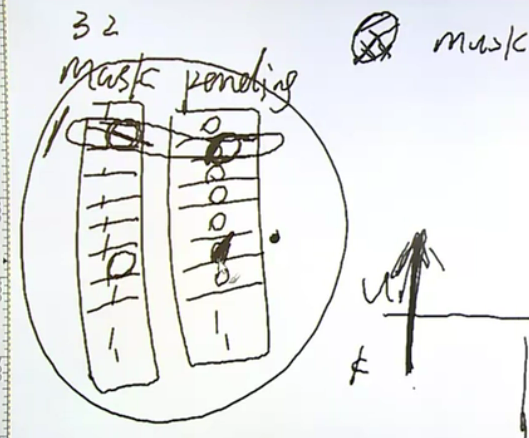
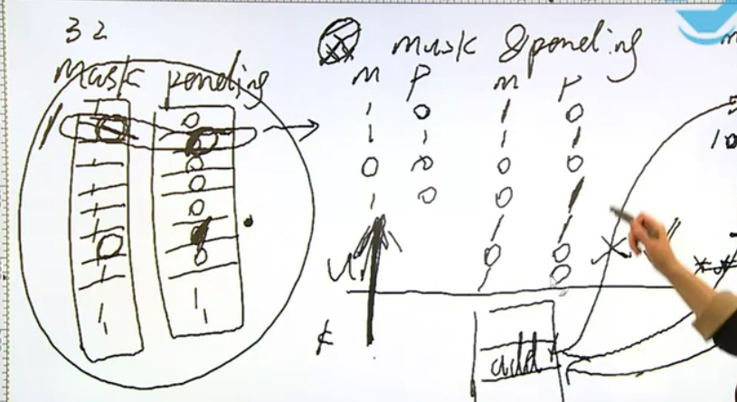
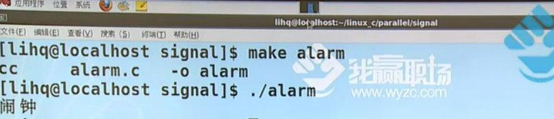
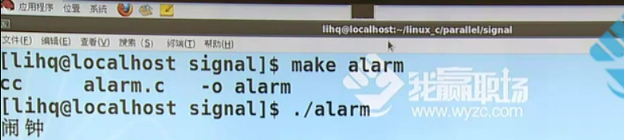

# 并发-异步事件处理的两种方法

1. 信号实现并发
    * 信号的概念
    * signal();
    * 信号的不可靠
    * 可重入函数
    * 信号的响应过程
    * 常用函数：kill、raise、alarm、pause、abort、system、sleep
    * 信号集
    * 信号屏蔽字和信号pending集的处理
    * 扩展：sigsuspend、sigaction、setitimer
    * 实时信号：1-9点都是标准信号
2. 多线程实现并发


信号的概念：信号是软件层面的中断

异步事件的处理：异步事件指的是事件什么时候发生不知道、事件的发生会产生什么样的结果也不知道，可以想象一个人在江边钓鱼，鱼就是个异步事件，鱼的大小品种不知(事件的发生会产生什么样的结果)、什么时候出现也不知(什么时候发生不知道)

1. 查询法：也即当前进程轮询查看异步事件有无发生
2. 通知法：当前进程可以不等待而去执行别的任务，等待某一个进程通知异步事件的发生，然后当前进程就可以转而去处理这个事件

异步事件发生的频率很稀疏则可以使用被动通知法，如果频繁发生则使用主动查询法

# 并发-信号的基本概念

比如说现在用的是单核的计算机，它是不会出现真正意义上的并行的，只会存在并发。不可打断的就是一条机器指令，比如说认为在一边写程序一边听着歌，这些操作其实知识并发。在单核计算机上，各个程序都会轮流占用当前的处理器，但是每个程序都由限定大小的时间片，只不过当前的调度非常快，对于用户是感觉不到计算机在做分时的实现

我们之前写的程序绝大多数都是同步程序，因为程序和结果都已经在代码中固定了，比如if-else或者while，很少会在程序或者结果中得到我们无法预测的内容

并发中有两大部分，一个是信号一个是线程，这两个都是用来处理并发的手段，信号属于初步异步，而线程属于强烈异步，所以如果信号部分的知识理解的比较透彻的话，那么在学习线程的时候就会省一点力气，并且两者可以在代码中混用

信号是软件层面的中断，中断是底层硬件的知识，而信号是应用层面的内容，信号的响应依赖于中断，硬件设备都会发出中断指令，因为很多事件的响应都是依赖于中断的，再比如说时间片轮转策略中当时间片耗尽进程就需要出让调度器去等待队列排队，那么时间片耗尽让进程出让调度资源就是中断的一种表现形式。

用`kill -l`能查看当前信号，编号1-31的信号被称为标准信号，编号34-64的信号名称都是SIGRT+(MIN~MAX)，被称为实时信号，所以其实使用kill命令给某个进程发信号的时候可以加上编号，意为发某个具体的信号给该进程

```shell
liangruuu@liangruuu-virtual-machine:/var/log$ kill -l

# result
1) SIGHUP	 2) SIGINT	 3) SIGQUIT	 4) SIGILL	 5) SIGTRAP
6) SIGABRT	 7) SIGBUS	 8) SIGFPE	 9) SIGKILL	10) SIGUSR1
11) SIGSEGV	12) SIGUSR2	13) SIGPIPE	14) SIGALRM	15) SIGTERM
16) SIGSTKFLT	17) SIGCHLD	18) SIGCONT	19) SIGSTOP	20) SIGTSTP
21) SIGTTIN	22) SIGTTOU	23) SIGURG	24) SIGXCPU	25) SIGXFSZ
26) SIGVTALRM	27) SIGPROF	28) SIGWINCH	29) SIGIO	30) SIGPWR
31) SIGSYS	34) SIGRTMIN	35) SIGRTMIN+1	36) SIGRTMIN+2	37) SIGRTMIN+3
38) SIGRTMIN+4	39) SIGRTMIN+5	40) SIGRTMIN+6	41) SIGRTMIN+7	42) SIGRTMIN+8
43) SIGRTMIN+9	44) SIGRTMIN+10	45) SIGRTMIN+11	46) SIGRTMIN+12	47) SIGRTMIN+13
48) SIGRTMIN+14	49) SIGRTMIN+15	50) SIGRTMAX-14	51) SIGRTMAX-13	52) SIGRTMAX-12
53) SIGRTMAX-11	54) SIGRTMAX-10	55) SIGRTMAX-9	56) SIGRTMAX-8	57) SIGRTMAX-7
58) SIGRTMAX-6	59) SIGRTMAX-5	60) SIGRTMAX-4	61) SIGRTMAX-3	62) SIGRTMAX-2
63) SIGRTMAX-1	64) SIGRTMAX
```


* ISO C即标准C支持的信号种类是最少的，所以在标准C的环境下信号基本上完成不了什么功能
* Solaris9支持的信号种类最多
* 默认动作中"终止+core"操作的种类最多，core指的是core文件，core文件一个程序的某一个现场，一般我们保存起来的都是出错的现场，就比如说登录QQ的时候如果闪退了，那么QQ就会弹出一个征询用户采集错误报告窗口，这个步骤就是在采集错误现场，也就是这些core文件，core文件详细内容https://blog.csdn.net/u011417820/article/details/71435031

>NAME
>
>> signal - ANSI C signal handling
>
>SYNOPSIS
>
>> #include <signal.h>
>>
>> typedef void (*sighandler_t)(int);
>>
>> sighandler_t signal(int signum, sighandler_t handler);
>
>1. sighandler_t signal(int signum, sighandler_t handler)：注册当前信号的行为，signum表示之前说的那么多信号中的其中一个，handler表示具体操作的函数，是用一个函数指针sighandler_t来定义的，只不过这里的指针函数是typedef过的，返回值指的是信号之前的行为，其也是一个函数指针
>2. typedef void (*sighandler_t)(int)：返回值为void，参数类型为int的函数指针，意为一个行为
>3. 信号会打算阻塞的系统调用，所以我们在之前几个章节写的进程程序没有一个是判断了如果信号来打断阻塞的系统调用会怎么办的，即没有一个是正确的

2. 其实这个函数就相当于`void(*signal(int signum, void (*func)(int)))(int)`

* 用signal函数实现打印星号的功能

```c
int main()
{

    for (int i = 0; i < 10; i++)
    {
        write(1, "*", 1);
        sleep(1);
    }

    exit(0);
}

```

如果在打印的过程中有一个ctrl+c操作，则程序会被打断，ctrl+c相当于是SIGINT(signal interupt)的快捷方式，同理常用的quit相当于是SIGQUIT的快捷方式。这个ctrl+c就是典型的异步操作，进程不知道什么时候来，也不知道来的是一个什么样的信号

```shell
liangruuu@liangruuu-virtual-machine:~/study/linuxc/code/parallel/signal$ ./star 

# result
****^C
liangruuu@liangruuu-virtual-machine:~/study/linuxc/code/parallel/signal$ 
```


>DESCRIPTION
>
>> signal() sets the disposition of the signal signum to handler, which is either SIG_IGN, SIG_DFL, or the address of a programmer-defined function (a "signal handler").
>
>* handler要么是SIG_IGN, SIG_DFL中的其中一个，要么是一个自定义的函数地址
>* SIG_IGN：signal_ingore，即忽略掉这个信号
>* SIG_DFL：signal_defauly，即默认操作

```c
int main()
{
    signal(SIGINT, SIG_IGN);

    for (int i = 0; i < 10; i++)
    {
        write(1, "*", 1);
        sleep(1);
    }

    exit(0);
}
```

* 在程序执行过程中忽略掉ctrl+c信号，也就是说ctrl+c无法中断程序的执行

```shell
liangruuu@liangruuu-virtual-machine:~/study/linuxc/code/parallel/signal$ ./star 

# result
**^C*^C*^C******liangruuu@liangruuu-virtual-machine:~/study/linuxc/code/parallel/signal$ 
```

* 在收到信号的时候打印特殊符号

```c
#include <stdio.h>
#include <stdlib.h>
#include <signal.h>
#include <unistd.h>

static void int_handler(int s)
{
    write(1, "!", 1);
}

int main()
{
    signal(SIGINT, int_handler);

    for (int i = 0; i < 10; i++)
    {
        write(1, "*", 1);
        sleep(1);
    }

    exit(0);
}

```

```shell
liangruuu@liangruuu-virtual-machine:~/study/linuxc/code/parallel/signal$ ./star 

# result
*^C!**^C!**^C!*^C!****liangruuu@liangruuu-virtual-machine:~/study/linuxc/code/parallel/signal$ 
```

当程序在每秒钟打印一个星号的同时，输入端一直按着ctrl+c不放，则这个程序的执行时间是不足10秒的，即信号会打断阻塞的系统调用，在程序执行sleep还不足1秒的时候就被信号打断从而执行下一个循环，以此类推

```shell
liangruuu@liangruuu-virtual-machine:~/study/linuxc/code/parallel/signal$ ./star 

# result
# 1秒就执行完成
*^C!*^C!*^C!*^C!*^C!*^C!*^C!*^C!*^C!*^C!liangruuu@liangruuu-virtual-machine:~/study/linuxc/code/parallel/signal$ ^C
liangruuu@liangruuu-virtual-machine:~/study/linuxc/code/parallel/signal$ ^C
liangruuu@liangruuu-virtual-machine:~/study/linuxc/code/parallel/signal$ ^C
liangruuu@liangruuu-virtual-machine:~/study/linuxc/code/parallel/signal$ ^C
```

3. 之前写的mycpy程序

```c
#include <stdio.h>
#include <stdlib.h>
#include <unistd.h>
#include <sys/types.h>
#include <sys/stat.h>
#include <fcntl.h>
#include <errno.h>

#define BUFSIZE 1024

int main(int argc, char **argv)
{
    int sfd, dfd;
    int len = 0;
    int ret = 0;
    int pos = 0;
    char buf[BUFSIZE];

    if (argc < 3)
    {
        fprintf(stderr, "Usage:%s <src_file> <dest_file>\n", argv[0]);
        exit(1);
    }

    sfd = open(argv[1], O_RDONLY);
    if (sfd < 0)
    {
        perror("open()");
        exit(1);
    }

    dfd = open(argv[2], O_WRONLY | O_CREAT | O_TRUNC, 0600);
    if (dfd < 0)
    {
        close(sfd);
        perror("open()");
        exit(1);
    }

    while (1)
    {
        len = read(sfd, buf, BUFSIZE);
        if (len < 0)
        {
            perror("read()");
            break;
        }
        if (len == 0)
            break;

        pos = 0;
        while (len > 0)
        {
            // printf("pos=%d len=%d\n", pos, len);
            ret = write(dfd, buf + pos, len);
            // printf("ret=%d\n", ret);
            if (ret < 0)
            {
                perror("write()");
                exit(1);
            }
            pos += ret;
            len -= ret;
        }
    }

    close(dfd);
    close(sfd);

    exit(0);
}

```

其中的open函数会被信号打断，信号会打断阻塞形式的系统调用，open、read、write都算是阻塞形式的系统调用

>NAME
>
>> open, openat, creat - open and possibly create a file
>
>ERRORS
>
>> EINTR  While  blocked  waiting to complete an open of a slow device (e.g., a FIFO; see fifo(7)), the call was interrupted by a signal handler; see signal(7).
>
>* EINTR：error interupt，the call was interrupted by a signal handler

用使用信号处理逻辑更新之后的代码

```c
#include <stdio.h>
#include <stdlib.h>
#include <unistd.h>
#include <sys/types.h>
#include <sys/stat.h>
#include <fcntl.h>
#include <errno.h>

#define BUFSIZE 1024

int main(int argc, char **argv)
{
    int sfd, dfd;
    int len = 0;
    int ret = 0;
    int pos = 0;
    char buf[BUFSIZE];

    if (argc < 3)
    {
        fprintf(stderr, "Usage:%s <src_file> <dest_file>\n", argv[0]);
        exit(1);
    }

    do
    {
        sfd = open(argv[1], O_RDONLY);
        if (sfd < 0)
        {
            if (errno != EINTR)
            {
                perror("open()");
                exit(1);
            }
        }
    } while (sfd < 0);

    do
    {
        dfd = open(argv[2], O_WRONLY | O_CREAT | O_TRUNC, 0600);
        if (dfd < 0)
        {
            close(sfd);
            perror("open()");
            exit(1);
        }
    } while (dfd < 0);

    while (1)
    {
        len = read(sfd, buf, BUFSIZE);
        if (len < 0)
        {

            if (errno == EINTR)
                continue;
            perror("read()");
            break;
        }
        if (len == 0)
            break;

        pos = 0;
        while (len > 0)
        {
            // printf("pos=%d len=%d\n", pos, len);
            ret = write(dfd, buf + pos, len);
            // printf("ret=%d\n", ret);
            if (ret < 0)
            {
                if (errno == EINTR)
                    continue;
                perror("write()");
                exit(1);
            }
            pos += ret;
            len -= ret;
        }
    }

    close(dfd);
    close(sfd);

    exit(0);
}

```

# 信号的响应过程

信号的不可靠：

* https://blog.csdn.net/isunbin/article/details/83929415

信号的响应过程：任何的硬件都会发出中断，即使当前没有硬件发出中断指令，计算机的内核也有一个模块，这个模块负责每秒向外输出中断，所以比如说虽然在打印一个hello world的时候，程序是非常平摊地运行过去，是一个一瞬间的事情，但是这个printf进程在打印出内容的过程中被打断了无数次，它其实是在磕磕绊绊地运行

内核为每个进程维护了一组位图，一个位图叫做mask信号屏蔽字，还有一个位图叫做pending，理论上来讲mask和pending对应的位图都是32位的，之前写过一个打印星号的程序，main函数的功能是一秒打印一个星号，一共打印10次，interupt hanlde这个函数的功能是打印!号，当某个时刻输入ctrl+c，就会响应这个信号从而打印出!号，然后继续每秒打印星号直到main程序结束

mask用来表示当前信号的状态，而pending是一个位图用来记录当前进程收到哪些信号，在之前讲到会话session概念的时候已经提到我们其实已经在面向进程编程了，只不过之前写的程序都是单进程单线程程序，之后讲到线程概念的时候才会接触到单进程多线程的程序，所以现在面对的编程单位已经是线程了。其实进程线程行不分家，从内核的角度来看，当前操作的任务只有一个，即线程，只不过从用户的角度来看是区分进程线程，进程是线程的容器，但是从内核角度来看，内核只有一个概念，即进程，而内核所谓的进程就是我们理解上的线程，所以下面的这幅图只是仅限于从进程角度来分析信号的响应过程，但是在线程级别来看的话这幅图其实不是这样画的

mask屏蔽字的值一般全都是1，pending的初始值全部为0，比如时间片耗尽了或者被别的进程打断了，则当前进程就需要把当前的执行线程及时压栈存放，然后带着当前的压栈现场去内核中的等待调度的就绪队列中排队，排队等待调度到该进程的时候获取别的进程出让的调度器资源，然后把压栈的现场进行恢复接着执行之后的操作...如果再次被打断的话同理，以此类推

压栈保存的执行现场内部肯定有一个字段来表示返回地址address，这个返回地址表示的就是刚才被打断时候程序的地址，比如指向main函数的某个位置。在内核态的等待队列中排队，当调度到该进程的时候要从内核态转变到用户态，对现场进行一个恢复，然后继续打印星号。从内核态转变到用户态的时候，这个时间段非常重要，从内核态转变到用户态的时候需要执行一段表达式指令`mask & pending`，即用mask按位与上pending。假如说mask和pending是全1和全0的现象，则按为与之后整个值得0，那么就意味着没有收到任何信号，所以就返回被打断时候的程序地址接着执行程序



信号从收到到响应有一个不可避免的延迟，假设说某一个时刻有信号到来了，比如interrput信号假设反映到pending位图的第二位上，即把第二位置成1。现在是收到信号了，但是进程不知道，必须得被一个中断打断了才知道，被中断打断之后拿着地址进入内核态，然后排队等待调度，等着从内核态返回用户态的时候就有机会执行表达式`mask & pending`，此时lock锁定的是第二位，信号除了有signal name还有signal num，所以一对照现在的signal num对应的信号是sig interrupt这个信号，而在程序中事先用signal函数给interrupt信号注册了一个行为，当有interrupt信号到来的时候那就打印一个！号



现在的程序就变成了这样：某个时刻收到了一个信号， 进程为什么看不到，是因为进程此时还没有进入内核态来等待调度，等进程从内核态返回用户态的时候需要做一个按位与操作，只有做了这个操作才能发现信号，所以信号从收到到响应会有一个不可避免的时延，没有中断来打断进程的话，进程都看不到收到了信号，一直没有中断打断则一直看不到信号

所以之前讲到过一句话：信号是依赖于中断机制而进行响应的

收到interrupt信号把pending位图的第二位置成1并且进行按位与操作之后，把mask对应位置成0，pending位也置成0，然后把压栈的现场地址换成被signal函数注册的信号处理函数的地址，替换并且返回用户态去执行此信号处理函数，执行完信号处理函数之后又回到内核态，把刚才的main程序地址替换回来，并且把mask对应位置的值恢复成1。然后又即将从内核态返回用户态，这时依然做一次按位与操作，其实就说明之前的那个信号已经被响应掉了，因为把返回地址替换回来了，所以继续回到被打断的现场执行打印星号的操作，以此类推....



标准信号有这样的缺陷：进程在收到多个信号的时候，先响应哪个是没有顺序的，即标准信号的响应没有严格的顺序，但是存在信号优先级，优先级高的先被响应，平级的信号是没有响应顺序的

信号是从内核态回到用户态的路上被响应的

如何忽略掉一个信号？之前在讲signal函数的时候，函数其中一个参数制定了信号的动作，这个信号的动作除了是一个函数入口地址，还可以是ignore和default，比如我们指定当前进程就是忽略掉指定的信号，则ignore其实做的就是把指定信号的mask位的值永远置成0，所以按位与的结果只会是0。所以我们并不能阻止信号的到来，只能做到决定信号是否被响应



标准信号为什么会丢失？因为pending是一个位图，每一个信号都会使得pending位图上的相应位置变为1，但是即使来了100个进程，那也就意味着执行了100次置1操作，这跟执行一次置1操作没有区别呀，结果还是pending对应位置变为1

收到一个信号：

(M	P)：1	0	—收到信号—>	1	1	—从内核态返回用户态，按位与之后发现信号并且作出响应，把mask和pending对应位置变为0	—>	0	0	—响应完之后把mask值重新置为1—>	1	0

收到多个信号：

(M	P)：1	0	—收到信号—>	1	1	—从内核态返回用户态，按位与之后发现信号并且作出响应，把mask和pending对应位置变为0	—>	0	0	—在响应的时候又有100个相同的信号过来了，所以进行100次把对应pending位的值变为1的操作，但是mask值还是0—>	0	1	—把mask值变为1—>	1	1	—从内核态返回用户态，按位与之后发现信号并且作出响应，把mask和pending对应位置变为0—>	0	0	—响应完之后把mask值重新置为1—>	1	0



# 信号-kill、raise、pause

> NAME
>
> > kill - send signal to a process
>
> SYNOPSIS
>
> > #include <sys/types.h>
> > #include <signal.h>
> >
> > int kill(pid_t pid, int sig);
>
> 1. int kill(pid_t pid, int sig)：给一个进程发送信号，第一个参数为进程PID；第二个参数；

1. 之前有很多人在终端上调用kill命令来结束某个进程额运行就说是杀掉某个进程，这种说法其实是错误的，kill函数只是用来发送信号的，由于多半信号的功能都是终止或者终止+core，所以就认为kill就是杀死一个进程

    其实之前讲到过一个函数waitpid，这个函数的传参也有一个pid类型的值，pid值会有小于-1，等于-1，等于0...，这里也是同样的情况

>DESCRIPTION
>
>> ...
>>
>> If pid is positive, then signal sig is sent to the process with the ID specified by pid.
>>
>> If pid equals 0, then sig is sent to every process in the process group of the calling process.
>>
>> If  pid equals -1, then sig is sent to every process for which the calling process has permission to send signals, except for process 1 (init), but see below.
>>
>> If pid is less than -1, then sig is sent to every process in the process group whose ID is -pid.
>>
>> If sig is 0, then no signal is sent, but existence and permission checks are still performed; this can be used  to  check for the existence of a process ID or process group ID that the caller is permitted to signal.
>>
>> ......
>
>* 如果提供的PID是正数的话，则表示把指定的signal发送给指定进程
>* 如果PID=0时，会给当前进程同组的所有进程都发送信号，通常把这种操作称为组内广播
>* 如果PID=-1时，则说明当前指定信号发送给所有有权限发送信号的进程，除了init进程，这就相当于全局广播
>* 如果PID<-1时，把信号发送给对应PID绝对值的进程
>* 如果当前信号=0的话，则表示不会发出任何信号，通常被用作检测一个进程或者进程组是否存在
>
>
>RETURN VALUE
>
>> On success (at least one signal was sent), zero is returned.  On error, -1 is returned, and errno is set appropriately.
>
>ERRORS
>
>> EPERM  The calling process does not have permission to send the signal to any of the target processes.
>>
>> ESRCH  The target process or process group does not exist.
>
>* kill(pid, 0)实际上就是在检测，该进程或者进程组是否存在，如果得到的errno值为EPERM的话则表示进程或者进程组存在，但是没有权限发送信号；如果返回errno值为ESRCH的话就表示进程或者进程组不存在

* raise

>NAME
>
>> raise - send a signal to the caller
>
>SYNOPSIS
>
>> #include <signal.h>
>>
>> int raise(int sig);
>
>1. int raise(int sig)：给当前进程或线程发送信号
>
>DESCRIPTION
>
>> The raise() function sends a signal to the calling process or thread.  In a single-threaded program it is equivalent to
>>
>> ​	kill(getpid(), sig);
>>
>> In a multithreaded program it is equivalent to
>>
>> ​	pthread_kill(pthread_self(), sig);
>
>

* alarm

>NAME
>
>> alarm - set an alarm clock for delivery of a signal
>
>SYNOPSIS
>
>> #include <unistd.h>
>>
>> unsigned int alarm(unsigned int seconds);
>
>1. unsigned int alarm(unsigned int seconds)：以秒为单位的计时
>
>
>

1. 有了alarm函数之后其实就可以做很多事情了，之前写的程序都没有时间概念的，比如让一个程序运行3秒...

>DESCRIPTION
>
>> alarm() arranges for a SIGALRM signal to be delivered to the calling process in seconds seconds.
>>
>> If seconds is zero, any pending alarm is canceled.
>>
>> In any event any previously set alarm() is canceled.
>
>* 当倒计时结束的时候会发送给当前进程一个SIGALRM信号，如果当前seconds为0的话则不会产生时钟信号，这个SIGALRM信号的默认动作是杀死当前进程
>
>

```c
// alarm.c

#include <stdio.h>
#include <stdlib.h>
#include <unistd.h>

int main()
{

    alarm(5);
    while (1)
    {
    };

    exit(0);
}
```

* 10：5秒之后发送SIGALRM信号杀死当前进程

```shell
liangruuu@liangruuu-virtual-machine:~/study/linuxc/code/parallel/signal$ ./alarm 

# result
Alarm clock
liangruuu@liangruuu-virtual-machine:~/study/linuxc/code/parallel/signal$ 
```

```c
// alarm.c

#include <stdio.h>
#include <stdlib.h>
#include <unistd.h>

int main()
{

    alarm(10);
    alarm(1);
    alarm(5);

    while (1)
    {
    };

    exit(0);
}
```

* 10-12：alarm函数无法实现多任务的计时器，所以一旦程序中出现多个alarm，则程序会出错

```shell
liangruuu@liangruuu-virtual-machine:~/study/linuxc/code/parallel/signal$ ./alarm 

# result
# 5秒后结束当前进程
Alarm clock
liangruuu@liangruuu-virtual-machine:~/study/linuxc/code/parallel/signal$ 
```

>NAME
>
>> pause - wait for signal
>
>SYNOPSIS
>
>> #include <unistd.h>
>>
>> int pause(void); 
>
>1. int pause(void)：人为做出来的一个阻塞的系统调用，功能就是等待一个信号来打断它，如果程序中有pause函数，那么程序就不再是盲目等待
>
>

1. 在没有添加pause函数之前，执行alarm程序就会造成CPU的满占，因为`while(1)`语句一直在轮转，但是如果在循环体内加上pause函数就不会再使得CPU被满占了

```c
// alarm.c

#include <stdio.h>
#include <stdlib.h>
#include <unistd.h>

int main()
{

    alarm(10);
    alarm(1);
    alarm(5);

    while (1)
    {
        pause();
    };

    exit(0);
}

```





在之前的章节中说过最好不要使用sleep函数，因为在有的环境下sleep函数是由alarm+pause函数封装而成的，所以如果在这个环境下同时使用sleep+alarm函数的话就相当于在程序中引入了多条alarm语句，正如之前说的那样多个alarm函数可能会造成意想不到的结果，但是在某些环境下sleep是由nanosleep函数封装的，这是没问题的，所以不同平台对sleep函数的封装不一样，因此如果要考虑到代码移植的话，不建议使用sleep，除非能保证目标环境下sleep函数的封装方式


