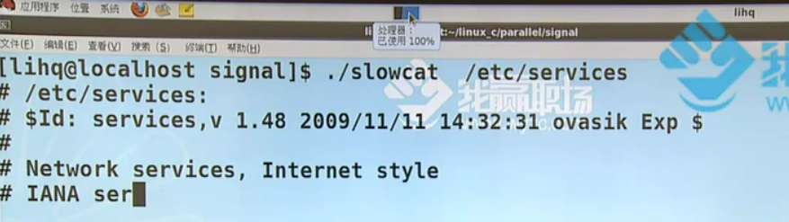
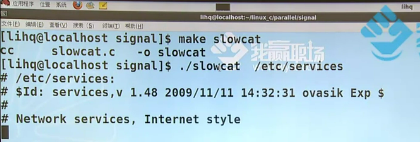
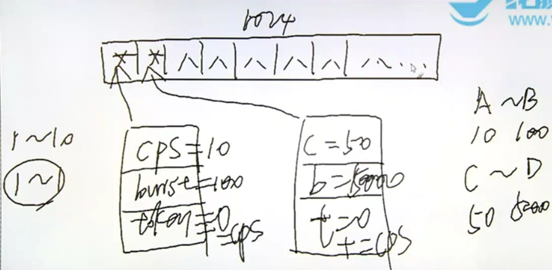
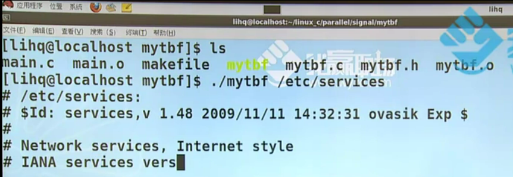
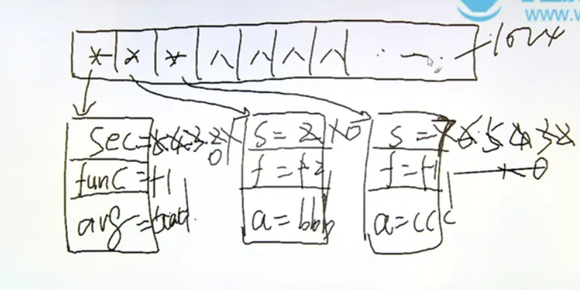
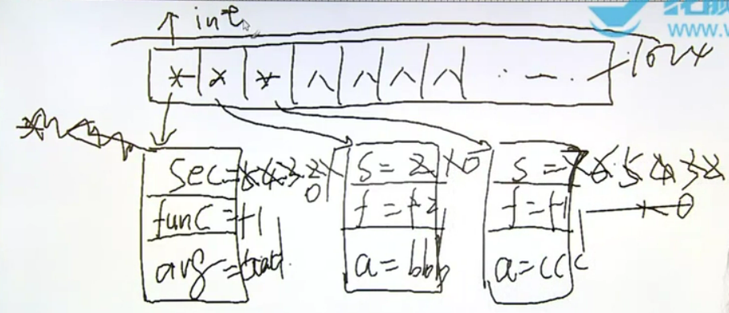

# 并发-异步事件处理的两种方法

1. 信号实现并发
    * 信号的概念
    * signal();
    * 信号的不可靠
    * 可重入函数
    * 信号的响应过程
    * 常用函数：kill、raise、alarm、pause、abort、system、sleep
    * 信号集
    * 信号屏蔽字和信号pending集的处理
    * 扩展：sigsuspend、sigaction、setitimer
    * 实时信号：1-9点都是标准信号
2. 多线程实现并发


信号的概念：信号是软件层面的中断

异步事件的处理：异步事件指的是事件什么时候发生不知道、事件的发生会产生什么样的结果也不知道，可以想象一个人在江边钓鱼，鱼就是个异步事件，鱼的大小品种不知(事件的发生会产生什么样的结果)、什么时候出现也不知(什么时候发生不知道)

1. 查询法：也即当前进程轮询查看异步事件有无发生
2. 通知法：当前进程可以不等待而去执行别的任务，等待某一个进程通知异步事件的发生，然后当前进程就可以转而去处理这个事件

异步事件发生的频率很稀疏则可以使用被动通知法，如果频繁发生则使用主动查询法

# 并发-信号的基本概念

比如说现在用的是单核的计算机，它是不会出现真正意义上的并行的，只会存在并发。不可打断的就是一条机器指令，比如说认为在一边写程序一边听着歌，这些操作其实知识并发。在单核计算机上，各个程序都会轮流占用当前的处理器，但是每个程序都由限定大小的时间片，只不过当前的调度非常快，对于用户是感觉不到计算机在做分时的实现

我们之前写的程序绝大多数都是同步程序，因为程序和结果都已经在代码中固定了，比如if-else或者while，很少会在程序或者结果中得到我们无法预测的内容

并发中有两大部分，一个是信号一个是线程，这两个都是用来处理并发的手段，信号属于初步异步，而线程属于强烈异步，所以如果信号部分的知识理解的比较透彻的话，那么在学习线程的时候就会省一点力气，并且两者可以在代码中混用

信号是软件层面的中断，中断是底层硬件的知识，而信号是应用层面的内容，信号的响应依赖于中断，硬件设备都会发出中断指令，因为很多事件的响应都是依赖于中断的，再比如说时间片轮转策略中当时间片耗尽进程就需要出让调度器去等待队列排队，那么时间片耗尽让进程出让调度资源就是中断的一种表现形式。

用`kill -l`能查看当前信号，编号1-31的信号被称为标准信号，编号34-64的信号名称都是SIGRT+(MIN~MAX)，被称为实时信号，所以其实使用kill命令给某个进程发信号的时候可以加上编号，意为发某个具体的信号给该进程

```shell
liangruuu@liangruuu-virtual-machine:/var/log$ kill -l

# result
1) SIGHUP	 2) SIGINT	 3) SIGQUIT	 4) SIGILL	 5) SIGTRAP
6) SIGABRT	 7) SIGBUS	 8) SIGFPE	 9) SIGKILL	10) SIGUSR1
11) SIGSEGV	12) SIGUSR2	13) SIGPIPE	14) SIGALRM	15) SIGTERM
16) SIGSTKFLT	17) SIGCHLD	18) SIGCONT	19) SIGSTOP	20) SIGTSTP
21) SIGTTIN	22) SIGTTOU	23) SIGURG	24) SIGXCPU	25) SIGXFSZ
26) SIGVTALRM	27) SIGPROF	28) SIGWINCH	29) SIGIO	30) SIGPWR
31) SIGSYS	34) SIGRTMIN	35) SIGRTMIN+1	36) SIGRTMIN+2	37) SIGRTMIN+3
38) SIGRTMIN+4	39) SIGRTMIN+5	40) SIGRTMIN+6	41) SIGRTMIN+7	42) SIGRTMIN+8
43) SIGRTMIN+9	44) SIGRTMIN+10	45) SIGRTMIN+11	46) SIGRTMIN+12	47) SIGRTMIN+13
48) SIGRTMIN+14	49) SIGRTMIN+15	50) SIGRTMAX-14	51) SIGRTMAX-13	52) SIGRTMAX-12
53) SIGRTMAX-11	54) SIGRTMAX-10	55) SIGRTMAX-9	56) SIGRTMAX-8	57) SIGRTMAX-7
58) SIGRTMAX-6	59) SIGRTMAX-5	60) SIGRTMAX-4	61) SIGRTMAX-3	62) SIGRTMAX-2
63) SIGRTMAX-1	64) SIGRTMAX
```


* ISO C即标准C支持的信号种类是最少的，所以在标准C的环境下信号基本上完成不了什么功能
* Solaris9支持的信号种类最多
* 默认动作中"终止+core"操作的种类最多，core指的是core文件，core文件一个程序的某一个现场，一般我们保存起来的都是出错的现场，就比如说登录QQ的时候如果闪退了，那么QQ就会弹出一个征询用户采集错误报告窗口，这个步骤就是在采集错误现场，也就是这些core文件，core文件详细内容https://blog.csdn.net/u011417820/article/details/71435031

>NAME
>
>> signal - ANSI C signal handling
>
>SYNOPSIS
>
>> #include <signal.h>
>>
>> typedef void (*sighandler_t)(int);
>>
>> sighandler_t signal(int signum, sighandler_t handler);
>
>1. sighandler_t signal(int signum, sighandler_t handler)：注册当前信号的行为，signum表示之前说的那么多信号中的其中一个，handler表示具体操作的函数，是用一个函数指针sighandler_t来定义的，只不过这里的指针函数是typedef过的，返回值指的是信号之前的行为，其也是一个函数指针
>2. typedef void (*sighandler_t)(int)：返回值为void，参数类型为int的函数指针，意为一个行为
>3. 信号会打算阻塞的系统调用，所以我们在之前几个章节写的进程程序没有一个是判断了如果信号来打断阻塞的系统调用会怎么办的，即没有一个是正确的

2. 其实这个函数就相当于`void(*signal(int signum, void (*func)(int)))(int)`

* 用signal函数实现打印星号的功能

```c
int main()
{

    for (int i = 0; i < 10; i++)
    {
        write(1, "*", 1);
        sleep(1);
    }

    exit(0);
}

```

如果在打印的过程中有一个ctrl+c操作，则程序会被打断，ctrl+c相当于是SIGINT(signal interupt)的快捷方式，同理常用的quit相当于是SIGQUIT的快捷方式。这个ctrl+c就是典型的异步操作，进程不知道什么时候来，也不知道来的是一个什么样的信号

```shell
liangruuu@liangruuu-virtual-machine:~/study/linuxc/code/parallel/signal$ ./star 

# result
****^C
liangruuu@liangruuu-virtual-machine:~/study/linuxc/code/parallel/signal$ 
```


>DESCRIPTION
>
>> signal() sets the disposition of the signal signum to handler, which is either SIG_IGN, SIG_DFL, or the address of a programmer-defined function (a "signal handler").
>
>* handler要么是SIG_IGN, SIG_DFL中的其中一个，要么是一个自定义的函数地址
>* SIG_IGN：signal_ingore，即忽略掉这个信号
>* SIG_DFL：signal_defauly，即默认操作

```c
int main()
{
    signal(SIGINT, SIG_IGN);

    for (int i = 0; i < 10; i++)
    {
        write(1, "*", 1);
        sleep(1);
    }

    exit(0);
}
```

* 在程序执行过程中忽略掉ctrl+c信号，也就是说ctrl+c无法中断程序的执行

```shell
liangruuu@liangruuu-virtual-machine:~/study/linuxc/code/parallel/signal$ ./star 

# result
**^C*^C*^C******liangruuu@liangruuu-virtual-machine:~/study/linuxc/code/parallel/signal$ 
```

* 在收到信号的时候打印特殊符号

```c
#include <stdio.h>
#include <stdlib.h>
#include <signal.h>
#include <unistd.h>

static void int_handler(int s)
{
    write(1, "!", 1);
}

int main()
{
    signal(SIGINT, int_handler);

    for (int i = 0; i < 10; i++)
    {
        write(1, "*", 1);
        sleep(1);
    }

    exit(0);
}

```

```shell
liangruuu@liangruuu-virtual-machine:~/study/linuxc/code/parallel/signal$ ./star 

# result
*^C!**^C!**^C!*^C!****liangruuu@liangruuu-virtual-machine:~/study/linuxc/code/parallel/signal$ 
```

当程序在每秒钟打印一个星号的同时，输入端一直按着ctrl+c不放，则这个程序的执行时间是不足10秒的，即信号会打断阻塞的系统调用，在程序执行sleep还不足1秒的时候就被信号打断从而执行下一个循环，以此类推

```shell
liangruuu@liangruuu-virtual-machine:~/study/linuxc/code/parallel/signal$ ./star 

# result
# 1秒就执行完成
*^C!*^C!*^C!*^C!*^C!*^C!*^C!*^C!*^C!*^C!liangruuu@liangruuu-virtual-machine:~/study/linuxc/code/parallel/signal$ ^C
liangruuu@liangruuu-virtual-machine:~/study/linuxc/code/parallel/signal$ ^C
liangruuu@liangruuu-virtual-machine:~/study/linuxc/code/parallel/signal$ ^C
liangruuu@liangruuu-virtual-machine:~/study/linuxc/code/parallel/signal$ ^C
```

3. 之前写的mycpy程序

```c
#include <stdio.h>
#include <stdlib.h>
#include <unistd.h>
#include <sys/types.h>
#include <sys/stat.h>
#include <fcntl.h>
#include <errno.h>

#define BUFSIZE 1024

int main(int argc, char **argv)
{
    int sfd, dfd;
    int len = 0;
    int ret = 0;
    int pos = 0;
    char buf[BUFSIZE];

    if (argc < 3)
    {
        fprintf(stderr, "Usage:%s <src_file> <dest_file>\n", argv[0]);
        exit(1);
    }

    sfd = open(argv[1], O_RDONLY);
    if (sfd < 0)
    {
        perror("open()");
        exit(1);
    }

    dfd = open(argv[2], O_WRONLY | O_CREAT | O_TRUNC, 0600);
    if (dfd < 0)
    {
        close(sfd);
        perror("open()");
        exit(1);
    }

    while (1)
    {
        len = read(sfd, buf, BUFSIZE);
        if (len < 0)
        {
            perror("read()");
            break;
        }
        if (len == 0)
            break;

        pos = 0;
        while (len > 0)
        {
            // printf("pos=%d len=%d\n", pos, len);
            ret = write(dfd, buf + pos, len);
            // printf("ret=%d\n", ret);
            if (ret < 0)
            {
                perror("write()");
                exit(1);
            }
            pos += ret;
            len -= ret;
        }
    }

    close(dfd);
    close(sfd);

    exit(0);
}

```

其中的open函数会被信号打断，信号会打断阻塞形式的系统调用，open、read、write都算是阻塞形式的系统调用

>NAME
>
>> open, openat, creat - open and possibly create a file
>
>ERRORS
>
>> EINTR  While  blocked  waiting to complete an open of a slow device (e.g., a FIFO; see fifo(7)), the call was interrupted by a signal handler; see signal(7).
>
>* EINTR：error interupt，the call was interrupted by a signal handler

用使用信号处理逻辑更新之后的代码

```c
#include <stdio.h>
#include <stdlib.h>
#include <unistd.h>
#include <sys/types.h>
#include <sys/stat.h>
#include <fcntl.h>
#include <errno.h>

#define BUFSIZE 1024

int main(int argc, char **argv)
{
    int sfd, dfd;
    int len = 0;
    int ret = 0;
    int pos = 0;
    char buf[BUFSIZE];

    if (argc < 3)
    {
        fprintf(stderr, "Usage:%s <src_file> <dest_file>\n", argv[0]);
        exit(1);
    }

    do
    {
        sfd = open(argv[1], O_RDONLY);
        if (sfd < 0)
        {
            if (errno != EINTR)
            {
                perror("open()");
                exit(1);
            }
        }
    } while (sfd < 0);

    do
    {
        dfd = open(argv[2], O_WRONLY | O_CREAT | O_TRUNC, 0600);
        if (dfd < 0)
        {
            close(sfd);
            perror("open()");
            exit(1);
        }
    } while (dfd < 0);

    while (1)
    {
        len = read(sfd, buf, BUFSIZE);
        if (len < 0)
        {

            if (errno == EINTR)
                continue;
            perror("read()");
            break;
        }
        if (len == 0)
            break;

        pos = 0;
        while (len > 0)
        {
            // printf("pos=%d len=%d\n", pos, len);
            ret = write(dfd, buf + pos, len);
            // printf("ret=%d\n", ret);
            if (ret < 0)
            {
                if (errno == EINTR)
                    continue;
                perror("write()");
                exit(1);
            }
            pos += ret;
            len -= ret;
        }
    }

    close(dfd);
    close(sfd);

    exit(0);
}

```

# 信号的响应过程

信号的不可靠：

* https://blog.csdn.net/isunbin/article/details/83929415

信号的响应过程：任何的硬件都会发出中断，即使当前没有硬件发出中断指令，计算机的内核也有一个模块，这个模块负责每秒向外输出中断，所以比如说虽然在打印一个hello world的时候，程序是非常平摊地运行过去，是一个一瞬间的事情，但是这个printf进程在打印出内容的过程中被打断了无数次，它其实是在磕磕绊绊地运行

内核为每个进程维护了一组位图，一个位图叫做mask信号屏蔽字，还有一个位图叫做pending，理论上来讲mask和pending对应的位图都是32位的，之前写过一个打印星号的程序，main函数的功能是一秒打印一个星号，一共打印10次，interupt hanlde这个函数的功能是打印!号，当某个时刻输入ctrl+c，就会响应这个信号从而打印出!号，然后继续每秒打印星号直到main程序结束

mask用来表示当前信号的状态，而pending是一个位图用来记录当前进程收到哪些信号，在之前讲到会话session概念的时候已经提到我们其实已经在面向进程编程了，只不过之前写的程序都是单进程单线程程序，之后讲到线程概念的时候才会接触到单进程多线程的程序，所以现在面对的编程单位已经是线程了。其实进程线程行不分家，从内核的角度来看，当前操作的任务只有一个，即线程，只不过从用户的角度来看是区分进程线程，进程是线程的容器，但是从内核角度来看，内核只有一个概念，即进程，而内核所谓的进程就是我们理解上的线程，所以下面的这幅图只是仅限于从进程角度来分析信号的响应过程，但是在线程级别来看的话这幅图其实不是这样画的

mask屏蔽字的值一般全都是1，pending的初始值全部为0，比如时间片耗尽了或者被别的进程打断了，则当前进程就需要把当前的执行线程及时压栈存放，然后带着当前的压栈现场去内核中的等待调度的就绪队列中排队，排队等待调度到该进程的时候获取别的进程出让的调度器资源，然后把压栈的现场进行恢复接着执行之后的操作...如果再次被打断的话同理，以此类推

压栈保存的执行现场内部肯定有一个字段来表示返回地址address，这个返回地址表示的就是刚才被打断时候程序的地址，比如指向main函数的某个位置。在内核态的等待队列中排队，当调度到该进程的时候要从内核态转变到用户态，对现场进行一个恢复，然后继续打印星号。从内核态转变到用户态的时候，这个时间段非常重要，从内核态转变到用户态的时候需要执行一段表达式指令`mask & pending`，即用mask按位与上pending。假如说mask和pending是全1和全0的现象，则按为与之后整个值得0，那么就意味着没有收到任何信号，所以就返回被打断时候的程序地址接着执行程序


信号从收到到响应有一个不可避免的延迟，假设说某一个时刻有信号到来了，比如interrput信号假设反映到pending位图的第二位上，即把第二位置成1。现在是收到信号了，但是进程不知道，必须得被一个中断打断了才知道，被中断打断之后拿着地址进入内核态，然后排队等待调度，等着从内核态返回用户态的时候就有机会执行表达式`mask & pending`，此时lock锁定的是第二位，信号除了有signal name还有signal num，所以一对照现在的signal num对应的信号是sig interrupt这个信号，而在程序中事先用signal函数给interrupt信号注册了一个行为，当有interrupt信号到来的时候那就打印一个！号


现在的程序就变成了这样：某个时刻收到了一个信号， 进程为什么看不到，是因为进程此时还没有进入内核态来等待调度，等进程从内核态返回用户态的时候需要做一个按位与操作，只有做了这个操作才能发现信号，所以信号从收到到响应会有一个不可避免的时延，没有中断来打断进程的话，进程都看不到收到了信号，一直没有中断打断则一直看不到信号

所以之前讲到过一句话：信号是依赖于中断机制而进行响应的

收到interrupt信号把pending位图的第二位置成1并且进行按位与操作之后，把mask对应位置成0，pending位也置成0，然后把压栈的现场地址换成被signal函数注册的信号处理函数的地址，替换并且返回用户态去执行此信号处理函数，执行完信号处理函数之后又回到内核态，把刚才的main程序地址替换回来，并且把mask对应位置的值恢复成1。然后又即将从内核态返回用户态，这时依然做一次按位与操作，其实就说明之前的那个信号已经被响应掉了，因为把返回地址替换回来了，所以继续回到被打断的现场执行打印星号的操作，以此类推....


标准信号有这样的缺陷：进程在收到多个信号的时候，先响应哪个是没有顺序的，即标准信号的响应没有严格的顺序，但是存在信号优先级，优先级高的先被响应，平级的信号是没有响应顺序的

信号是从内核态回到用户态的路上被响应的

如何忽略掉一个信号？之前在讲signal函数的时候，函数其中一个参数制定了信号的动作，这个信号的动作除了是一个函数入口地址，还可以是ignore和default，比如我们指定当前进程就是忽略掉指定的信号，则ignore其实做的就是把指定信号的mask位的值永远置成0，所以按位与的结果只会是0。所以我们并不能阻止信号的到来，只能做到决定信号是否被响应


标准信号为什么会丢失？因为pending是一个位图，每一个信号都会使得pending位图上的相应位置变为1，但是即使来了100个进程，那也就意味着执行了100次置1操作，这跟执行一次置1操作没有区别呀，结果还是pending对应位置变为1

收到一个信号：

(M	P)：1	0	—收到信号—>	1	1	—从内核态返回用户态，按位与之后发现信号并且作出响应，把mask和pending对应位置变为0	—>	0	0	—响应完之后把mask值重新置为1—>	1	0

收到多个信号：

(M	P)：1	0	—收到信号—>	1	1	—从内核态返回用户态，按位与之后发现信号并且作出响应，把mask和pending对应位置变为0	—>	0	0	—在响应的时候又有100个相同的信号过来了，所以进行100次把对应pending位的值变为1的操作，但是mask值还是0—>	0	1	—把mask值变为1—>	1	1	—从内核态返回用户态，按位与之后发现信号并且作出响应，把mask和pending对应位置变为0—>	0	0	—响应完之后把mask值重新置为1—>	1	0


# 信号-kill、raise、pause

> NAME
>
> > kill - send signal to a process
>
> SYNOPSIS
>
> > #include <sys/types.h>
> > #include <signal.h>
> >
> > int kill(pid_t pid, int sig);
>
> 1. int kill(pid_t pid, int sig)：给一个进程发送信号，第一个参数为进程PID；第二个参数；

1. 之前有很多人在终端上调用kill命令来结束某个进程额运行就说是杀掉某个进程，这种说法其实是错误的，kill函数只是用来发送信号的，由于多半信号的功能都是终止或者终止+core，所以就认为kill就是杀死一个进程

    其实之前讲到过一个函数waitpid，这个函数的传参也有一个pid类型的值，pid值会有小于-1，等于-1，等于0...，这里也是同样的情况

>DESCRIPTION
>
>> ...
>>
>> If pid is positive, then signal sig is sent to the process with the ID specified by pid.
>>
>> If pid equals 0, then sig is sent to every process in the process group of the calling process.
>>
>> If  pid equals -1, then sig is sent to every process for which the calling process has permission to send signals, except for process 1 (init), but see below.
>>
>> If pid is less than -1, then sig is sent to every process in the process group whose ID is -pid.
>>
>> If sig is 0, then no signal is sent, but existence and permission checks are still performed; this can be used  to  check for the existence of a process ID or process group ID that the caller is permitted to signal.
>>
>> ......
>
>* 如果提供的PID是正数的话，则表示把指定的signal发送给指定进程
>* 如果PID=0时，会给当前进程同组的所有进程都发送信号，通常把这种操作称为组内广播
>* 如果PID=-1时，则说明当前指定信号发送给所有有权限发送信号的进程，除了init进程，这就相当于全局广播
>* 如果PID<-1时，把信号发送给对应PID绝对值的进程
>* 如果当前信号=0的话，则表示不会发出任何信号，通常被用作检测一个进程或者进程组是否存在
>
>
>RETURN VALUE
>
>> On success (at least one signal was sent), zero is returned.  On error, -1 is returned, and errno is set appropriately.
>
>ERRORS
>
>> EPERM  The calling process does not have permission to send the signal to any of the target processes.
>>
>> ESRCH  The target process or process group does not exist.
>
>* kill(pid, 0)实际上就是在检测，该进程或者进程组是否存在，如果得到的errno值为EPERM的话则表示进程或者进程组存在，但是没有权限发送信号；如果返回errno值为ESRCH的话就表示进程或者进程组不存在

* raise

>NAME
>
>> raise - send a signal to the caller
>
>SYNOPSIS
>
>> #include <signal.h>
>>
>> int raise(int sig);
>
>1. int raise(int sig)：给当前进程或线程发送信号
>
>DESCRIPTION
>
>> The raise() function sends a signal to the calling process or thread.  In a single-threaded program it is equivalent to
>>
>> ​	kill(getpid(), sig);
>>
>> In a multithreaded program it is equivalent to
>>
>> ​	pthread_kill(pthread_self(), sig);
>
>

* alarm

>NAME
>
>> alarm - set an alarm clock for delivery of a signal
>
>SYNOPSIS
>
>> #include <unistd.h>
>>
>> unsigned int alarm(unsigned int seconds);
>
>1. unsigned int alarm(unsigned int seconds)：以秒为单位的计时
>
>
>

1. 有了alarm函数之后其实就可以做很多事情了，之前写的程序都没有时间概念的，比如让一个程序运行3秒...

>DESCRIPTION
>
>> alarm() arranges for a SIGALRM signal to be delivered to the calling process in seconds seconds.
>>
>> If seconds is zero, any pending alarm is canceled.
>>
>> In any event any previously set alarm() is canceled.
>
>* 当倒计时结束的时候会发送给当前进程一个SIGALRM信号，如果当前seconds为0的话则不会产生时钟信号，这个SIGALRM信号的默认动作是杀死当前进程
>
>

```c
// alarm.c

#include <stdio.h>
#include <stdlib.h>
#include <unistd.h>

int main()
{

    alarm(5);
    while (1)
    {
    };

    exit(0);
}
```

* 10：5秒之后发送SIGALRM信号杀死当前进程

```shell
liangruuu@liangruuu-virtual-machine:~/study/linuxc/code/parallel/signal$ ./alarm 

# result
Alarm clock
liangruuu@liangruuu-virtual-machine:~/study/linuxc/code/parallel/signal$ 
```

```c
// alarm.c

#include <stdio.h>
#include <stdlib.h>
#include <unistd.h>

int main()
{

    alarm(10);
    alarm(1);
    alarm(5);

    while (1)
    {
    };

    exit(0);
}
```

* 10-12：alarm函数无法实现多任务的计时器，所以一旦程序中出现多个alarm，则程序会出错

```shell
liangruuu@liangruuu-virtual-machine:~/study/linuxc/code/parallel/signal$ ./alarm 

# result
# 5秒后结束当前进程
Alarm clock
liangruuu@liangruuu-virtual-machine:~/study/linuxc/code/parallel/signal$ 
```

>NAME
>
>> pause - wait for signal
>
>SYNOPSIS
>
>> #include <unistd.h>
>>
>> int pause(void); 
>
>1. int pause(void)：人为做出来的一个阻塞的系统调用，功能就是等待一个信号来打断它，如果程序中有pause函数，那么程序就不再是盲目等待
>
>

1. 在没有添加pause函数之前，执行alarm程序就会造成CPU的满占，因为`while(1)`语句一直在轮转，但是如果在循环体内加上pause函数就不会再使得CPU被满占了

```c
// alarm.c

#include <stdio.h>
#include <stdlib.h>
#include <unistd.h>

int main()
{

    alarm(10);
    alarm(1);
    alarm(5);

    while (1)
    {
        pause();
    };

    exit(0);
}

```


在之前的章节中说过最好不要使用sleep函数，因为在有的环境下sleep函数是由alarm+pause函数封装而成的，所以如果在这个环境下同时使用sleep+alarm函数的话就相当于在程序中引入了多条alarm语句，正如之前说的那样多个alarm函数可能会造成意想不到的结果，但是在某些环境下sleep是由nanosleep函数封装的，这是没问题的，所以不同平台对sleep函数的封装不一样，因此如果要考虑到代码移植的话，不建议使用sleep，除非能保证目标环境下sleep函数的封装方式

# 信号-alarm实例

* 用alarm函数实现定式循环功能：让一个数在5秒内自累加

版本一：不使用alarm函数 

```c
// 5Sec.c

#include <stdio.h>
#include <stdlib.h>
#include <time.h>


int main()
{

    time_t end;
    int64_t count = 0;
    end = time(NULL) + 5;

    while (time(NULL) < end)
        count++;

    printf("%ld\n", count);

    exit(0);
}

```

* 14，16：定义time_t类型的时间值，end为从现在开始5秒后的时间

```shell
liangruuu@liangruuu-virtual-machine:~/study/linuxc/code/parallel/signal$ ./5sec 

# result
1399835517


liangruuu@liangruuu-virtual-machine:~/study/linuxc/code/parallel/signal$ time ./5sec > /tmp/out

# result
real    0m4.362s
user    0m4.357s
sys     0m0.004s
```

版本二：使用alarm函数实现

```c
// 5Sec.c

#include <stdio.h>
#include <stdlib.h>

int main()
{

    int64_t count = 0;

    alarm(5);

    while (loop)
        count++;

    printf("%ld\n", count);

    exit(0);
}

```

* 11：5秒之后时钟信号到来，则会杀死当前进程，但是当前也没有机会做printf打印。所以说用alarm的默认功能，这个程序是绝对实现不了的，因为程序将会异常终止

我们让时钟信号被终止之后不杀死当前进程，相反去让这个进程去执行一个任务

```c
// 5Sec.c

#include <stdio.h>
#include <stdlib.h>
#include <time.h>
#include <unistd.h>
#include <signal.h>

static int loop = 1;

static void alarm_handler(int s)
{
    loop = 0;
}

int main()
{

    int64_t count = 0;

    alarm(5);
    signal(SIGALRM, alarm_handler);

    while (loop)
        count++;

    printf("%ld\n", count);

    exit(0);
}

```

* 18-19：5秒后始终信号到来则把loop的值变为假

这段程序显然是一个异步事件，时钟信号什么时候会到来，来的时候会发生什么事情显然在循环体内是不知道的

```shell
liangruuu@liangruuu-virtual-machine:~/study/linuxc/code/parallel/signal$ ./5sec 

# result
15130022002


liangruuu@liangruuu-virtual-machine:~/study/linuxc/code/parallel/signal$ time ./5sec > /tmp/out1

# result
real    0m5.002s
user    0m4.998s
sys     0m0.004s
```

```shell
liangruuu@liangruuu-virtual-machine:~/study/linuxc/code/parallel/signal$ ./5sec 

# result
1399835517


liangruuu@liangruuu-virtual-machine:~/study/linuxc/code/parallel/signal$ time ./5sec > /tmp/out

# result
real    0m4.362s
user    0m4.357s
sys     0m0.004s


liangruuu@liangruuu-virtual-machine:~/study/linuxc/code/parallel/signal$ ./5sec 

# result
15130022002


liangruuu@liangruuu-virtual-machine:~/study/linuxc/code/parallel/signal$ time ./5sec > /tmp/out1

# result
real    0m5.002s
user    0m4.998s
sys     0m0.004s
```

从结果可以看出用signal和alarm函数实现的程序要比使用time函数的程序在时间上更加精确，并且执行的次数是版本一的数十倍

使用了alarm函数之后，程序就相当于有了时间观念，那么有了时间观念就意味着什么呢？比如说以之前的mycat代码为例，mycat代码就相当于mycpy代码把目标文件换成了标准输出stdout

```c
#include<stdio.h>
#include<stdlib.h>
#include <unistd.h>
#include <sys/types.h>
#include <sys/stat.h>
#include <fcntl.h>
#include <errno.h>


#define BUFSIZE 1024

int main(int argc, char **argv)
{
    int sfd, dfd = 1;
    int len = 0;
    int ret = 0;
    int pos = 0;
    char buf[BUFSIZE];

    if(argc < 2)
    {   
        fprintf(stderr, "Usage:%s <src_file>\n",argv[0]);
        exit(1);
    }

    do
    {
        sfd = open(argv[1], O_RDONLY);
        if(sfd < 0)
        {
            if(errno != EINTR)
            {
                perror("open()");
                exit(1);
            }
        }
    }while (sfd < 0);


    while(1)
    {
        len = read(sfd, buf, BUFSIZE);
        if(len < 0)
        {

            if(errno == EINTR)
                continue; 
            perror("read()");
            break;
        }
        if(len == 0)
            break;

        pos = 0;
        while(len > 0)
        {
            ret = write(dfd, buf + pos, len);
            if(ret < 0)
            {
                if(errno == EINTR)
                    continue; 
                perror("write()");
                exit(1);
            }
            pos += ret;
            len -= ret;
        }
    }

    close(sfd);

    exit(0);
}

```

* 14：因为mycat的功能是把内容输出到终端，所以目标文件就变成了标准输出对应的文件描述符1，并且所有关于dfd的代码就可以删除了

```shell
liangruuu@liangruuu-virtual-machine:~/study/linuxc/code/parallel/signal$ ./mycat alarm.c 

# result
#include <stdio.h>
#include <stdlib.h>
#include <unistd.h>

int main()
{

    alarm(10);
    alarm(1);
    alarm(5);

    while (1)
    {
        pause();
    };

    exit(0);
}
```

把mycat加上时间观念之后，程序其实可以做很多事情，比如可以使程序结果慢慢地输出到终端上，命令类似于`./slowcat filename`，比如说每秒10个字符地输出，这其实就是一个流量控制算法

任何形式的音影播放器一定会作流量控制，比如说把slowcat命令看做播放器，要把源文件一股脑地读入就会出现比如音乐几秒钟就播放完了，一个几小时的电影几分钟也播放完了，在这种情况下都要用到流量控制。原来的程序是没有流量控制的，我们让程序每秒输出固定大小的字符显然是不能实现的，但是加上刚才说了alarm函数之后，程序就有了时间观念，就能控制每秒播放多少个字符；再比如说通过网络传输数据，比如说有10GB数据，肯定不能一股脑全部把数据塞入网络中，所以可以根据当前使用情况选择每秒钟产生一个或多个固定大小的数据包，这也是流量控制算法的一种表现形式

```c
// slowcat.c

#include <stdio.h>
#include <stdlib.h>
#include <unistd.h>
#include <sys/types.h>
#include <sys/stat.h>
#include <fcntl.h>
#include <errno.h>
#include <signal.h>

#define CPS 10
#define BUFSIZE CPS

static volatile int loop = 0;

static void alarm_handler(int s)
{
    alarm(1);
    loop = 1;
}

int main(int argc, char **argv)
{
    int sfd, dfd = 1;
    int len = 0;
    int ret = 0;
    int pos = 0;
    char buf[BUFSIZE];

    if (argc < 2)
    {
        fprintf(stderr, "Usage:%s <src_file>\n", argv[0]);
        exit(1);
    }

    signal(SIGALRM, alarm_handler);
    alarm(1);

    do
    {
        sfd = open(argv[1], O_RDONLY);
        if (sfd < 0)
        {
            if (errno != EINTR)
            {
                perror("open()");
                exit(1);
            }
        }
    } while (sfd < 0);

    while (1)
    {
        while (!loop)
            pause();
        loop = 0;

        while ((len = read(sfd, buf, BUFSIZE)) < 0)
        {
            if (errno == EINTR)
                continue;
            perror("read()");
            break;
        }

        if (len == 0)
            break;

        pos = 0;
        while (len > 0)
        {
            ret = write(dfd, buf + pos, len);
            if (ret < 0)
            {
                if (errno == EINTR)
                    continue;
                perror("write()");
                exit(1);
            }
            pos += ret;
            len -= ret;
        }
    }

    close(sfd);

    exit(0);
}

```

* 12-13：CPS->character per second，每秒钟一次读写数据大小控制在10个字符
* 37-38：这两行代码的顺序不能够改变，因为如果alarm函数写在前面了，也就意味着可以在alarm和signal中间插入若干代码，而这些代码的执行时间不确定，如果执行时间超过alarm设置的时间，alarm发送SIGALRM信号，但是因为signal函数没有被执行，也就没有定义给信号注册的行为函数，那么就会沿用SIGALRM信号默认的行为，即杀死当前进程。所以只要是设置时钟信号的行为一定要在alarm函数之前定义
* 55：loop的初始值设置为0，则循环判断为真，则一直进行循环，直到loop值变为1之后才能进行下面的读操作，1秒之后执行行为函数后，loop的值才变成1；为了能继续这个执行逻辑，需要把loop值重新设置为0
* 19：当第一次执行信号处理函数的时候，就会为自己发出下一秒的时钟信号，即本次执行alarm会触发下一秒的alarm
* 56：如果没有加上这一行的pause函数其实程序也能正常运行，但是会使得CPU占用率瞬间飙升，也就是说程序处于盲等的状态。因为这在这个循环里loop为假在一秒内已经被判断了无数次，pause函数就是专门用来被信号打断的函数，它信号来之前会让进程一直处于阻塞状态，因为在循环体里定义的pause函数，所以当没有收到信号时循环就不会一直执行下去。直到执行信号处理函数，pause接收到信号退出执行，随后loop值改变，导致跳出循环体



加上pause函数之后的执行结果



其实上面的流量控制算法还有一个别称：漏桶算法，即收到海量的数据也不紧不慢，采取1秒读10个字符的速度缓慢推进，如果没有数据来的话就读不到东西，就会执行假错的逻辑，导致一直在原地打转

```c
while ((len = read(sfd, buf, BUFSIZE)) < 0)
{
    if (errno == EINTR)
        continue;
    perror("read()");
    break;
}
```

# 信号-令牌桶实例

针对之前的漏桶算法的实现更希望达到这样的效果：如果数据量突然激增，需要立马处理掉其中的一部分数据，其实当先前程不应该处于空闲的状态，因为目前规定的是loop一秒钟改变一次，读写一次是10个字节，说明可以理解成当前进程其实是有权限一秒传输10个字节的，但其实应该攒下这个权限，比如说当前读取设备上没有数据，那么当前进程就闲置了比如说3秒，即这3秒的时间内可以攒下读写30个字节的权限，程序做成这样就比较灵活了。计算机上的数据在进行传输的时候不会像小河流水一样，读也好写也好，之前强调过buffer和cache的机制，即有可能写数据到缓冲区中，然后执行刷新操作就会把所有的数据都刷离缓冲区，内存中对于字节流、数据流的操作就是要么不来，要来就来一堆，所以数据是一堆一堆过来的

所以漏桶这样的一个实例，放在实际的应用上的话，应用的范围会比较窄一点，应用广一点的算法叫做：令牌桶算法，如果进程处于闲置状态就攒权限，比如说闲置3秒，就攒下了传输30个字节的权限，如果有一大波数据传过来就可以把其中的30个字节解决掉，此时这个权限就被用完了，之后就只能每秒10个字节地传输数据

* 令牌桶实现代码

```c
// slowcat2.c

#include <stdio.h>
#include <stdlib.h>
#include <unistd.h>
#include <sys/types.h>
#include <sys/stat.h>
#include <fcntl.h>
#include <errno.h>
#include <signal.h>

#define CPS 10
#define BUFSIZE CPS
#define BURST 100

static volatile sig_atomic_t token = 0;

static void alarm_handler(int s)
{
    alarm(1);
    token++;
    if (token > BURST)
        token = BURST;
}

int main(int argc, char **argv)
{
    int sfd, dfd = 1;
    int len = 0;
    int ret = 0;
    int pos = 0;
    char buf[BUFSIZE];

    if (argc < 2)
    {
        fprintf(stderr, "Usage:%s <src_file>\n", argv[0]);
        exit(1);
    }

    signal(SIGALRM, alarm_handler);
    alarm(1);

    do
    {
        sfd = open(argv[1], O_RDONLY);
        if (sfd < 0)
        {
            if (errno != EINTR)
            {
                perror("open()");
                exit(1);
            }
        }
    } while (sfd < 0);

    while (1)
    {
        while (token <= 0)
            pause();
        token--;

        while ((len = read(sfd, buf, BUFSIZE)) < 0)
        {
            if (errno == EINTR)
                continue;
            perror("read()");
            break;
        }

        if (len == 0)
            break;

        pos = 0;
        while (len > 0)
        {
            ret = write(dfd, buf + pos, len);
            if (ret < 0)
            {
                if (errno == EINTR)
                    continue;
                perror("write()");
                exit(1);
            }
            pos += ret;
            len -= ret;
        }
    }

    close(sfd);

    exit(0);
}

```

* 14：因为不再是漏桶模式，即当前进程不要被一直循环而处于闲置状态，所以需要把循环值改为令牌值
* 12：定义一个令牌桶承载数据大小的上限，即当前进程最多能攒下传输100个字节数据的权限
* 19-21：下一次时钟信号到来的时候就不再是loop的值置为1，而是把token的值自增
* 56-58：因为没有loop概念，所以需要改变loop逻辑为token逻辑；读写一次会消耗掉一个token，所以需要token自减

alarm_handler函数每秒会执行一次，也就是说token会每秒从0自累加一次，假定当前token值为0，执行到56行的时候进入pause等待，一直等到有信号来打断pause函数，pause函数被打断的时候token已经在alarm_handler函数中被类加了一次，所以token值不小于等于0，所以跳出循环执行之后的逻辑。假设当前文件流中没有内容，即read函数就会被阻塞住，当1秒钟时钟信号到来，tokne会从0变为1，并且read作为一个阻塞系统调用会被信号打断，第62行代码判断如果是被信号打断的话就会继续执行while read操作，如果这时还没有数据的话就继续阻塞，等待着下一秒的时钟信号的到来，token自增由1变为2，再被打断以此类推......当token值变为3的时候就相当于当前进程被read函数阻塞了3秒，假设这个时候文件流有数据流出，这时就会读10个字节然后立马写10个字节，再回去判断token是否小于等于0，因为此时token值为3，不满足循环条件，所以就不会进入循环，随后token自减变为了2，然后再去执行read操作读取10个字节，随后立马写10个字节，以此类推，直到tokne值自减为0就进入while循环执行pause函数阻塞直到信号的到来。这个过程不是一次性处理30个字节，而是一次性处理10个字节，连续处理3次，所以之前等待的3秒其实不是白等，而是在攒token以便之后短时间能传输更多的数据

# 信号-令牌桶封装成库实例

把令牌桶提供的方法写在mytbf.h文件中，把实现写在mytbf.c文件中，用户在main.c文件中就可以调用令牌桶的库来完成一个流控算法

用户如果要进行一个程序当中多个不同速率的流量控制的时候应该如何去做？

用户需要指定不同的流速，也就是之前代码中的CPS字段；而每个令牌桶肯定会有一个上限BURST；需要有个变量来存放令牌数，这三个变量就组成了令牌桶的三要素，那么就在.h文件中声明方法来帮助用户控制这三个数据

之前的代码中是一个tokne对应10个字节，现在为了防止不停地进行数值之间的换算，用一个token对应一个字节。比如说CPS为10，之前的代码中是每秒钟token自增1，但是现在因为一个tokne对应1个字节，所以变成了每秒token+=CPS

假设把文件A的内容拷贝到文件B中，每秒钟传输10个字节，桶的上限是100；把文件C的内容拷贝到文件D中，每秒钟传输50个字节，桶的上限是5000，那么就可以设置三个属性值为对应的数值

用户可能需要多个令牌桶，则需要把令牌桶全部都存储起来，所以可以使用数组来存放



```c
// mytbf.h

#ifndef _MYTBF_H_
#define _MYTBF_H_

#define MYTBF_MAX 1024

mytbf_init(int cps, int burst);

#endif
```

* 6：定义令牌桶种类的上限，也就是说能支持1024个不同容量的令牌桶
* 8：令牌桶交给用户初始化，需要用户指定每秒传输的字节个数cps以及桶容量上限burst，返回值应该是结构体类型数据数组的起始地址，正如上面这张图所展示的那样

结合面向对象的编程方式，要把数据结构存放在.c文件中，因为不希望被用户看到，也就是.h文件中的内容会被用户所使用到，.c文件会被编译连接成动态库或者是静态库

```c
// mytbf.c

#include "mytbf.h"

struct mytbf_st
{
    int cps;
    int burst;
    int token;
};
```

所以在.h文件中就就应该返回给用户一个mytbf_st类型的的结构体的起始地址

```c
struct mytbf_st *mytbf_init(int cps, int burst);
```

但是因为数据类型是定义在.c文件中的，是隐藏起来不给用户看到的，所以这里可以使mytbf_init函数的返回值为void*，因为任何类型的指针赋值给void都是正确的，所以更改之后的代码结构为：

```c
// mytbf.h

#ifndef _MYTBF_H_
#define _MYTBF_H_

#define MYTBF_MAX 1024

typedef void mytbf_t;

mytbf_t *mytbf_init(int cps, int burst);

#endif


// mytbf.c

#include "mytbf.h"

struct mytbf_st
{
    int cps;
    int burst;
    int token;
    int pos;
};
```

* 24：因为令牌桶是存放在数组中的，所以需要有一个属性pos来标记该令牌桶是存放在数组中的第几个位置的

```c
// mytbf.h

#ifndef _MYTBF_H_
#define _MYTBF_H_

#define MYTBF_MAX 1024

typedef void mytbf_t;

mytbf_t *mytbf_init(int cps, int burst);

int mytbf_fetchtoken(mytbf_t *, int);

int mytbf_returntoken(mytbf_t *, int);

int mytbf_destroy(mytbf_t *);

#endif
```

* 16：init函数会申请空间，所以需要一个释放空间的函数，做的是一个free类型的操作

* 12：从mytbf_t *类型数据中获取第二个参数所代表的令牌数，以返回值形式告知最终真实获取了多少个令牌。比如说第二个参数为100，则表示要取100个令牌，但是返回值为50，则表示实际上获取了50个令牌数

* 14：有剩余未被使用的令牌，则需要往mytbf_t结构体中归还第二个参数代表的token数量，返回值表示实际上归还的token数

更改main函数的逻辑，main程序的内容就是作为用户之后的操作

```c
// main.c

#include <stdio.h>
#include <stdlib.h>
#include <unistd.h>
#include <string.h>
#include <sys/types.h>
#include <sys/stat.h>
#include <fcntl.h>
#include <errno.h>

#include "mytbf.h"

#define CPS     10
#define BUFSIZE 1024
#define BURST 100


int main(int argc, char **argv)
{
    int sfd, dfd = 1;
    int len = 0;
    int ret = 0;
    int pos = 0;
    int size = 0;
    char buf[BUFSIZE];
    mytbf_t *tbf;

    if(argc < 2)
    {   
        fprintf(stderr, "Usage:%s <src_file>\n",argv[0]);
        exit(1);
    }

    tbf = mytbf_init(CPS, BURST);
    if(tbf == NULL)
    {
        fprintf(stderr, "mytbf_init() failed!\n");
        exit(1);
    }

    do
    {
        sfd = open(argv[1], O_RDONLY);
        if(sfd < 0)
        {
            if(errno != EINTR)
            {
                perror("open()");
                exit(1);
            }
        }
    }while (sfd < 0);
    

    while(1)
    {
        size = mytbf_fetchtoken(tbf, BUFSIZE);
        if(size < 0)
        {
            fprintf(stderr, "mytbf_fetchtoken():%s\n", strerror(-size));
            exit(1);
        }

        while((len = read(sfd, buf, size)) < 0)
        {
            if(errno == EINTR)
                continue; 
            perror("read()");
            break;
        }

        if(len == 0)
            break;

        if(size - len > 0)
            mytbf_returntoken(tbf, size - len);

        pos = 0;
        while(len > 0)
        {
            // printf("pos=%d len=%d\n", pos, len);
            ret = write(dfd, buf + pos, len);
            // printf("ret=%d\n", ret);
            if(ret < 0)
            {
                if(errno == EINTR)
                    continue; 
                perror("write()");
                exit(1);
            }
            pos += ret;
            len -= ret;
        }
        
    }

    close(sfd);

    mytbf_destroy(tbf);

    exit(0);
}

```

* 12：删除所有关于令牌桶的逻辑函数，而从mytbf.h中调用
* 35：在所有的内容实现之前首先需要调用mytbfinit函数，参数是用户自定义的，返回值需要用一个mytbfinit类型的指针接收
* 100：调用mytbf_destroy函数销毁申请的tbf令牌桶
* 58：进程能否读数据取决于还有没有令牌剩余，所以这行代码的作用从tbf结构数据中过去1024个令牌，但实际上能获得size个token，所以第65行代码只能读取size个字节
* 76-77：在即将向文件写数据之前先判断当前获取到的token是否被全部使用完，比如说在读取文件的过程中，最后一次读取时文件末尾只有3个字节没有被读取，但是却获得了10个token，也就是说剩余7个token，之前读文件的时候消耗了len个tokne，所以这里需要归还size-len个令牌

```c
// mybtf.c

static struct mytbf_st* job[MYTBF_MAX];

mytbf_t *mytbf_init(int cps, int burst)
{
    struct mytbf_st *me;

    int pos = get_free_pos();
    if(pos < 0)
        return NULL;

    me = malloc(sizeof(*me));
    if(me == NULL)
        return NULL;

    me->token = 0;
    me->cps = cps;
    me->burst = burst;
    me->pos = pos;
    job[pos] = me;

    return me;
}


static int get_free_pos(void)
{
    for(int i = 0; i < MYTBF_MAX; i++)
    {
        if(job[i] == NULL)
            return i;
    }

    return -1;
}
```

* 14-24：初始化结构体，并且给对应属性赋值，因为按照之前的那张图，我们需要把不同种类的令牌桶结构体存入一个数组中，所以需要把当前结构体存入数组的对应位置
* 3：定义结构体指针数组的全局变量，一共可以装下1024个不同的令牌桶
* 10，28-37：get_free_pos函数意为找到数组中的一个空位置以供存放该令牌桶

```c
// mytbf.c

int mytbf_destroy(mytbf_t *ptr)
{
    
    struct mytbf_st *me = ptr;
    job[me->pos] = NULL;
    free(ptr);
}
```

* 3-9：释放令牌桶空间，并且把存放该令牌桶的数组对应位置置空

```c
// mytbf.c

int mytbf_fetchtoken(mytbf_t *ptr, int size)
{
    struct mytbf_st *me = ptr;
    int n;
    
    if(size <= 0)
        return -EINVAL;

    while(me->token <= 0)
        pause();

    n = min(me->token, size);
    me->token -= n; 

    return n;
}

static int min(int a, int b)
{
    if(a < b)
        return a;
    return b;
}
```

* 8-9：如果用户所要token数是小于等于0的话就返回错误，EINVAL是标准出错函数中的其中一个变量，意为参数非法，因为EINVAL是一个正数，所以我们让其返回负数
* 11-14：如果有token的话，就在size和token值中选取最小值，如果小于等于0则应该等待新的token被产生，这就是一种阻塞的实现，用户获取到令牌之后，桶内的令牌数就相对应的减少，函数返回实际获得到的token数n

```c
// mytbf.c

int mytbf_returntoken(mytbf_t *ptr, int size)
{
    struct mytbf_st *me = ptr;

    if(size <= 0)
        return -EINVAL;

    me->token += size;
    if(me->token > me->burst)
        me->token = me->burst;

    return size;
}
```

* 11-14：不能超额归还token，返回用户所归还的token数，注意这里返回的是size，也就是用户归还的token数，而不是burst-size对应的实际归还数，比如用户归还了10个token，但是桶剩余空间只有1个，则不能返回1，而是返回size，因为用户确实是归还了10个，实际归还1个不是用户的问题

至此关键的四个函数`mytbf_init`、`mytbf_fetchtoken`、`mytbf_returntoken`、`mytbf_destroy`的大致逻辑已经编写完毕，但是还未触及核心逻辑，即找不到位置来发出第一个alarm信号，也找不到位置写signal函数

```c
signal(SIGALRM, alarm_handler);
alarm(1);
```

信号处理函数alarm_handler中应该有的逻辑是遍历数组，给每一个存放在数组里的令牌桶中的token元属性都增加CPS值

我们应该在init函数中添加对signal和alarm函数的定义，并且定义信号处理函数alarm_handler

```c
// mytbf.c

static int inited = 0;

mytbf_t *mytbf_init(int cps, int burst)
{
    struct mytbf_st *me;
    if(!inited)
    {
        module_load();
        inited = 1;
    }


    int pos = get_free_pos();
    if(pos < 0)
        return NULL;

    me = malloc(sizeof(*me));
    if(me == NULL)
        return NULL;
    
    me->token = 0;
    me->cps = cps;
    me->burst = burst;
    me->pos = pos;
    job[pos] = me;

    return me;
}


static void alarm_handler(int s)
{
    alarm(1);
    for (int i = 0; i < MYTBF_MAX; i++)
    {
        if(job[i] != NULL)
        {
            job[i]->token += job[i]->cps;
            if(job[i]->token > job[i]->burst)
                job[i]->token = job[i]->burst;
        }
    }
    
}


static void module_load(void)
{
    alarm_handler_save = signal(SIGALRM, alarm_handler);
    alarm(1);

    // 钩子函数，程序结束前最后执行
    atexit(module_unload);
}


static void module_unload(void)
{
    signal(SIGALRM, alarm_handler_save);
    alarm(0);
    for (int i = 0; i < MYTBF_MAX; i++)
        free(job[i]);
}

typedef void (*sighandler_t)(int);

static __sighandler_t alarm_handler_save;
```

* 8-12：只能进行一次初始化signal和alarm函数操作，因为之前说过在一个程序中不能声明多个alarm函数，否则程序会出错，所以当进行过一次初始化之后就把inited的值置为1，以此来限制初始化次数
* 60-66：进程在某个时刻异常结束了，则应该把当前还没来得及释放的令牌桶都释放掉；第二点是因为时钟信号只是这个小模块会被用到的功能，可能出了这个程序其他模块用不到时钟信号，但是如果没有执行unload操作的话，那么系统还是会每隔1秒发送一个信号，所以需要关闭时钟信号来防止对其他模块程序造成影响

* 52，62：signal的返回值应该用sighandler_t类型来保存，返回值表示的是在给一个信号定义一个新的行为的时候返回的旧行为，所以需要在load时保存旧行为，在执行unload的时候把信号对应行为替换回旧行为

完整代码：

```c
// mybtf.h

#ifndef _MYTBF_H_
#define _MYTBF_H_

#define MYTBF_MAX 1024

typedef void mytbf_t;

mytbf_t *mytbf_init(int cps, int burst);

int mytbf_fetchtoken(mytbf_t *, int);

int mytbf_returntoken(mytbf_t *, int);

int mytbf_destroy(mytbf_t *);

#endif
```

```c
// mytbf.c

#include <stdio.h>
#include <stdlib.h>
#include <unistd.h>
#include <errno.h>
#include <signal.h>

#include "mytbf.h"

typedef void (*sighandler_t)(int);

static struct mytbf_st* job[MYTBF_MAX];

static int inited = 0;

static __sighandler_t alarm_handler_save;

struct mytbf_st
{
    int cps;
    int burst;
    int token;
    int pos;
};

static void alarm_handler(int s)
{
    alarm(1);
    for (int i = 0; i < MYTBF_MAX; i++)
    {
        if(job[i] != NULL)
        {
            job[i]->token += job[i]->cps;
            if(job[i]->token > job[i]->burst)
                job[i]->token = job[i]->burst;
        }
    }
    
}

static void module_unload(void)
{
    signal(SIGALRM, alarm_handler_save);
    alarm(0);
    for (int i = 0; i < MYTBF_MAX; i++)
        free(job[i]);
}

static void module_load(void)
{
    alarm_handler_save = signal(SIGALRM, alarm_handler);
    alarm(1);

    // 钩子函数，程序结束前最后执行
    atexit(module_unload);
}

static int min(int a, int b)
{
    if(a < b)
        return a;
    return b;
}

static int get_free_pos(void)
{
    for(int i = 0; i < MYTBF_MAX; i++)
    {
        if(job[i] == NULL)
            return i;
    }

    return -1;
}

mytbf_t *mytbf_init(int cps, int burst)
{
    struct mytbf_st *me;
    if(!inited)
    {
        module_load();
        inited = 1;
    }


    int pos = get_free_pos();
    if(pos < 0)
        return NULL;

    me = malloc(sizeof(*me));
    if(me == NULL)
        return NULL;
    
    me->token = 0;
    me->cps = cps;
    me->burst = burst;
    me->pos = pos;
    job[pos] = me;

    return me;
}

int mytbf_fetchtoken(mytbf_t *ptr, int size)
{
    struct mytbf_st *me = ptr;
    int n;
    
    if(size <= 0)
        return -EINVAL;

    while(me->token <= 0)
        pause();

    n = min(me->token, size);
    me->token -= n; 

    return n;
}

int mytbf_returntoken(mytbf_t *ptr, int size)
{
    struct mytbf_st *me = ptr;

    if(size <= 0)
        return -EINVAL;

    me->token += size;
    if(me->token > me->burst)
        me->token = me->burst;

    return size;
}

int mytbf_destroy(mytbf_t *ptr)
{
    
    struct mytbf_st *me = ptr;
    job[me->pos] = NULL;
    free(ptr);
}
```

```c
// main.c

#include <stdio.h>
#include <stdlib.h>
#include <unistd.h>
#include <string.h>
#include <sys/types.h>
#include <sys/stat.h>
#include <fcntl.h>
#include <errno.h>

#include "mytbf.h"

#define CPS     10
#define BUFSIZE 1024
#define BURST 100


int main(int argc, char **argv)
{
    int sfd, dfd = 1;
    int len = 0;
    int ret = 0;
    int pos = 0;
    int size = 0;
    char buf[BUFSIZE];
    mytbf_t *tbf;

    if(argc < 2)
    {   
        fprintf(stderr, "Usage:%s <src_file>\n",argv[0]);
        exit(1);
    }

    tbf = mytbf_init(CPS, BURST);
    if(tbf == NULL)
    {
        fprintf(stderr, "mytbf_init() failed!\n");
        exit(1);
    }

    do
    {
        sfd = open(argv[1], O_RDONLY);
        if(sfd < 0)
        {
            if(errno != EINTR)
            {
                perror("open()");
                exit(1);
            }
        }
    }while (sfd < 0);
    

    while(1)
    {
        size = mytbf_fetchtoken(tbf, BUFSIZE);
        if(size < 0)
        {
            fprintf(stderr, "mytbf_fetchtoken():%s\n", strerror(-size));
            exit(1);
        }

        while((len = read(sfd, buf, size)) < 0)
        {
            if(errno == EINTR)
                continue; 
            perror("read()");
            break;
        }

        if(len == 0)
            break;

        if(size - len > 0)
            mytbf_returntoken(tbf, size - len);

        pos = 0;
        while(len > 0)
        {
            // printf("pos=%d len=%d\n", pos, len);
            ret = write(dfd, buf + pos, len);
            // printf("ret=%d\n", ret);
            if(ret < 0)
            {
                if(errno == EINTR)
                    continue; 
                perror("write()");
                exit(1);
            }
            pos += ret;
            len -= ret;
        }
        
    }

    close(sfd);

    mytbf_destroy(tbf);

    exit(0);
}

```

因为涉及到.h文件，所以使用makefile来编译项目，从结果中也可以看到不是处于盲等状态

```makefile
all:mytbf

mytbf:main.o mytbf.o
	gcc $^ -o $@

clean:
	rm -rf *.o mytbf

```



# 信号-多任务计时器anytime实现

* 实例：使用单一计时器，构造一组函数，实现任意数量的计时器

在之前学习alarm函数的时候说到过：如果在程序中定义了多个alarm函数的话其实只有一个会生效，而且是最后一个

```c
// alarm.c

#include <stdio.h>
#include <stdlib.h>
#include <unistd.h>

int main()
{

    alarm(10);
    alarm(1);
    alarm(5);

    while (1)
    {
        pause();
    };

    exit(0);
}

```

比如说微波炉，第一个人过来定了3分，第二个人过来定了5分钟，第三个人过来定了10分钟，其中这三个人是几乎同时到达微波炉前，结果是只有最后一个使用微波炉的人所定时长决定了整个微波炉的使用时长；现在要实现这样的功能：这三个人所需时间分别是1、3、5分钟，执行1分钟之后第一个人的任务结束，再执行2分钟第二个人的任务结束，再执行2分钟第三个人的任务结束，以上描述的场景就是使用单一计时器，构造一组函数，实现任意数量的计时器

```c
// main.c


#include <stdio.h>
#include <stdlib.h>
#include <wait.h>
#include <sys/types.h>
#include <unistd.h>
#include "anytimer.h"

static void f1(void *s)
{
    printf("f1():%s", (char *)s);
    fflush(NULL);
}

static void f2(void *s)
{
    printf("f2():%s", (char *)s);
    fflush(NULL);
}

int main(void)
{

    at_addjob(4, f1, "hello");
    at_addjob(2, f2, "world");
    at_addjob(7, f3, "apue");

    while (1)
    {
        write(1, "*", 1);
        sleep(1);
    }

    anytimer_destroy();

    return 0;
}
```

* 26：4秒后调用函数f1，并且给函数传参一个字符串，26-28两行代码同理，执行效果为从程序执行开始计时，2s后打印world，再过去2s后打印hello，再过去3秒后打印apue
* 30-34：在时间流逝期间每秒往终端打印一个星号，及最后显示在终端上的内容应该是`**world**hello***apue*******`

每一句话都可以看做是一个任务job，每个job都有这几个属性：时间sec、执行操作函数func、函数传参arg

* 第一个任务：sec=4，func=f1，arg=hello

* 第二个任务：sec=2，func=f2，arg=world

* 第三个任务：sec=7，func=f1，arg=apue

之前函数的效果可以被理解成：计时开始时每秒对应每个job的sec属性字段都自减1，下一秒再自减1，当sec值为0的时候就去调用函数传递参数，所以这么一看的话其实和之前令牌桶的实现思路是类似的，一个是自减sec，一个是自减token



```c
// anytimer.h

#ifndef _ANYTIMER_H_
#define _ANYTIMER_H_

#define JOB_MAX 1024

typedef void at_jobfunc_t(void *);

/**
 * return >= 0          成功，返回任务ID
 *        == -EINVAL    失败，参数非法
 *        == -ENOSPC    失败，数组已满
 *        == -ENOMEM    失败，分配内存空间异常
 */
int at_addjob(int sec, at_jonfunc_t *jobp, void *argv);


/**
 * 取消任务
 * return == 0          成功，指定任务成功取消
 *        == -EINVAL    失败，参数非法
 *        == -EBUSY    	失败，指定任务已完成
 *        == -ECANCELED 失败，指定任务重复取消
 */
int at_canceljob(int id);


/**
 * 因为任务无法自己释放资源，所以需要主动去回收，也即收尸操作
 * return == 0          成功，指定任务成功释放
 *        == -EINVAL    失败，参数非法
 */
int at_waitjob(int);

#endif
```

* 16：之用令牌桶实现打印文字的实例中我们使用了结构体指针，通过返回指针的形式以供用户操作这个结构体里的属性，但是这里我们采取另一个方式，即参照文件描述符的实现思路返回给用户一个整型数，这个整型数就代表了这个结构体
* 24：当一个任务结束的时候，肯定不能让其自行消亡，因为如果一个任务可以自行消亡，也即自身执行完毕后就释放资源的话，那么之前讲到的wait操作对子进程进行收尸就没有意义了，因为反正子进程能自行消亡，wait操作是一个典型的把异步操作同步化的操作。那么我们如何保证让这个已经被执行的任务在下一次扫描数组的时候被忽略？那就要求借助一个flag属性，当job被注册的时候可以吧flag值设为running，当任务被执行完成的时候就把flag设置为over，也即flag为正常模式的时候时间sec才会自检减，否则不自减



对应的main函数实现骨架

```c
// main.c

int main(void)
{
    int job1, job2, job3;

    job1 = at_addjob(4, f1, "hello");
    if(job1 < 0)
    {
        fprintf(stderr, "at_addjob():%s\n", stderror(-job1));
        exit(1);
    }
    job2 = at_addjob(2, f2, "world");
    if(job2 < 0)
    {
        fprintf(stderr, "at_addjob():%s\n", stderror(-job2));
        exit(1);
    }
    job3 = at_addjob(7, f3, "apue");
    if(job3 < 0)
    {
        fprintf(stderr, "at_addjob():%s\n", stderror(-job3));
        exit(1);
    }

    while (1)
    {
        write(1, "*", 1);
        sleep(1);
    }

    anytimer_destroy();

    return 0;
}
```

anytimer的具体实现需要学习后面的知识才能继续

# setitime及相关函数


alarm函数在进行计时的话，时间会控制地比较僵硬，只能以秒为单位进行计时，setitimer函数能提供更加精确的计时方式以及更多的时钟信号模式，所以之后如果要实现时钟相关功能的话就是用setitimer，而不是alarm

>NAME
>
>> getitimer, setitimer - get or set value of an interval timer
>
>SYNOPSIS
>
>> #include <sys/time.h>
>>
>> int getitimer(int which, struct itimerval *curr_value);
>> int setitimer(int which, const struct itimerval *new_value, struct itimerval *old_value);
>
>1. getitimer：获取时钟相关配置
>2. setitimer：which值的是要设置哪个时钟，new_value为时钟周期，old_value指的是旧的时钟周期，setitimer可以控制到的秒的级别取决于结构体itimerval
>
>
>
>

2. 系统提供了这么几个时钟

> DESCRIPTION
>
> > ITIMER_REAL：实时递减，递减到0为止然后发出一个SIGALRM信号，这个模式刚好能替代之前的alarm函数
> >
> > ITIMER_VIRTUAL：虚拟时钟，同样也是倒计时，倒计时结束后会发送一个SIGVTALRM信号，只有当进程运行的时候才递减
> >
> > ......

```c
struct itimerval {
    struct timeval it_interval; /* Interval for periodic timer */
    struct timeval it_value;    /* Time until next expiration */
};


struct timeval {
    time_t      tv_sec;         /* seconds */
    suseconds_t tv_usec;        /* microseconds */
};

```

* 2-3：it_interval指的是周期，it_value指的是递减的值，当it_value的值递减为0时，该发哪个信号就发哪个信号，并且把it_interval的值赋给it_value
* 7-10：it_interval和it_value的类型是秒和微秒级别的单位

setitimer函数最大的好处就是误差不累计，这一点对于长期运行的程序而言非常重要

刚才说到当it_value为0的时候发信号，并且此时it_interval的值会原封不动地赋值给it_value，也就是说setitimer函数本身就能构成一个时钟周期，所以不用再去实现一个alarm链了，即不用在信号处理函数中再调用一次alarm函数了

```c
// slowcat3.c

#include<stdio.h>
#include<stdlib.h>
#include <unistd.h>
#include <sys/types.h>
#include <sys/stat.h>
#include <sys/time.h>
#include <fcntl.h>
#include <errno.h>
#include <signal.h>

#define CPS     10
#define BUFSIZE CPS

static volatile int loop = 0;

static void alarm_handler(int s)
{
    // alarm(1);
    loop = 1;
}

int main(int argc, char **argv)
{
    int sfd, dfd = 1;
    int len = 0;
    int ret = 0;
    int pos = 0;
    char buf[BUFSIZE];
    struct itimerval itv;

    if(argc < 2)
    {   
        fprintf(stderr, "Usage:%s <src_file>\n",argv[0]);
        exit(1);
    }

    signal(SIGALRM, alarm_handler);
    // alarm(1);
    itv.it_interval.tv_sec = 1;
    itv.it_interval.tv_usec = 0;
    itv.it_value.tv_sec = 1;
    itv.it_value.tv_usec = 0;
    if(setitimer(ITIMER_REAL, &itv, NULL) < 0)
    {
        perror("setitimer()");
        exit(1);
    }

    do
    {
        sfd = open(argv[1], O_RDONLY);
        if(sfd < 0)
        {
            if(errno != EINTR)
            {
                perror("open()");
                exit(1);
            }
        }
    }while (sfd < 0);
    

    while(1)
    {
        while(!loop)
            pause();
        loop = 0;

        while((len = read(sfd, buf, BUFSIZE)) < 0)
        {
            if(errno == EINTR)
                continue; 
            perror("read()");
            break;
        }

        if(len == 0)
            break;


        pos = 0;
        while(len > 0)
        {
            ret = write(dfd, buf + pos, len);
            if(ret < 0)
            {
                if(errno == EINTR)
                    continue; 
                perror("write()");
                exit(1);
            }
            pos += ret;
            len -= ret;
        }
        
    }

    close(sfd);

    exit(0);
}

```


