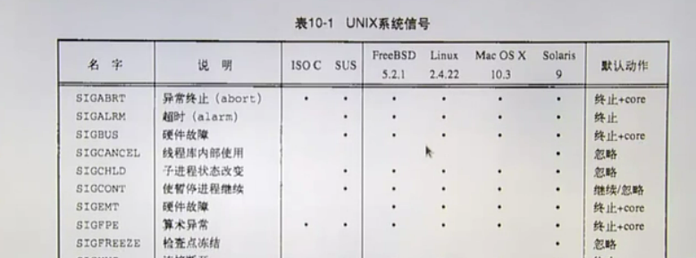

# 并发-异步事件处理的两种方法

1. 信号实现并发
    * 信号的概念
    * signal();
    * 信号的不可靠
    * 可重入函数
    * 信号的响应过程
    * 常用函数：kill、raise、alarm、pause、abort、system、sleep
    * 信号集
    * 信号屏蔽字和信号pending集的处理
    * 扩展：sigsuspend、sigaction、setitimer
    * 实时信号：1-9点都是标准信号
2. 多线程实现并发


信号的概念：信号是软件层面的中断

异步事件的处理：异步事件指的是事件什么时候发生不知道、事件的发生会产生什么样的结果也不知道，可以想象一个人在江边钓鱼，鱼就是个异步事件，鱼的大小品种不知(事件的发生会产生什么样的结果)、什么时候出现也不知(什么时候发生不知道)

1. 查询法：也即当前进程轮询查看异步事件有无发生
2. 通知法：当前进程可以不等待而去执行别的任务，等待某一个进程通知异步事件的发生，然后当前进程就可以转而去处理这个事件

异步事件发生的频率很稀疏则可以使用被动通知法，如果频繁发生则使用主动查询法

# 并发-信号的基本概念

比如说现在用的是单核的计算机，它是不会出现真正意义上的并行的，只会存在并发。不可打断的就是一条机器指令，比如说认为在一边写程序一边听着歌，这些操作其实知识并发。在单核计算机上，各个程序都会轮流占用当前的处理器，但是每个程序都由限定大小的时间片，只不过当前的调度非常快，对于用户是感觉不到计算机在做分时的实现

我们之前写的程序绝大多数都是同步程序，因为程序和结果都已经在代码中固定了，比如if-else或者while，很少会在程序或者结果中得到我们无法预测的内容

并发中有两大部分，一个是信号一个是线程，这两个都是用来处理并发的手段，信号属于初步异步，而线程属于强烈异步，所以如果信号部分的知识理解的比较透彻的话，那么在学习线程的时候就会省一点力气，并且两者可以在代码中混用

信号是软件层面的中断，中断是底层硬件的知识，而信号是应用层面的内容，信号的响应依赖于中断，硬件设备都会发出中断指令，因为很多事件的响应都是依赖于中断的，再比如说时间片轮转策略中当时间片耗尽进程就需要出让调度器去等待队列排队，那么时间片耗尽让进程出让调度资源就是中断的一种表现形式。

用`kill -l`能查看当前信号，编号1-31的信号被称为标准信号，编号34-64的信号名称都是SIGRT+(MIN~MAX)，被称为实时信号，所以其实使用kill命令给某个进程发信号的时候可以加上编号，意为发某个具体的信号给该进程

```shell
liangruuu@liangruuu-virtual-machine:/var/log$ kill -l

# result
1) SIGHUP	 2) SIGINT	 3) SIGQUIT	 4) SIGILL	 5) SIGTRAP
6) SIGABRT	 7) SIGBUS	 8) SIGFPE	 9) SIGKILL	10) SIGUSR1
11) SIGSEGV	12) SIGUSR2	13) SIGPIPE	14) SIGALRM	15) SIGTERM
16) SIGSTKFLT	17) SIGCHLD	18) SIGCONT	19) SIGSTOP	20) SIGTSTP
21) SIGTTIN	22) SIGTTOU	23) SIGURG	24) SIGXCPU	25) SIGXFSZ
26) SIGVTALRM	27) SIGPROF	28) SIGWINCH	29) SIGIO	30) SIGPWR
31) SIGSYS	34) SIGRTMIN	35) SIGRTMIN+1	36) SIGRTMIN+2	37) SIGRTMIN+3
38) SIGRTMIN+4	39) SIGRTMIN+5	40) SIGRTMIN+6	41) SIGRTMIN+7	42) SIGRTMIN+8
43) SIGRTMIN+9	44) SIGRTMIN+10	45) SIGRTMIN+11	46) SIGRTMIN+12	47) SIGRTMIN+13
48) SIGRTMIN+14	49) SIGRTMIN+15	50) SIGRTMAX-14	51) SIGRTMAX-13	52) SIGRTMAX-12
53) SIGRTMAX-11	54) SIGRTMAX-10	55) SIGRTMAX-9	56) SIGRTMAX-8	57) SIGRTMAX-7
58) SIGRTMAX-6	59) SIGRTMAX-5	60) SIGRTMAX-4	61) SIGRTMAX-3	62) SIGRTMAX-2
63) SIGRTMAX-1	64) SIGRTMAX
```



* ISO C即标准C支持的信号种类是最少的，所以在标准C的环境下信号基本上完成不了什么功能
* Solaris9支持的信号种类最多
* 默认动作中"终止+core"操作的种类最多，core指的是core文件，core文件一个程序的某一个现场，一般我们保存起来的都是出错的现场，就比如说登录QQ的时候如果闪退了，那么QQ就会弹出一个征询用户采集错误报告窗口，这个步骤就是在采集错误现场，也就是这些core文件，core文件详细内容https://blog.csdn.net/u011417820/article/details/71435031

>NAME
>
>> signal - ANSI C signal handling
>
>SYNOPSIS
>
>> #include <signal.h>
>>
>> typedef void (*sighandler_t)(int);
>>
>> sighandler_t signal(int signum, sighandler_t handler);
>
>1. sighandler_t signal(int signum, sighandler_t handler)：注册当前信号的行为，signum表示之前说的那么多信号中的其中一个，handler表示具体操作的函数，是用一个函数指针sighandler_t来定义的，只不过这里的指针函数是typedef过的，返回值指的是信号之前的行为，其也是一个函数指针
>2. typedef void (*sighandler_t)(int)：返回值为void，参数类型为int的函数指针，意为一个行为
>3. 信号会打算阻塞的系统调用，所以我们在之前几个章节写的进程程序没有一个是判断了如果信号来打断阻塞的系统调用会怎么办的，即没有一个是正确的

2. 其实这个函数就相当于`void(*signal(int signum, void (*func)(int)))(int)`

* 用signal函数实现打印星号的功能

```c
int main()
{

    for (int i = 0; i < 10; i++)
    {
        write(1, "*", 1);
        sleep(1);
    }

    exit(0);
}

```

如果在打印的过程中有一个ctrl+c操作，则程序会被打断，ctrl+c相当于是SIGINT(signal interupt)的快捷方式，同理常用的quit相当于是SIGQUIT的快捷方式。这个ctrl+c就是典型的异步操作，进程不知道什么时候来，也不知道来的是一个什么样的信号

```shell
liangruuu@liangruuu-virtual-machine:~/study/linuxc/code/parallel/signal$ ./star 

# result
****^C
liangruuu@liangruuu-virtual-machine:~/study/linuxc/code/parallel/signal$ 
```


>DESCRIPTION
>
>> signal() sets the disposition of the signal signum to handler, which is either SIG_IGN, SIG_DFL, or the address of a programmer-defined function (a "signal handler").
>
>* handler要么是SIG_IGN, SIG_DFL中的其中一个，要么是一个自定义的函数地址
>* SIG_IGN：signal_ingore，即忽略掉这个信号
>* SIG_DFL：signal_defauly，即默认操作

```c
int main()
{
    signal(SIGINT, SIG_IGN);

    for (int i = 0; i < 10; i++)
    {
        write(1, "*", 1);
        sleep(1);
    }

    exit(0);
}
```

* 在程序执行过程中忽略掉ctrl+c信号，也就是说ctrl+c无法中断程序的执行

```shell
liangruuu@liangruuu-virtual-machine:~/study/linuxc/code/parallel/signal$ ./star 

# result
**^C*^C*^C******liangruuu@liangruuu-virtual-machine:~/study/linuxc/code/parallel/signal$ 
```

* 在收到信号的时候打印特殊符号

```c
#include <stdio.h>
#include <stdlib.h>
#include <signal.h>
#include <unistd.h>

static void int_handler(int s)
{
    write(1, "!", 1);
}

int main()
{
    signal(SIGINT, int_handler);

    for (int i = 0; i < 10; i++)
    {
        write(1, "*", 1);
        sleep(1);
    }

    exit(0);
}

```

```shell
liangruuu@liangruuu-virtual-machine:~/study/linuxc/code/parallel/signal$ ./star 

# result
*^C!**^C!**^C!*^C!****liangruuu@liangruuu-virtual-machine:~/study/linuxc/code/parallel/signal$ 
```

当程序在每秒钟打印一个星号的同时，输入端一直按着ctrl+c不放，则这个程序的执行时间是不足10秒的，即信号会打断阻塞的系统调用，在程序执行sleep还不足1秒的时候就被信号打断从而执行下一个循环，以此类推

```shell
liangruuu@liangruuu-virtual-machine:~/study/linuxc/code/parallel/signal$ ./star 

# result
# 1秒就执行完成
*^C!*^C!*^C!*^C!*^C!*^C!*^C!*^C!*^C!*^C!liangruuu@liangruuu-virtual-machine:~/study/linuxc/code/parallel/signal$ ^C
liangruuu@liangruuu-virtual-machine:~/study/linuxc/code/parallel/signal$ ^C
liangruuu@liangruuu-virtual-machine:~/study/linuxc/code/parallel/signal$ ^C
liangruuu@liangruuu-virtual-machine:~/study/linuxc/code/parallel/signal$ ^C
```

3. 之前写的mycpy程序

```c
#include <stdio.h>
#include <stdlib.h>
#include <unistd.h>
#include <sys/types.h>
#include <sys/stat.h>
#include <fcntl.h>
#include <errno.h>

#define BUFSIZE 1024

int main(int argc, char **argv)
{
    int sfd, dfd;
    int len = 0;
    int ret = 0;
    int pos = 0;
    char buf[BUFSIZE];

    if (argc < 3)
    {
        fprintf(stderr, "Usage:%s <src_file> <dest_file>\n", argv[0]);
        exit(1);
    }

    sfd = open(argv[1], O_RDONLY);
    if (sfd < 0)
    {
        perror("open()");
        exit(1);
    }

    dfd = open(argv[2], O_WRONLY | O_CREAT | O_TRUNC, 0600);
    if (dfd < 0)
    {
        close(sfd);
        perror("open()");
        exit(1);
    }

    while (1)
    {
        len = read(sfd, buf, BUFSIZE);
        if (len < 0)
        {
            perror("read()");
            break;
        }
        if (len == 0)
            break;

        pos = 0;
        while (len > 0)
        {
            // printf("pos=%d len=%d\n", pos, len);
            ret = write(dfd, buf + pos, len);
            // printf("ret=%d\n", ret);
            if (ret < 0)
            {
                perror("write()");
                exit(1);
            }
            pos += ret;
            len -= ret;
        }
    }

    close(dfd);
    close(sfd);

    exit(0);
}

```

其中的open函数会被信号打断，信号会打断阻塞形式的系统调用，open、read、write都算是阻塞形式的系统调用

>NAME
>
>> open, openat, creat - open and possibly create a file
>
>ERRORS
>
>> EINTR  While  blocked  waiting to complete an open of a slow device (e.g., a FIFO; see fifo(7)), the call was interrupted by a signal handler; see signal(7).
>
>* EINTR：error interupt，the call was interrupted by a signal handler

用使用信号处理逻辑更新之后的代码

```c
#include <stdio.h>
#include <stdlib.h>
#include <unistd.h>
#include <sys/types.h>
#include <sys/stat.h>
#include <fcntl.h>
#include <errno.h>

#define BUFSIZE 1024

int main(int argc, char **argv)
{
    int sfd, dfd;
    int len = 0;
    int ret = 0;
    int pos = 0;
    char buf[BUFSIZE];

    if (argc < 3)
    {
        fprintf(stderr, "Usage:%s <src_file> <dest_file>\n", argv[0]);
        exit(1);
    }

    do
    {
        sfd = open(argv[1], O_RDONLY);
        if (sfd < 0)
        {
            if (errno != EINTR)
            {
                perror("open()");
                exit(1);
            }
        }
    } while (sfd < 0);

    do
    {
        dfd = open(argv[2], O_WRONLY | O_CREAT | O_TRUNC, 0600);
        if (dfd < 0)
        {
            close(sfd);
            perror("open()");
            exit(1);
        }
    } while (dfd < 0);

    while (1)
    {
        len = read(sfd, buf, BUFSIZE);
        if (len < 0)
        {

            if (errno == EINTR)
                continue;
            perror("read()");
            break;
        }
        if (len == 0)
            break;

        pos = 0;
        while (len > 0)
        {
            // printf("pos=%d len=%d\n", pos, len);
            ret = write(dfd, buf + pos, len);
            // printf("ret=%d\n", ret);
            if (ret < 0)
            {
                if (errno == EINTR)
                    continue;
                perror("write()");
                exit(1);
            }
            pos += ret;
            len -= ret;
        }
    }

    close(dfd);
    close(sfd);

    exit(0);
}

```


