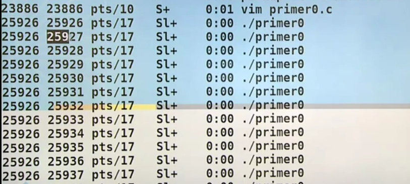
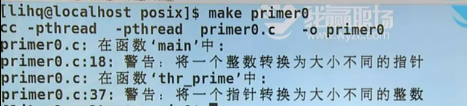
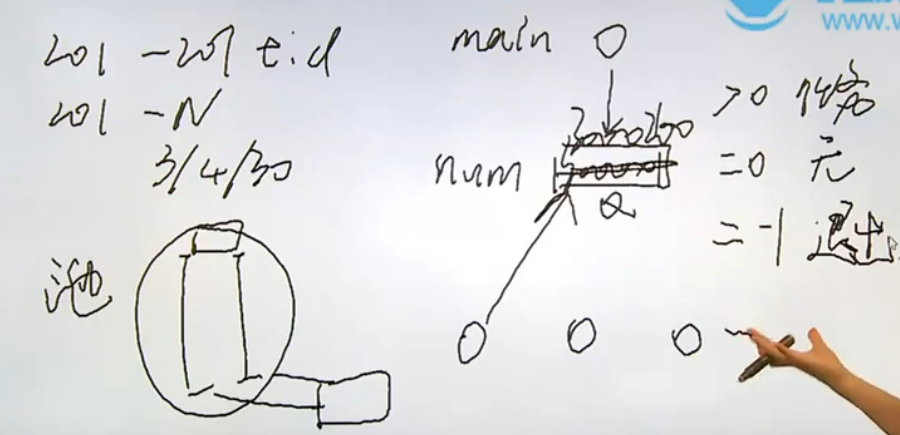
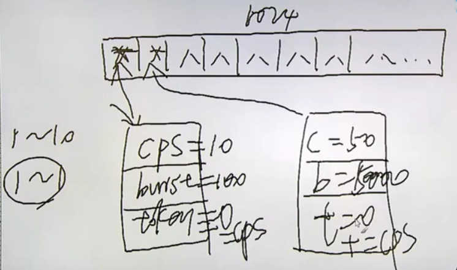
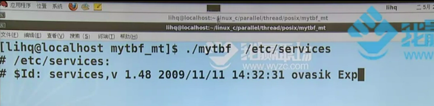

# 线程-线程的概念和线程标识

1. 线程的概念
2. 线程的创建、线程终止、线程的取消选项、栈清理
3. 线程同步
4. 线程相关的属性线程同步的属性
5. 线程与信号、线程与fork、线程重入


之前讲到一个会话session的概念，当时讲这个概念的时候是为了实现一个守护进程，当前的一次成功的shell登录其实就是一个会话的产生，会话是用来承载进程组的，会话中可以有一个或多个进程组，每个进程组里有一个或多个进程，一个进程中有一个或多个线程

之前写的都是单进程或者单线程的程序，包括信号机制在内，虽然信号已经有了并发的概念，但是在处理信号处理函数st_handle的同时，被打断的现场肯定是不会去运行的，这就相当于被阻塞了，即没有出现多个分支并行去执行任务的情况

线程说白了就是一个正在运行的函数，之前写的函数，不管是main函数还是一个常规函数在运行，进程当中始终至少会有一个函数在运行，但是到目前为止还没有办法让多于一个的函数在进行运行，线程机制就能使得多个函数能同时运行

一个进程中至少会有一个线程，也就是说一个进程空间中最少会有一个函数在运行。假如说就用一个main函数来进行编程的话，那其实程序当中就有一个main线程在运行的，很多人其实在接触到函数这个概念的时候通常会人为main函数是一个特殊的函数，进程以main作为入口，并且以main作为出口，这个认知是正确的，但无非是我们人为的规定，因为我们必须制定一个入口和出口，其实我们可以不以main函数作为入口和出口。有人习惯把main函数作为主函数，但是到了线程阶段，main函数就被视作为main线程而非进程，并且是main线程而非主线程在运行，因为多个线程之间是兄弟关系，不分先后，而非有主次之分的关系，即使当前线程创建出了一个兄弟线程，这个兄弟线程也可以反过来给当前线程收尸或取消掉

多个线程的内存空间是共享的，在同一个进程空间内如果运行着多个线程，那么这些线程进行通信的方法会很简单，因为一个进程的空间是在32位环境下是4G的虚拟地址空间，有两个函数正在同时运行，如果想让他们两个线程通信的话就不需要借助外来机制了，可以直接在程序中创建一个全局变量，这个全局变量是这两个函数同时能获取的，这就是一个典型的通信机制

线程有很多不同的标准，现在用的比较多的是posix线程，posix线程是一套标准而非实现。比如线程为pthread_t类型，p表示的是posix，thread表示的是线程，pthread_t表示的就是posix线程下的线程标识，而pthread_t是什么类型是不确定的，有可能是整型，有可能是结构体...因为posix只是一个标准而非实现，pthread_t就相当于pid_t类型，在不同环境下代表的类型是不同的，但是如果要申明一个线程就必须用pthread_t来表示

在终端输出`ps axm`命令

```shell
liangruuu@liangruuu-virtual-machine:~/study/linuxc$ ps axm

# result
5720 ?        -      0:00 [kworker/6:1-events]
- -        I      0:00 -
5762 ?        -      0:00 [kworker/8:0-events]
- -        I      0:00 -
5763 ?        -      0:00 /usr/lib/firefox/firefox -contentproc -childID 25 -isForBrowser -prefsLen 8832 -prefMapSize 247345 -jsI
- -        Sl     0:00 -
- -        Sl     0:00 -

```

可以看到每一个进程下面都有一条--记录，甚至一些进程下面有多个--，--所在行代表的就是一个线程，因为一个进程空间至少有一个线程，所以每个进程下面至少有一个--

再使用`ps ax -L`命令查看进程和线程的关系，-L表示以linux模式查看，LWP是轻量级进程，这里可以理解为线程，可以看到相同进程下有不同的线程，线程号其实就是用进程号来进行描述的	

```shell
liangruuu@liangruuu-virtual-machine:~$ ps ax -L
    PID     LWP TTY      STAT   TIME COMMAND
   1422    1423 ?        Ssl    0:00 /usr/libexec/gvfs-afc-volume-monitor
   1422    1424 ?        Ssl    0:00 /usr/libexec/gvfs-afc-volume-monitor
   1422    1426 ?        Ssl    0:00 /usr/libexec/gvfs-afc-volume-monitor
   1428    1428 ?        Ssl    0:00 /usr/lib/upower/upowerd
   1428    1435 ?        Ssl    0:00 /usr/lib/upower/upowerd
   1428    1436 ?        Ssl    0:00 /usr/lib/upower/upowerd


```

# 线程-线程创建

>NAME
>
>> pthread_equal - compare thread IDs
>
>SYNOPSIS
>
>> #include <pthread.h>
>>
>> int pthread_equal(pthread_t t1, pthread_t t2);
>>
>> Compile and link with -pthread.
>
>1. int pthread_equal(pthread_t t1, pthread_t t2)：比较两个线程ID，因为pthread这个类型是不确定的，所以不能用等于号来表示两个进程的关系，如果相同返回非零值，否则返回零
>
>2. 在线程阶段编译任何和线程相关的程序都需要使用makefile文件，并且在makefile文件中加上-pthread.设置

2. makefile文件设置

```makefile
CFLAGS+=-pthread
LDFLAGS+=-pthread
```

>NAME
>
>> pthread_self - obtain ID of the calling thread
>
>SYNOPSIS
>
>> #include <pthread.h>
>>
>> pthread_t pthread_self(void);
>>
>> Compile and link with -pthread.
>
>1. pthread_t pthread_self(void)：获取当前线程的ID，类似于于进程的getpid函数

线程的创建

>NAME
>
>> pthread_create - create a new thread
>
>SYNOPSIS
>
>> #include <pthread.h>
>>
>> int pthread_create(pthread_t \*thread, const pthread_attr_t \*attr, void \*(\*start_routine) (void \*), void \*arg);
>>
>> Compile and link with -pthread.
>
>1. pthread_create：第一个参数是pthread_t类型的指针，不是让用户提供指针，而是让用户提供一个存放pthread_t数据的地址，然后把创建成的线程标识回填到这个地址空间上；第二个参数pthread_attr_t表示线程的属性，在多数情况下可以使用默认的NULL即可；第三个参数是一个函数指针，表示并行执行的兄弟线程；第四个参数就是传递给第三个函数指针的参数

1. 成功创建返回值为0，否则返回一个error number

> RETURN VALUE
>
> > On success, pthread_create() returns 0; on error, it returns an error number, and the contents of *thread are undefined.

* 使用pthread_create创建线程

```c
// create1.c

#include <stdio.h>
#include <stdlib.h>
#include <pthread.h>
#include <string.h>

static void *func(void *p)
{
    puts("Thread is working...");
    return NULL;
}

int main()
{
    pthread_t tid;
    int err;

    puts("Begin!");

    err = pthread_create(&tid, NULL, func, NULL);
    if (err)
    {
        fprintf(stderr, "pthread_create():%s\n", strerror(err));
        exit(1);
    }

    puts("End!");

    exit(0);
}

```

```shell
liangruuu@liangruuu-virtual-machine:~/study/linuxc/code/parallel/thread/posix$ ./create1 

# result
Begin!
End!
```

按道理创建出来的兄弟线程会打印“Thread is working...”这句话，但是结果并没有。因为线程的调度取决于调度器的调度策略，当前main线程打印begin，然后创建一个线程，然后打印end，即被创建的线程还没来得及被调度执行打印函数的时候main线程就执行了exit(0)了，exit就是进程正常终止的方式之一

# 线程-线程终止和栈清理

线程的终止包括三种方式：

1. 线程从启动例程返回，返回值为线程的退出码
2. 线程可以被统一进程中的其他线程取消
3. 线程调用pthread_exit()函数，相当于进程阶段的exit函数

统一进程中的最后一个线程结束运行后，这个进程也会结束运行

>NAME
>
>> pthread_exit - terminate calling thread
>
>SYNOPSIS
>
>> #include <pthread.h>
>>
>> void pthread_exit(void *retval);
>>
>> Compile and link with -pthread.
>
>1. void pthread_exit(void *retval)

在刚才的create1.c函数中使用`return NULL`来表示线程的退出，那么现在使用`pthread_exit(NULL)`来替换，当前看好像没有什么区别，但是之后要进行一些进程栈的清理，如果使用return null就相当于不能主动做线程栈的清理了

```c
static void *func(void *p)
{
    puts("Thread is working...");
    pthread_exit(NULL);
}
```

既然线程线程会被终止，那么就会有一个函数来进行线程终的收尸

>NAME
>
>> pthread_join - join with a terminated thread
>
>SYNOPSIS
>
>> #include <pthread.h>
>>
>> int pthread_join(pthread_t thread, void **retval);
>>
>> Compile and link with -pthread. 
>
>1. int pthread_join(pthread_t thread, void **retval)：第一个参数指的是要被收尸的线程；第二个参数如果为NULL的话就表示只收尸不关心状态，如果要把收尸的状态加以查看的话就传一个void\*类型变量的地址，可以发现这个参数跟pthread_exit函数的参数是一样的变量名，所以这个pthread_join函数的retval变量就是pthread_exit函数的参数

1. 这个函数相当于进程中的wait函数，但是跟wait函数不一样的是，wait函数不需要指定进程，而pthread_join需要指定所要回收的线程

使用这两个函数来重构之前的代码

```c
// create.c


#include <stdio.h>
#include <stdlib.h>
#include <pthread.h>
#include <string.h>

static void *func(void *p)
{
    puts("Thread is working...");
    pthread_exit(NULL);
}

int main()
{
    pthread_t tid;
    int err;

    puts("Begin!");

    err =  pthread_create(&tid, NULL, func, NULL);
    if(err)
    {
        fprintf(stderr, "pthread_create():%s\n", strerror(err));
        exit(1);
    }

    pthread_join(tid, NULL);

    puts("End!");

    exit(0);
}

```

* 29：回收被创建的线程tid，第二个参数为空，因为pthread_exit的参数为空，pthread_join相当于在等待pthread_exit函数的返回值

```shell
liangruuu@liangruuu-virtual-machine:~/study/linuxc/code/parallel/thread/posix$ ./create

# result
Begin!
Thread is working...
End!
```

先打印Begin!，然后调用pthread_join函数等待创建的线程执行完成，因为线程的中pthread_exit函数的返回值为NULL，即没有返回值，所以这里的第二个参数设置为NULL

栈清理有两个函数需要掌握：

1. pthread_cleanup_push();
2. pthread_cleanup_pop();

这两个函数相当于钩子函数，pthread_cleanup_push相当于往钩子上挂函数，pthread_cleanup_pop相当于从钩子上取函数

>NAME
>
>> pthread_cleanup_push, pthread_cleanup_pop - push and pop thread cancellation clean-up handlers
>
>SYNOPSIS
>
>> #include <pthread.h>
>>
>> void pthread_cleanup_push(void (\*routine)(void \*), void \*arg);
>> void pthread_cleanup_pop(int execute);
>>
>> Compile and link with -pthread.
>
>1. void pthread_cleanup_push(void (\*routine)(void \*), void \*arg)：第一个参数为函数指针；第二个参数为函数指针对应函数传入的参数
>2. void pthread_cleanup_pop(int execute)：参数execute指的是在拿到钩子函数的时候决定钩子函数是否被调用，如果为真则调用，如果为佳假则不被调用

```c
// cleanup.c 

#include <stdio.h>
#include <stdlib.h>
#include <pthread.h>
#include <string.h>

static void cleanup_func(void *p)
{
    puts(p);
}

static void *func(void *p)
{
    puts("Thread is working...");
    pthread_cleanup_push(cleanup_func, "cleanup:1");
    pthread_cleanup_push(cleanup_func, "cleanup:2");
    pthread_cleanup_push(cleanup_func, "cleanup:3");

    pthread_cleanup_pop(1);
    pthread_cleanup_pop(1);
    // 不调用
    pthread_cleanup_pop(0);

    puts("push over!");

    pthread_exit(NULL);
}

int main()
{
    pthread_t tid;
    int err;

    puts("Begin!");

    err = pthread_create(&tid, NULL, func, NULL);
    if (err)
    {
        fprintf(stderr, "pthread_create():%s\n", strerror(err));
        exit(1);
    }

    pthread_join(tid, NULL);

    puts("End!");

    exit(0);
}

```

```shell
liangruuu@liangruuu-virtual-machine:~/study/linuxc/code/parallel/thread/posix$ ./clearup

# result
Begin!
Thread is working...
cleanup:3
cleanup:2
push over!
End!
```

* 16-18：挂载钩子函数
* 20-23：把钩子函数从栈中弹出，传参为1表示执行弹出的钩子函数，传参为0表示不执行弹出的钩子函数，所以可以看到cleanup:1语句没有被输出，而且执行顺序是按照挂载的顺序逆序执行

# 线程的取消

一个线程在执行的过程中一定会用到线程的取消，多线程可以把任务分摊开，比如有一个深度为1W的二叉树，要在这颗二叉树中查找一个指定节点，从第三层开始用四个线程每个线程负责找一颗子树，则会有一个线程找到指定的那个节点，那么其他线程就没有必要继续找下去，则这个时候就需要把其他三个线程给取消了，如果是一个正在运行的线程是没有办法收尸的，所以就需要先取消再收尸

>NAME
>
>> pthread_cancel - send a cancellation request to a thread
>
>SYNOPSIS
>
>> #include <pthread.h>
>>
>> int pthread_cancel(pthread_t thread);
>>
>> Compile and link with -pthread.
>
>1. int pthread_cancel(pthread_t thread)：给一个线程发送取消请求，参数就是指定线程

1. 先使用pthread_cancel函数取消线程，再使用pthread_join进行线程资源的回收

有以下代码：

```c
fd1 = open();
if(fd1 < 0)
{
    perror();
	exit(1);
}
//      -----------> cleanup_push -> close(fd1)

fd2 = open();
if(fd2 < 0)
{
    perror();
	exit(1);
}
//      -----------> cleanup_push -> close(fd2)

close(fd1);
close(fd2);
```

这是一个线程，当前线程在执行打开两个文件的操作，当执行完打开第一个文件的时候收到了cancel线程的请求，则到此为止fd1还没来得即close，解决办法就是通过pthread_cleanup_push挂载一个钩子函数，这个钩子函数的作用就是执行close操作，钩子函数会在执行pthread_cleanup_pop的时候被调用

但这是一种非常理想的情况，如果是在还没来得及挂载钩子函数的时候就被别人cancel了怎么办？

取消由取消选项来做主，取消有两种状态：允许、不允许，如果设置为允许取消的话，又分为异步取消和推迟取消，其中推迟取消是默认的设置，推迟指的是推迟到cancel点来进行响应。cancel点：posix定义的cancel点都是可能引发阻塞的系统调用，而非系统调用的内容是否是cancel点在不同平台上可能不同，所以刚才举的例子`还没来得及挂载钩子函数的时候就被别人cancel了`的情况是不存在的，即可以在挂载函数之前收到cancel信号，但是不会取消，因为cleanup_push不是cancel点，即cleanup_push不阻塞系统调用，所以会继续执行直到执行到下面的open函数，因为open是阻塞系统调用，所以cancel会在这个点去响应

# 线程-线程竞争实例

* 使用多线程实现筛选质数的功能

```c
#include <stdio.h>
#include <stdlib.h>
#include <string.h>
#include <unistd.h>
#include <sys/types.h>
#include <sys/wait.h>
#include <pthread.h>

#define LEFT 30000000
#define RIGHT 30000200
#define THRNUM (RIGHT - LEFT + 1)


static void *thr_prime(void *p)
{
    int i, j, mark;
    i = *(int *)p;
    mark = 1;
    for (j = 2; j < i / 2; j++)
    {
        if (i % j == 0)
        {
            mark = 0;
            break;
        }
    }
    if (mark)
        printf("%d is a primer\n", i);

    pthread_exit(NULL);
}

int main()
{
    int i, err;
    pthread_t tid[THRNUM];

    for (i = LEFT; i <= RIGHT; i++)
    {

        err = pthread_create(tid + (i - LEFT), NULL, thr_prime, &i);
        if (err)
        {
            fprintf(stderr, "pthread_create():%s\n", strerror(err));
            exit(1);
        }
    }

    for (i = LEFT; i <= RIGHT; i++)
        pthread_join(tid[i - LEFT], NULL);

    exit(0);
}

```

* 11：使用201个线程执行操作
* 33：main线程创建其兄弟线程去执行判断质数与否的功能
* 49-50：创建了多少线程就需要调用多少次join操作进行线程资源的回收

```shell
liangruuu@liangruuu-virtual-machine:~/study/linuxc/code/parallel/thread/posix$ ./primer_th 
    
# result
30000059 is a primer
30000059 is a primer
30000163 is a primer
30000163 is a primer
30000079 is a primer
30000037 is a primer
30000133 is a primer
30000163 is a primer
30000037 is a primer
```

这个执行结果出现的原因是线程间的竞争关系，可以看这行代码`pthread_create(tid + (i - LEFT), NULL, thr_prime, &i);`，在创建所有线程的时候给每个线程传的参数都是i的地址，也就是说thr_prime函数同时在运行这201份，这201个指针p实际上都指向了变量i，即还没有确认创建出来的第一个线程把i拿走就在创建第二个线程了，所以说错误就错在用地址传参，i本身就一块地址，然后找了201个指针来指向这块空间，肯定会出现竞争的



如果问题出在201个指针公用一块的地址的话，那就不传地址`pthread_create(tid + (i - LEFT), NULL, thr_prime, i);`，用传值来替换，但是因为pthread_create函数的第四个参数的类型需要是地址，所以使用一种丑陋的方式强制类型转换`pthread_create(tid + (i - LEFT), NULL, thr_prime, (void *)i);`

```c
static void *thr_prime(void *p)
{
    int i, j, mark;
    i = (int)p;
    mark = 1;
    for (j = 2; j < i / 2; j++)
    {
        if (i % j == 0)
        {
            mark = 0;
            break;
        }
    }
    if (mark)
        printf("%d is a primer\n", i);

    pthread_exit(NULL);
}

int main()
{
    int i, err;
    pthread_t tid[THRNUM];

    for (i = LEFT; i <= RIGHT; i++)
    {
        err = pthread_create(tid + (i - LEFT), NULL, thr_prime, (void *)i);
        if (err)
        {
            fprintf(stderr, "pthread_create():%s\n", strerror(err));
            exit(1);
        }
    }

    for (i = LEFT; i <= RIGHT; i++)
        pthread_join(tid[i - LEFT], NULL);

    exit(0);
}

```



```shell
liangruuu@liangruuu-virtual-machine:~/study/linuxc/code/parallel/thread/posix$ ./primer_th 

# result
30000083 is a primer
30000059 is a primer
30000037 is a primer
30000049 is a primer
30000079 is a primer
30000041 is a primer
30000109 is a primer
30000001 is a primer
30000137 is a primer
30000133 is a primer
30000071 is a primer
30000199 is a primer
30000193 is a primer
30000023 is a primer
30000163 is a primer
30000167 is a primer
30000169 is a primer
30000149 is a primer
```

结果为什么会冲突，是因为201个指针指向了同一个i的地址，那其实如果201个指针指向的是201块空间不就好了，所以可以构造一个结构体

```c
#include <stdio.h>
#include <stdlib.h>
#include <string.h>
#include <unistd.h>
#include <sys/types.h>
#include <sys/wait.h>
#include <pthread.h>

#define LEFT 30000000
#define RIGHT 30000200
#define THRNUM (RIGHT - LEFT + 1)

struct thr_arg_st
{
    int n;
};

static void *thr_prime(void *p)
{
    int i, j, mark;
    i = ((struct thr_arg_st *)p)->n;
    // free(p);
    mark = 1;
    for (j = 2; j < i / 2; j++)
    {
        if (i % j == 0)
        {
            mark = 0;
            break;
        }
    }
    if (mark)
        printf("%d is a primer\n", i);

    pthread_exit(p);
}

int main()
{
    int i, err;
    pthread_t tid[THRNUM];
    struct thr_arg_st *p;
    void *ptr;

    for (i = LEFT; i <= RIGHT; i++)
    {
        p = malloc(sizeof(*p));
        if (p == NULL)
        {
            perror("malloc()");
            exit(1);
        }
        p->n = i;
        err = pthread_create(tid + (i - LEFT), NULL, thr_prime, p);
        if (err)
        {
            fprintf(stderr, "pthread_create():%s\n", strerror(err));
            exit(1);
        }
    }

    for (i = LEFT; i <= RIGHT; i++)
    {
        pthread_join(tid[i - LEFT], &ptr);
        free(ptr);
    }

    exit(0);
}

```

* 45：201个线程每一个都拿到一块独立的空间则需要考虑使用动态分配，而指针变量指向一个结构体(其实可以直接malloc一块int大小的空间，这里采用结构体是为了以后可能的功能拓展，两种方式均可)
* 22，34，53，64，65：因为需要把malloc申请的内从空间释放掉，通过pthread_exit函数把处理过的变量p返回，并且通过pthread_join接收，从而做到释放空间

# 线程-竞争故障

* 用代码实现竞争故障的例子，在这个例子中有20个线程出现来操作同一个文件，各个线程的操作都是一样的，即打开文件，读数据然后把数据取出然后覆盖写会，然后关闭文件

```c
// add.c

#include <stdio.h>
#include <stdlib.h>
#include <string.h>
#include <pthread.h>

#define THRNUM 20
#define LINESIZE 1024
#define FNAME "/tmp/out"		// echo 1 > /tmp/out

static void *thr_add(void *p)
{
    FILE *fp;
    char linebuf[LINESIZE];

    fp = fopen(FNAME, "r+");
    if (fp == NULL)
    {
        perror("fopen()");
        exit(1);
    }

    fgets(linebuf, LINESIZE, fp);
    fseek(fp, 0, SEEK_SET);
    slepp(1);
    fprintf(fp, "%d\n", atoi(linebuf) + 1);

    fclose(fp);

    pthread_exit(NULL);
}

int main()
{
    pthread_t tid[THRNUM];
    int i, err;
    for (i = 0; i < THRNUM; i++)
    {
        err = pthread_create(tid + i, NULL, thr_add, NULL);
        if (err)
        {
            fprintf(stderr, "pthread_create():%s\n", strerror(err));
            exit(1);
        }
    }

    for (i = 0; i < THRNUM; i++)
        pthread_join(tid[i], NULL);

    exit(0);
}
 
```

* 8：main线程负责创建20个线程
* 25：因为读取文件的过程中，文件位置指针会向后走，因为要覆盖写回数据，所以要把文件位置指针重定位到文件的开始位置
* 26：把读取的字符类型的数据变为整型进行自增操作，然后写回文件

```shell
liangruuu@liangruuu-virtual-machine:~/study/linuxc/code/parallel/thread/posix$ ./add 
liangruuu@liangruuu-virtual-machine:~/study/linuxc/code/parallel/thread/posix$ cat /tmp/out 

# result
# 如果线程不竞争的话，最后结果应该是21
2
```

```c
fgets(linebuf, LINESIZE, fp);
fseek(fp, 0, SEEK_SET);
slepp(1);
fprintf(fp, "%d\n", atoi(linebuf) + 1);

fclose(fp);
```

因为没有处理线程的竞争关系，所以一开始的时候就有很多线程获得了文件的初始值1，然后全部执行sleep语句阻塞1秒，最后的输出结果肯定也是从1开始自增，即结果为2，再全部把2写回文件，所以文件里的内容就是2

线程同步：互斥量相当于某一个可能被多个线程所竞争的资源，那么在使用这个资源的时候需要加上一个锁，让抢到这把锁的线程去访问这个资源，其他没抢到锁的线程则需要等待，直到锁被释放然后再开始抢，以此类推

>NAME
>
>> pthread_mutex_destroy, pthread_mutex_init — destroy and initialize a mutex
>
>SYNOPSIS
>
>> #include <pthread.h>
>>
>> int pthread_mutex_destroy(pthread_mutex_t *mutex);
>> int pthread_mutex_init(pthread_mutex_t *restrict mutex, const pthread_mutexattr_t *restrict attr);
>> pthread_mutex_t mutex = PTHREAD_MUTEX_INITIALIZER
>
>1. pthread_mutex_init：第一个参数为互斥量，也是说初始化一个锁；第二个参数是把这个互斥量的属性设置为什么
>2. pthread_mutex_t mutex = PTHREAD_MUTEX_INITIALIZER：静态初始化方式，类型变量名用宏来初始化，pthread_mutex_init是动态初始化

>NAME
>
>> pthread_mutex_lock, pthread_mutex_trylock, pthread_mutex_unlock — lock and unlock a mutex
>
>SYNOPSIS
>
>> #include <pthread.h>
>>
>> int pthread_mutex_lock(pthread_mutex_t *mutex);
>> int pthread_mutex_trylock(pthread_mutex_t *mutex);
>> int pthread_mutex_unlock(pthread_mutex_t *mutex);
>
>1. lock和unlock函数之间的一段函数被称为临界区

* 使用互斥量重构代码

```c
#include <stdio.h>
#include <stdlib.h>
#include <string.h>
#include <pthread.h>

#define THRNUM 20
#define LINESIZE 1024
#define FNAME "/tmp/out"

static pthread_mutex_t mut = PTHREAD_MUTEX_INITIALIZER;

static void *thr_add(void *p)
{
    FILE *fp;
    char linebuf[LINESIZE];

    fp = fopen(FNAME, "r+");
    if (fp == NULL)
    {
        perror("fopen()");
        exit(1);
    }

    pthread_mutex_lock(&mut);
    fgets(linebuf, LINESIZE, fp);
    fseek(fp, 0, SEEK_SET);
    fprintf(fp, "%d\n", atoi(linebuf) + 1);

    fclose(fp);
    pthread_mutex_unlock(&mut);

    pthread_exit(NULL);
}

int main()
{
    pthread_t tid[THRNUM];
    int i, err;
    for (i = 0; i < THRNUM; i++)
    {
        err = pthread_create(tid + i, NULL, thr_add, NULL);
        if (err)
        {
            fprintf(stderr, "pthread_create():%s\n", strerror(err));
            exit(1);
        }
    }

    for (i = 0; i < THRNUM; i++)
        pthread_join(tid[i], NULL);

    pthread_mutex_destroy(&mut);

    exit(0);
}

```

* 24-30：lock和unlock函数之间的代码被称为临界区，上了锁之后的临界区中的代码一个时间段中只能被一个线程所访问
* 10，52：初始化一个互斥量，并且在main线程结束的时候应该销毁互斥量

```shell
liangruuu@liangruuu-virtual-machine:~/study/linuxc/code/parallel/thread/posix$ ./add
liangruuu@liangruuu-virtual-machine:~/study/linuxc/code/parallel/thread/posix$ cat /tmp/out 

# result
21
```

* 实现一个例子：用四个线程一直往终端输出abcd，即结果应该是`abcdabcdabcdabcd......`

```c
#include <stdio.h>
#include <stdlib.h>
#include <string.h>
#include <pthread.h>
#include <unistd.h>

#define THRNUM 4

static pthread_mutex_t mut[THRNUM];

static void *thr_func(void *p)
{
    int c;
    int n = (int)p;
    c = 'a' + n;
    while (1)
    {
        write(1, &c, 1);
    }

    pthread_exit(NULL);
}

int main()
{
    pthread_t tid[THRNUM];
    int i, err;

    for (i = 0; i < THRNUM; i++)
    {

        err = pthread_create(tid + i, NULL, thr_func, (void *)i);
        if (err)
        {
            fprintf(stderr, "pthread_create():%s\n", strerror(err));
            exit(1);
        }
    }

    alarm(2);

    for (i = 0; i < THRNUM; i++)
        pthread_join(tid[i], NULL);

    exit(0);
}

```

* 40：因为第16-19行是一个死循环一直往终端输出数据，所以为了测试方便调用alarm信号在程序执行5秒后就会杀死当前的main线程

```shell
liangruuu@liangruuu-virtual-machine:~/study/linuxc/code/parallel/thread/posix$ ./abcd 

# result
ababbabbbababababababababababababababababababababababababababababababababababaaababababababbbabbbbbbbbbbbbbbbbabbbabababababababababababaabababbababababababababababababababababababababababababababababababababababababcbdadabacdbacdabcdadbcadbcbabdbcadbcabacdbabcdababcbdadacbdacbcbdacbdadacbdacbcdabcdbadcbdddddddddddddddddddddddddddddddddddabcdabdacbdbacdbacdbadcbadcabdcabadcbadbcdabacdcdbdbdacbdacbdacacbdacbdacbdbdbdbabcdabcdababcdabcdbdcabdcabdababadcbadcdcdbacdbacccccccccccccccccccdbacacbdacbccccccccccccccccccccdabcacbdbacbdacacabdcacbdcacacabdcabdcabdcacbdacbdadacbdbacdbacdabcdabcdabcbadcbcbadcbadcbcadabcbdbacacdbdacbdadcbcbacdbacdbacdbacdbacdbacdbacdcbadacbdacacabadcbadcdbadcbadcdbacdbacdcbadcbadadacbdacbdadacbdacbdcbdcbdcbdccdcAlarm clock
```

可以看到输出结果是杂乱无章的，跟我们的要求工整地输出abcd序列相去甚远

加入互斥量之后重构代码：把这四个线程做成一个锁链，也就是说打印完A之后去释放B的锁，加上A的锁；打印完B之后再去释放C的锁，加上B的锁；打印C之后再去释放D的锁，加上C的锁；打印完D之后再去释放A的锁，加上D的锁......

```c
#include <stdio.h>
#include <stdlib.h>
#include <string.h>
#include <pthread.h>
#include <unistd.h>

#define THRNUM 4

static pthread_mutex_t mut[THRNUM];

static int next(int n)
{
    if (n + 1 == THRNUM)
        return 0;
    return n + 1;
}

static void *thr_func(void *p)
{
    int c;
    int n = (int)p;
    c = 'a' + n;
    while (1)
    {
        pthread_mutex_lock(mut + n);
        write(1, &c, 1);
        pthread_mutex_unlock(mut + next(n));
    }

    pthread_exit(NULL);
}

int main()
{
    pthread_t tid[THRNUM];
    int i, err;

    for (i = 0; i < THRNUM; i++)
    {

        pthread_mutex_init(mut + i, NULL);
        pthread_mutex_lock(mut + i);

        err = pthread_create(tid + i, NULL, thr_func, (void *)i);
        if (err)
        {
            fprintf(stderr, "pthread_create():%s\n", strerror(err));
            exit(1);
        }
    }

    pthread_mutex_unlock(mut + 0);

    alarm(2);

    for (i = 0; i < THRNUM; i++)
        pthread_join(tid[i], NULL);

    exit(0);
}

```

* 38-50：4个互斥量的初始化，属性设置为默认，然后给初始化的互斥量加锁，即这个循环中实现的是：初始化，锁上，创建线程.....，也即创建了4个线程，并且创建了四把锁，然后把这四把锁都锁上了
* 52：执行完循环之后，先释放第一把锁，也就是打印输出A的锁
* 25-27：给自己加锁，打印完了之后，给下一个线程释放锁
* 11-16：获取下一个线程

```shell
liangruuu@liangruuu-virtual-machine:~/study/linuxc/code/parallel/thread/posix$ ./abcd 

# result
abcdabcdabcdabcdabcdabcdabcdabcdabcdabcdabcdabcdabcdabcdabcdabcdabcdabcdabcdabcdabcdabcdabcdabcdabcdabcdabcdabcdabcdabcdabcdabcdabcdabcdabcdabcdabcdabcdabcdabcdabcdabcdabcdabcdabcdabcdabcdabcdabcdabcdabcdabcdabcdabcdabcdabcdabcdabcdabcdabcdabcdabcdabcdabcdabcdabcdabcdabcdabcdabcdabcdabcdabcdabcdabcdabcdabcdabcdabcdabcdabcdabcdabcdabcdabcdabcdabcdabcdabcdabcdabcdabcdabcdabcdabcdabcdabcdabcdabcdabcdabcdabcdabcdabcdabcdabcdabcdabcdabcdabcdabcdabcdabcdabcdabcdabcdabcdabcdabcdabcdabcdabcdabcdabcdabcdabcdabcdabcdabcdabcdabcdabcdabcdabcdabcdabcdabcdabcdabcdabcdabcdabcdabcdabcdabcdabcdabcdabcdabcdabcdabcdabcdabcdabcdabcdabcdaAlarm clock
```

# 线程-线程池实现

* 使用线程池重构质数筛选



```c
// primer_pool.c

#include <stdio.h>
#include <stdlib.h>
#include <string.h>
#include <unistd.h>
#include <sys/types.h>
#include <sys/wait.h>
#include <pthread.h>

#define LEFT 30000000
#define RIGHT 30000200
#define THRNUM 4

static int num = 0;
static pthread_mutex_t mut_num = PTHREAD_MUTEX_INITIALIZER;

static void *thr_prime(void *p)
{
    int i, j, mark;

    while (1)
    {
        pthread_mutex_lock(&mut_num);
        while (num == 0)
        {
            pthread_mutex_unlock(&mut_num);
            sched_yield();
            pthread_mutex_lock(&mut_num);
        }
        if (num == -1)
        {
            pthread_mutex_unlock(&mut_num);
            break;
        }
        i = num;
        num = 0;
        pthread_mutex_unlock(&mut_num);

        mark = 1;
        for (j = 2; j < i / 2; j++)
        {
            if (i % j == 0)
            {
                mark = 0;
                break;
            }
        }
        if (mark)
            printf("[%d] %d is a primer\n", (int)p, i);
    }
    pthread_exit(NULL);
}

int main()
{
    int i, err;
    pthread_t tid[THRNUM];
    struct thr_arg_st *p;
    void *ptr;

    for (i = 0; i < THRNUM; i++)
    {
        err = pthread_create(tid + i, NULL, thr_prime, (void *)i);
        if (err)
        {
            fprintf(stderr, "pthread_create():%s\n", strerror(err));
            exit(1);
        }
    }

    for (i = LEFT; i <= RIGHT; i++)
    {
        pthread_mutex_lock(&mut_num);
        while (num != 0)
        {
            pthread_mutex_unlock(&mut_num);
            sched_yield();
            pthread_mutex_lock(&mut_num);
        }

        num = i;
        pthread_mutex_unlock(&mut_num);
    }

    pthread_mutex_lock(&mut_num);
    while (num != 0)
    {
        pthread_mutex_unlock(&mut_num);
        sched_yield();
        pthread_mutex_lock(&mut_num);
    }
    num = -1;
    pthread_mutex_unlock(&mut_num);

    for (i = 0; i < THRNUM; i++)
        pthread_join(tid[i], NULL);

    pthread_mutex_destroy(&mut_num);

    exit(0);
}

```

* 13：线程池大小为4
* 72-84：74-83行的加解锁是main线程的操作，而24-38行的加解锁是兄弟线程的操作，74行的加锁操作是main线程查看num的数据来判断是否应该把新的数据放到num中，77行的解锁是main线程的操作执行完后释放锁从而可以让兄弟线程去抢这把锁，79行的加锁是等兄弟线程操作完之后然后让main线程查看num的值从而进入下一个while循环中
* 78：意思为出让调度器给别的线程，可以理解为间隔非常短的sleep，因为如果不加sched_yield函数的话，就有极大概率使得加锁完之后立刻解锁
* 93：循环结束后说明把201个任务都分配给线程了，然后通知线程退出
* 22：线程不是做一次任务就结束了的，而是不停地抢任务计算，抢任务计算....
* 25-37：注意临界区的跳转语句，只要尝试跳转到临界区外的话就需要解锁，比如34行的break是跳转到52行的，已经出了临界区，所以要执行一次解锁操作，否则就会导致死锁
* 86、93、94：这三个操作是连在一起的，因为要对num赋值，所以需要锁操作，但是期间添加了一个循环
* 87-92：需要特别注意的一点是，main线程也会参与到共享变量的竞争，所以为了防止main线程自己抢自己的数据，则使用一个循环一直循环判断num为0时，也就是说num被别的进程处理了之后才会跳出循环，这一段的锁操作也需要满足加锁和解锁必须一对一

判断是否需要添加锁操作的一个依据是，如果要对共享变量操作的话，就把锁操作添加到这个变量的两端，比如25行的num。注意加锁之后一定要添加解锁操作，至于加在哪里要具体问题具体分析

```c
pthread_mutex_lock(&mut_num);
while (num != 0)
{
    pthread_mutex_unlock(&mut_num);
    sched_yield();
    pthread_mutex_lock(&mut_num);
}

num = i;
pthread_mutex_unlock(&mut_num);
```

以上面的代码片段为例分析，因为num是线程共享变量，所以需要在num两端加上锁操作，首先在第一行加锁，对num操作判断完后就执行第3行的解锁，假如没有第6行的加锁操作的话，就会按照代码的while逻辑，如果num!=0，就会重新执行第4行的加锁，这下就没了解锁操作，所以需要在第6行添加解锁操作，如果跳出循环的话，因为第6行的加锁操作，并且因为在第9行有对num的操作，所以需要在第10行添加解锁操作

```shell
liangruuu@liangruuu-virtual-machine:~/study/linuxc/code/parallel/thread/posix$ ./primer_pool 

# result
[3] 30000023 is a primer
[2] 30000041 is a primer
[0] 30000037 is a primer
[1] 30000001 is a primer
[0] 30000071 is a primer
[2] 30000059 is a primer
[3] 30000049 is a primer
[1] 30000079 is a primer
[0] 30000083 is a primer
[3] 30000133 is a primer
[1] 30000137 is a primer
[2] 30000109 is a primer
[1] 30000163 is a primer
[2] 30000169 is a primer
[3] 30000167 is a primer
[0] 30000149 is a primer
[2] 30000199 is a primer
[1] 30000193 is a primer
```

# 线程-线程令牌桶

* 用线程知识和互斥量改写之前的用信号实现的令牌通

信号处理函数alarm_handle是每秒调用一次，给当前非空的job添加token，如果使用多线程去实现的话，则可以把当前函数独立成一个线程在旁边运行，线程每秒钟执行一次

在当前一定会有一些资源是作为独占资源存在的，比如说全局变量job数组，同一时刻有用户在init，有用户在destory，有用户在fetch_token...如果同一时刻有多个用户在调用get_free_pos函数来寻找空位置的话就极有可能发生竞争，说白了就是程序中出现了job的位置都应该先加锁后解锁

```c
static pthread_mutex_t mut_job = PTHREAD_MUTEX_INITIALIZER;
```

互斥量mut_jpb一旦被定义就应该去思考在代码的哪里去写销毁这个互斥量的逻辑，肯定是不能在destory函数中去销毁的，因为destory函数中销毁的是一个令牌桶，而job数组是相当于一个全局变量的角色，因此这个互斥量一定是在模块卸载的时候，即在module_unload函数中被销毁

```c
mytbf_t *mytbf_init(int cps, int burst)
{
    struct mytbf_st *me;

    if(!inited)
    {
        module_load();
        inited = 1;
    }

    me = malloc(sizeof(*me));
    if (me == NULL)
        return NULL;

    me->token = 0;
    me->cps = cps;
    me->burst = burst;

    pthread_mutex_lock(&mut_job);
    int pos = get_free_pos_unlocked();
    if (pos < 0)
    {
        pthread_mutex_unlock(&mut_job);
        free(me);
        return NULL;
    }

    me->pos = pos;
    job[pos] = me;
    pthread_mutex_unlock(&mut_job);

    return me;
}

static int get_free_pos_unlocked(void)
{
    for (int i = 0; i < MYTBF_MAX; i++)
    {
        if (job[i] == NULL)
            return i;
    }

    return -1;
}
```

* 19、30：因为要执行get_free_pos函数，也就是对全局变量job数组进行操作，所以需要在其两端进行锁操作，两个锁操作之间的内容就是临界区
* 11-17：malloc函数因为其对job数组是没什么关系的，所以需要把它从临界区中提出去，放在临界区之前
* 23：因为我们之前说了如果在临界区内有跳转语句，而这个跳转语句会跳转到临界区之外的话，就必须加上解锁操作
* 20、35-44：这行代码其实也是临界区中的跳转语句，因为函数其实就是一个跳转语句，但这里因为用于对pos变量加锁的lock操作同时也把这个函数给上锁了，所以单就这里的情况而言是没必要加锁的，但是为了体现出这个函数是没有加锁的，所以用`get_free_pos_unlocked`这个特殊的函数名来替换，用来提示用户如果使用这个函数的话先加锁后使用

```c
int mytbf_destroy(mytbf_t *ptr)
{

    struct mytbf_st *me = ptr;
    pthread_mutex_lock(&mut_job);
    job[me->pos] = NULL;
    pthread_mutex_unlock(&mut_job);

    free(ptr);
    
    return 0;
}
```

```c
int mytbf_fetchtoken(mytbf_t *ptr, int size)
{
    struct mytbf_st *me = ptr;
    int n;

    if (size <= 0)
        return -EINVAL;

    pthread_mutex_lock(&me->mut);
    while (me->token <= 0)
    {
        pthread_mutex_unlock(&me->mut);
        sched_yield();
        pthread_mutex_lock(&me->mut);
    }

    n = min(me->token, size);
    me->token -= n;
    pthread_mutex_unlock(&me->mut);

    return n;
}

struct mytbf_st
{
    int cps;
    int burst;
    int token;
    int pos;
    pthread_mutex_t mut;
};
```

* 9、19：token同样是全局的数据，所以理当使用锁操作，但是这里的操作又跟job没什么关系，所以不能使用mut_job锁，这时有个思路是像job一样设置一个全局的token锁，如果全局设置token的锁的话就相当于1024个桶共用一个token锁，但是token的竞争关系是在一个桶里发生的，不同的桶的token是互不干扰的，桶A里的token+1和桶B里的token-1是互不干涉的，可以形象地理解成一栋楼里的若干房间，如果设置一把全局的锁的话，意思就是楼里的所有房间共用一把锁，这肯定是不合理的，所以我们需要针对每一个桶的token设置互斥锁，即在桶的结构体中设置一个锁属性，也即30行的代码，此时我们还需要在init函数里添加对于锁属性mut的初始化`pthread_mutex_init(&me->mut, NULL);`，并且在destory函数中添加销毁token锁的代码`pthread_mutex_destroy(&me->mut);`



* 10-19：原来的代码是使用pause函数来等待信号打断，这里使用线程的方式，之前讲过在循环体里设置锁操作的方式，这里沿用之前的代码格式，用sched_yield函数来防止释放锁后立刻加锁

```c
int mytbf_returntoken(mytbf_t *ptr, int size)
{
    struct mytbf_st *me = ptr;

    if (size <= 0)
        return -EINVAL;

    pthread_mutex_lock(&me->mut);
    me->token += size;
    if (me->token > me->burst)
        me->token = me->burst;
    pthread_mutex_unlock(&me->mut);

    return size;
}
```

* 8-12：因为对于共享变量token操作，所以需要进行锁操作

```c
static void module_load(void)
{

    int err;
    err = pthread_create(&tid_alarm, NULL, thr_alarm, NULL);
    if (err)
    {
        fprintf(stderr, "pthread_create():%s\n", strerror(err));
        exit(1);
    }

    // 钩子函数，程序结束前最后执行
    atexit(module_unload);
}

static pthread_t tid_alarm;

static void *thr_alarm(void *p)
{
    while (1)
    {
        pthread_mutex_lock(&mut_job);
        for (int i = 0; i < MYTBF_MAX; i++)
        {
            if (job[i] != NULL)
            {
                pthread_mutex_lock(&job[i]->mut);
                job[i]->token += job[i]->cps;
                if (job[i]->token > job[i]->burst)
                    job[i]->token = job[i]->burst;
                pthread_mutex_unlock(&job[i]->mut);
            }
        }
        pthread_mutex_unlock(&mut_job);
        sleep(1);
    }
}
```

* 5：创建一个线程，每秒钟执行一次，起到的是之前alarm函数的作用
* 22、27：22行的锁是针对job数组的，27行的锁是针对token的

```c
static void module_unload(void)
{

    pthread_cancel(tid_alarm);
    pthread_join(tid_alarm, NULL);

    for (int i = 0; i < MYTBF_MAX; i++)
    {
        if (job[i] != NULL)
        {
            mytbf_destroy(job[i]);
        }
    }

    pthread_mutex_destroy(&mut_job);
}
```

在信号章节我们使用一个inited变量来控制单次模块的初始化，这里我们使用线程的内容来进行初始化，因为inited也是一个多线程共用变量，所以也涉及到重入问题，所以我们也需要对inited变量加锁

```c
lock
if(!inited)
{
    module_load();
    inited = 1;
}
unlock
```

这里补充一个函数pthread_once用来进行动态模块的单次初始化，其实就相当于我们刚才的锁操作逻辑

```c
static pthread_once_t init_once = PTHREAD_ONCE_INIT;

mytbf_t *mytbf_init(int cps, int burst)
{
    struct mytbf_st *me;

    pthread_once(&init_once, module_load);

    me = malloc(sizeof(*me));
    if (me == NULL)
        return NULL;

    me->token = 0;
    me->cps = cps;
    me->burst = burst;
    pthread_mutex_init(&me->mut, NULL);

    pthread_mutex_lock(&mut_job);
    int pos = get_free_pos_unlocked();
    if (pos < 0)
    {
        pthread_mutex_unlock(&mut_job);
        free(me);
        return NULL;
    }

    me->pos = pos;
    job[pos] = me;
    pthread_mutex_unlock(&mut_job);

    return me;
}
```

完整代码如下：

```c
#include <stdio.h>
#include <stdlib.h>
#include <string.h>
#include <unistd.h>
#include <errno.h>
#include <pthread.h>

#include "mytbf.h"

static struct mytbf_st *job[MYTBF_MAX];
static pthread_mutex_t mut_job = PTHREAD_MUTEX_INITIALIZER;
static pthread_t tid_alarm;
static pthread_once_t init_once = PTHREAD_ONCE_INIT;

struct mytbf_st
{
    int cps;
    int burst;
    int token;
    int pos;
    pthread_mutex_t mut;
};

static void *thr_alarm(void *p)
{
    while (1)
    {
        pthread_mutex_lock(&mut_job);
        for (int i = 0; i < MYTBF_MAX; i++)
        {
            if (job[i] != NULL)
            {
                pthread_mutex_lock(&job[i]->mut);
                job[i]->token += job[i]->cps;
                if (job[i]->token > job[i]->burst)
                    job[i]->token = job[i]->burst;
                pthread_mutex_unlock(&job[i]->mut);
            }
        }
        pthread_mutex_unlock(&mut_job);
        sleep(1);
    }
}

static void module_unload(void)
{

    pthread_cancel(tid_alarm);
    pthread_join(tid_alarm, NULL);

    for (int i = 0; i < MYTBF_MAX; i++)
    {
        if (job[i] != NULL)
        {
            mytbf_destroy(job[i]);
        }
    }

    pthread_mutex_destroy(&mut_job);
}

static void module_load(void)
{

    int err;
    err = pthread_create(&tid_alarm, NULL, thr_alarm, NULL);
    if (err)
    {
        fprintf(stderr, "pthread_create():%s\n", strerror(err));
        exit(1);
    }

    // 钩子函数，程序结束前最后执行
    atexit(module_unload);
}

static int min(int a, int b)
{
    if (a < b)
        return a;
    return b;
}

static int get_free_pos_unlocked(void)
{
    for (int i = 0; i < MYTBF_MAX; i++)
    {
        if (job[i] == NULL)
            return i;
    }

    return -1;
}

mytbf_t *mytbf_init(int cps, int burst)
{
    struct mytbf_st *me;

    pthread_once(&init_once, module_load);

    me = malloc(sizeof(*me));
    if (me == NULL)
        return NULL;

    me->token = 0;
    me->cps = cps;
    me->burst = burst;
    pthread_mutex_init(&me->mut, NULL);

    pthread_mutex_lock(&mut_job);
    int pos = get_free_pos_unlocked();
    if (pos < 0)
    {
        pthread_mutex_unlock(&mut_job);
        free(me);
        return NULL;
    }

    me->pos = pos;
    job[pos] = me;
    pthread_mutex_unlock(&mut_job);

    return me;
}

int mytbf_fetchtoken(mytbf_t *ptr, int size)
{
    struct mytbf_st *me = ptr;
    int n;

    if (size <= 0)
        return -EINVAL;

    pthread_mutex_lock(&me->mut);
    while (me->token <= 0)
    {
        pthread_mutex_unlock(&me->mut);
        sched_yield();
        pthread_mutex_lock(&me->mut);
    }

    n = min(me->token, size);
    me->token -= n;
    pthread_mutex_unlock(&me->mut);

    return n;
}

int mytbf_returntoken(mytbf_t *ptr, int size)
{
    struct mytbf_st *me = ptr;

    if (size <= 0)
        return -EINVAL;

    pthread_mutex_lock(&me->mut);
    me->token += size;
    if (me->token > me->burst)
        me->token = me->burst;
    pthread_mutex_unlock(&me->mut);

    return size;
}

int mytbf_destroy(mytbf_t *ptr)
{

    struct mytbf_st *me = ptr;
    pthread_mutex_lock(&mut_job);
    job[me->pos] = NULL;
    pthread_mutex_unlock(&mut_job);

    pthread_mutex_destroy(&me->mut);
    free(ptr);
}
```

```shell
liangruuu@liangruuu-virtual-machine:~/study/linuxc/code/parallel/thread/posix/mytbf_mt$ ./mytbf /etc/services 

# result
# Network services, Internet style
#
# Note that it is presently the policy of IANA to assign a single well-kn
```

# 线程-条件变量

因为下面的代码，上面实现令牌桶的方法结果会出现盲等的状态，(加锁-查看-解锁-等待)在一秒钟执行了无数次，这还是典型的查询法，即不间断地查看token的值，如果要把它改成通知法的话就变成了当处理函数增加或减少token之后告诉当前线程，就像过马路一样，行人先等待，如果能过马路的话红绿灯会通知行人做出行同行操作，会发出通知或者信号来吧当前线程唤醒

```c
pthread_mutex_lock(&me->mut);
while (me->token <= 0)
{
    pthread_mutex_unlock(&me->mut);
    sched_yield();
    pthread_mutex_lock(&me->mut);
}

n = min(me->token, size);
me->token -= n;
pthread_mutex_unlock(&me->mut);
```

查询法多半会处于盲等状态，不停地主动去查看变量状态，条件变量可以把其变为通知形式，条件变量中涉及到一个类型：pthread_cond_t，常规操作包括init和destory，具体用法涉及到`pthread_cond_broadcast`或者是`pthread_cond_signal`去发送一个消息

>NAME
>
>> pthread_cond_destroy, pthread_cond_init — destroy and initialize condition variables
>
>SYNOPSIS
>
>> #include <pthread.h>
>>
>> int pthread_cond_destroy(pthread_cond_t *cond);
>> int pthread_cond_init(pthread_cond_t *restrict cond, const pthread_condattr_t *restrict attr);
>> pthread_cond_t cond = PTHREAD_COND_INITIALIZER;
>
>1. 和互斥量一样，条件变量也提供了两种初始化的方式，一种是静态初始化，一种是动态初始化，init是用动态初始化的方式，首先要指定条件变量的地址，然后机上条件变量的属性

>NAME
>
>> pthread_cond_broadcast, pthread_cond_signal — broadcast or signal a condition
>
>SYNOPSIS
>
>> #include <pthread.h>
>>
>> int pthread_cond_broadcast(pthread_cond_t *cond);
>> int pthread_cond_signal(pthread_cond_t *cond);
>
>1. pthread_cond_broadcast指的是把所有的等待都唤醒
>2. pthread_cond_signal是唤醒任意一个，至于会唤醒哪一个是不确定的，它们两个函数的参数都是一个条件变量

>NAME
>
>> pthread_cond_timedwait, pthread_cond_wait — wait on a condition
>
>SYNOPSIS
>
>> #include <pthread.h>
>>
>> int pthread_cond_timedwait(pthread_cond_t *restrict cond, pthread_mutex_t *restrict mutex, const struct timespec *restrict abstime);
>> int pthread_cond_wait(pthread_cond_t *restrict cond, pthread_mutex_t *restrict mutex);
>
>1. wait和timedwait中wait是死等一个行为的发生，而timedwait是在规定时间内如果没有行为发生的话就结束，wait函数的第二个参数是一个互斥量，这个wait函数就相当于解锁等待
>    

使用上面的函数来重构刚才的代码，对于通知法，循环判断如果token<=0的话当前线程就阻塞住，阻塞到有线程来通知该线程为止，也就是当前的token值有可能不是0了，条件变量是来通知token值发生变化的，并且条件变量要和互斥量mut结合起来使用

```c
struct mytbf_st
{
    int cps;
    int burst;
    int token;
    int pos;
    pthread_mutex_t mut;
    pthread_cond_t cond;
};


mytbf_t *mytbf_init(int cps, int burst)
{
    struct mytbf_st *me;

    pthread_once(&init_once, module_load);

    me = malloc(sizeof(*me));
    if (me == NULL)
        return NULL;

    me->token = 0;
    me->cps = cps;
    me->burst = burst;
    pthread_mutex_init(&me->mut, NULL);
    pthread_cond_init(&me->cond, NULL);

    pthread_mutex_lock(&mut_job);
    int pos = get_free_pos_unlocked();
    if (pos < 0)
    {
        pthread_mutex_unlock(&mut_job);
        free(me);
        return NULL;
    }

    me->pos = pos;
    job[pos] = me;
    pthread_mutex_unlock(&mut_job);

    return me;
}

int mytbf_destroy(mytbf_t *ptr)
{

    struct mytbf_st *me = ptr;
    pthread_mutex_lock(&mut_job);
    job[me->pos] = NULL;
    pthread_mutex_unlock(&mut_job);

    pthread_mutex_destroy(&me->mut);
    pthread_cond_destroy(&me->cond);
    free(ptr);
}
```

* 8、27、54：条件变量的声明，初始化和销毁

定义了条件变量之后就可以使用通知法来重构fetchtoken函数了

```c
int mytbf_fetchtoken(mytbf_t *ptr, int size)
{
    struct mytbf_st *me = ptr;
    int n;

    if (size <= 0)
        return -EINVAL;

    pthread_mutex_lock(&me->mut);
    while (me->token <= 0)
    {
        pthread_cond_wait(&me->cond, &me->mut);

        // pthread_mutex_unlock(&me->mut);
        // sched_yield();
        // pthread_mutex_lock(&me->mut);
    }

    n = min(me->token, size);
    me->token -= n;
    pthread_mutex_unlock(&me->mut);

    return n;
}
```

* 12：pthread_cond_wait的第一个参数是条件变量，第二个参数是互斥量mutex，原来的三行代码的功能是发现token值不是想要的值的话那就解锁，解锁完之后稍微等一下然后加锁，然后在执行循环判断，替换成wait之后则是发现条件不成立即token值不满足循环条件那就解锁，然后调用pthread_cond_wait函数等待，直到一个pthread_cond_broadcast或者pthread_cond_signal函数来打断，之前写过一个筛选质数的程序，比如下游的很多线程在等任务，main线程把一个新的任务放在num中，如果只是通知下游的任意一个就用pthread_cond_signal，如果全部下游线程都要被通知到则使用pthread_cond_broadcast

    整个流程是：循环判断token值不满足条件，则先解锁me->mut进入等待，但是这个等待不是sched_yield，而是等待一个pthread_cond_broadcast或者pthread_cond_signal把等待打断，被唤醒之后main线程第一个行为就是去抢锁执行加锁操作，然后再去判断循环条件是否满足。如果此时锁被别的线程抢走了，那么当前的wait原语就会阻塞在抢锁阶段直到其他线程把锁释放了然后接着抢，pthread_cond_wait理论上应该放在一个循环语句中，因为未必waiat被其他线程打断了就满足判断条件

    其实可以发现pthread_cond_wait等价的14-16行代码中，9和14一一对应，16和21一一对应，都是加锁->执行操作->解锁

```c
static void *thr_alarm(void *p)
{
    while (1)
    {
        pthread_mutex_lock(&mut_job);
        for (int i = 0; i < MYTBF_MAX; i++)
        {
            if (job[i] != NULL)
            {
                pthread_mutex_lock(&job[i]->mut);
                job[i]->token += job[i]->cps;
                if (job[i]->token > job[i]->burst)
                    job[i]->token = job[i]->burst;

                pthread_cond_broadcast(&job[i]->cond);
                pthread_mutex_unlock(&job[i]->mut);
            }
        }
        pthread_mutex_unlock(&mut_job);
        sleep(1);
    }
}


int mytbf_returntoken(mytbf_t *ptr, int size)
{
    struct mytbf_st *me = ptr;

    if (size <= 0)
        return -EINVAL;

    pthread_mutex_lock(&me->mut);
    me->token += size;
    if (me->token > me->burst)
        me->token = me->burst;

    pthread_cond_broadcast(&me->cond);
    pthread_mutex_unlock(&me->mut);

    return size;
}
```

* 15、37：所有会使得token值发生变化的函数都应该在相应位置加上pthread_cond_broadcast发通知



使用条件变量重构筛选质数代码

筛选质数代码中也存在盲等状态，不管是main线程还是其他线程都在不停地对num值进行(抢num、看状态)*N，这其实还是查询法的一种方式，如果把其变为通知法，则是下游线程一直处于等待状态，上游往num中放了一个任务之后发一个通知，下游中的任意一个线程被pthread_cond_broadcast或者pthread_cond_signal唤醒然后去获取任务即可

```c
// primer_pool_cond.c

#include <stdio.h>
#include <stdlib.h>
#include <string.h>
#include <unistd.h>
#include <sys/types.h>
#include <sys/wait.h>
#include <pthread.h>

#define LEFT 30000000
#define RIGHT 30000200
#define THRNUM 4

static int num = 0;
static pthread_mutex_t mut_num = PTHREAD_MUTEX_INITIALIZER;
static pthread_cond_t cond_num = PTHREAD_COND_INITIALIZER;

static void *thr_prime(void *p)
{
    int i, j, mark;

    while (1)
    {
        pthread_mutex_lock(&mut_num);
        while (num == 0)
        {
            // pthread_mutex_unlock(&mut_num);
            // sched_yield();
            // pthread_mutex_lock(&mut_num);
            pthread_cond_wait(&cond_num, &mut_num);
        }
        if (num == -1)
        {
            pthread_mutex_unlock(&mut_num);
            break;
        }
        i = num;
        num = 0;

        pthread_cond_broadcast(&cond_num);
        pthread_mutex_unlock(&mut_num);

        mark = 1;
        for (j = 2; j < i / 2; j++)
        {
            if (i % j == 0)
            {
                mark = 0;
                break;
            }
        }
        if (mark)
            printf("[%d] %d is a primer\n", (int)p, i);
    }
    pthread_exit(NULL);
}

int main()
{
    int i, err;
    pthread_t tid[THRNUM];
    struct thr_arg_st *p;
    void *ptr;

    for (i = 0; i < THRNUM; i++)
    {
        err = pthread_create(tid + i, NULL, thr_prime, (void *)i);
        if (err)
        {
            fprintf(stderr, "pthread_create():%s\n", strerror(err));
            exit(1);
        }
    }

    for (i = LEFT; i <= RIGHT; i++)
    {
        pthread_mutex_lock(&mut_num);
        while (num != 0)
        {
            pthread_cond_wait(&cond_num, &mut_num);
        }

        num = i;
        pthread_cond_signal(&cond_num);
        pthread_mutex_unlock(&mut_num);
    }

    pthread_mutex_lock(&mut_num);
    while (num != 0)
    {
        pthread_cond_wait(&cond_num, &mut_num);
        // pthread_mutex_unlock(&mut_num);
        // sched_yield();
        // pthread_mutex_lock(&mut_num);
    }
    num = -1;
    pthread_cond_broadcast(&cond_num);
    pthread_mutex_unlock(&mut_num);

    for (i = 0; i < THRNUM; i++)
        pthread_join(tid[i], NULL);

    pthread_mutex_destroy(&mut_num);
    pthread_cond_destroy(&cond_num);

    exit(0);
}

```

* 15、103：条件变量的静态初始化和销毁
* 39、83、95：因为循环是针对num值进行判断的，所以只要是对num值做出改变的位置都需要加上pthread_cond_broadcast或者pthread_cond_signal来唤醒等待
* 25、28、30、35：25-28一一对应，30-35一一对应

用条件变量重构acbcd.c程序

```c
// abcd_cond.c

#include <stdio.h>
#include <stdlib.h>
#include <string.h>
#include <pthread.h>
#include <unistd.h>

#define THRNUM 4

static int num = 0;
static pthread_mutex_t mut = PTHREAD_MUTEX_INITIALIZER;
static pthread_cond_t cond = PTHREAD_COND_INITIALIZER;

static int next(int n)
{
    if (n + 1 == THRNUM)
        return 0;
    return n + 1;
}

static void *thr_func(void *p)
{
    int n = (int)p;
    int c = 'a' + n;
    while (1)
    {
        pthread_mutex_lock(&mut);
        while (num != n)
            pthread_cond_wait(&cond, &mut);

        write(1, &c, 1);
        num = next(num);
        pthread_cond_broadcast(&cond);
        pthread_mutex_unlock(&mut);
    }

    pthread_exit(NULL);
}

int main()
{
    pthread_t tid[THRNUM];
    int i, err;

    for (i = 0; i < THRNUM; i++)
    {

        err = pthread_create(tid + i, NULL, thr_func, (void *)i);
        if (err)
        {
            fprintf(stderr, "pthread_create():%s\n", strerror(err));
            exit(1);
        }
    }

    alarm(2);

    for (i = 0; i < THRNUM; i++)
        pthread_join(tid[i], NULL);

    pthread_mutex_destroy(&mut);
    pthread_cond_destroy(&cond);

    exit(0);
}

```

* 12：之前是创建了四把锁，而现在只需要创建一把锁，然后设置一个全局变量num，如果当前的值跟num不等的话，就调用pthread_cond_wait等待，直到其中一个完成任务的线程执行完之后再调用pthread_cond_broadcast或者pthread_cond_signal唤醒其他线程


# 线程-信号量

区别于之前的互斥量pthread_mutex_t，互斥量是一个以独占形式来使用某个资源的机制，在数据结构范畴抽象出了一个哲学家就餐问题，假设5根筷子不是放在每两人中间，而是桌子上有一个容器，这个容器里放着5根筷子，这个问题用互斥量来解决的话就会出现：一个人在就餐的时候因为筷子是作为共享变量，所以就会给筷子设置一个锁，所以即使有5根筷子，但是也只会有一个人在同一时间使用2根筷子，直到使用完之后才会把筷子这个资源释放掉；再比如文件，如果按照之前互斥量的做法的话，一个人在读文件的时候也相当于占有了这个文件资源，也就是说给这个文件资源上了锁，其他人不能对文件进行操作，但是实际上是能够多个进程实现对一个文件进行同时读的，当然即使有些文件是能够共享访问的，但是还是需要对其设置一个上限数量，比如说5根筷子最多两个人共享，再比如说读文件，可能考虑到资源限制，约定可以多个人只读文件，但是一定得有一个上限，比如20个人同时读。其实可以想象成有20个token，每有一个用户读文件，则token自减1，有人释放文件资源则token+1，当如果有20个人在同时读的话那么token值就为0，也就说明到达了资源上线，如果再有用户来读文件的话就必须得等其余20个用户有人释放读文件权限之后才能读文件，也就是说在资源能够在一定可容纳范围内共享的时候互斥量就有一点不好用了，"我用的时候其他人都不能用"

信号量把当前资源量初始化一个上限，当资源总量减到不能减的话就说明不能再使用了。可以这样理解：互斥量是bool类型除了是就是否，用到的时候就是一种状态，不用的时候就是另外一种状态；信号量可以理解成int型，有加有减，值必须得够减才能使用，不够减就得等待。实际上信号量没有一种单独的机制去实现，得用互斥量+条件变量来完成信号量的使用

我们之前使用分块法，交叉法，和池类算法来实现指数筛选的程序，这里使用信号量来重构

用条件变量和互斥量来完成一个记录次数的有资源上线的资源共享，当前用的是201个线程来质数计算的程序，但是之后可以产生201个线程，但是同一时刻不行，同一时刻最多只能同时存在N个线程

```c
// main.c

#define LEFT 30000000
#define RIGHT 30000200
#define THRNUM (RIGHT - LEFT + 1)
#define N 4
```

```c
#ifndef MYSEM_H__
#define MYSEM_H__

typedef void mysem_t;

mysem_t *mysem_init(int);

int mysem_add(mysem_t *, int);

int mysem_sub(mysem_t *, int);

int mysem_destroy(mysem_t *);

#endif


struct mysem_st
{
    int value;
    pthread_mutex_t mut;
    pthread_cond_t cond;
};
```

* 6、17-22：初始化时需要把资源总量值作为参数，返回值应该是一个结构体标识，这个结构体里无非有的是资源总量value，在获取value的时候其他线程就不能取，某一个时刻针对value的操作当然还是以单线程来实现的，因为不能让多个线程对一个值进行操作，所以需要一个互斥量pthread_mutex_t，在获取资源value的时候如果发现资源不够用的话，当前线程应该阻塞住并且等待，这种等待要么是查询法使用一个while，要么使用通知法，有现成归还资源的时候就通知当前线程，所以需要一个条件变量pthread_cond_t
* 10、12：归还资源量add和减掉资源量sub，add操作即对mysem_t中的value属性进行加操作，而对于sub操作，如果当前线程需要3个资源量，但是目前资源总量为1，这时是不能获取资源的。所以只有value值大于等于要求的资源总量时才能对value值进行减操作

```c
// main.c


#include <stdio.h>
#include <stdlib.h>
#include <string.h>
#include <unistd.h>
#include <sys/types.h>
#include <sys/wait.h>
#include <pthread.h>
#include "mysem.h"

#define LEFT 30000000
#define RIGHT 30000200
#define THRNUM (RIGHT - LEFT + 1)
#define N 4

struct thr_arg_st
{
    int n;
};

static mysem_t *sem;

static void *thr_prime(void *p)
{
    int i, j, mark;
    i = ((struct thr_arg_st *)p)->n;
    mark = 1;
    for (j = 2; j < i / 2; j++)
    {
        if (i % j == 0)
        {
            mark = 0;
            break;
        }
    }
    if (mark)
        printf("%d is a primer\n", i);

    sleep(2);

    mysem_add(sem, 1);
    pthread_exit(p);
}

int main()
{
    int i, err;
    pthread_t tid[THRNUM];
    struct thr_arg_st *p;
    void *ptr;

    sem = mysem_init(N);
    if (sem == NULL)
    {
        fprintf(stderr, "mysem_init() failed!\n");
        exit(1);
    }

    for (i = LEFT; i <= RIGHT; i++)
    {
        mysem_sub(sem, 1);

        p = malloc(sizeof(*p));
        if (p == NULL)
        {
            perror("malloc()");
            exit(1);
        }
        p->n = i;
        err = pthread_create(tid + (i - LEFT), NULL, thr_prime, p);
        if (err)
        {
            fprintf(stderr, "pthread_create():%s\n", strerror(err));
            exit(1);
        }
    }

    for (i = LEFT; i <= RIGHT; i++)
    {
        pthread_join(tid[i - LEFT], &ptr);
        free(ptr);
    }

    mysem_destroy(sem);
    exit(0);
}

```

* 54、86：初始化和销毁信号量
* 63：在创建一个线程的时候企图减少资源量，所以需要判断是否能成功获取资源量，如果能获取也即结构体中的value还大于0的话，才能够去创建线程
* 43：线程即将结束的时候就归还资源量
* 41：等价于每个线程被创建出来需要干活2秒，这样就可以使用ps命令查看当前线程的关系

```c
mysem_t *mysem_init(int initval)
{
    struct mysem_st *me;
    me = malloc(sizeof(*me));
    if (me == NULL)
        return NULL;

    me->value = initval;
    pthread_mutex_init(&me->mut, NULL);
    pthread_cond_init(&me->cond, NULL);

    return me;
}
```

```c
int mysem_destroy(mysem_t *ptr)
{
    struct mysem_st *me = ptr;
    pthread_mutex_destroy(&me->mut);
    pthread_cond_destroy(&me->cond);
    free(me);

    return 0;
}
```

```c
int mysem_sub(mysem_t *ptr, int n)
{
    struct mysem_st *me = ptr;
    pthread_mutex_lock(&me->mut);

    while (me->value < n)
        pthread_cond_wait(&me->cond, &me->mut);

    me->value -= n;
    pthread_mutex_unlock(&me->mut);

    return n;
}
```

* 1：从mysem_t获取n个资源量
* 6-7：如果ptr里的value值小于n的话是不能获取资源量的，所以就必须使用wait函数阻塞在这里

```c
int mysem_add(mysem_t *ptr, int n)
{
    struct mysem_st *me = ptr;
    pthread_mutex_lock(&me->mut);

    me->value += n;
    pthread_cond_broadcast(&me->cond);
    pthread_mutex_unlock(&me->mut);

    return n;
}
```

* 1：向mysem_t归还n个资源量
* 7：获取资源量函数中是pthread_cond_wait函数，所以归还资源量函数中对应的是pthread_cond_broadcast函数，如果这里写的是pthread_cond_signal函数的话意思是唤醒一个线程，而pthread_cond_broadcast是唤醒所有线程，如果有3个线程执行sub函数后被阻塞住的话，并且这三个线程所需资源量分别为1，2，3，但是执行完add函数之后归还了10个资源，那么就可以一次性满足所有处于阻塞状态的线程，所以需要使用pthread_cond_broadcast函数唤醒全部阻塞线程(408 操作系统经典内容)


经过2秒之后


# 线程-线程属性

`int pthread_create(pthread_t *thread, const pthread_attr_t *attr, oid *(*start_routine) (void *), void *arg);`中的第二个参数就是线程的属性，我们之前一直写的都是NULL，也就是说在创建线程的时候并不指定它的特殊属性

>NAME
>
>> pthread_attr_init, pthread_attr_destroy - initialize and destroy thread attributes object
>
>SYNOPSIS
>
>> #include <pthread.h>
>>
>> int pthread_attr_init(pthread_attr_t *attr);
>> int pthread_attr_destroy(pthread_attr_t *attr);
>>
>> Compile and link with -pthread.
>
>

// TODO


# 线程-线程重入

在信号的时候讲到过重入概念，跟信号相比多线程更容易产生重入现象，之前的程序都是通过pthread_create创建线程并且使其独立运行


// TODO


