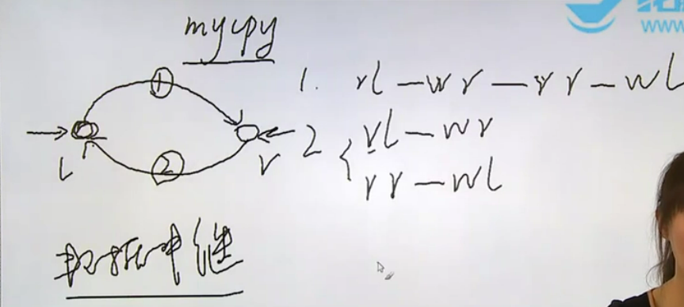
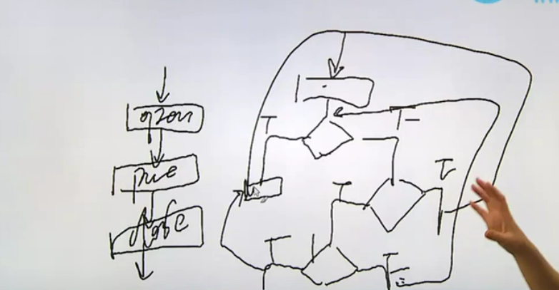
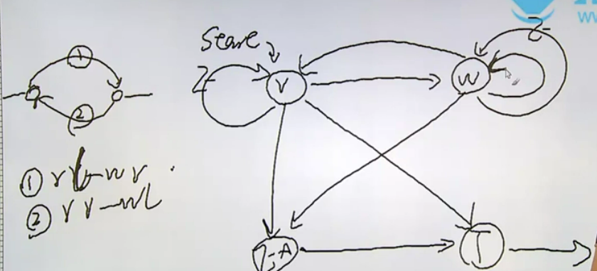
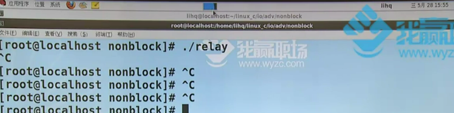
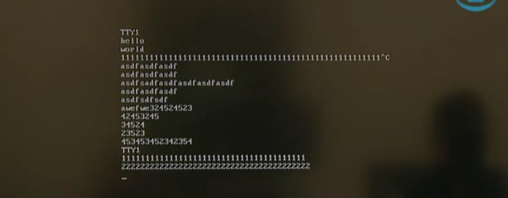

# 数据中继原理解析

在IO层面按照一开始整理的思路来讲包括标准IO、系统调用IO、文件系统、并发，有了这些内容之后就可以回过头去再看IO，IO是所有实现的基础

高级IO：非阻塞IO——阻塞IO

阻塞IO意味必须把某个任务完成，读不完内容就不结束，非阻塞IO意味着做任务都是尝试着去做，如果不能做的话就返回

open函数的man手册中会有一些ERRORS，ERRORS就是当前可能会发生错误的情况，也就是在设置errno之后代表的是哪些出错情况

>ERRORS
>
>> EINTR  
>> While  blocked  waiting to complete an open of a slow device (e.g., a FIFO; see fifo(7)), the call was interrupted by a signal handler; see signal(7).
>>
>> EAGAIN 
>> The file descriptor fd refers to a file other than a socket and has been marked nonblocking (O_NONBLOCK), and  the read would block.  See open(2) for further details on the O_NONBLOCK flag.
>
>1. EINTR指的是当前如果在操作一个比较慢的设备的话，那么这个操作会被信号打断
>2. EAGAIN指的是当前操作如果是非阻塞的方式，那么就有可能发生EAGAIN假错

1. 除了阻塞情况下会有一个假错，假错不是因为操作失败而是因为当前的操动作非常慢，是一个阻塞的系统调用，总做不完要完成的那个任务，这时有信号过来就会打断一个正在阻塞的系统调用
2. 比如说读打印机，如果用阻塞的方式去读的话，那么就意味着读打印机必须读到内容为止；用非阻塞的方式的话读打印机，一读，有内容拿回来，没内容也回来，但是这个回来会被当做一个出错的返回，如果查看errno的话，这个errno值会是EAGAIN。也就是说这不是真正意义上的出错，是因为做这件事情尝试去做了，但是没有成功，只是因为现在没有数据而不是当前read函数的问题

高级IO这一部分主要是来研究非阻塞IO，在讲非阻塞IO的时候会介绍一种编程思路：有限状态机

1. 非阻塞IO
2. IO多路转接
3. 其他读写函数
4. 储存映射IO
5. 文件锁

假设有两个正常打开的设备，现在要用这两个设备进行数据交换(数据中继)：把左边设备L的数据拿到右边的设备R去，数据可能在右边的设备进行加工，再把右边的数据拿回到左边的设备中区去，有以下几种方式

1. 从任务的角度讨论，读L写R，然后读R写L，这样转一圈相当于四个工作，假设用阻塞的形式实现的话就会出现一些问题，比如读左边设备的数据，但是一直没有数据出现，那么就一定会阻塞在读L这样的动作上，这时如果有信号来打断的话，一判断是加假错，然后继续读，但是右边的设备不断地会有数据到来，其实如果先读R写L，再读L写R的话这个循环就能正常执行，结果一直在读L，L一直没数据，那就没办法读R写L。对于刚才的这一套流程是只针对一个线程或者进程而言的，总而言之没有协同操作，只是一个人在完成
2. 分为两个线程或进程，一个用来读L并且写R，一个用来读R并且写L，那么哪一端有数据那么哪一端就可以先执行，用第二种方式还可以勉强去考虑使用
3. 如果换成非阻塞方式只用一个线程或进程也能实现这个读写操作：企图读L，没数据，那么就换R去读，如果R没数据再去读L，再没数据就又去读R，左右横跳以此类推



# 有限状态机编程原理

有限状态机这种编程思想可以用来解决复杂流程的问题

简单流程：如果一个程序的自然流程是结构化的，那么就是简单流程

复杂流程：如果一个程序的自然流程不是结构化的，那么就是复杂流程，比如执行某一个语句体，然后有个条件判断，如果为真则执行xx，如果为假则继续进行判断，再为真的话则仍然继续判断，如果为真则返回去执行第一步的真操作，如果为假的话......即用简单的顺序选择循环不能够完全把这个流程描述出来，可能会用到一个跳转goto.....这个流程是非结构化的，复杂流程很常见，比如网络协议，网络协议通常不是简单流程，比如之前提到过一个概念：口令的随机校验，在登录账号，输入密码，第一次输入正确然后报错输入错误请重新输入，它不会给你报"请再次输入"，第二次再输入成功，也就是只有连续两次输入同一个口令才会让用户正常登陆，这个两步口令校验是为了防止脚本攻击。就这么一个小的功能模块的流程图也不会是结构化的，因为跟人打交道这件事本身就不容易

自然流程：作为人类而言解决问题最直接最直观的思路，比如说大象装冰箱分几步？第一步把冰箱门打开，第二步把大象放进去，第三步把冰箱门关上



* 用有限状态机来实现之前两个设备数据交换的功能

```c
#define TTY1 "/dev/tty8"
#define TTY2 "/dev/tty9"
```

* 1-2：设置两个设备 

```c
int main()
{
    int fd1, fd2;

    fd1 = open(TTY1, O_RDWR);
    if (fd1 < 0)
    {
        perror("open()");
        exit(1);
    }
    write(fd1, "TTY1\n", 5);

    fd2 = open(TTY2, O_RDWR | O_NONBLOCK);
    if (fd2 < 0)
    {
        perror("open()");
        exit(1);
    }
    write(fd2, "TTY2\n", 5);

    relay(fd1, fd2);

    close(fd2);
    close(fd1);

    exit(0);
}

static void relay(int fd1, int fd2)
{
    
}
```

* main函数主要用来打开文件调用数据中继的函数，然后用有限状态机的方式来进行编程
* 5：当前使用非阻塞IO方式来实现程序，但是即便使用非阻塞IO，也不能够确定用户一定是用非阻塞方式打开文件的，main函数是用来模拟用户的操作的，所以应该在main函数之外进行所有工作之前要保证是以非阻塞方式进行操作的，这时就可以用到`fcontrol`函数，这个函数针对文件描述符的属性、状态的改变进行了封装操作，我们假设用户在打开文件fd1时忘记了以非阻塞方式打开文件，即以O_RDWR方式打开
* 13：第二个用户使用了非阻塞方式打开文件fd2，所以是以O_NONBLOCK方式打开
* 21：调用数据中继函数

把前一节画的数据交换图用有限状态机的形式表示：

①的任务是读L写R，②的任务是读R写L，这两个过程是一样的，所以只拿出其中一个进行分析：首先不管初始的思路是什么，一定会有一个start的状态，这个start状态一定是读态，如果读取失败了，如果是真错那么就报错，把报错这个环节称为EX态(异常处理态)，报完错之后进程结束进入terminate进程终止态；如果读取是假错，即在非阻塞情况下读文件，但是文件中并没有数据造成的错误，那么就重新进入读态，即如果是ERRAGAIN的话就继续进入读态；如果发现读取是最后一次读了，那么读完之后就进入结束状态；如果读取能成功的话就进入写态，如果写成功了就进入读态，写操作可能会出错，如果是真错那么进入EX态，如果是假错则重新进入写态，还有一种情况是，比如说当前的写没有失败，但是读到了10个字节，写另外的一个设备只写了3个字节，那剩余的7个字节要坚持写够，所以在这个情况下还要继续进入写态。写操作不能作为主导，写操作不会导致程序正常终止，也就是说不能从写态连接到终止态度



甲方改需求只不过是在这张图的某个地方添加一个圈，并且分析这个圈和其他圈的连线是什么，并且在程序中只需要把这些圈作为点，然后从每个点出发，把从每个点出发的线用代码表示好就可以了

```c
static void relay(int fd1, int fd2)
{
    int fd1_save, fd2_save;

    fd1_save = fcntl(fd1, F_GETFL);
    fcntl(fd1, F_SETFL, fd1_save | O_NONBLOCK);

    fd2_save = fcntl(fd2, F_GETFL);
    fcntl(fd2, F_SETFL, fd2_save | O_NONBLOCK);

}
```

* 6-7、9-10：F_GETFL意为获取文件fd1的文件状态，文件状态是一个32位的整型数；使用F_SETFL选项对fd1进行文件状态的设置，设置的内容是fd1_save，即原有的属性或者是O_NONBLOCK状态，如果文件本身就有O_NONBLOCK状态的话，那只不过上在位图上重复置1，如果先前没有指定O_NONBLOCK，那么现在的文件状态就是非阻塞的了。也就是说在状态机的状态转移之前需要将两个文件以非阻塞方式打开

现在该来建立数据结构了，即封装状态机的数据结构

```c
struct fsm_st
{
    int state;
    int sfd;
    int dfd;
    char buf[BUFSIZE];
    int len;
    int pos;
    char *errstr;
};

enum
{
    STATE_R = 1, // read
    STATE_W,     // write
    STATE_EX,    // error
    STATE_T      // over
};
```

* 3：当前状态机的状态，即图中的每一个圈圈，状态用enum结构体中的属性指代
* 4-5：两个文件的文件描述符
* 6：因为任务是读L写R，或者是读R写L，读完之后要暂时把数据放在一个缓冲区，然后写入的时候再从这个缓冲区里取数据

```c
static void relay(int fd1, int fd2)
{
    int fd1_save, fd2_save;
    struct fsm_st fsm12, fsm21;

    fd1_save = fcntl(fd1, F_GETFL);
    fcntl(fd1, F_SETFL, fd1_save | O_NONBLOCK);

    fd2_save = fcntl(fd2, F_GETFL);
    fcntl(fd2, F_SETFL, fd2_save | O_NONBLOCK);

    fsm12.state = STATE_R;
    fsm12.sfd = fd1;
    fsm12.dfd = fd2;

    fsm21.state = STATE_R;
    fsm21.sfd = fd2;
    fsm21.dfd = fd1;

    while (fsm12.state != STATE_T || fsm21.state != STATE_T)
    {
        fsm_driver(&fsm12);
        fsm_driver(&fsm21);
    }

    fcntl(fd1, F_SETFL, fd1_save);
    fcntl(fd2, F_SETFL, fd2_save);
}
```

* 4：fsm12代表读L写R时的状态机，fsm21代表读R写L时的状态机
* 12-14、16-18：初始化状态机，用到的文件描述符fd1和fd2其实一个是由阻塞方式打开，一个是由非阻塞方式打开，所以需要在用户调用完函数之后，即做完数据中继之后把文件描述符的状态复原，我们之前一直在强调要把我们实现的函数作为一个大工程里的小模块，函数里的实现不能影响外部模块，所以需要确保在进入模块和离开模块时整体状态是一致的
* 26-27：把文件描述符的状态恢复，所以一开始的时候设置了fd1_save和fd1_save两个参数
* 20-24：当状态机12的状态不是终止态或者状态机21的状态不是终止态的话那就调用函数fsm_driver执行状态机的状态转移

```c
static void fsm_driver(struct fsm_st *fsm)
{
    int ret;

    switch (fsm->state)
    {
    case STATE_R:
        fsm->len = read(fsm->sfd, fsm->buf, BUFSIZE);
        if (fsm->len == 0)
            fsm->state = STATE_T;
        else if (fsm->len < 0)
        {
            if (errno == EAGAIN)
                fsm->state = STATE_R;
            else
            {
                fsm->errstr = "read()";
                fsm->state = STATE_EX;
            }
        }
        else
        {
            fsm->pos = 0;
            fsm->state = STATE_W;
        }
        break;
    case STATE_W:
        ret = write(fsm->dfd, fsm->buf + fsm->pos, fsm->len);
        if (ret < 0)
        {
            if (errno == EAGAIN)
                fsm->state = STATE_W;
            else
            {
                fsm->errstr = "write()";
                fsm->state = STATE_EX;
            }
        }
        else
        {
            fsm->pos += ret;
            fsm->len -= ret;
            if (fsm->len == 0)
                fsm->state = STATE_R;
            else
                fsm->state = STATE_W;
        }
        break;
    case STATE_EX:
        perror(fsm->errstr);
        fsm->state = STATE_T;
        break;
    case STATE_T:
        break;
    default:
        abort();
        break;
    }
}
```

* 7-26：如果当前状态是读态的话就调用read函数进行文件读操作；len为实际读取的字节数，等于0则表示正常结束，那么当前状态机的状态就转移成终止态，如果len的值小于0，即表示读取失败，错分真错加措，所以如果是加错的话那么状态机的状态就应该回到读态，如果是真错，那么状态机的状态就应该转移至终止态度，如果读取成功，则状态机的状态就需转移到写态
* 27-48：逻辑和读操作类似，在写态一共有四条线，` if (ret < 0)`体中包括了真错和假错两条线，还有一条是没有写够len个字节进行的重返写态写够len个字节，还有一条是写够了len个字节然后转移到读态，`fsm->buf + fsm->pos`的意思是假如要写len个字节，可是实际上只写入了ret个字节，那么下一次就应该从buf+3的位置开始写len-ret个字节
* 49-52：真错态，只有一条链接到终止态的线，因为有读错也有写错，所以用fsm->errstr字段记录当前出错原因

完整代码

```c
// relay.c

#include <stdio.h>
#include <stdlib.h>
#include <unistd.h>
#include <sys/types.h>
#include <sys/stat.h>
#include <fcntl.h>
#include <errno.h>

#define TTY1 "/dev/tty8"
#define TTY2 "/dev/tty9"
#define BUFSIZE 1024

enum
{
    STATE_R = 1, // read
    STATE_W,     // write
    STATE_EX,    // error
    STATE_T      // over
};

struct fsm_st
{
    int state;
    int sfd;
    int dfd;
    char buf[BUFSIZE];
    int len;
    int pos;
    char *errstr;
};

static void fsm_driver(struct fsm_st *fsm)
{
    int ret;

    switch (fsm->state)
    {
        case STATE_R:
            fsm->len = read(fsm->sfd, fsm->buf, BUFSIZE);
            if (fsm->len == 0)
                fsm->state = STATE_T;
            else if (fsm->len < 0)
            {
                if (errno == EAGAIN)
                    fsm->state = STATE_R;
                else
                {
                    fsm->errstr = "read()";
                    fsm->state = STATE_EX;
                }
            }
            else
            {
                fsm->pos = 0;
                fsm->state = STATE_W;
            }
            break;
        case STATE_W:
            ret = write(fsm->dfd, fsm->buf + fsm->pos, fsm->len);
            if (ret < 0)
            {
                if (errno == EAGAIN)
                    fsm->state = STATE_W;
                else
                {
                    fsm->errstr = "write()";
                    fsm->state = STATE_EX;
                }
            }
            else
            {
                fsm->pos += ret;
                fsm->len -= ret;
                if (fsm->len == 0)
                    fsm->state = STATE_R;
                else
                    fsm->state = STATE_W;
            }
            break;
        case STATE_EX:
            perror(fsm->errstr);
            fsm->state = STATE_T;
            break;
        case STATE_T:
            break;
        default:
            abort();
            break;
    }
}

static void relay(int fd1, int fd2)
{
    int fd1_save, fd2_save;
    struct fsm_st fsm12, fsm21;

    fd1_save = fcntl(fd1, F_GETFL);
    fcntl(fd1, F_SETFL, fd1_save | O_NONBLOCK);

    fd2_save = fcntl(fd2, F_GETFL);
    fcntl(fd2, F_SETFL, fd2_save | O_NONBLOCK);

    fsm12.state = STATE_R;
    fsm12.sfd = fd1;
    fsm12.dfd = fd2;

    fsm21.state = STATE_R;
    fsm21.sfd = fd2;
    fsm21.dfd = fd1;

    while (fsm12.state != STATE_T || fsm21.state != STATE_T)
    {
        fsm_driver(&fsm12);
        fsm_driver(&fsm21);
    }

    fcntl(fd1, F_SETFL, fd1_save);
    fcntl(fd2, F_SETFL, fd2_save);
}

int main()
{
    int fd1, fd2;

    fd1 = open(TTY1, O_RDWR);
    if (fd1 < 0)
    {
        perror("open()");
        exit(1);
    }
    write(fd1, "TTY1\n", 5);

    fd2 = open(TTY2, O_RDWR | O_NONBLOCK);
    if (fd2 < 0)
    {
        perror("open()");
        exit(1);
    }
    write(fd2, "TTY2\n", 5);

    relay(fd1, fd2);

    close(fd2);
    close(fd1);

    exit(0);
}
```


因为111111这一行最后输入了ctrl+c，表示该行没有被输入到缓冲区中，也就没有被fd2获取，所以在终端显示TTY2信息的时候没有改行数据出现



因为当前程序处于盲等状态，忙在假错(看一下没内容——>看一下没内容)*N，对应到状态机图上表现为一直读状态上转圈

# 中继引擎实例实现

把刚才的程序改造成一个中继引擎

可以把之前的两个设备互传数据的模型称为job，fd1、fd2、fsm21和fsm12就能用来描述一个job，现在要来实现一个服务的话也就是说能同时支持多少个这样的job的存在，比如同时支持1w个job，对应的文件描述符fd的个数为2w个，如果用数组来进行存储的话，那么数组空间为1w个，则可以把当前产生的job存入数组中。现在有两种思路给用户提供job，第一种给用户结构体的起始位置，第二种是给用户存放结构体的数组下标，每次有一对任务产生，就有一个job结构体产生，上限为1w，也即最多能打开2w个有效文件

我们在下面的实现代码中需要确保不同job中的文件互不干扰，并且为了方便测试只在main函数中测试两个job

```c
// relayer.h

#ifndef RELAYER_H__
#define RELAYER_H__

#include <stdint.h>

#define REL_JOBMAX 10000

struct rel_stat_st
{
    int state;
    int fd1;
    int fd2;
    int64_t count12, count21; // 1向2发送了多少字节，2向1发送了多少字节
};

int rel_addjob(int fd1, int fd2);
/*
    return >= 0			成功，返回当前任务ID
           == -EINVAL	失败，参数非法
           == -ENOSPC   失败，任务数组满
           == -ENOMEM   失败，内存分配有误
*/

int rel_canceljob(int id);
/*
    return == 0			成功，指定任务成功取消
           == -EINVAL	失败，参数非法
           == -EBUSY    失败，任务早已被取消
*/

int rel_waitjob(int id, struct rel_stat_st *);
/*
    return == 0			成功，指定任务已终止并返回状态
           == -EINVAL	失败，参数非法

*/

int rel_statjob(int id, struct rel_stat_st *);
/*

    return == 0			成功，指定任务状态返回
           == -EINVAL	失败，参数非法

*/
#endif


enum
{
    STATE_RUNNING = 1,
    STATE_CANCELED,
    STATE_OVER
}
```

* 18：给存放job的数组添加job，返回数组下标，即当前任务的ID
* 26：反悔机制，即取消任务
* 33、10-16、50-55：回收资源机制，设置任务状态rel_stat_st结构体，以便查看job的状态，job有三种状态，分别是STATE_RUNNING、STATE_CANCELED、STATE_OVER
* 40：获取当前任务的状态回填至rel_stat_st类型的变量

```c
// main.c


#include <stdio.h>
#include <stdlib.h>
#include <unistd.h>
#include <fcntl.h>
#include <errno.h>
#include <string.h>
#include "relayer.h"

//两个设备为一对互传数据
#define TTY1 "/dev/tty12"
#define TTY2 "/dev/tty10"

#define TTY3 "/dev/tty9"
#define TTY4 "/dev/tty8"

int main(int argc, char **argv)
{
    int fd1, fd2, fd3, fd4;
    int job1, job2;
    fd1 = open(TTY1, O_RDWR); //先以阻塞打开（故意先阻塞形式）
    if (fd1 < 0)
    {
        perror("open()");
        exit(1);
    }
    write(fd1, "TTY1\n", 5);
    fd2 = open(TTY2, O_RDWR | O_NONBLOCK); //非阻塞
    if (fd2 < 0)
    {
        perror("open()");
        exit(1);
    }
    write(fd2, "TTY2\n", 5);

    job1 = rel_addjob(fd1, fd2); //添加一对终端互传数据
    if (job1 < 0)
    {
        fprintf(stderr, "rel_addjob():%s\n", strerror(-job1));
        exit(1);
    }

    fd3 = open(TTY3, O_RDWR); //先以阻塞打开（故意先阻塞形式）
    if (fd3 < 0)
    {
        perror("open()");
        exit(1);
    }
    write(fd3, "TTY3\n", 5);
    fd4 = open(TTY4, O_RDWR | O_NONBLOCK); //非阻塞
    if (fd4 < 0)
    {
        perror("open()");
        exit(1);
    }
    write(fd4, "TTY4\n", 5);

    job2 = rel_addjob(fd3, fd4); //添加一对终端互传数据
    if (job2 < 0)
    {
        fprintf(stderr, "rel_addjob():%s\n", strerror(-job2));
        exit(1);
    }

    while (1)
        pause();

    close(fd4);
    close(fd3);
    close(fd2);
    close(fd1);

    exit(0);
}
```

main函数不再需要定义状态机的结构体和状态机定义和操作，只需要调用方法，方法在relayer.c中定义

* 38、60：添加一对终端互传数据
* 67-68：不能让程序结束才能让任务持续执行

```c
//状态机
struct rel_fsm_st
{
    int state;         //记录状态
    int sfd;           //源文件
    int dfd;           //目的文件
    char buf[BUFSIZE]; //中间缓冲区
    int len;           //读到的长度
    int pos;           //写的过程如果一次没有写完，记录上次写的位置
    char *err;         //错误信息
    int64_t count;     //输出字符数量
};

//每一对终端结构体
struct rel_job_st
{
    //两个终端
    int fd1;
    int fd2;
    //该对终端状态STATE_RUNNING，STATE_CANCELED, STATE_OVER
    int job_state;
    //两个终端的状态机结构体
    struct rel_fsm_st fsm12, fsm21;
    //用来退出复原状态
    int fd1_save, fd2_save;
};

```

* 15：之前的rel_stat_st结构体是给用户看的，这里的rel_job_st是真正进行操作处理job的结构体，相当于rel_stat_st是部分的封装与隐藏

```c
#define REL_JOBMAX 10000

static struct rel_job_st *rel_job[REL_JOBMAX];
static pthread_mutex_t mut_rel_job = PTHREAD_MUTEX_INITIALIZER;
static pthread_once_t init_once = PTHREAD_ONCE_INIT;

int rel_addjob(int fd1, int fd2)
{
    struct rel_job_st *me;
    int pos;

    pthread_once(&init_once, module_load);
    me = malloc(sizeof(*me));
    if (me == NULL) //空间问题
        return -ENOMEM;
    me->fd1 = fd1;
    me->fd2 = fd2;
    me->job_state = STATE_RUNNING; //该对终端设置正在运行

    me->fd1_save = fcntl(me->fd1, F_GETFL);
    fcntl(me->fd1, F_SETFL, me->fd1_save | O_NONBLOCK); //非阻塞	打开

    me->fd2_save = fcntl(me->fd2, F_GETFL);
    fcntl(me->fd2, F_SETFL, me->fd2_save | O_NONBLOCK); //非阻塞	打开

    me->fsm12.sfd = me->fd1;
    me->fsm12.dfd = me->fd2;
    me->fsm12.state = STATE_R;

    me->fsm21.sfd = me->fd2;
    me->fsm21.dfd = me->fd1;
    me->fsm21.state = STATE_R;

    pthread_mutex_lock(&mut_rel_job);
    pos = get_free_pos_unlocked();
    if (pos < 0)
    {
        pthread_mutex_unlock(&mut_rel_job);
        fcntl(me->fd1, F_SETFL, me->fd1_save);
        fcntl(me->fd2, F_SETFL, me->fd2_save);
        free(me);
        return -ENOSPC;
    }
    rel_job[pos] = me;
    pthread_mutex_unlock(&mut_rel_job);
    return pos;
}

static void module_load(void)
{
    int err;
    pthread_t tid_relayer;
    err = pthread_create(&tid_relayer, NULL, thr_relayer, NULL);
    if (err)
    {
        fprintf(stderr, "pthread_create():%s\n", strerror(err));
        exit(1);
    }
}

static void *thr_relayer(void *p)
{
    int i;
    while (1)
    {
        pthread_mutex_lock(&mut_rel_job);
        for (i = 0; i < REL_JOBMAX; i++)
        {
            if (rel_job[i] != NULL)
            {
                if (rel_job[i]->job_state == STATE_RUNNING)
                {
                    fsm_driver(&rel_job[i]->fsm12);
                    fsm_driver(&rel_job[i]->fsm21);
                    if (rel_job[i]->fsm12.state == STATE_T && rel_job[i]->fsm21.state == STATE_T)
                        rel_job[i]->job_state = STATE_OVER;
                }
            }
        }
        pthread_mutex_unlock(&mut_rel_job);
    }
}

//状态转移函数
static void fsm_driver(struct rel_fsm_st *fsm)
{
    ......
}
```

* 1：定义job数组最多能承载的job数
* 21、24：确保一个job里的文件都是以非阻塞的形式打开的
* 34、35、45：在数组中找空位，如果涉及到对数组的操作的话就需要把数组作为独占资源，这时就需要用到锁了
* 12：运行一个线程module_load去专门执行状态机的状态转移操作，并且只能初始化一次，即动态模块的单次初始化，所以需要使用pthread_once函数
* 61、71：thr_relayer函数的作用是找到当前非空的job，推动其中的两个状态机运行，并且保证当前job的状态是RUNNING，如果是CANCELED或者是ERROR则不转移状态

完整代码

```c
// relayer.c

#include <stdio.h>
#include <stdlib.h>
#include <errno.h>
#include <pthread.h>
#include <unistd.h>
#include <string.h>
#include <fcntl.h>
#include "relayer.h"

#define BUFSIZE 1024

static struct rel_job_st *rel_job[REL_JOBMAX];
static pthread_mutex_t mut_rel_job = PTHREAD_MUTEX_INITIALIZER;
static pthread_once_t init_once = PTHREAD_ONCE_INIT;

enum
{
    //几种状态
    STATE_R,
    STATE_W,
    STATE_EX,
    STATE_T
};

enum
{
    STATE_RUNNING = 1,
    STATE_CANCELED,
    STATE_OVER
};

//状态机
struct rel_fsm_st
{
    int state;         //记录状态
    int sfd;           //源文件
    int dfd;           //目的文件
    char buf[BUFSIZE]; //中间缓冲区
    int len;           //读到的长度
    int pos;           //写的过程如果一次没有写完，记录上次写的位置
    char *err;         //错误信息
    int64_t count;     //输出字符数量
};

//每一对终端结构体
struct rel_job_st
{
    //两个终端
    int fd1;
    int fd2;
    //该对终端状态STATE_RUNNING，STATE_CANCELED, STATE_OVER
    int job_state;
    //两个终端的状态机结构体
    struct rel_fsm_st fsm12, fsm21;
    //用来退出复原状态
    int fd1_save, fd2_save;
};

//状态转移函数
static void fsm_driver(struct rel_fsm_st *fsm)
{
    int ret;
    switch (fsm->state)
    {
    case STATE_R:
        fsm->len = read(fsm->sfd, fsm->buf, BUFSIZE);
        if (fsm->len == 0)
            fsm->state = STATE_T;
        else if (fsm->len < 0)
        {
            if (errno == EAGAIN)
                fsm->state = STATE_R;
            else
            {
                fsm->err = "read()";
                fsm->state = STATE_EX;
            }
        }
        else
        {
            fsm->pos = 0;
            fsm->state = STATE_W;
        }

        break;
    case STATE_W:
        ret = write(fsm->dfd, fsm->buf + fsm->pos, fsm->len);
        if (ret < 0)
        {
            if (errno == EAGAIN)
                fsm->state = STATE_W;
            else
            {
                fsm->err = "write()";
                fsm->state = STATE_EX;
            }
        }
        else
        {
            fsm->pos += ret;
            fsm->len -= ret;
            if (fsm->len == 0)
                fsm->state = STATE_R; //写完了再去读
            else
                fsm->state = STATE_W; //没写完继续写
        }
        break;
    case STATE_EX:
        perror(fsm->err);
        fsm->state = STATE_T;
        break;
    case STATE_T:
        /*  do smoething*/
        break;
    default:
        abort();
        break;
    }
}

static void *thr_relayer(void *p)
{
    int i;
    while (1)
    {
        pthread_mutex_lock(&mut_rel_job);
        for (i = 0; i < REL_JOBMAX; i++)
        {
            if (rel_job[i] != NULL)
            {
                if (rel_job[i]->job_state == STATE_RUNNING)
                {
                    fsm_driver(&rel_job[i]->fsm12);
                    fsm_driver(&rel_job[i]->fsm21);
                    if (rel_job[i]->fsm12.state == STATE_T && rel_job[i]->fsm21.state == STATE_T)
                        rel_job[i]->job_state = STATE_OVER;
                }
            }
        }
        pthread_mutex_unlock(&mut_rel_job);
    }
}

static void module_load(void)
{
    int err;
    pthread_t tid_relayer;
    err = pthread_create(&tid_relayer, NULL, thr_relayer, NULL);
    if (err)
    {
        fprintf(stderr, "pthread_create():%s\n", strerror(err));
        exit(1);
    }
}

static int get_free_pos_unlocked()
{
    int i;
    for (i = 0; i < REL_JOBMAX; i++)
    {
        if (rel_job[i] == NULL)
            return i;
    }
    return -1;
}

int rel_addjob(int fd1, int fd2)
{
    struct rel_job_st *me;
    int pos;

    pthread_once(&init_once, module_load);
    me = malloc(sizeof(*me));
    if (me == NULL) //空间问题
        return -ENOMEM;
    me->fd1 = fd1;
    me->fd2 = fd2;
    me->job_state = STATE_RUNNING; //该对终端设置正在运行

    me->fd1_save = fcntl(me->fd1, F_GETFL);
    fcntl(me->fd1, F_SETFL, me->fd1_save | O_NONBLOCK); //非阻塞	打开

    me->fd2_save = fcntl(me->fd2, F_GETFL);
    fcntl(me->fd2, F_SETFL, me->fd2_save | O_NONBLOCK); //非阻塞	打开

    me->fsm12.sfd = me->fd1;
    me->fsm12.dfd = me->fd2;
    me->fsm12.state = STATE_R;

    me->fsm21.sfd = me->fd2;
    me->fsm21.dfd = me->fd1;
    me->fsm21.state = STATE_R;

    pthread_mutex_lock(&mut_rel_job);
    pos = get_free_pos_unlocked();
    if (pos < 0)
    {
        pthread_mutex_unlock(&mut_rel_job);
        fcntl(me->fd1, F_SETFL, me->fd1_save);
        fcntl(me->fd2, F_SETFL, me->fd2_save);
        free(me);
        return -ENOSPC;
    }
    rel_job[pos] = me;
    pthread_mutex_unlock(&mut_rel_job);
    return pos;
}

int rel_canceljob(int id);
/*
    return == 0			成功，指定任务成功取消
           == -EINVAL	失败，参数非法
           == -EBUSY    失败，任务早已被取消
*/

int rel_waitjob(int id, struct rel_stat_st *);

int rel_statjob(int id, struct rel_stat_st *);
```

```c
// relayer.h

#ifndef RELAYER_H__
#define RELAYER_H__

#include <stdint.h>

#define REL_JOBMAX 10000

struct rel_stat_st
{
    int state;
    int fd1;
    int fd2;
    int64_t count12, count21; // 1向2发送了多少字节，2向1发送了多少字节
};

int rel_addjob(int fd1, int fd2);
/*
    return >= 0			成功，返回当前任务ID
           == -EINVAL	失败，参数非法
           == -ENOSPC   失败，任务数组满
           == -ENOMEM   失败，内存分配有误
*/

int rel_canceljob(int id);
/*
    return == 0			成功，指定任务成功取消
           == -EINVAL	失败，参数非法
           == -EBUSY    失败，任务早已被取消
*/

int rel_waitjob(int id, struct rel_stat_st *);
/*
    return == 0			成功，指定任务已终止并返回状态
           == -EINVAL	失败，参数非法

*/

int rel_statjob(int id, struct rel_stat_st *);
/*

    return == 0			成功，指定任务状态返回
           == -EINVAL	失败，参数非法

*/
#endif
```

```c
// main.c

#include <stdio.h>
#include <stdlib.h>
#include <unistd.h>
#include <fcntl.h>
#include <errno.h>
#include <string.h>
#include "relayer.h"

//两个设备为一对互传数据
#define TTY1 "/dev/tty12"
#define TTY2 "/dev/tty10"

#define TTY3 "/dev/tty9"
#define TTY4 "/dev/tty8"

int main(int argc, char **argv)
{
    int fd1, fd2, fd3, fd4;
    int job1, job2;
    fd1 = open(TTY1, O_RDWR); //先以阻塞打开（故意先阻塞形式）
    if (fd1 < 0)
    {
        perror("open()");
        exit(1);
    }
    write(fd1, "TTY1\n", 5);
    fd2 = open(TTY2, O_RDWR | O_NONBLOCK); //非阻塞
    if (fd2 < 0)
    {
        perror("open()");
        exit(1);
    }
    write(fd2, "TTY2\n", 5);

    job1 = rel_addjob(fd1, fd2); //添加一对终端互传数据
    if (job1 < 0)
    {
        fprintf(stderr, "rel_addjob():%s\n", strerror(-job1));
        exit(1);
    }

    fd3 = open(TTY3, O_RDWR); //先以阻塞打开（故意先阻塞形式）
    if (fd3 < 0)
    {
        perror("open()");
        exit(1);
    }
    write(fd3, "TTY3\n", 5);
    fd4 = open(TTY4, O_RDWR | O_NONBLOCK); //非阻塞
    if (fd4 < 0)
    {
        perror("open()");
        exit(1);
    }
    write(fd4, "TTY4\n", 5);

    job2 = rel_addjob(fd3, fd4); //添加一对终端互传数据
    if (job2 < 0)
    {
        fprintf(stderr, "rel_addjob():%s\n", strerror(-job2));
        exit(1);
    }

    while (1)
        pause();

    close(fd4);
    close(fd3);
    close(fd2);
    close(fd1);

    exit(0);
}
```




# 高级IO-select 

在运行之前的relayer程序的时候一定是出于盲等的状态，CPU一下子就被占满了，之前的程序应该说大部分时间都在处理ERRAGAIN，比如说状态机初始化是一个读态，只要没有内容的话数据就没有办法读，那么read返回的就是一个假错，继续把状态机推动到读态，我们不断地在一个while循环中碰到一个假错就推动到读态，以此类推周而复始

对于IO密集型任务可以对其进行IO多路转接，IO多路转接的作用说白了就是监视文件描述符的行为，当当前文件描述符发生了用户感兴趣的行为之后才去做后续操作。比如两个设备做数据交换，我们之前都是一直在探测文件有无数据可读或者可写，如果用上IO多路转接的话就，布置一个监视任务，让程序知道什么是用户感兴趣的任务，比如说告诉程序当线程处于读态的时候在某个文件描述符上数据的话就把读态转变成写态

IO多路转接有三个方式：

1. select
2. poll
3. epoll

这三个函数都能做到IO多路转接，简而言之就是实现对文件的监视，区别在于select的移植性非常好，但是本身设计有缺陷；select函数和poll函数用来监视文件描述符的行为的组织思路是完全不一样的，select是以事件为单位组织文件描述符，而poll是以文件描述符为单位组织事件；因为poll函数的IO效率还是不够高，所以各个平台都在poll函数的基础上实现了自家的方言，而epoll就是linux平台上基于poll做的一个方言来完成文件描述符的监视，poll是用户自己来维护一些内容，而epoll企图简化用户所维护的内容，所以说epoll是不能够移植的，select和poll是可以移植的

>NAME
>
>> select, pselect, FD_CLR, FD_ISSET, FD_SET, FD_ZERO - synchronous I/O multiplexing
>
>SYNOPSIS
>
>> /* According to POSIX.1-2001, POSIX.1-2008 */
>> #include <sys/select.h>
>>
>> /* According to earlier standards */
>> #include <sys/time.h>
>> #include <sys/types.h>
>> #include <unistd.h>
>>
>> int select(int nfds, fd_set *readfds, fd_set *writefds, fd_set *exceptfds, struct timeval *timeout);
>
>1. select：fd_set表示文件描述符的集合，我们之前学过sigset_t，这代表信号集；第一个参数nfds表示select函数所监视的文件描述符中最大值再+1，比如当前监视的所有文件描述符中最大的值为3579，那么nfds的值就为3580；第二个参数是一个读文件的文件描述符集合，即用户所关心的可能发生读操作的文件都放在readfds集合中；第三个参数是所关心的可能发生写操作的文件的集合；第四个参数是可能发生异常的文件描述符集合，前面三个集合中如果其中的任意一个集合中的文件发生了对应的事件，比如读集中有一个文件可读了，那么select函数就会返回；最后一个参数表示超时设置，如果没有超时设置就会发生死等直到用户感兴趣的事件发生
>2. select函数会返回三个集合中发生了对应感兴趣行为的文件描述符个数，如果在超时时间内没有发生只扫一个感兴趣的行为的话就会返回假错
>3. 当执行了一次select函数之后，这三个文件描述符的集合就会被替换成存放结果的文件集合，而不是原来的文件集合了，也就是说如果执行一次select操作后返回的值不大于0，也就是说没有文件执行感兴趣的行为，则执行select函数之后，这三个集合都会被置NULL，并且可以看到这三个集合没有被const修饰，也就是说会发生改变

1. 以下四个操作函数都是关于fd_set的

```c
// 从指定集合中删除文件描述符fd
void FD_CLR(int fd, fd_set *set);
// 判断集合中是否存在文件描述符fd
int  FD_ISSET(int fd, fd_set *set);
// 把文件描述符fd放入集合中
void FD_SET(int fd, fd_set *set);
// 清空一个文件描述符集合
void FD_ZERO(fd_set *set);
```


使用select函数重构relay程序，之前的程序处于盲等状态是因为下面的while循环代码块

```c
while (fsm12.state != STATE_T || fsm21.state != STATE_T)
{
    fsm_driver(&fsm12);
    fsm_driver(&fsm21);
}
```

如果使用select函数的话就不能盲目地进行状态的变化，直到发生了感兴趣的行为为止，下面的代码为实现代码框架

```c
while (fsm12.state != STATE_T || fsm21.state != STATE_T)
{
    // 布置监视任务

    // 监视
    select();

    // 查看监视结果
    // 根据监视结果有条件地推动状态机
    if()
    	fsm_driver(&fsm12);
    if() 
        fsm_driver(&fsm21);
}
```

完整代码

```c
#include <stdio.h>
#include <stdlib.h>
#include <unistd.h>
#include <sys/time.h>
#include <sys/types.h>
#include <sys/stat.h>
#include <fcntl.h>
#include <errno.h>

#define TTY1 "/dev/tty8"
#define TTY2 "/dev/tty9"
#define BUFSIZE 1024

enum
{
    STATE_R = 1, // read
    STATE_W,     // write
    STATE_AUTO,
    STATE_EX, // error
    STATE_T   // over
};

struct fsm_st
{
    int state;
    int sfd;
    int dfd;
    char buf[BUFSIZE];
    int len;
    int pos;
    char *errstr;
};

static void fsm_driver(struct fsm_st *fsm)
{
    int ret;

    switch (fsm->state)
    {
    case STATE_R:
        fsm->len = read(fsm->sfd, fsm->buf, BUFSIZE);
        if (fsm->len == 0)
            fsm->state = STATE_T;
        else if (fsm->len < 0)
        {
            if (errno == EAGAIN)
                fsm->state = STATE_R;
            else
            {
                fsm->errstr = "read()";
                fsm->state = STATE_EX;
            }
        }
        else
        {
            fsm->pos = 0;
            fsm->state = STATE_W;
        }
        break;
    case STATE_W:
        ret = write(fsm->dfd, fsm->buf + fsm->pos, fsm->len);
        if (ret < 0)
        {
            if (errno == EAGAIN)
                fsm->state = STATE_W;
            else
            {
                fsm->errstr = "write()";
                fsm->state = STATE_EX;
            }
        }
        else
        {
            fsm->pos += ret;
            fsm->len -= ret;
            if (fsm->len == 0)
                fsm->state = STATE_R;
            else
                fsm->state = STATE_W;
        }
        break;
    case STATE_EX:
        perror(fsm->errstr);
        fsm->state = STATE_T;
        break;
    case STATE_T:
        break;
    default:
        abort();
        break;
    }
}

static int max(int a, int b)
{
    return a > b ? a : b;
}

static void relay(int fd1, int fd2)
{
    int fd1_save, fd2_save;
    struct fsm_st fsm12, fsm21;
    fd_set rset, wset;

    fd1_save = fcntl(fd1, F_GETFL);
    fcntl(fd1, F_SETFL, fd1_save | O_NONBLOCK);

    fd2_save = fcntl(fd2, F_GETFL);
    fcntl(fd2, F_SETFL, fd2_save | O_NONBLOCK);

    fsm12.state = STATE_R;
    fsm12.sfd = fd1;
    fsm12.dfd = fd2;

    fsm21.state = STATE_R;
    fsm21.sfd = fd2;
    fsm21.dfd = fd1;

    while (fsm12.state != STATE_T || fsm21.state != STATE_T)
    {
        FD_ZERO(&rset);
        FD_ZERO(&wset);

        if (fsm12.state == STATE_R)
            FD_SET(fsm12.sfd, &rset);
        if (fsm12.state == STATE_W)
            FD_SET(fsm12.dfd, &wset);
        if (fsm21.state == STATE_R)
            FD_SET(fsm21.sfd, &rset);
        if (fsm21.state == STATE_W)
            FD_SET(fsm21.dfd, &wset);

        if (fsm12.state < STATE_AUTO || fsm21.state < STATE_AUTO)
        {
            if (select(max(fd1, fd2) + 1, &rset, &wset, NULL, NULL) < 0)
            {
                if (errno == EINTR)
                    continue;
                perror("select()");
                exit(1);
            }
        }

        if (FD_ISSET(fd1, &rset) || FD_ISSET(fd2, &wset) || fsm12.state > STATE_AUTO)
            fsm_driver(&fsm12);
        if (FD_ISSET(fd2, &rset) || FD_ISSET(fd1, &wset) || fsm21.state > STATE_AUTO)
            fsm_driver(&fsm21);
    }

    fcntl(fd1, F_SETFL, fd1_save);
    fcntl(fd2, F_SETFL, fd2_save);
}

int main()
{
    int fd1, fd2;

    fd1 = open(TTY1, O_RDWR);
    if (fd1 < 0)
    {
        perror("open()");
        exit(1);
    }
    write(fd1, "TTY1\n", 5);

    fd2 = open(TTY2, O_RDWR | O_NONBLOCK);
    if (fd2 < 0)
    {
        perror("open()");
        exit(1);
    }
    write(fd2, "TTY2\n", 5);

    relay(fd1, fd2);

    close(fd2);
    close(fd1);

    exit(0);
}
```

* 135-141：第一个参数就是选择最大的那个文件描述符再+1，以及设置读集、写集、异常集、超时时间，如果发生了感兴趣行为的文件描述符个数小于0的话处于假错状态；第135行的判断不能是一个循环判断，按照我们之前的写法，如果select不设置超时时间从而处于阻塞等状态，被一个信号打断就会假错，此时应该通过一个while循环再次进行文件描述符个数的判断，但是这里不行，因为我们之前讲过了select函数会导致三个集合发生改变，不再是一开始的集合了，并且如果select函数返回的符合条件的文件描述符个数为0，那么这三个集合就会被置为NULL，所以无法继续执行下一次循环的select，下一次循环又要重新执行124-131这么多行代码。如果是真错的话就报错退出
* 121-131：监视任务的布置就需要用到之前讲到的4个针对文件描述符集合操作的函数，然后根据当前状态机的状态来确定什么状态时候监视文件描述符的什么行为
* 121-122：把读、写集置为空
* 124、126、128、130：如果当前状态机fsm12的状态是读态，那么就把文件描述符fd1放入读集中；如果状态即fsm12的状态是写态，那么就把文件描述符fd2，就把文件描述符fd2放入写集中；同理设置fsm21中的文件放入对应的集合中
* 144-147：根据监视结果有效地推动状态机，如果此时fd1可读或者fd2可写的话则推动状态机fsm12，同理推动状态机fsm21，如何判断文件可读或者可写呢？只需要判断相应文件描述符是否在对应集合里
* STATE_AUTO：之前我们写的代码只判断了读写态时候的行为，但是没有指定处于EX态时候的行为，所以这个字段是为了判断当前状态是否是读态还是写态，如果是两者中的其中一个的话才去尝试调用select函数，如果不是的话，即如果是EX态的话就无条件自动推动到T态


select函数监视文件结果和一开始的文件被存放在相同集合中，会导致下一次循环会执行无数重复的代码；第二个问题是select函数的第一个参数的类型是int，但是文件描述符的个数是可以通过ulimit命令来改变的，如果文件描述符最大值+1超过了有符号整型最大值的话会导致溢出，并且文件描述符只能用正数来表示，这里的int负数也可以表示，意味着有很多数被浪费了；select以事件为单位组织文件描述符，比如读事件、写事件、异常事件，并以此创建了对应的三个集合，但是事件种类太过单一，除了读、写其他事件全部被视作异常事件


# poll实例

>NAME
>
>> poll, ppoll - wait for some event on a file descriptor
>
>SYNOPSIS
>
>> #include <poll.h>
>>
>> int poll(struct pollfd *fds, nfds_t nfds, int timeout);
>
>1. poll是以文件描述符为单位来组织事件，第一个参数是结构体数组的起始位置，有几个结构体就意味着当前监视者多少个文件；第二个参数是当前文件描述符个数，也即结构体数组的长度；第三个参数为超时设置，单位是毫秒，如果timeout的值为0，则代表非阻塞，如果设置-1，则表示阻塞
>
>RETURN VALUE
>
>>  On  success,  a positive number is returned; this is the number of structures which have nonzero revents fields (in other words, those descriptors with events or errors reported). 
>
>

1. 结构体pollfd

```c
struct pollfd {
    int   fd;         /* file descriptor */
    // 感兴趣的事件
    short events;     /* requested events */
    // 已经发生的事件
    short revents;    /* returned events */
};
```

使用poll函数重构relay.c程序

```c
#include <stdio.h>
#include <stdlib.h>
#include <unistd.h>
#include <fcntl.h>
#include <errno.h>
#include <sys/time.h>
#include <sys/types.h>
#include <sys/select.h>
#include <poll.h>

#define TTY1 "/dev/tty11"
#define TTY2 "/dev/tty12"
#define BUFSIZE 1024
enum
{
    //几种状态
    STATE_R,
    STATE_W,
    STATE_AUTO,
    STATE_EX,
    STATE_T
};

struct fsm_st
{
    int state;         //记录状态
    int sfd;           //源文件
    int dfd;           //目的文件
    char buf[BUFSIZE]; //中间缓冲区
    int len;           //读到的长度
    int pos;           //写的过程如果一次没有写完，记录上次写的位置
    char *err;         //错误信息
};

static void fsm_driver(struct fsm_st *fsm)
{
    int ret;
    switch (fsm->state)
    {
        case STATE_R:
            fsm->len = read(fsm->sfd, fsm->buf, BUFSIZE);
            if (fsm->len == 0)
                fsm->state = STATE_T;
            else if (fsm->len < 0)
            {
                if (errno == EAGAIN)
                    fsm->state = STATE_R;
                else
                {
                    fsm->err = "read()";
                    fsm->state = STATE_EX;
                }
            }
            else
            {
                fsm->pos = 0;
                fsm->state = STATE_W;
            }

            break;
        case STATE_W:
            ret = write(fsm->dfd, fsm->buf + fsm->pos, BUFSIZE);
            if (ret < 0)
            {
                if (errno == EAGAIN)
                    fsm->state = STATE_W;
                else
                {
                    fsm->err = "write()";
                    fsm->state = STATE_EX;
                }
            }
            else
            {
                fsm->pos += ret;
                fsm->len -= ret;
                if (fsm->len == 0)
                    fsm->state = STATE_R; //写完了再去读
                else
                    fsm->state = STATE_W; //没写完继续写
            }
            break;
        case STATE_EX:
            perror(fsm->err);
            fsm->state = STATE_T;
            break;
        case STATE_T:
            /*  do smoething*/
            break;
        default:
            abort();
            break;
    }
}

static int max(int a, int b)
{
    return a > b ? a : b;
}
static void relay(int fd1, int fd2)
{
    struct fsm_st fsm12, fsm21;
    struct pollfd pfd[2];
    int fd1_save = fcntl(fd1, F_GETFL);
    fcntl(fd1, F_SETFL, fd1_save | O_NONBLOCK); //非阻塞	打开

    int fd2_save = fcntl(fd2, F_GETFL);
    fcntl(fd2, F_SETFL, fd2_save | O_NONBLOCK); //非阻塞	打开

    //初始状态
    fsm12.state = STATE_R;
    fsm12.sfd = fd1;
    fsm12.dfd = fd2;

    fsm21.state = STATE_R;
    fsm21.sfd = fd2;
    fsm21.dfd = fd1;

    pfd[0].fd = fd1;
    pfd[1].fd = fd2;
    while (fsm12.state != STATE_T || fsm21.state != STATE_T)
    {

        //布置监视任务
        pfd[0].events = 0;          //位图清0
        if (fsm12.state == STATE_R) //如果可读，或上读的事件
            pfd[0].events |= POLLIN;
        if (fsm21.state == STATE_W)
            pfd[0].events |= POLLOUT;

        pfd[1].events = 0;
        if (fsm12.state == STATE_W)
            pfd[1].events |= POLLOUT;
        if (fsm21.state == STATE_R)
            pfd[1].events |= POLLIN;

        //监视
        if (fsm12.state < STATE_AUTO || fsm21.state < STATE_AUTO)
        {
            while (poll(pfd, 2, -1) < 0)
            { // pollfd数组首地址， 数组长度， 阻塞形式
                if (errno == EINTR)
                {
                    continue;
                }
                perror("poll()");
                exit(1);
            }
        }

        //查看监视结果
        //如果1可读2可写或者处于EX,T态
        if (pfd[0].revents & POLLIN || pfd[1].revents & POLLOUT || fsm12.state > STATE_AUTO) 
            fsm_driver(&fsm12);
        //如果2可读1可写
        if (pfd[1].revents & POLLIN || pfd[0].revents & POLLOUT || fsm21.state > STATE_AUTO) 
            fsm_driver(&fsm21);
    }

    //复原退出
    fcntl(fd1, F_SETFL, fd1_save);
    fcntl(fd2, F_SETFL, fd2_save);
}

int main(int argc, char **argv)
{
    int fd1, fd2;
    fd1 = open(TTY1, O_RDWR); //先以阻塞打开（故意先阻塞形式）
    if (fd1 < 0)
    {
        perror("open()");
        exit(1);
    }
    write(fd1, "TTY1\n", 5);
    fd2 = open(TTY2, O_RDWR | O_NONBLOCK); //非阻塞
    if (fd2 < 0)
    {
        perror("open()");
        exit(1);
    }
    write(fd2, "TTY2\n", 5);
    relay(fd1, fd2); //核心代码

    close(fd2);
    close(fd1);

    exit(0);
}

```

* 103：定义pollfd结构体数组，并且数组大小为2，因为监视的文件描述符的个数为2
* 140：因为不存在select函数中的集合覆盖问题，观看pollfd结构体，感兴趣的行为和已经发生的行为是存放在两个不同的地方的，所以可以使用while循环，`poll(pfd, 2, -1)`发生了感兴趣的行为，查看什么行为可以做了才去推动状态机，所以这里设置-1为阻塞状态，直到有感兴趣的行为发生，如果发生假错就立刻再次进入循环执行poll判断

>DESCRIPTION
>
>> The bits that may be set/returned in events and revents are defined in <poll.h>:
>>
>> POLLIN：是否可读
>> POLLPRI
>> POLLOUT：是否可写
>> POLLERR
>> ......
>
>* events and revents是位图，并且一共有7种值，而select函数对事件的定义只有两种即读和写；位图的操作方式是按位与或者按位或

# epoll实例

>NAME
>
>> epoll - I/O event notification facility
>
>SYNOPSIS
>
>> #include <sys/epoll.h>
>
>DESCRIPTION
>
>> epoll_create(2)  creates a new epoll instance and returns a file descriptor referring to that instance.
>>
>> Interest in particular file descriptors is then registered via epoll_ctl(2), which adds items to the interest list  of the epoll instance.
>>
>> epoll_wait(2)  waits  for  I/O events, blocking the calling thread if no events are currently available.
>
>1. 如果要使用epoll来监视文件描述的行为的话，就需要以上的三个操作，step1：通过epoll_create创建一个epoll实例；第二步使用epoll_ctl进行epoll实例的监视或者控制；step3：查看监视结果或者获取监视事件的话执行epoll_wait操作，以上三个函数全是系统调用级别的函数
>2. poll与epoll的区别：使用poll机制的时候是建立一个数组，其中有n个成员，每个成员是一个结构体类型，结构体里有文件描述符、事件......这个操作是处于用户态的，实际上是在用户的角度维护数组并且进行IO操作。但是在epoll机制下，所做的操作是在内核态，而用户处于用户态，即相当于是内核来维护这个数组来帮助维护所有的文件描述符、感兴趣的事件、返回的事件.....内核来提供一些系统调用然后用户通过这些方法来进行IO实现


1. epoll_create

>NAME
>
>> epoll_create, epoll_create1 - open an epoll file descriptor
>
>SYNOPSIS
>
>> #include <sys/epoll.h>
>>
>> int epoll_create(int size);
>> int epoll_create1(int flags);
>
>* epoll_create(int size)用来打开一个文件描述符，也就是说创建一个epoll实例，这个size不是我们想象的所维护的用来保存结构体的数组的大小，想写几都行，函数执行成功返回文件描述符，失败返回-1并设置errno

2. epoll_ctl

>NAME
>
>> epoll_ctl - control interface for an epoll file descriptor
>
>SYNOPSIS
>
>> #include <sys/epoll.h>
>>
>> int epoll_ctl(int epfd, int op, int fd, struct epoll_event *event);
>
>* epoll_ctl：用来控制一个epoll实例，第一个参数就是刚才通过epoll_create创建的epoll实例；第二个参数指的是对epoll实例执行的操作op；第三个参数表示epoll操作针对的对象是哪个文件描述符；第四个参数为要针对的是哪个事件，epoll_event结构体如下，第一个参数指的是感兴趣的事件，用32位的位图来表示，常用的值有EPOLLIN、EPOLLOUT、EPOLLERR.....第二个变量是tyedef出来的共用体
>
>```c
>struct epoll_event {
>    uint32_t     events;    /* Epoll events */
>    epoll_data_t data;      /* User data variable */
>};
>```
>
>```c
>typedef union epoll_data {
>    void        *ptr;
>    int          fd;
>    uint32_t     u32;
>    uint64_t     u64;
>} epoll_data_t;
>
>```
>
>

* op操作有`EPOLL_CTL_ADD`, `EPOLL_CTL_MOD`, `EPOLL_CTL_DEL`，比如给epfd实例当中的某个文件描述符EPOLL_CTL_ADD(添加)某个行为event，或者比如说EPOLL_CTL_MOD(修改)epfd实例当中的文件描述符fd的某个行为event，所以这个epoll_ctl函数实际上相当于把原来poll的机制给继续封装了一层，不让用户直接操作数组，而是以系统调用的方式提供给用户帮用户管理这个数组

3. epoll_wait

>NAME
>
>> epoll_wait, epoll_pwait - wait for an I/O event on an epoll file descriptor
>
>SYNOPSIS
>
>> #include <sys/epoll.h>
>>
>> int epoll_wait(int epfd, struct epoll_event \*events, int maxevents, int timeout);
>
>* epoll_wait：往外取正在发生的事件
>
>

* epoll_wait第一个参数是epoll实例；第二个参数是结构体类型的数组的起始地址；第三个参数是最多能获取的事件数，即从内核维护的数组中获取maxevents个事件然后存放到epoll_event类型的数组中；第四个参数为超时时间，-1表示阻塞，0表示非阻塞

使用epoll重构relayer程序

```c
// relay_e.c

#include <stdio.h>
#include <stdlib.h>
#include <unistd.h>
#include <fcntl.h>
#include <errno.h>
#include <sys/time.h>
#include <sys/types.h>
#include <sys/epoll.h>

#define TTY1 "/dev/tty11"
#define TTY2 "/dev/tty12"
#define BUFSIZE 1024
enum
{
    //几种状态
    STATE_R,
    STATE_W,
    STATE_AUTO,
    STATE_EX,
    STATE_T
};

struct fsm_st
{
    int state;         //记录状态
    int sfd;           //源文件
    int dfd;           //目的文件
    char buf[BUFSIZE]; //中间缓冲区
    int len;           //读到的长度
    int pos;           //写的过程如果一次没有写完，记录上次写的位置
    char *err;         //错误信息
};

static void fsm_driver(struct fsm_st *fsm)
{
    int ret;
    switch (fsm->state)
    {
    case STATE_R:
        fsm->len = read(fsm->sfd, fsm->buf, BUFSIZE);
        if (fsm->len == 0)
            fsm->state = STATE_T;
        else if (fsm->len < 0)
        {
            if (errno == EAGAIN)
                fsm->state = STATE_R;
            else
            {
                fsm->err = "read()";
                fsm->state = STATE_EX;
            }
        }
        else
        {
            fsm->pos = 0;
            fsm->state = STATE_W;
        }

        break;
    case STATE_W:
        ret = write(fsm->dfd, fsm->buf + fsm->pos, BUFSIZE);
        if (ret < 0)
        {
            if (errno == EAGAIN)
                fsm->state = STATE_W;
            else
            {
                fsm->err = "write()";
                fsm->state = STATE_EX;
            }
        }
        else
        {
            fsm->pos += ret;
            fsm->len -= ret;
            if (fsm->len == 0)
                fsm->state = STATE_R; //写完了再去读
            else
                fsm->state = STATE_W; //没写完继续写
        }
        break;
    case STATE_EX:
        perror(fsm->err);
        fsm->state = STATE_T;
        break;
    case STATE_T:
        /*  do smoething*/
        break;
    default:
        abort();
        break;
    }
}

static int max(int a, int b)
{
    return a > b ? a : b;
}
static void relay(int fd1, int fd2)
{
    struct fsm_st fsm12, fsm21;
    int epfd;
    struct epoll_event ev;
    int fd1_save = fcntl(fd1, F_GETFL);
    fcntl(fd1, F_SETFL, fd1_save | O_NONBLOCK); //非阻塞	打开

    int fd2_save = fcntl(fd2, F_GETFL);
    fcntl(fd2, F_SETFL, fd2_save | O_NONBLOCK); //非阻塞	打开

    //初始状态
    fsm12.state = STATE_R;
    fsm12.sfd = fd1;
    fsm12.dfd = fd2;

    fsm21.state = STATE_R;
    fsm21.sfd = fd2;
    fsm21.dfd = fd1;

    epfd = epoll_create(10);	// 参数是任意值，随便取了个10
    if (epfd < 0)
    {
        perror("epoll_create()");
        exit(1);
    }
    ev.events = 0;	// 暂时无行为
    ev.data.fd = fd1; // 把文件描述符fd1放入epoll机制中，让epoll来进行管理
    epoll_ctl(epfd, EPOLL_CTL_ADD, fd1, &ev);

    ev.events = 0;
    ev.data.fd = fd2;
    epoll_ctl(epfd, EPOLL_CTL_ADD, fd2, &ev);
    while (fsm12.state != STATE_T || fsm21.state != STATE_T)
    {

        //布置监视任务
        ev.data.fd = fd1;
        ev.events = 0; //位图清0

        if (fsm12.state == STATE_R) //如果可读
            ev.events |= EPOLLIN;
        if (fsm21.state == STATE_W)
            ev.events |= EPOLLOUT;

        epoll_ctl(epfd, EPOLL_CTL_MOD, fd1, &ev);

        ev.data.fd = fd2;
        ev.events = 0; //位图清0
        if (fsm12.state == STATE_W)
            ev.events |= EPOLLOUT;
        if (fsm21.state == STATE_R)
            ev.events |= EPOLLIN;

        //监视
        if (fsm12.state < STATE_AUTO || fsm21.state < STATE_AUTO)
        {
            while (epoll_wait(epfd, &ev, 1, -1) < 0)
            { //
                if (errno == EINTR)
                {
                    continue;
                }
                perror("epoll_wait()");
                exit(1);
            }
        }

        //查看监视结果
        if (ev.data.fd == fd1 && ev.events & EPOLLIN || ev.data.fd == fd2 && ev.events & EPOLLOUT || fsm12.state > STATE_AUTO) //如果1可读2可写或者处于EX,T态
            fsm_driver(&fsm12);
        if (ev.data.fd == fd1 && ev.events & EPOLLOUT || ev.data.fd == fd2 && ev.events & EPOLLIN || fsm21.state > STATE_AUTO) //如果2可读1可写
            fsm_driver(&fsm21);
    }

    //复原退出
    fcntl(fd1, F_SETFL, fd1_save);
    fcntl(fd2, F_SETFL, fd2_save);

    close(epfd);
}

int main(int argc, char **argv)
{
    int fd1, fd2;
    fd1 = open(TTY1, O_RDWR); //先以阻塞打开（故意先阻塞形式）
    if (fd1 < 0)
    {
        perror("open()");
        exit(1);
    }
    write(fd1, "TTY1\n", 5);
    fd2 = open(TTY2, O_RDWR | O_NONBLOCK); //非阻塞
    if (fd2 < 0)
    {
        perror("open()");
        exit(1);
    }
    write(fd2, "TTY2\n", 5);
    relay(fd1, fd2); //核心代码

    close(fd2);
    close(fd1);

    exit(0);
}
```

* 121、180：三步走，第一步用epoll_create创建epoll实例以及关闭文件描述符
* 146：第二步用epoll_ctl对epoll实例中的某个文件描述符进行行为的添加修改等操作
* 158：使用epoll_wait监视并取出事件


