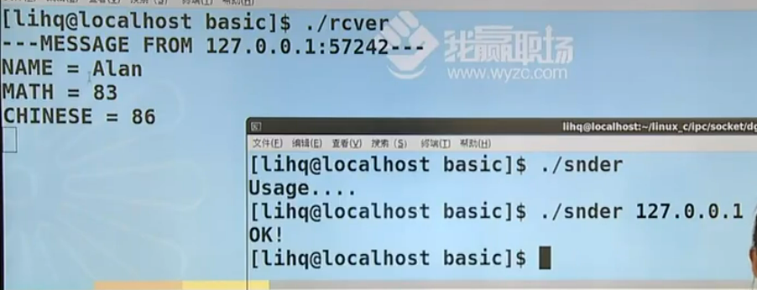
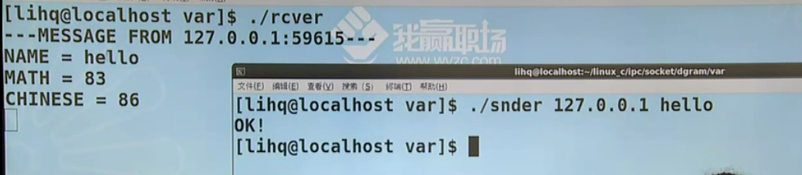
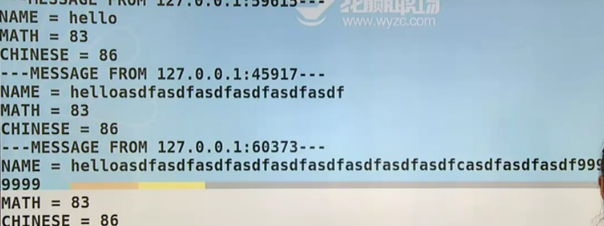
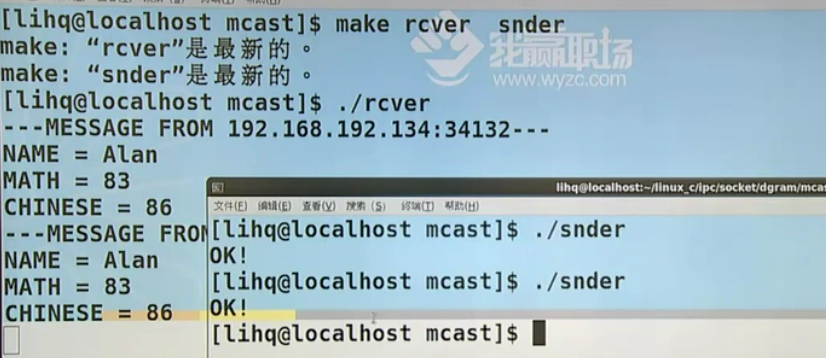

# 套接字-字节序问题

网络套接字socket

* 讨论：跨主机的传输要注意的问题

* 报式套接字

* 流式套接字


1. 字节序问题：

* 大端存储：低地址处放高字节
* 小端存储：低地址处放低字节


不管是文件传输还是IO实现，总是低地址处的数据先出去，高地址处的数据后出去。这就有问题了，比如说此时A发出了一个数据到B，比如A是小端格式存储，但是B当做大端格式接收，那么从A发出的00-00-00-05数据被B端接收，因为虽然解析格式会变，但是数据是不会变的，数据被B接收仍然是00-00-00-05，但是因为是大端格式存储，所以会被解析成05-00-00-00

解决方式是不区分大端存储还是小端存储，而是区分主机字节序(host)和网络字节序(network)，现在有一组函数来进行这个序列的转换：`__to__`，当前PC机上的内容要通过网络传输到对端的话，那么当前的数据就是主机序转网络序，如果数据是从网络接收过来的话就选择网络序转主机序

```markdown
htons / htonl: host to network 传输2字节数据 / 传输4字节数据

ntohs / ntohl: network to host 传输2字节数据 / 传输4字节数据
```

2. 对齐

```c
struct
{
    int i;
    float f;
    char ch;
}
```

编译器把结构体进行对齐的目的是加速节省当前的取址周期，凡是参与网络通信的结构体都要禁止对齐操作，所以在定义结构体的时候一定要告诉编译器不进行对齐，如果对齐的话会对协议数据解析产生影响


3. 类型长度问题：不同计算机环境下对于int、char、float等数据类型的长度定义不同，解决办法是用一些通用的数据类型，比如32位的有符号整型数int32_t，32位无符号整型数uint32_t，char型数据int8_t......

socket是什么：有很多网络协议比如IPV4、AX25....来完成网络协议族的指定，同时可以有多种不同的数据传输方式，比如说流式传输、数据包式传输.....，其实在不同的协议族当中对于不同的网络实现方式都会有支持，所以可以看到如果两两组合的话就会对程序员的工作造成巨大的压力，换一个协议/传输方式就得重新写一遍代码，我们借助一个机制把用什么样子的协议族和数据传输方式给指定起来，这个机制就是socket，而socket提供给用户的是一个抽象出来的文件描述符，也就是说只需要凭借一个文件描述符就能解决套接字传输的问题，因为socket本质上是一个文件描述符，所以之前讲的关于文件IO的操作都能适用于socket，对于一个文件描述符的操作无非就是打开关闭读写定位......


>NAME
>
>> socket - create an endpoint for communication
>
>SYNOPSIS
>
>> #include <sys/types.h>          /* See NOTES */
>> #include <sys/socket.h>
>>
>> int socket(int domain, int type, int protocol);
>
>1. int socket(int domain, int type, int protocol)：上一幅图中说到了socket其实是封装协议和网络实现方式的一个机制，所以在创建socket的时候一定会指定网络协议和数据传输方式；第一个参数domain其实指的就是协议族；第二个参数type指的是网络实现方式；第三个参数protocol指的是协议，比如用的是domain协议族中的protocol协议来进行type类型的传输，返回值是socket的文件描述符
>
>
>
>DESCRIPTION
>
>```shell
># domain
>
>Name         Purpose                                    Man page
>AF_UNIX      Local communication                        unix(7)
>AF_LOCAL     Synonym for AF_UNIX
>AF_INET      IPv4 Internet protocols                    ip(7)
>AF_AX25      Amateur radio AX.25 protocol               ax25(4)
>AF_IPX       IPX - Novell protocols
>AF_APPLETALK AppleTalk                                  ddp(7)
>
>
>
># type
># 流式
>SOCK_STREAM     Provides  sequenced,  reliable, two-way, connection-based byte streams.  An out-of-band data transmission mechanism may be supported.		
>
># 报式
>SOCK_DGRAM      Supports datagrams (connectionless, unreliable messages of a fixed maximum length).
>
>
>```
>
>* sequenced,  reliable, two-way, connection-based byte streams：有序可靠指的是只要接收放能接受到数据就保证数据包中的内容以及内容顺序是正确的，但不是指的是不丢包，在网络传输过程中丢包是一定的；双工指的是通信双方都能主动发送和接收数据；基于连接指的是三次握手，点对点传输字节流数据，如果数据是以单字节为单位进行传输的话就相当于流式套接字，如果每个数据不是char型，而是一个结构体指针类型的话就相当于报式传输，是以数据分组格式传输的；
>* 字节流SOCK_STREAM的意思是数据没有特别严格的边界，比如作为发送方给对方发送100个字节数据，可以选择一次接收50个字节，并接受两次，也可以选择一次接收20个字节，并接收5次.....
>* 报式传输SOCK_DGRAM是要求的数据分组和完整性，以一个数据包里的格式进行发送，比如传输结构体，结构体中有姓名、年龄......每个结构体都和其他及饿哦固体有着非常清晰的边界

# 套接字-报式套接字

为什么先讲报式套接字呢？因为报式套接字需要程序员指定和封装的内容是比较丰富的，也就是说看一个程序员会不会写网络传输的程序主要能否完成报式的传输，在报式套接字的实现上会发现前面强调的几个问题都能体现出来

被动端：

1. 取得socket
2. 给socket绑定一个地址
3. 收/发消息
4. 关闭socket

主动端：

1. 取得socket
2. 给socket绑定一个地址(可省略)
3. 发/收消息
4. 关闭socket

之前严格地区分过主动端和被动端，被动端是收包的一方，所以需要先运行，主动端是发送包的一方，所以需要后运行，并且主动端的第二步给socket绑定地址可以省略，因为当前socket一旦建立成功就会分配一个当前没有被使用的端口，在进程结束之前这个端口是一直被当前进程占用的，主动端第二步必须执行并且给socket主动绑定一个IP地址和端口，相当于灯塔必须首先声明自己的地址

用socket重构之前消息队列的程序，那么发送端和接收端就可以放在两台不同的主机上了

```c
// proto.h

#ifndef PROTO_H__
#define PROTO_H__

#define RCVPROT "1989"
#define NAMESIZE 20

struct msg_st
{
    uint8_t name[NAMESIZE];
    uint32_t math;
    uint32_t chinese;
} __attribute__((packed)); //不对齐

#endif
```

* 11：之前使用`char name[NAMESIZE]`声明的，但是之前讲过数据类型要参照对标准数据的定义
* 14：设置不对齐
* 6：设置接收端的端口号，因为IP地址经常会换来换去，所及就不指定了，之后在argv数组里设置

依照之前写的接收方四个步骤写的骨架：

```c
// rcver.c

#include <stdio.h>
#include <stdlib.h>

#include "proto.h"


int main()
{
	socket();
    
    bind();
    
    recvfrom();
    
    close();

    exit(0);
}
```

完整代码：

```c
#include <stdio.h>
#include <stdlib.h>
#include <unistd.h>
#include <sys/types.h>
#include <sys/socket.h>
#include <arpa/inet.h>

#include "proto.h"

#define IPSTRSIZE 40

int main()
{
    int sd;
    struct sockaddr_in laddr, raddr;
    struct msg_st rbuf;
    socklen_t raddr_len;
    char ipstr[IPSTRSIZE];

    sd = socket(AF_INET, SOCK_DGRAM, IPPROTO_UDP);
    if (sd < 0)
    {
        perror("socket()");
        exit(1);
    }

    laddr.sin_family = AF_INET;
    laddr.sin_port = htons(atoi(RCVPROT));
    inet_pton(AF_INET, "0.0.0.0", &laddr.sin_addr);

    if (bind(sd, (struct sockaddr *)&laddr, sizeof(laddr)) < 0)
    {
        perror("bind()");
        exit(1);
    }

    raddr_len = sizeof(raddr);
    while (1)
    {
        recvfrom(sd, &rbuf, sizeof(rbuf), 0, (void *)&raddr, &raddr_len);
        inet_ntop(AF_INET, &raddr.sin_addr, ipstr, IPSTRSIZE);
        printf("---MESSAGE FROM %s:%d---\n", ipstr, ntohs(raddr.sin_port));
        printf("NAME = %s\n", rbuf.name);
        printf("MATH = %d\n", ntohl(rbuf.math));
        printf("CHINESE = %d\n", ntohl(rbuf.chinese));
    }

    close(sd);

    exit(0);
}
```

* 20：使用AF_INET协议族，使用SOCK_DGRAM方式传输数据，第三个参数表示用AF_INET协议族中的某个协议使用SOCK_DGRAM方式传输数据，而这个协议是IPPROTO_UDP。顺便如果第三个参数为0的话就代表协议族里面支持SOCK_DGRAM方式的默认协议
* 15、31-35：给socket绑定一个地址，laddr表示local addr，raddr表示remote addr，需要注意的是bind函数的第二个参数类型为struct sockaddr，但是我们传递的不是struct sockaddr，而是sockaddr_in，所以需要强转
* 27-29：设置sockaddr_in的属性值，`htons(atoi(RCVPROT))`意思为把字符串类型的端口号转成整型，并且IP地址和端口号是要通过网络发送给对方的，那么就需要把主机字节序转换成网络字节序；29行的inet_pton函数表示把点分式转换成大整数类型的数据(point to int)

>NAME
>
>> bind - bind a name to a socket
>
>SYNOPSIS
>
>> #include <sys/types.h>          /* See NOTES */
>> #include <sys/socket.h>
>>
>> int bind(int sockfd, const struct sockaddr \*addr, socklen_t addrlen);
>
>1. bind：第一个参数是代表socket的文件描述符；第二个参数是地址；第三个参数是地址长度
>
>

1. 注意压根没有sockaddr这个结构体的定义，这个结构体是捏造出来的，参数addr的类型取决于address family，也就是当前协议组规定的地址信息，类sockaddr结构体里面会指定一个协议族字段和一个长度为14的数组，但至于实际上的结构体长什么样，得取决于协议族是怎么定义的，也就是说在不同的协议组当中对于本端绑定的地址的格式会各自有各自的规定，可以把sockaddr理解成一个抽象类，而具体的地址结构就像是继承自抽象类的具体类

>DESCRIPTION
>
>> The  rules  used in name binding vary between address families.  Consult the manual entries in Section 7 for detailed information. For AF_INET, see ip(7); for AF_INET6, see ipv6(7); for AF_UNIX, see unix(7); for  AF_APPLETALK,  see  ddp(7); for AF_PACKET, see packet(7); for AF_X25, see x25(7); and for AF_NETLINK, see netlink(7).
>>
>> The  actual  structure passed for the addr argument will depend on the address family.  The sockaddr structure is defined as something like:
>>
>> ```c
>> struct sockaddr {
>>     sa_family_t sa_family;
>>     char        sa_data[14];
>> }
>> ```
>
>* 如果用的协议族是AF_INET，则地址结构体的定义需要执行`man 7 ip`......

执行`man 7 ip`命令之后，可以看到在任意一个条目的man手册当中都有`Address format`的地址格式的定义，比如说在ipv4协议的地址格式为`sockaddr_in`，结构体中的sin_addr字段是一个in_addr类型，而in_addr实际上表示的是一个大整数类型，因为经常使用点分式来表示IP地址，但点分式是一个字符串，传输起来肯定没有整型数据方便，所以我们需要一个函数可以把点分式的IP地址转换成大整数类型的数据

```c
struct sockaddr_in {
    sa_family_t    sin_family; /* address family: AF_INET */
    in_port_t      sin_port;   /* port in network byte order */
    struct in_addr sin_addr;   /* internet address */
};

/* Internet address. */
struct in_addr {
    uint32_t       s_addr;     /* address in network byte order */
};

```

再比如说执行`man 7 unix`，同样也能看到地址格式的定义

```c
struct sockaddr_un {
    sa_family_t sun_family;               /* AF_UNIX */
    char        sun_path[108];            /* Pathname */
};
```

* 40：recvfrom指的是从socket上接受一个message

>NAME
>
>> recv, recvfrom, recvmsg - receive a message from a socket
>
>SYNOPSIS
>
>> #include <sys/types.h>
>> #include <sys/socket.h>
>>
>> ssize_t recv(int sockfd, void \*buf, size_t len, int flags);
>>
>> ssize_t recvfrom(int sockfd, void \*buf, size_t len, int flags, struct sockaddr \*src_addr, socklen_t \*addrlen);
>
>1. recv：刚才解释过流式套接字和报式套接字的区别和联系，其中有一条是点对点，一对一的连接方式，所以recv相较于recvfrom函数是应用在流式套接字上，因为参数只需要socket和数据存储缓冲区buf，因为是提前建立好链接的，所以不必每次都记录对方的地址
>2. 因为不是一对一，点对点的通信，所以recvfrom函数应用在报式套接字，每次数据的传输都需要记录对方主机的地址，通过sockfd接收，把数据放入缓冲区buf中；flags表示有无特殊要求，无则填0；对端的地址和地址长度分别存放在src_addr和addrlen中
>
>

* 41：inet_ntop大整数型数据转换成点分式
* 42：注意要网络序转主机序

发送端代码骨架：

```c
// snder.c

#include <stdio.h>
#include <stdlib.h>

#include "proto.h"


int main()
{
	socket();
    
    // bind();
    
    sendto();
    
    close();

    exit(0);
}
```

* 13：因为是发送端，依照我们之前的分析，所以可以省略第二步绑定地址

完成代码

```c
// snder.c

#include <stdio.h>
#include <stdlib.h>
#include <string.h>
#include <unistd.h>
#include <sys/types.h>
#include <sys/socket.h>
#include <arpa/inet.h>

#include "proto.h"

#define IPSTRSIZE 40

int main(int argc, char *argv[])
{
    int sd;
    struct sockaddr_in raddr;
    struct msg_st sbuf;
    socklen_t raddr_len;
    char ipstr[IPSTRSIZE];

    if (argc < 2)
    {
        fprintf(stderr, "Usage:%s <IP ADDRESS>\n", argv[0]);
        exit(1);
    }

    sd = socket(AF_INET, SOCK_DGRAM, IPPROTO_UDP);
    if (sd < 0)
    {
        perror("socket()");
        exit(1);
    }

    memset(&sbuf, '\0', sizeof(sbuf));
    strcpy(sbuf.name, "Alan");
    sbuf.math = htonl(rand() % 100);
    sbuf.chinese = htonl(rand() % 100);

    raddr.sin_family = AF_INET;
    raddr.sin_port = htons(atoi(RCVPROT));
    inet_pton(AF_INET, argv[1], &raddr.sin_addr);

    if (sendto(sd, &sbuf, sizeof(sbuf), 0, (void *)&raddr, sizeof(raddr)) < 0)
    {
        perror("sendto()");
        exit(1);
    }

    puts("ok!");

    close(sd);

    exit(0);
}
```



上面的是一个basic版本的socket报式套接字传输，但是在这个程序中有一个问题：proto.h文件中传输的数据大小规定的太死了，即不能超过20个字节，那就有问题了，比如名字太长则存储不了，如果名字太短则浪费存储空间

```c
#define NAMESIZE 20

struct msg_st
{
    uint8_t name[NAMESIZE];
    uint32_t math;
    uint32_t chinese;
} __attribute__((packed)); //不对齐
```

如果要解决这问题的话，一个想法是既然是变长数据，那么就干脆把把数组定义为指针，指针指向一个名字，然后用malloc给这块空间动态分配内存，但是这个想法是绝对错误的，因为在rcver和snder有可能是运行在两个不同的设备上的，在网络传输层面从来就没有传输4字节指针的说法，比如说作为发送方malloc一块内存，内存的起始地址的2000，那就意味着把2000这个地址值传输到接收方的设备上，但是接收方的2000地址和发送方的2000地址不是一个概念

```c
#ifndef PROTO_H__
#define PROTO_H__

#define RCVPROT "1989"
#define NAMEMAX (512 - 8 - 8)

struct msg_st
{
    uint32_t math;
    uint32_t chinese;
    uint8_t name[1];       //动态数组，一定要定义在结构体最后位置
} __attribute__((packed)); //不对齐

#endif
```

解决办法是把数组变成变长的内容，其实不是数组变长，数组目前为止用的比较频繁的还是定长的数组，变长的是当前的结构体，name其实要的是一个占位符，同时把NAMESIZE改成NAMEMAX，并且NAMEMAX的大小为当前包的容量减去定长的容量

* 5：512是UDP包的推荐长度，第一个8指的是UDP的报头，第二个8指的是math和chinese字段的8字节，剩余内容才是name字段所能存在的最大值

```c
// snder.c

#include <stdio.h>
#include <stdlib.h>
#include <string.h>
#include <unistd.h>
#include <sys/types.h>
#include <sys/socket.h>
#include <arpa/inet.h>

#include "proto.h"

#define IPSTRSIZE 40

int main(int argc, char *argv[])
{
    int sd, size;
    struct sockaddr_in raddr;
    struct msg_st *sbufp;

    if (argc < 3)
    {
        fprintf(stderr, "Usage:%s <IP ADDRESS> <NAME>\n", argv[0]);
        exit(1);
    }

    sd = socket(AF_INET, SOCK_DGRAM, IPPROTO_UDP);
    if (sd < 0)
    {
        perror("socket()");
        exit(1);
    }

    if (strlen(argv[2]) > NAMEMAX)
    {
        fprintf(stderr, "NAME is too long!\n");
        exit(1);
    }

    size = sizeof(struct msg_st) + strlen(argv[2]);
    sbufp = malloc(size);
    if (sbufp == NULL)
    {
        perror("malloc()");
        exit(1);
    }

    memset(sbufp, '\0', sizeof(*sbufp));
    strcpy(sbufp->name, argv[2]);
    sbufp->math = htonl(rand() % 100);
    sbufp->chinese = htonl(rand() % 100);

    raddr.sin_family = AF_INET;
    raddr.sin_port = htons(atoi(RCVPROT));
    inet_pton(AF_INET, argv[1], &raddr.sin_addr);

    if (sendto(sd, sbufp, size, 0, (void *)&raddr, sizeof(raddr)) < 0)
    {
        perror("sendto()");
        exit(1);
    }

    puts("ok!");

    close(sd);

    exit(0);
}
```

* 19、40-41、48：sbufp应该变成一个指针变量，通过malloc动态分配内存空间，并且初始化

```c
// rcver.c

#include <stdio.h>
#include <stdlib.h>
#include <unistd.h>
#include <sys/types.h>
#include <sys/socket.h>
#include <arpa/inet.h>

#include "proto.h"

#define IPSTRSIZE 40

int main()
{
    int sd, size;
    struct sockaddr_in laddr, raddr;
    struct msg_st *rbufp;
    socklen_t raddr_len;
    char ipstr[IPSTRSIZE];

    size = sizeof(struct msg_st) + NAMEMAX - 1;

    rbufp = malloc(size);
    if (rbufp == NULL)
    {
        perror("malloc()");
        exit(1);
    }

    sd = socket(AF_INET, SOCK_DGRAM, IPPROTO_UDP);
    if (sd < 0)
    {
        perror("socket()");
        exit(1);
    }

    laddr.sin_family = AF_INET;
    laddr.sin_port = htons(atoi(RCVPROT));
    inet_pton(AF_INET, "0.0.0.0", &laddr.sin_addr);

    if (bind(sd, (void *)&laddr, sizeof(laddr)) < 0)
    {
        perror("bind()");
        exit(1);
    }

    raddr_len = sizeof(raddr);
    while (1)
    {
        recvfrom(sd, rbufp, size, 0, (void *)&raddr, &raddr_len);
        inet_ntop(AF_INET, &raddr.sin_addr, ipstr, IPSTRSIZE);
        printf("---MESSAGE FROM %s:%d---\n", ipstr, ntohs(raddr.sin_port));
        printf("NAME = %s\n", rbufp->name);
        printf("MATH = %d\n", ntohl(rbufp->math));
        printf("CHINESE = %d\n", ntohl(rbufp->chinese));
    }

    close(sd);

    exit(0);
}
```

 

# 套接字-多播实例

报式套接字中还涉及到多点通信的内容，在流式套接字和报式套接字中只有报式套接字能实现多点通信，因为流式套接字是一对一、点对点的服务

多点通信：广播（全网广播、子网广播）、多播/组播

广播和组播之间更推荐使用组播，因为组播更灵活一点，广播的范围非常大，不管愿不愿意接受都必须接收广播数据，但是组播是建立一个多播组，如果愿意接受消息则加入这个多播组，然后在组间发消息，如果不想收到数据的话就离开多播组，但是多播中有一个特殊地址，如果往这个地址发消息的话就如同发送一个广播

全网广播：往一个大家周知的地址上来发消息，比如说我们经常说的广播就是往255.255.255.255这个地址上发消息

协议proto不需要变

```c
// snder.h

#include <stdio.h>
#include <stdlib.h>
#include <string.h>
#include <unistd.h>
#include <sys/types.h>
#include <sys/socket.h>
#include <arpa/inet.h>

#include "proto.h"

#define IPSTRSIZE 40

int main()
{
    int sd;
    struct sockaddr_in raddr;
    struct msg_st sbuf;
    socklen_t raddr_len;
    char ipstr[IPSTRSIZE];

    sd = socket(AF_INET, SOCK_DGRAM, IPPROTO_UDP);
    if (sd < 0)
    {
        perror("socket()");
        exit(1);
    }

    int val = 1;
    if (setsockopt(sd, SOL_SOCKET, SO_BROADCAST, &val, sizeof(val)) < 0)
    {
        perror("setockopt()");
        exit(1);
    }

    memset(&sbuf, '\0', sizeof(sbuf));
    strcpy(sbuf.name, "Alan");
    sbuf.math = htonl(rand() % 100);
    sbuf.chinese = htonl(rand() % 100);

    raddr.sin_family = AF_INET;
    raddr.sin_port = htons(atoi(RCVPROT));
    inet_pton(AF_INET, "255.255.255.255", &raddr.sin_addr);

    if (sendto(sd, &sbuf, sizeof(sbuf), 0, (void *)&raddr, sizeof(raddr)) < 0)
    {
        perror("sendto()");
        exit(1);
    }

    puts("ok!");

    close(sd);

    exit(0);
}
```

* 44：原本的发送方的代码是`sendto(sd, &sbuf, sizeof(sbuf), 0, (void *)&raddr, sizeof(raddr)`，把&sbuf地址上的内容发送到对端的&raddr地址上去，而对端IP地址是我们在终端上指定的，全网广播应该把IP地址设置成"255.255.255.255"，然后发送端往广播地址上发数据，接收端从广播地址上接收数据

当前的广播实际上默认要求是不能够发出的，组播其实也一样，也就是说在默认的属性中是不能进行这种特殊内容的发送的，之前画过一张图说过各个协议可以对应各个不同的数据传输方式的实现，其实各个协议里面还有很多薄层，比如IP层，TCP层，SOCKET层...在不同的层上会有不同的开关可以来加以控制，全网广播是禁止被发送的，但是有一个开关能够实现广播操作，我们执行`man 7 socket`查看socket层，其中有socket options设置，也就是说当前socket封装出的传输当中有若干配置可以去更改

>Socket options
>
>> The socket options listed below can be set by using setsockopt(2) and read with getsockopt(2) with the socket  level  set to SOL_SOCKET for all sockets.  Unless otherwise noted, optval is a pointer to an int.
>>
>> SO_ACCEPTCONN
>>
>> SO_ATTACH_FILTER
>>
>> SO_BROADCAST：Set or get the broadcast flag.  When enabled, datagram sockets are allowed to send packets to a broadcast address. This option has no effect on stream-oriented sockets.
>>
>> ......
>
>* 打开SO_BROADCAST设置就可以打开广播功能
>* setsockopt、getsockopt

执行`man 7 ip`查看IP层能控制什么

>Socket options
>
>> IP_ADD_MEMBERSHIP
>>
>> ```c
>> struct ip_mreqn {
>>     struct in_addr imr_multiaddr; /* IP multicast group
>>                                             address */
>>     struct in_addr imr_address;   /* IP address of local
>>                                             interface */
>>     int            imr_ifindex;   /* interface index */
>> };
>> ```
>>
>> IP_ADD_SOURCE_MEMBERSHIP
>>
>> ......
>
>

>NAME
>
>> getsockopt, setsockopt - get and set options on sockets
>
>SYNOPSIS
>
>> #include <sys/types.h>          /* See NOTES */
>> #include <sys/socket.h>
>>
>> int getsockopt(int sockfd, int level, int optname, oid \*optval, socklen_t \*optlen);
>> int setsockopt(int sockfd, int level, int optname, const void \*optval, socklen_t optlen);
>
>1. setsockopt：对某一个socket的某一个层面上level的某一个属性optname进行设置，由于所更改的属性是不相同的，所以不同的属性所需要的参数optval不同，有可能是整型也有可能是bool类型还有可能是结构体类型，因为参数大小是不一致的，所以也需要optlen来指定传参大小
>2. level的值比如有tcp、ip、socket.......

* 30-35：`setsockopt(sd, SOL_SOCKET, SO_BROADCAST, &val, sizeof(val)`针对sd的socket层中的SO_BROADCAST属性，把它的值改为val值

```c
// rcver.c

#include <stdio.h>
#include <stdlib.h>
#include <unistd.h>
#include <sys/types.h>
#include <sys/socket.h>
#include <arpa/inet.h>

#include "proto.h"

#define IPSTRSIZE 40

int main()
{
    int sd;
    struct sockaddr_in laddr, raddr;
    struct msg_st rbuf;
    socklen_t raddr_len;
    char ipstr[IPSTRSIZE];

    sd = socket(AF_INET, SOCK_DGRAM, IPPROTO_UDP);
    if (sd < 0)
    {
        perror("socket()");
        exit(1);
    }

    int val = 1;
    if(setsockopt(sd, SOL_SOCKET, SO_BROADCAST, &val, sizeof(val)) < 0)
    {
        perror("setockopt()");
        exit(1);
    }

    laddr.sin_family = AF_INET;
    laddr.sin_port = htons(atoi(RCVPROT));
    inet_pton(AF_INET, "0.0.0.0", &laddr.sin_addr);

    if (bind(sd, (void *)&laddr, sizeof(laddr)) < 0)
    {
        perror("bind()");
        exit(1);
    }

    raddr_len = sizeof(raddr);
    while (1)
    {
        recvfrom(sd, &rbuf, sizeof(rbuf), 0, (void *)&raddr, &raddr_len);
        inet_ntop(AF_INET, &raddr.sin_addr, ipstr, IPSTRSIZE);
        printf("---MESSAGE FROM %s:%d---\n", ipstr, ntohs(raddr.sin_port));
        printf("NAME = %s\n", rbuf.name);
        printf("MATH = %d\n", ntohl(rbuf.math));
        printf("CHINESE = %d\n", ntohl(rbuf.chinese));
    }

    close(sd);

    exit(0);
}
```

多播属于D类地址，D类地址都是224.xxx开头

```c
// proto.h

#ifndef PROTO_H__
#define PROTO_H__

#define MGROUP "224.2.2.2"
#define RCVPROT "1989"
#define NAMESIZE 20

struct msg_st
{
    uint8_t name[NAMESIZE];
    uint32_t math;
    uint32_t chinese;
} __attribute__((packed)); //不对齐

#endif
```

```c
// snder.c

#include <stdio.h>
#include <stdlib.h>
#include <string.h>
#include <unistd.h>
#include <sys/types.h>
#include <sys/socket.h>
#include <arpa/inet.h>
#include <net/if.h>

#include "proto.h"

#define IPSTRSIZE 40

int main()
{
    int sd;
    struct sockaddr_in raddr;
    struct msg_st sbuf;
    socklen_t raddr_len;
    char ipstr[IPSTRSIZE];

    sd = socket(AF_INET, SOCK_DGRAM, IPPROTO_UDP);
    if (sd < 0)
    {
        perror("socket()");
        exit(1);
    }

    struct ip_mreqn mreq;
    inet_pton(AF_INET, MGROUP, &mreq.imr_multiaddr);
    inet_pton(AF_INET, "0.0.0.0", &mreq.imr_address);
    mreq.imr_ifindex = if_nametoindex("enp3s0");

    if (setsockopt(sd, IPPROTO_IP, IP_MULTICAST_IF, &mreq, sizeof(mreq)) < 0)
    {
        perror("setockopt()");
        exit(1);
    }

    memset(&sbuf, '\0', sizeof(sbuf));
    strcpy(sbuf.name, "Alan");
    sbuf.math = htonl(rand() % 100);
    sbuf.chinese = htonl(rand() % 100);

    raddr.sin_family = AF_INET;
    raddr.sin_port = htons(atoi(RCVPROT));
    inet_pton(AF_INET, MGROUP, &raddr.sin_addr);

    if (sendto(sd, &sbuf, sizeof(sbuf), 0, (void *)&raddr, sizeof(raddr)) < 0)
    {
        perror("sendto()");
        exit(1);
    }

    puts("ok!");

    close(sd);

    exit(0);
}
```

```c
// rcver.c

#include <stdio.h>
#include <stdlib.h>
#include <unistd.h>
#include <sys/types.h>
#include <sys/socket.h>
#include <arpa/inet.h>
#include <net/if.h>

#include "proto.h"

#define IPSTRSIZE 40

int main()
{
    int sd;
    struct sockaddr_in laddr, raddr;
    struct msg_st rbuf;
    socklen_t raddr_len;
    char ipstr[IPSTRSIZE];

    sd = socket(AF_INET, SOCK_DGRAM, IPPROTO_UDP);
    if (sd < 0)
    {
        perror("socket()");
        exit(1);
    }

    struct ip_mreqn mreq;
    inet_pton(AF_INET, MGROUP, &mreq.imr_multiaddr);
    inet_pton(AF_INET, "0.0.0.0", &mreq.imr_address);
    mreq.imr_ifindex = if_nametoindex("enp3s0");

    if (setsockopt(sd, IPPROTO_IP, IP_ADD_MEMBERSHIP, &mreq, sizeof(mreq)) < 0)
    {
        perror("setockopt()");
        exit(1);
    }

    laddr.sin_family = AF_INET;
    laddr.sin_port = htons(atoi(RCVPROT));
    inet_pton(AF_INET, "0.0.0.0", &laddr.sin_addr);

    if (bind(sd, (void *)&laddr, sizeof(laddr)) < 0)
    {
        perror("bind()");
        exit(1);
    }

    raddr_len = sizeof(raddr);
    while (1)
    {
        recvfrom(sd, &rbuf, sizeof(rbuf), 0, (void *)&raddr, &raddr_len);
        inet_ntop(AF_INET, &raddr.sin_addr, ipstr, IPSTRSIZE);
        printf("---MESSAGE FROM %s:%d---\n", ipstr, ntohs(raddr.sin_port));
        printf("NAME = %s\n", rbuf.name);
        printf("MATH = %d\n", ntohl(rbuf.math));
        printf("CHINESE = %d\n", ntohl(rbuf.chinese));
    }

    close(sd);

    exit(0);
}
```




